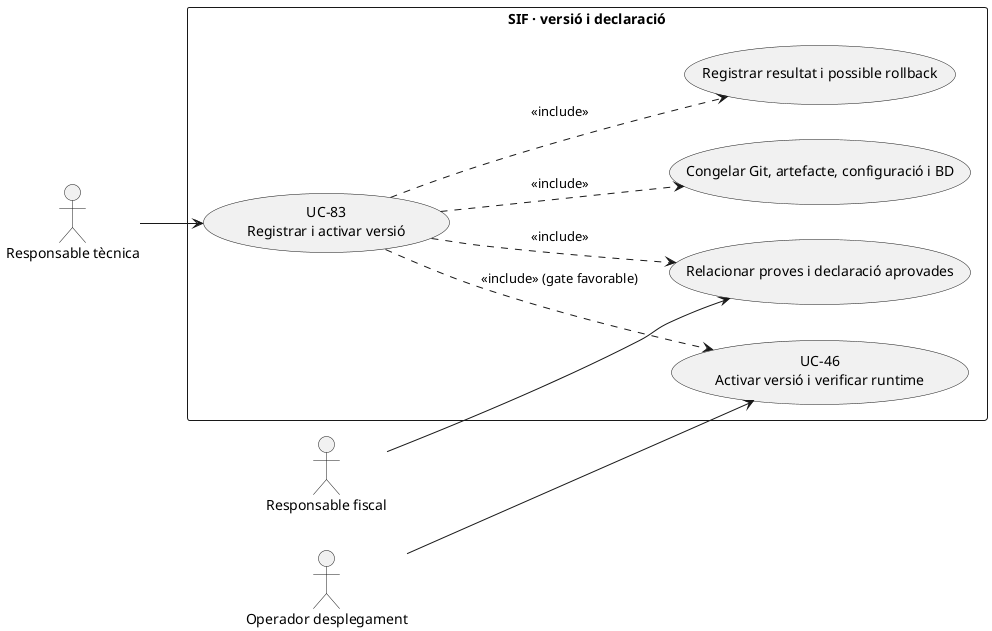
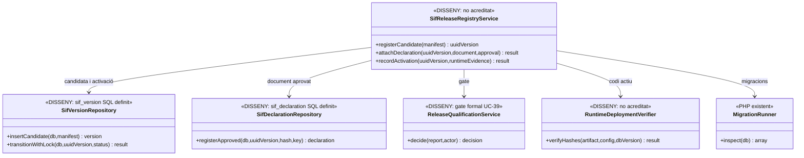
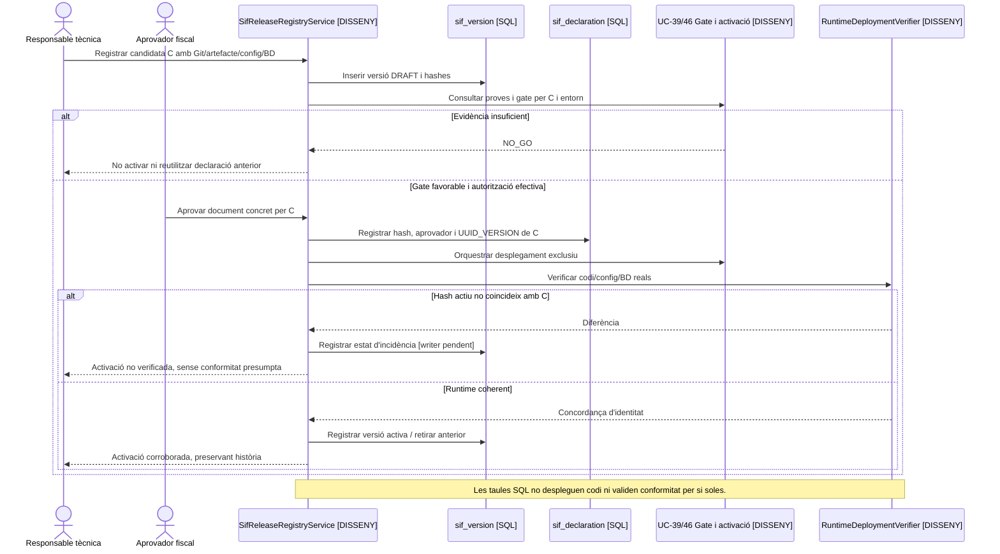

# UC-83 · Registrar i activar versió del SIF i declaració responsable

**Objectiu del catàleg:** relacionar de manera inequívoca versió, artefacte, configuració, migracions, proves, declaració i activació. **Estat [DISSENY/BLOQUEJANT].** UC-46 governa la decisió de posar en servei una candidata; UC-83 defineix la **traça de cada versió i declaració** i com es comprova que allò desplegat és exactament allò aprovat.

## 1. Evidència i model versionat

La migració d'auditoria defineix `sif_version` amb `UUID_VERSION`, `VERSION_CODE` únic, `GIT_REVISION`, `ARTIFACT_HASH`, `CONFIG_HASH`, `DATABASE_VERSION`, `STATUS`, `CREATED_BY` i `ACTIVATED_AT`. `sif_declaration` té `UUID_VERSION` com a FK, `DECLARATION_VERSION`, `DOCUMENT_HASH`, `STORAGE_KEY`, `APPROVED_BY/AT` i `STATUS`. **No s'ha acreditat un writer/activador PHP per aquestes taules**, i la FK no demostra que el document existeixi o que la declaració correspongui a la versió efectivament servida.

`MigrationRunner::inspect()` comprova el ledger `sif_schema_migration`, hashes de migracions i presència de taules/columnes. `go-no-go-preproduction.php` funciona en `test/preproduction` i comprova prerequisits i circuits presents; **cap dels dos certifica el funcionament complet ni la coincidència entre codi actiu i declaració**. `SoapTransport` revisat només admet `TEST_ENDPOINT`: un gate de preproducció no es pot reutilitzar com a prova d'una tramesa productiva.

## 2. Fitxa funcional específica

| Objecte | Regla |
| --- | --- |
| Candidata | El commit Git, artefacte distribuïble, hash de configuració **sense secrets**, versió BD, emissor/entorn i manifest de components formen una identitat indivisible. Un nou commit o paràmetre material requereix una nova candidata/revisió. |
| Proves | Relacionar report UC-39 amb la **mateixa identitat exacta** de la candidata i entorn; la presència de scripts o `ready=true` local no acredita la prova de restauració ni el contracte AEAT. |
| Declaració | Lligar document físic, versió, hash de **bytes**, aprovador, data i abast verificat a `UUID_VERSION`. Les condicions i el contingut formal s'han de validar en el circuit corresponent; una fila `STATUS=ACTIVE` no converteix una declaració en conformitat acreditada. |
| Activació | Registrar estat de versió anterior i candidata, evidència de configuració/codi **realment en servei**, instants i actor; la migració no mostra una restricció global que imposi exactament una sola versió `ACTIVE` i no proporciona un protocol de desplegament entre BD i FTP/runtime. |
| Auditoria | Guardar decisions i intents d'activació a `sif_audit_event` quan el writer existeixi, amb hashes anterior/nou, actor, resultat i correlació. No enviar secrets/configuració en clar a `CHANGESET_JSON`. |
| Cap efecte monetari | Activar o registrar versió no reemet factures, no altera `fiscal_chain_state` ni crea `CHARGE/REFUND`. Si el rollback coincideix amb cobrament/callback real, s'ha de conciliar l'operació, no restaurar l'estat econòmic per intuïció. |

### Flux objectiu i criteris de tancament

1. Registrar candidata `DRAFT` amb `VERSION_CODE`, commit i hashes del paquet/configuració/BD i referència d'entorn; verificar que els fitxers i migracions esperats són accessibles i que el hash del desplegable correspon al commit/artefacte anunciat.
2. Associar evidències de runner, preflight, integració de canals, retorn AEAT de l'**entorn objectiu**, backup/restore i observabilitat a aquella mateixa versió; UC-39 defineix el gate i els bloquejants funcionals.
3. Custodiar la declaració **aprovada realment** i comprovar `DOCUMENT_HASH` contra el document físic abans de vincular-la; sense proves o autorització adequada, conservar la versió en estat no activat.
4. Coordinar UC-46 per activar una única versió operacional i verificar per separat `sif_version.STATUS`, bytes de codi servits, hash de configuració, versió real de BD i workers en curs. **El SQL no fa aquest desplegament de manera automàtica.**
5. Si falla una destinació, registrar desplegament parcial, versions observades i incidència. Decidir rollback sense perdre factures/pagaments registrats entre el canvi i l'error.
6. Provar: mateix `VERSION_CODE` amb hash diferent, declaració signada per artefacte antic, dues activacions concurrents, PHP actual i BD anterior, migració parcial, secrets a evidències, worker antic amb cua nova i `go-no-go-preproduction.php` correcte però transport productiu indisponible.

**Pendents:** model de report de proves per versió, writer de `sif_version` i `sif_declaration`, exclusivitat `ACTIVE`, verificació del runtime desplegat, procediment d'aprovació formal i proves d'activació/rollback. No s'ha activat cap versió ni executat gate en aquesta revisió.

## 3. UML de casos d'ús

## 4. UML de classes — esquema definit, activador pendent

## 5. UML de seqüència — declaració no correspon a codi actiu (DISSENY)

## 6. Traçabilitat

[UC-83 original](../06-fitxes-funcionals/uc-083.md) · [UC-46 activació](uc-046-activar-versio-declaracio-responsable.md) · [UC-39 gate](uc-039-proves-gate-go-no-go.md) · [UC-38 certificat](uc-038-configurar-sif-certificat.md) · [UC-40 backup](uc-040-backup-restauracio.md) · [MigrationRunner](../../sif/src/Database/MigrationRunner.php) · [Esquema de versions i declaracions](../../sif/database/migrations/2026_09_15_000003_add_functional_audit_control.sql).
