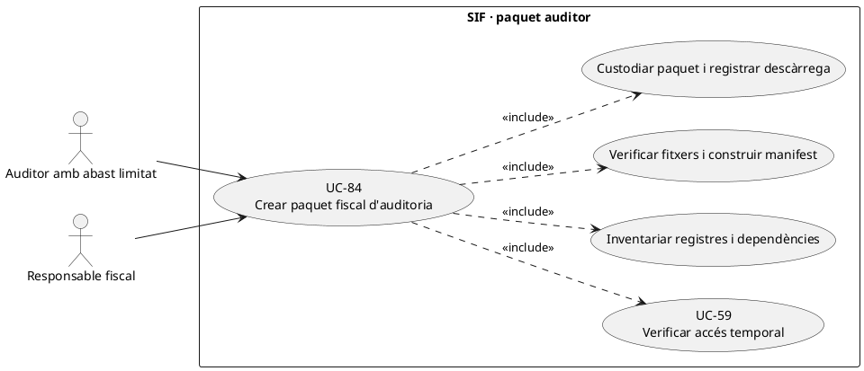
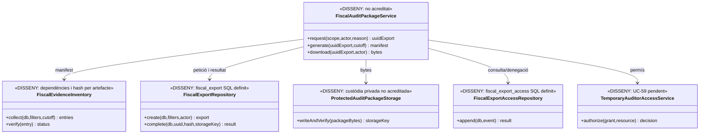
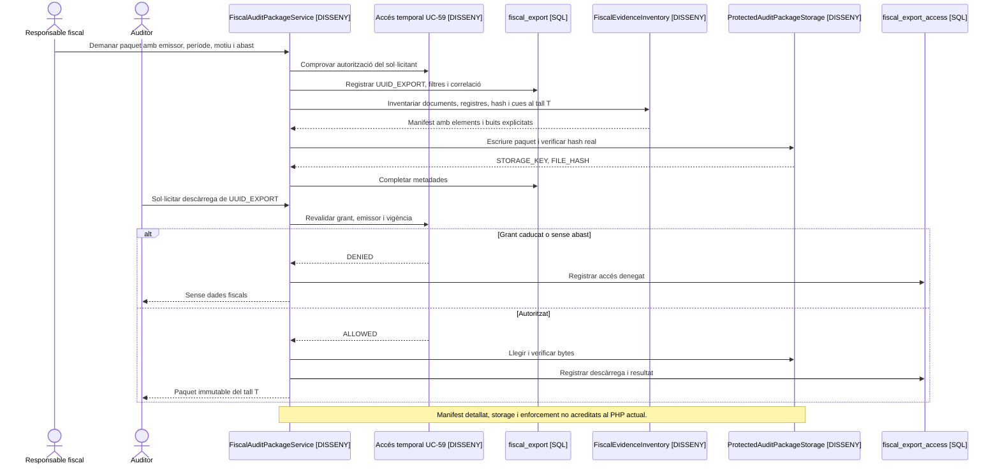

# UC-84 · Crear un paquet fiscal d'auditoria amb integritat i traça d'accés

**Objectiu original:** conservar filtres, motiu, sol·licitant, fitxer, hash i descàrregues. **Estat [DISSENY].** UC-37 exporta un període fiscal; UC-84 defineix el **paquet auditable**, el seu inventari, les dependències de cada registre i la custòdia/accés per un auditor amb abast autoritzat. Un paquet no és una factura nova ni una prova automàtica de compliment.

## 1. Fonts del SIF i abast mínim

La migració defineix `fiscal_export` (`UUID_EXPORT`, `EXPORT_TYPE`, `FILTERS_JSON`, rol, sol·licitant, `REASON_CODE`, `STORAGE_KEY`, `FILE_HASH`, estat i correlació) i `fiscal_export_access` (acció, resultat, actor, rol, `REQUEST_ID` i instants). **No s'ha acreditat** un generador de paquet PHP, un inventari criptogràfic per fitxer o un servidor de descàrrega autoritzada que executi aquestes taules.

Les fonts documentals són `factura`, `factura_linia`, `factura_registres`, `factura_rectificacio`, `fiscal_chain_state`, `fiscal_queue`, `aeat_submission_attempt` quan **realment estigui emplenada**, `factura_documents` més **fitxers existents i verificats**, i events/operacions originals. El `EvidenceStore` de transport conserva fitxers privats en el seu circuit, però no equival a una fila d'intent SQL ni a una factura PDF validada. El registre d'auditoria no ha d'incloure secrets, credencials, dades de targeta ni justificants sensibles de descompte fora de l'abast.

## 2. Fitxa funcional específica

| Element | Contracte |
| --- | --- |
| Petició | Auditor/operador identificat, finalitat i motiu, emissor, període, sèries, filtres, tipus de registres i nivell de dades personals aprovat. El grant UC-45/59 ha de ser efectiu abans de preparar i **cada vegada que es descarrega** el paquet. |
| Manifest | Identificador únic del paquet, data/hora de tall, versió d'esquema/exportador, filtres exactes, consulta/criteri temporal, llista ordenada de registres/fitxers, hash **per artefacte** i hash global del paquet. **Aquest manifest detallat és disseny pendent:** `fiscal_export.FILE_HASH` només verifica el fitxer principal. |
| Contingut | Factures i rectificatives, registres `ALTA/ANULACIO/SUBSANACIO` rellevants, hash/cadena i estats/respostes AEAT, documents fiscals **físicament disponibles**, incidències que n'expliquen els buits. No representar `SENT` com a acceptat, ni fitxer absent com a PDF disponible. |
| Preparació | Snapshot llegit amb data de tall coherent. Si un enviament entra a cua o canvia d'estat després, conservar l'instant de tall i la referència; no alterar registres originals ni reemetre'ls per «fer quadrar» el paquet. |
| Custòdia | Storage privat, xifrat/restricció segons política, hash verificat dels bytes reals i retenció aprovada. `STORAGE_KEY` no és URL pública; les descàrregues han de tenir token/rol restringit i traça també en denegacions. |
| Efecte fiscal i diners | Generar el paquet no crea `factura`, `factura_registres`, `CHARGE`, `REFUND` ni assignacions. Si hi ha un pagament/informe econòmic inclòs, és evidència de l'operació existent, no un moviment nou. |

### Flux objectiu

1. Aprovar petició d'auditoria per finalitat, període, emissor i abast de persones; registrar `UUID_EXPORT` i filtres immutable amb actor/motiu. Un `REQUEST_ID` repetit amb paràmetres contradictoris ha de rebutjar-se; el SQL **no té clau idempotent pròpia** per a `fiscal_export`.
2. Fer consulta temporal coherent de factures/registres i **resoldre les dependències**: rectificativa→original, registre de subsanació/anul·lació→registre previ, cua→`fiscal_order`, document→`UUID_FACTURA`, resposta AEAT→job/registre.
3. Preparar manifest amb «present/verificat/pendent/no acreditat» per cada artefacte. Un `factura_documents.CREATED` sense bytes verificables i un `aeat_submission_attempt` sense writer real **no** són evidència completa; reportar les mancances com a tals.
4. Serialitzar el paquet de format aprovat, verificar cardinalitats i hashes, desar bytes privats, i completar `fiscal_export.FILE_HASH/STORAGE_KEY`. No incloure claus privades, tokens o secrets de serveis.
5. Quan l'auditor el consulta o descarrega, UC-59 valida permís/vigència i `fiscal_export_access` registra resultat i correlació; ni un hash correcte ni el coneixement d'`UUID_EXPORT` concedeixen accés.
6. En cas d'error o reconstrucció, emetre **una versió nova del paquet** i mantenir manifest/data de tall de l'anterior. Repetir la mateixa exportació per timeout no ha de generar diversos paquets contradictoris atribuïts a la mateixa petició.

**Proves pendents:** factura rectificada durant l'exportació, document absent, intent AEAT sense resposta, paquet d'un emissor vs factura d'un altre, grant revocat abans de descarregar, fitxer modificat, exportació concurrent i filtració de dades personals en manifest/log.

## 3. UML de casos d'ús

## 4. UML de classes — exportació SQL vs paquet complet pendent

## 5. UML de seqüència — manifest i descàrrega denegada (DISSENY)

## 6. Traçabilitat

[UC-84 original](../06-fitxes-funcionals/uc-084.md) · [UC-37 exportar període](uc-037-exportar-periode-fiscal.md) · [UC-45 auditor](uc-045-activar-auditor-temporal.md) · [UC-80 accés documental](uc-080-servir-registrar-acces-document-fiscal.md) · [UC-77 tramesa AEAT](uc-077-operar-enviament-aeat-retry-dead-letter.md) · [Esquema fiscal_export i accessos](../../sif/database/migrations/2026_09_15_000003_add_functional_audit_control.sql).
