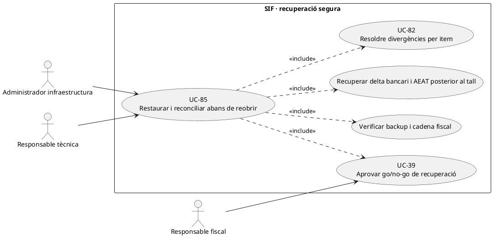
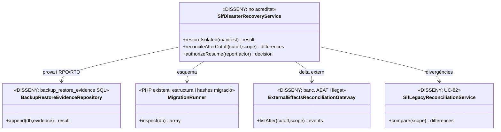
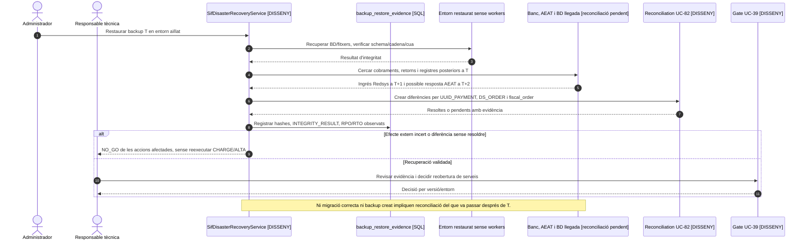

# UC-85 · Executar backup, restauració i reconciliació abans de reprendre operacions

**Objectiu original:** evidència de backup i restauració, integritat, RPO/RTO i incidències. **Estat [DISSENY/BLOQUEJANT].** UC-40 descriu el procés de còpia/restauració; UC-85 exigeix demostrar la **recuperació íntegra i la reconciliació dels efectes externs ocorreguts després del tall**, abans d'autoritzar workers, callbacks o API d'emissió en un sistema restaurat.

## 1. Evidència del repositori

`backup_restore_evidence` està definida a SQL amb `OPERATION_TYPE`, `ENVIRONMENT`, `SCOPE_JSON`, `BACKUP_REFERENCE/HASH`, `RPO_MINUTES`, `RTO_MINUTES`, `INTEGRITY_RESULT`, `EXECUTED_BY`, `CORRELATION_ID` i `EVIDENCE_JSON`. **No s'ha acreditat** un writer PHP ni una restauració real verificada. `MigrationRunner::inspect()` compara hashes del ledger `sif_schema_migration`, taules i columnes declarades, però **no comprova per si sol els hashes de `factura_registres`, la seqüència fiscal, les transaccions bancàries, els fitxers privats ni el resultat remot AEAT**.

`FiscalQueueProcessor::recoverStaleLocks()` pot reactivar jobs que han quedat en `PROCESSING`. Això **no acredita** que l'AEAT no hagués rebut el registre abans de la pèrdua de resposta. `RedsysCallbackWorker` pot recuperar notificacions, però una còpia feta abans d'un cobrament real ha de reconciliar-se amb el banc/Redsys **abans** de reprendre els processadors restaurats.

## 2. Contracte d'execució específic

| Fase | Evidència necessària |
| --- | --- |
| Tall i inventari | Registre de l'instant exacte T i versions del codi/BD, posició de la cadena, seqüències fiscals, jobs AEAT/Redsys pendents o `PROCESSING`, fons per factura/inscripció, fitxers de documents i evidències privades. **El ledger individual encara és proposta:** assenyalar expressament aquesta limitació. |
| Backup | Còpia coherent i protegida de BD SIF, dades llegades relacionades i storage privat, manifest per component/hash, política de claus/retenció i prova que el backup es pot llegir; no incloure certificats ni secrets productius en un dump accessible. |
| Restauració aïllada | Reconstituir components sense contactar **banc/AEAT productius** ni deixar workers programats actius, inspeccionar migracions i validar número/sèrie, hash chain, taules d'assignació, cua, documents i permisos d'usuari. |
| Delta extern | Cercar factures, cobraments Redsys/transferències, devolucions, respostes AEAT i canvis llegats **posteriors a T** i durant la recuperació. La BD restaurada no és autoritat per negar transaccions bancàries o registres remots que no contenia a T. |
| Reconciliació | Comparar fonts per UUID, `DS_ORDER`, `UUID_PAYMENT`, `UUID_FACTURA`, `fiscal_order` i `ID_INSC`, registrar item i decisió UC-82. No reproduir callbacks ni `ALTA/ANULACIO/SUBSANACIO` fins comprovar idempotència i resultat remot; una factura històrica és immutable. |
| Gate de retorn | Aprovar RPO/RTO **mesurats**, integritat i llista de divergències resoltes/pendents, així com reobertura ordenada de workers/API; decisió `GO/NO_GO` de UC-39 amb actor, motiu i evidència. |
| Incidències | Si falta una prova o resta un pagament/registre remot incert, bloquejar **l'acció afectada**, obrir UC-81, preservar la còpia, registrar estat parcial i no afirmar que el sistema ja està completament recuperat. |

### Flux objectiu

1. Preparar exercici de recuperació o incident amb abast, prioritat, entorn i punt de tall T, assignar responsables i congelar el pla dels components afectats. Registrar inici i objectius de RPO/RTO, sense declarar-los aconseguits.
2. Restaurar còpia en entorn segregat, **amb treballadors i connexions externes productives inhabilitats**, i verificar bytes de documents/evidències, integritat del dump, migracions i files fiscals/registres/cues.
3. Consultar fonts independents dels efectes posteriors a T: acceptació/rebuig AEAT, cobraments i devolucions reals bancaris, callbacks i canvis al llegat. Generar `reconciliation_run/item` objectius (SQL definit, serveis de conciliació **pendents**) per diferències, imports i titulars.
4. Per cada diferència, autoritzar una reparació **idempotent i específica**: recuperar evidència de callback existent, associar cobrament únic a factura, preservar registre AEAT remot, reconstruir fitxer absent sense editar contingut fiscal, o resoldre canvi acadèmic. Si no se sap si el banc/AEAT ha completat una operació, no fer un retry cec.
5. Calcular RPO/RTO observats, resultat d'integritat i incidents pendents; guardar-los en `backup_restore_evidence` mitjançant servei pendent amb referència i hash de la còpia.
6. Executar gate UC-39/83 abans d'obrir progressivament cues, web i TPV. La reobertura no ha de reemetre factures per compensar el període de parada ni donar per pagada una inscripció per un text del llegat.

### Proves crítiques

| Fallada injectada | Criteri verificable |
| --- | --- |
| Backup T, pagament Redsys real a T+1 abans de caiguda | No cobrar de nou ni perdre el primer ingrés; verificar `DS_ORDER`/bank, recuperar `UUID_PAYMENT` o incidència, evitar factura duplicada. |
| SOAP AEAT acceptat i resposta perduda abans del backup | Consultar evidència/estat remot; no crear nova factura ni segon registre fiscal com a «restauració». |
| Dump restaurat sense fitxer PDF que constava `CREATED` | `INTEGRITY_RESULT` incomplet i reconstitució documental verificable; no mostrar fitxer com a present. |
| `fiscal_chain_state` o numeració divergeixen dels registres històrics | Bloquejar nova emissió fins a revisió de la cadena i seqüència; no fer `UPDATE` improvisat de hashes fiscals. |
| Canvi de curs només en BD llegada després de T | Conciliar estat acadèmic i fons per inscrit, sense reescriure factura fiscal restaurada. |
| Recuperació llesta tècnicament però no hi ha aprovació d'activació | Mantenir `NO_GO` per l'abast sense prova/aprovador, tot preservant evidència de la restauració. |

**Pendents:** pla de còpia coherent entre sistemes, script provat de restauració, exercicis d'injecció de fallades, taula/writer de conciliació executable, verificació amb banc/AEAT i política signada de reobertura. Cap backup ni restauració real s'ha executat en aquesta revisió.

### 2.1. Restaurar un snapshot no equival a recuperar els efectes externs posteriors

**Punt de tall verificable.** Preparar per cada còpia un manifest que relacioni l'instant T del snapshot SIF amb l'instant i versió de **la BD web**, `fiscal_sequence`, `fiscal_chain_state`, últim `factura_registres.FISCAL_ORDER`, jobs `fiscal_queue`, `redsys_notifications`, `payment_transaction/payment_allocation` i `factura_documents` més els fitxers privats. Si la BD fiscal es copia a T però la web s'ha copiat abans, no donar per garantida una correspondència automàtica `FACTURA_RELACIONADA ↔ UUID_FACTURA` ni inventar un snapshot distribuït coherent: anotar desfasament i exigir la reconciliació. `MigrationRunner::inspect()` pot inspeccionar el ledger de migracions i l'esquema SQL, però **no certifica per si sol** coherència temporal entre sistemes ni integritat d'arxius.

**Una còpia antiga desconeix els fets posteriors.** Suposem que a T existeix una factura prèvia d'empresa pendent i a T+1 es confirma una transferència o callback TPV, es genera un `UUID_PAYMENT` i es notifica el receptor. Restaurar l'estat de T podria tornar a mostrar `PAGAMENT=0` o un job `PENDING` tot i existir ingrés real. Abans de reprendre `registerPayment()`, consultar la transacció externa, callbacks persistits fora de la còpia i la factura existent; registrar diferència per `DS_ORDER/referència bancària` i recuperar un sol moviment/assignació real **sense crear una segona factura ni repetir el correu d'èxit**.

**Resposta AEAT posterior a l'enviament local.** `FiscalQueueRepository::recoverStaleLocks()` pot convertir un `PROCESSING` antic a `RETRY`, però no consulta l'AEAT per saber si el registre es va rebre. Després de restaurar un snapshot anterior al `complete()`, el job pot tornar a semblar executable encara que hi hagi una resposta externa. Abans d'engegar el worker, correlacionar `UUID_FACTURA + FISCAL_ORDER`, payload/XML i evidència de recepció externa; un transport amb resultat incert és **incidència de remissió**, no permís per crear una factura nova, una anul·lació o un segon registre per comoditat.

**Arxius i credencials fora de la BD.** `factura_documents.PATH_FITXER/HASH_FITXER` poden sobreviure en el dump mentre es perd el PDF privat o la versió de plantilla. Verificar la presència dels **bytes**, hash i permís de lectura per a cada artefacte recuperat; no exposar un path públic ni declarar `CREATED` com a fitxer accessible. El P12 AEAT i el secret Redsys són dependències protegides **d'entorn**: una restauració de prova no ha de connectar-se al banc/AEAT productius ni copiar credencials actives a un espai no segregat.

**Ordre de reobertura.** Rehabilitar per fases **només després** de classificar les diferències: primer lectura/consulta sota permisos, després operacions d'entrada amb idempotència verificada, després workers de notificacions/AEAT segons estat remot acreditat. L'ordre concret i les finestres es defineixen al runbook aprovat; aquestes fases són **proposta de control**, no orquestrador ja implementat. Una restauració «correcta» que no ha comprovat les transaccions bancàries posteriors a T continua parcial i no autoritza reprendre la facturació com si mai no hi hagués hagut l'incident.

### 2.2. Proves de coherència entre snapshot i realitat externa (no executades)

| ID | Escenari | Resultat exigible |
| --- | --- | --- |
| BR-85-01 | BD SIF restaurada a T i BD web a T−1 | Conciliar `ID_INSC/FACTURA_RELACIONADA` i UUIDs, no deduir consistència pel sol èxit dels dumps. |
| BR-85-02 | Factura prèvia a T, ingrés bancari real i comunicació a T+1 | Recuperar ingrés únic i efectes ja completats; no factura ni email duplicats. |
| BR-85-03 | SOAP AEAT acceptat després del snapshot i job restaurat com a PENDING | Comprovar evidència/resposta remota abans de transmetre de nou el mateix registre. |
| BR-85-04 | Metadada de PDF al dump i bytes absents al storage recuperat | Integritat incompleta i incidència, cap descàrrega com a «original disponible». |
| BR-85-05 | Restauració de test inclou per error credencial Redsys productiva | Aïllament i retirada del secret exposat; cap connexió productiva des de test. |
| BR-85-06 | Totes les taules SQL restaurades però una devolució real posterior a T no hi consta | Registrar el moviment extern i reconciliar saldo; no comunicar «devolució pendent» com a fet segur. |

## 3. UML de casos d'ús

## 4. UML de classes — evidència SQL vs recuperació completa pendent

## 5. UML de seqüència — recuperació amb cobrament posterior al backup

## 6. Traçabilitat

[UC-85 original](../06-fitxes-funcionals/uc-085.md) · [UC-40 còpia/restauració](uc-040-backup-restauracio.md) · [UC-82 conciliació](uc-082-reconciliar-sif-bd-llegada.md) · [UC-39 go/no-go](uc-039-proves-gate-go-no-go.md) · [UC-83 versió](uc-083-registrar-activar-versio-declaracio.md) · [MigrationRunner](../../sif/src/Database/MigrationRunner.php) · [Esquema backup_restore_evidence](../../sif/database/migrations/2026_09_15_000003_add_functional_audit_control.sql) · [Moviments per inscrit](00-revisio-moviments-inscripcions.md).
