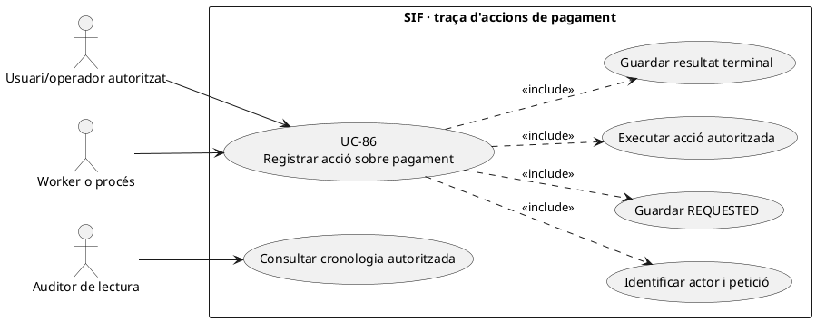
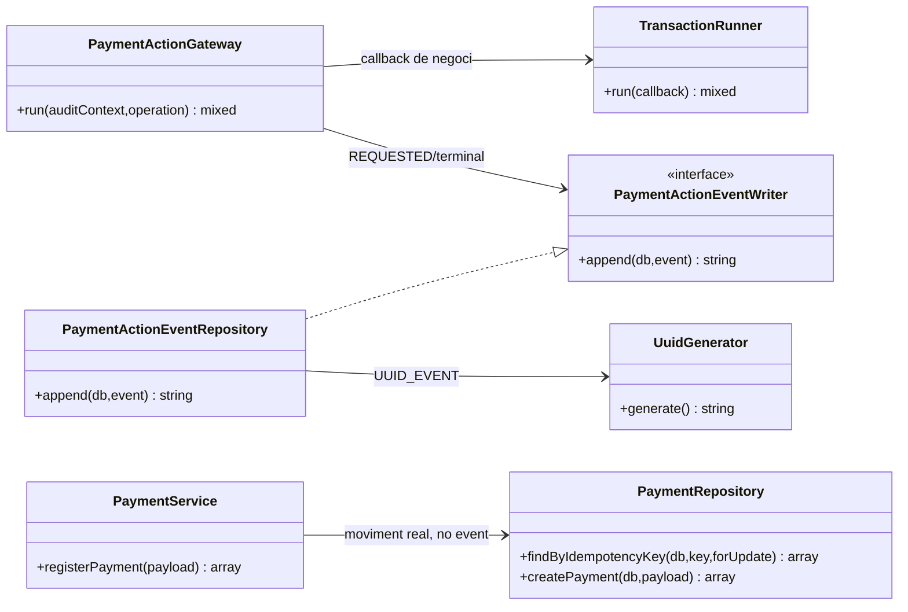
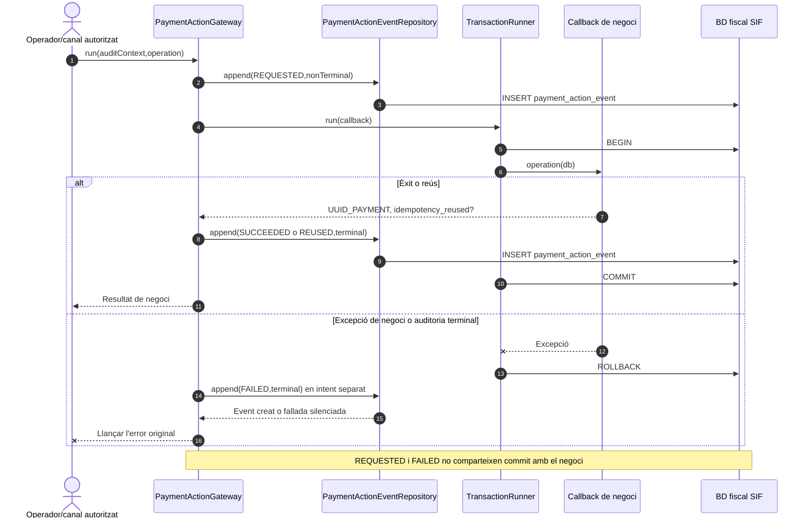

# UC-86 · Registrar qualsevol acció sobre un pagament — fitxa funcional i UML

**Objectiu del catàleg:** cronologia `append-only` de **petició, decisió i resultat** de les operacions sobre pagaments, en tots els entorns. L'event d'auditoria **no és** un assentament de diners. `payment_action_event` documenta qui ha consultat, assignat, refusat o reintentat; `payment_transaction` documenta CHARGE, REFUND i COMPENSATION i `payment_allocation` els imports aplicats a factures. Encara cal un **registre quantitatiu de procedència i destinació per inscripció** per a qualsevol acció que redistribueixi fons.

**Codi verificat:** `PaymentActionGateway::run()`, `PaymentActionEventRepository::append()`, `PaymentActionEventWriter` i `PaymentService::registerPayment()` existeixen. El gateway proporciona un patró executable per a **les rutes que efectivament l'invoquin**; aquesta revisió **no acredita que tots els canals i totes les accions, incloses SEARCH, VIEW, EXPORT o callbacks Redsys, ja passin pel gateway**. La migració defineix `payment_action_event` i el diccionari controla els seus valors.

## 1. Fitxa específica

| Element | Comportament comprovat o obligació pendent |
| --- | --- |
| Actors | Usuari autoritzat, procés automàtic, worker i auditor per consulta de la traça dins del seu abast. El rol/identitat s'han de validar al **canal** abans del gateway: el repositori d'events valida camps, **no** permisos. |
| Context mínim d'auditoria | `request_id`, `correlation_id`, `action`, `result`, `source_environment`, `source_channel`, `actor_type` i `occurred_at` obligatoris i no buits; UUID de pagament, clau idempotent, causa, actor/rol, motiu, hashes i changeset opcionals. |
| Accions admeses pel repositori | `CREATE_REQUEST`, `CREATE`, `SEARCH`, `VIEW`, `VIEW_ALLOCATIONS`, `EXPORT`, `ALLOCATE`, `REALLOCATE`, `UNALLOCATE`, `SPLIT_ALLOCATION`, `RECONCILE`, `RETRY`, `REDSYS_CALLBACK`, `REDSYS_WORKER_RESULT`, `IMPORT`, `ACCESS_DENIED`, entre altres valors llistats en `PaymentActionEventRepository::ACTIONS`. **Admetre una acció no demostra que el seu cas d'ús estigui implementat.** |
| Resultats admesos | `REQUESTED` (sempre no terminal); `SUCCEEDED`, `REUSED`, `NO_CHANGE`, `REJECTED`, `FAILED`, `QUEUED` i `PARTIAL` (sempre terminals segons validació del repositori). |
| Comportament del gateway | Escriu `REQUESTED` **abans** de la transacció de negoci; després executa el callback en transacció i hi incorpora un event terminal. Amb excepció, intenta escriure `FAILED` després del rollback i **torna a llançar l'error original**. |
| Ordre de durabilitat | Si falla `appendRequested()`, l'operació no comença. Si falla l'event terminal dins de la transacció, aquesta operació transaccional es reverteix. Si falla l'escriptura de `FAILED`, el gateway **silencia només aquest segon error**: pot quedar `REQUESTED` sense terminal. |
| Pagament real | `PaymentService` reutilitza `UUID_PAYMENT` per mateixa `IDEMPOTENCY_KEY`. **No compara el payload de la petició amb el pagament existent** en la seva ruta de reutilització. Això exigeix control de contradicció abans d'acceptar com a equivalent un reintent amb import, factura o destinació diferent. |
| Resultat per inscripció | `REALLOCATE` o `SPLIT_ALLOCATION` han de deixar events, però també un moviment **econòmic intern** amb import, `ID_INSC` origen/destí i referència al pagament real; l'event, per si sol, no en calcula el saldo. |

### 1.1. Flux principal implementat quan la ruta usa el gateway

1. L'adaptador comprova permís i construeix un `auditContext` sense secrets, amb `request_id` i `correlation_id` estables. La classe `PaymentActionGateway` **no** autentica l'actor ni exigeix el motiu de negoci si l'acció no el proporciona.
2. `appendRequested()` afegeix un event `REQUESTED` fora de la transacció de negoci; sense aquest event la comanda no entra al callback.
3. `TransactionRunner::run()` executa el callback de negoci; en un cobrament real el callback ha de validar `IDEMPOTENCY_KEY`, import real i assignacions, i només llavors crear/reutilitzar `payment_transaction` i les files de `payment_allocation`.
4. El gateway construeix l'event terminal: `REUSED` si el resultat indica `idempotency_reused=true`, `SUCCEEDED` per defecte, o `payment_audit_result` aportat pel callback, i el desa **dins** la mateixa transacció.
5. Si hi ha excepció, es fa rollback i `appendFailed()` intenta escriure `FAILED` amb `error_code` basat en classe d'excepció; l'error original arriba a l'adaptador.
6. En qualsevol acció que afecti una inscripció, el resultat de negoci ha de conciliar `UUID_PAYMENT`, factura, imports i moviments individuals, sense deduir-los del nombre d'events.

### 1.2. Alternatives i controls que no s'han d'inventar

| Cas | Comportament |
| --- | --- |
| Cerca o visualització d'un pagament | `SEARCH`/`VIEW` són valors acceptats pel repositori; cal connectar explícitament el canal de consulta a `append()`, no fingir que el gateway registra totes les lectures automàticament. |
| Reintent idempotent amb mateix import i destinació | El cobrament existent es reutilitza; es pot registrar event `REUSED`, **sense crear CHARGE addicional**. |
| Mateixa clau, import o assignacions diferents | **Buit real:** `PaymentService::existingResult()` retorna UUID sense comparar l'entrada. El disseny ha de revisar hash/payload i bloquejar contradicció abans de donar-la per correcta. |
| Error després de `REQUESTED` però abans del commit | `FAILED` en intent separat; si també falla, es conserva `REQUESTED` sense terminal i cal reconciliació posterior, no deduir èxit ni fracàs de l'absència del segon event. |
| Redistribució de 100 € entre dues inscripcions | Registrar canvi d'atribució **interna** 100 € amb origen/destí i event; no crear un segon cobrament extern de 100 €. |
| Accés denegat | El gateway exigeix que el canal autoritzi; `ACCESS_DENIED` és acció admesa a `payment_action_event`, però la cobertura efectiva de cada endpoint queda pendent d'auditar. |

**Proves pendents de validar en aquesta revisió:** escriptura `REQUESTED`+terminal sota èxit/reús/error, rollback per fallada d'event terminal, falta d'event `FAILED`, permisos per SEARCH/VIEW, idempotència amb payload contradictori, i conciliació econòmica per inscripció.

## 2. Diagrama UML de casos d'ús



## 3. Diagrama de classes executables



El gateway rep un **callback** de negoci, però `PaymentService` no té una dependència directa general a `PaymentActionGateway` acreditada al seu constructor. No dibuixar aquesta relació com si s'activés automàticament per totes les peticions.

## 4. Seqüència A — comanda amb traça completa



## 5. Seqüència B — atribució econòmica per inscripció (OBJECTIU)

```mermaid
sequenceDiagram
actor O as Operador
participant A as Adaptador de pagament [pendent]
participant G as PaymentActionGateway [PHP]
participant P as PaymentService [PHP]
participant L as Registre de fons d'inscripció [PROPOSTA]
O->>A: Reassignar 100 € ja cobrats d'A a B
A->>G: run(REALLOCATE,callback idempotent)
G->>L: operation: comprovar saldo A i pagament origen
L->>L: append(A→B,100 €,UUID_PAYMENT_ORIGEN)
L-->>G: UUID_MOVIMENT, import i destinació
G-->>A: Event terminal i resultat
Note over A,L: Cap CHARGE nou; el callback real de REALLOCATE encara no està implementat
```

## 6. Traçabilitat

[UC-86 original](../06-fitxes-funcionals/uc-086.md) · [UC-56 assignació](../06-fitxes-funcionals/uc-056.md) · [UC-25 conciliació](../06-fitxes-funcionals/uc-025.md) · [UC-02 cobrament](uc-002-registrar-cobrament-factura.md) · [Revisió de fons](00-revisio-moviments-inscripcions.md) · [PaymentActionGateway](../../sif/src/Service/PaymentActionGateway.php) · [PaymentActionEventRepository](../../sif/src/Repository/PaymentActionEventRepository.php) · [PaymentService](../../sif/src/Service/PaymentService.php) · [PaymentRepository](../../sif/src/Repository/PaymentRepository.php).
