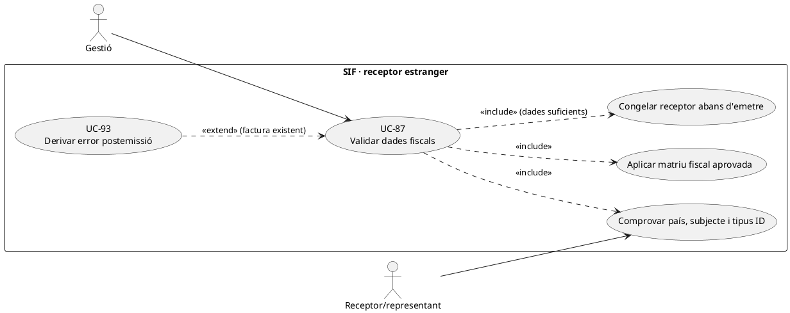
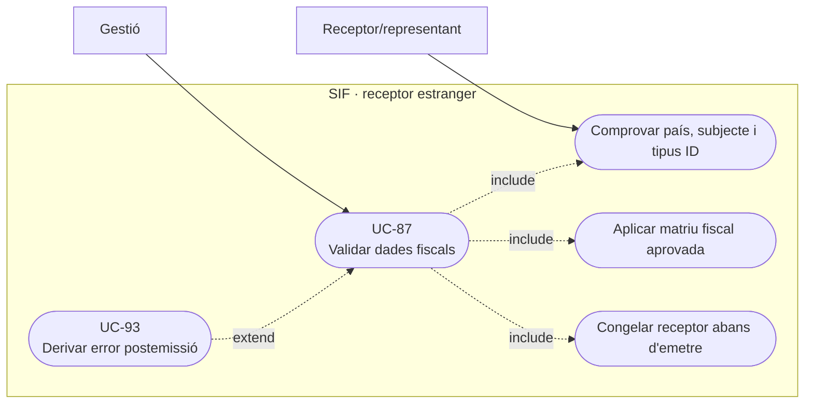
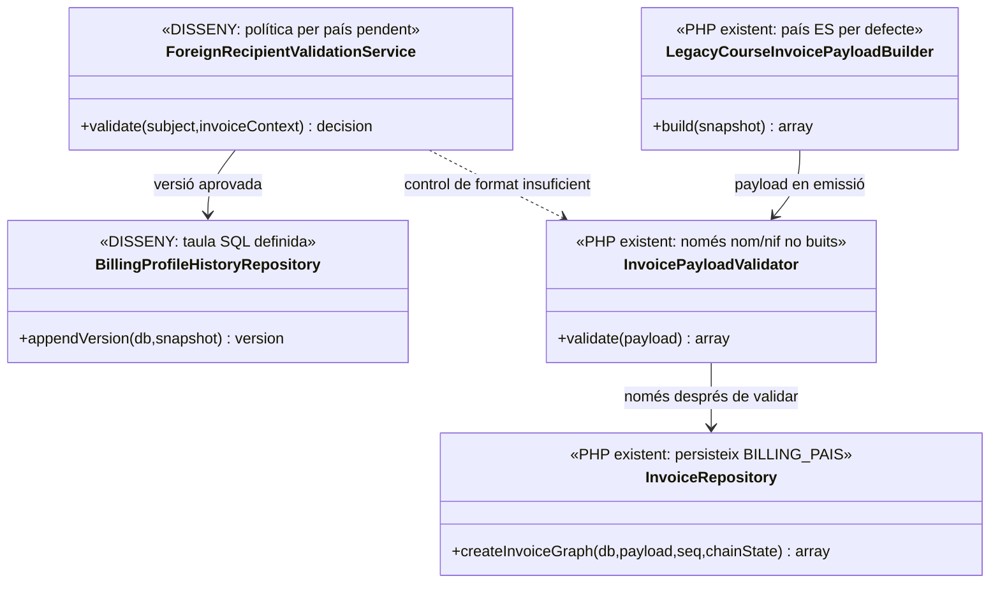
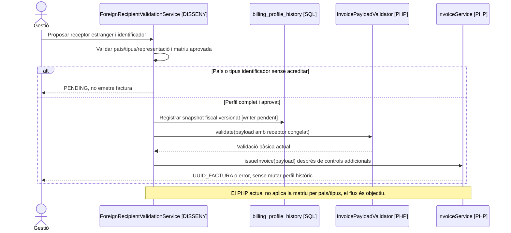

# UC-87 · Validar un receptor estranger o amb dades fiscals incompletes

**Objectiu original:** validació per país i tipus d'identificador; **no** emetre amb un receptor ambigu. **Estat [DISSENY/BLOQUEJANT].** Aquesta fitxa defineix controls de dades **pendents d'aprovar i implementar**, no determina automàticament el règim fiscal d'una operació estrangera.

## Evidència de la implementació

`InvoicePayloadValidator::validate()` requereix `billing.name` i `billing.nif` no buits. **No discrimina país, tipus de document ni estructura d'identificació**, ni exigeix CP, adreça o ciutat; `InvoiceRepository::insertInvoice()` desa `BILLING_PAIS` i fa servir `ES` per defecte si falta. `LegacyCourseInvoicePayloadBuilder::billing()` llegeix `DNI`, adreça, CP, població i `Pais` de la inscripció, també amb `ES` per defecte. Un identificador estranger acceptat com a text no acredita classificació/validesa fiscal.

`billing_profile_history` conté un snapshot fiscal versionat al SQL, però no s'ha acreditat cap `ForeignRecipientValidationService` executable o homologació dels codis de país/identificació. `ManualRectificationPayloadBuilder::billing()` reutilitza el receptor històric; no resol una validació deficient abans d'emetre.

## Decisió funcional i variants

| Situació | Acció específica |
| --- | --- |
| País/identificador absent o inconsistent | Blocatge de l'emissió i petició de dades amb identitat verificada; **no** omplir `ES` o un NIF inventat per fer passar el validador. |
| Resident a l'estranger amb identificador propi | Recollir país, tipus, número i evidència adequada; política de validació per jurisdicció i document **pendent**, sense presumir que tot identificador és un NIF espanyol. |
| Receptor persona/empresa/representant | Distingir comprador, pagador i receptor fiscal; l'alumne d'una factura de grup no és receptor només perquè consta a `fact_rels`. |
| Dades insuficients abans de pagar | Pot existir una oferta o intenció comercial, però bloquejar **l'emissió fiscal** fins a classificar i congelar dades necessàries; no crear pagament bancari fictici. |
| Dada errònia descoberta després d'emetre | Mantenir `factura.BILLING_*` i registres originals, obrir UC-93/74 i documentar via correctora aprovada, no `UPDATE` directe. |

### Flux objectiu

1. Identificar subjecte canònic, tipus de receptor, país i tipus d'identificador; consultar l'operació/servei i comprovar si ja hi ha `UUID_FACTURA`.
2. Validar format i dades imprescindibles segons una **matriu fiscal aprovada i versionada per país/tipus**, amb estat `VALID/PENDING/REJECTED` **proposat**; el validador PHP actual només comprova nom/NIF no buits.
3. Si falta informació, conservar la sol·licitud/versió però **no** cridar `InvoiceService::issueInvoice()`. Si s'ha generat intenció Redsys, no canviar-ne el snapshot sota el mateix `DS_ORDER`.
4. Amb dades i classificació aprovades, congelar receptor, país, règim fiscal i línies abans d'emetre. Relacionar la versió del perfil, sense copiar documents d'identitat sensibles al payload AEAT.
5. Si el canvi és posterior a l'emissió, derivar a UC-93/74. El cobrament existent conserva el seu `UUID_PAYMENT` independentment del resultat d'aquesta comprovació.

**Proves:** passaport sense país, NIF text no espanyol, país `ES` per defecte amb adreça estrangera, empresa pagadora amb alumne estranger, una factura ja emesa, canvi de perfil mentre hi ha intenció Redsys i dos identificadors per un mateix subjecte.

### Validació concreta de dades per canal i per receptor real

**La cadena de dades pot perdre la distinció del país.** `InvoicePayloadValidator::validate()` exigeix `billing.name` i `billing.nif` no buits, però no valida `country`, tipus d'identificador o coherència del domicili. `LegacyCourseInvoicePayloadBuilder::billing()` pren `DNI/Pais/ADRECA/Codi_Postal/Poblacio` de la inscripció; `InvoiceRepository::insertInvoice()` conserva el país del payload i usa `ES` per defecte quan falta. Això permet que un passaport o un identificador d'una altra jurisdicció figuri com a camp `nif` de text mentre el país s'ha omplert amb `ES` sense comprovació. El validador de dades fiscals de UC-87 és **un control d'integració pendent**, no una capacitat ja coberta per les dues comprovacions de presència.

**Identificar el destinatari abans de demanar-li dades.** Per una factura individual, el subjecte de la inscripció pot ser receptor; per un grup amb empresa pagadora, el document pertany al receptor fiscal de l'entitat, **no** a cada participant que tingui DNI/passaport estranger. `/alumnes/genera-entitat/` separa `entitats.CIF/RAO/ADRECA/CP/POBLACIO` del contacte `entitats_resp`; aquest contacte tampoc és automàticament el receptor. El pas de confirmació UC-69 ha de seleccionar un **ID de receptor intern** i presentar els camps del perfil corresponent: no completar les dades fiscals de l'empresa amb el domicili o passaport del participant perquè són els únics camps disponibles al formulari.

**Conservar la resposta rebuda i bloquejar només la mutació improcedent.** Si manca país, tipus d'identificador o la identificació del receptor real, guardar la sol·licitud d'aclariment i la prova amb accés restringit, **sense convertir** automàticament el número introduït a un NIF espanyol ni afirmar que la factura és apta. Si ja hi ha un `DS_ORDER` anterior, conservar `SNAPSHOT_JSON/EXPECTED_AMOUNT`: la validació posterior no reescriu l'intent bancari. Si arriba un callback amb ingrés real mentre la comprovació de receptor resta pendent, conservar la prova econòmica i obrir conciliació; no atribuir una factura amb receptor inventat ni un `REFUND` fictici. Les dades i classificacions tributàries **per país/tipus** s'han d'aprovar de manera separada per al servei real; la fitxa no en fixa un format universal.

**Canvi després d'haver emès.** Corregir `DNI/Pais` al perfil vigent no modifica `factura.BILLING_*` ni el PDF original. `ManualRectificationPayloadBuilder::billing()` copia les dades del receptor original i no és una eina genèrica de canvi de persona o de país; la petició amb document real passa a UC-93/74, amb justificació i decisió sobre la via fiscal adequada. La revisió del document no duplica el `UUID_PAYMENT` que ja pugui existir.

### Proves de receptor per canal (no executades)

| ID | Escenari | Resultat exigible |
| --- | --- | --- |
| RX-87-01 | Passaport no espanyol amb `Pais` absent al llegat | No substituir per `ES` de manera acrítica; país i tipus pendents de validació acreditada. |
| RX-87-02 | Alumne estranger d'un grup amb factura a l'escola | Validar receptor fiscal de l'escola i tractar les dades d'alumne com a participant, no com a comprador. |
| RX-87-03 | Contacte d'entitat i empresa tenen identificadors/domicilis diferents | Confirmació per ID intern de receptor; no copiar camps del contacte o de l'inscrit. |
| RX-87-04 | Intenció Redsys prèvia i posterior aclariment de país/receptor | Snapshot de l'ordre antiga immutable i conciliació de possible ingrés real. |
| RX-87-05 | Factura ja emesa amb receptor incorrecte | Conservar original i derivar a classificació UC-93/74; cap UPDATE fiscal directe. |

## UML de casos d'ús

### Vista de casos d’ús per a GitHub (Mermaid)

## UML de classes

## UML de seqüència — document estranger incomplet

## Traçabilitat

[UC-87 original](../06-fitxes-funcionals/uc-087.md) · [UC-69 confirmació fiscal](uc-069-confirmar-congelar-dades-fiscals.md) · [UC-93 canvi receptor original](../06-fitxes-funcionals/uc-093.md) · [UC-74 correcció](uc-074-classificar-correccio-fiscal.md) · [InvoicePayloadValidator](../../sif/src/Service/InvoicePayloadValidator.php) · [InvoiceRepository](../../sif/src/Repository/InvoiceRepository.php) · [LegacyCourseInvoicePayloadBuilder](../../sif/src/Service/LegacyCourseInvoicePayloadBuilder.php) · [SQL perfils](../../sif/database/migrations/2026_09_15_000003_add_functional_audit_control.sql).
