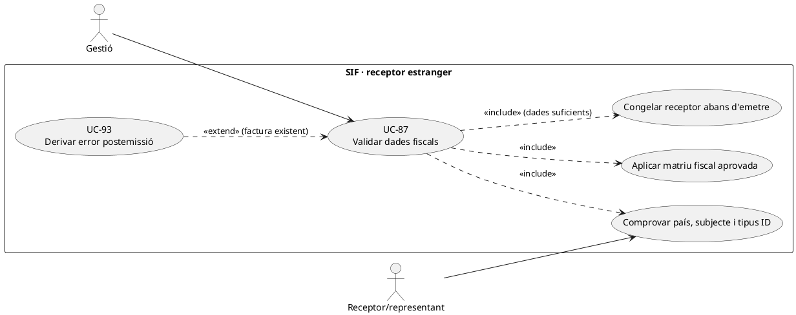
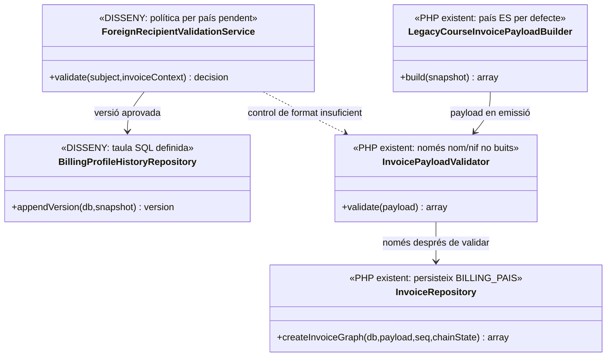

# UC-87 · Validar un receptor estranger o amb dades fiscals incompletes

**Objectiu original:** validació per país i tipus d'identificador; **no** emetre amb un receptor ambigu. **Estat [DISSENY/BLOQUEJANT].** Aquesta fitxa defineix controls de dades **pendents d'aprovar i implementar**, no determina automàticament el règim fiscal d'una operació estrangera.

## Evidència de la implementació

`InvoicePayloadValidator::validate()` requereix `billing.name` i `billing.nif` no buits. **No discrimina país, tipus de document ni estructura d'identificació**, ni exigeix CP, adreça o ciutat; `InvoiceRepository::insertInvoice()` desa `BILLING_PAIS` i fa servir `ES` per defecte si falta. `LegacyCourseInvoicePayloadBuilder::billing()` llegeix `DNI`, adreça, CP, població i `Pais` de la inscripció, també amb `ES` per defecte. Un identificador estranger acceptat com a text no acredita classificació/validesa fiscal.

`billing_profile_history` conté un snapshot fiscal versionat al SQL, però no s'ha acreditat cap `ForeignRecipientValidationService` executable o homologació dels codis de país/identificació. `ManualRectificationPayloadBuilder::billing()` reutilitza el receptor històric; no resol una validació deficient abans d'emetre.

## Decisió funcional i variants

| Situació | Acció específica |
| --- | --- |
| País/identificador absent o inconsistent | Blocatge de l'emissió i petició de dades amb identitat verificada; **no** omplir `ES` o un NIF inventat per fer passar el validador. |
| Resident a l'estranger amb identificador propi | Recollir país, tipus, número i evidència adequada; política de validació per jurisdicció i document **pendent**, sense presumir que tot identificador és un NIF espanyol. |
| Receptor persona/empresa/representant | Distingir comprador, pagador i receptor fiscal; l'alumne d'una factura de grup no és receptor només perquè consta a `fact_rels`. |
| Dades insuficients abans de pagar | Pot existir una oferta o intenció comercial, però bloquejar **l'emissió fiscal** fins a classificar i congelar dades necessàries; no crear pagament bancari fictici. |
| Dada errònia descoberta després d'emetre | Mantenir `factura.BILLING_*` i registres originals, obrir UC-93/74 i documentar via correctora aprovada, no `UPDATE` directe. |

### Flux objectiu

1. Identificar subjecte canònic, tipus de receptor, país i tipus d'identificador; consultar l'operació/servei i comprovar si ja hi ha `UUID_FACTURA`.
2. Validar format i dades imprescindibles segons una **matriu fiscal aprovada i versionada per país/tipus**, amb estat `VALID/PENDING/REJECTED` **proposat**; el validador PHP actual només comprova nom/NIF no buits.
3. Si falta informació, conservar la sol·licitud/versió però **no** cridar `InvoiceService::issueInvoice()`. Si s'ha generat intenció Redsys, no canviar-ne el snapshot sota el mateix `DS_ORDER`.
4. Amb dades i classificació aprovades, congelar receptor, país, règim fiscal i línies abans d'emetre. Relacionar la versió del perfil, sense copiar documents d'identitat sensibles al payload AEAT.
5. Si el canvi és posterior a l'emissió, derivar a UC-93/74. El cobrament existent conserva el seu `UUID_PAYMENT` independentment del resultat d'aquesta comprovació.

**Proves:** passaport sense país, NIF text no espanyol, país `ES` per defecte amb adreça estrangera, empresa pagadora amb alumne estranger, una factura ja emesa, canvi de perfil mentre hi ha intenció Redsys i dos identificadors per un mateix subjecte.

## UML de casos d'ús



## UML de classes



## UML de seqüència — document estranger incomplet

```mermaid
sequenceDiagram
actor G as Gestió
participant F as ForeignRecipientValidationService [DISSENY]
participant B as billing_profile_history [SQL]
participant V as InvoicePayloadValidator [PHP]
participant I as InvoiceService [PHP]
G->>F: Proposar receptor estranger i identificador
F->>F: Validar país/tipus/representació i matriu aprovada
alt País o tipus identificador sense acreditar
 F-->>G: PENDING, no emetre factura
else Perfil complet i aprovat
 F->>B: Registrar snapshot fiscal versionat [writer pendent]
 F->>V: validate(payload amb receptor congelat)
 V-->>F: Validació bàsica actual
 F->>I: issueInvoice(payload) després de controls addicionals
 I-->>G: UUID_FACTURA o error, sense mutar perfil històric
end
Note over F,I: El PHP actual no aplica la matriu per país/tipus; el flux és objectiu.
```

## Traçabilitat

[UC-87 original](../06-fitxes-funcionals/uc-087.md) · [UC-69 confirmació fiscal](uc-069-confirmar-congelar-dades-fiscals.md) · [UC-93 canvi receptor original](../06-fitxes-funcionals/uc-093.md) · [UC-74 correcció](uc-074-classificar-correccio-fiscal.md) · [InvoicePayloadValidator](../../sif/src/Service/InvoicePayloadValidator.php) · [InvoiceRepository](../../sif/src/Repository/InvoiceRepository.php) · [LegacyCourseInvoicePayloadBuilder](../../sif/src/Service/LegacyCourseInvoicePayloadBuilder.php) · [SQL perfils](../../sif/database/migrations/2026_09_15_000003_add_functional_audit_control.sql).
