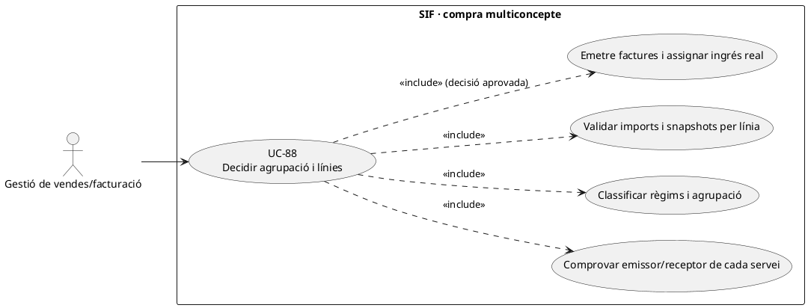
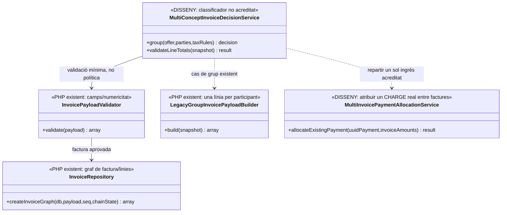
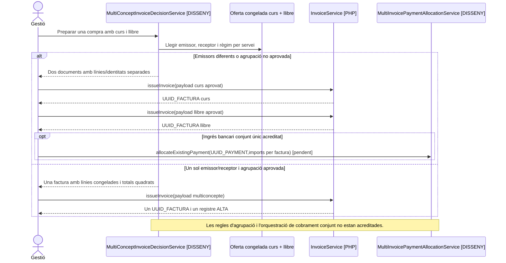

# UC-88 · Decidir si una compra multiconcepte exigeix una factura o diverses

**Objectiu original:** una regla explícita decideix **factura amb diverses línies** o **factures separades**, no la quantitat de moviments de pagament. **Estat [DISSENY/PARCIAL].** El PHP pot persistir diverses línies i el builder de grup en construeix una per participant; no s'ha acreditat un classificador transversal que decideixi quan agrupar serveis amb receptors/emissors/règims diferents.

## Evidència del codi

`InvoicePayloadValidator::validate()` exigeix un array `lines` no buit i comprova `concept, quantity, unit_price, base, total` de cada línia, però **no determina si dos serveis són agrupables ni reconcilia tots els totals de línia amb els totals globals**. `InvoiceRepository::createInvoiceGraph()` desa totes les línies d'un mateix `UUID_FACTURA` i crea **un** registre `ALTA` amb numeració/cadena/cua per la factura. `LegacyGroupInvoicePayloadBuilder::build()` construeix una línia per participant i suma bases, descomptes i totals; el receptor és el responsable llegat i `visible_alumne=0`. Això és **un exemple de composició**, no una regla universal per venda mixta de curs, llibre, pack i altres productes.

`fact_rels` pot relacionar diversos orígens amb una factura, però `InvoiceRepository::insertRelations()` no omple `ID_FACTURA_LINIA` ni import per inscrit. Un únic `payment_transaction` amb diverses `payment_allocation` pot assignar cobrament a factures distintes; **la quantitat de `DS_ORDER` o d'ingressos no fixa per si sola el nombre de factures**.

## Decisió per línia i receptor

| Escenari | Decisió pendent / invariant |
| --- | --- |
| Grup amb receptor únic i cursos per participant | El builder actual pot emetre **una factura amb una línia per alumne**, identificada amb `source_type=INSCRIPCIO` i `source_id`. Receptor del grup i autorització de consulta s'han de confirmar. |
| Curs i llibre en una compra | Identificar emissor real, receptor, classe de prestació, règim i base/impost de **cada línia** abans de decidir la unitat fiscal. No aplicar el `iva_regim=EXEMPT` del builder de curs a un altre producte per defecte; UC-98 classifica la botiga/SL. |
| Dues entitats emissores | No construir una factura única amb emissor ambigu. Separar per emissor i conciliar una eventual entrada externa conjunta sense fabricar dos `CHARGE`. |
| Una factura amb ingressos fraccionats | Mantenir el mateix `UUID_FACTURA`, registrar cada ingrés **real** i assignar-lo a la factura existent; no crear una factura nova per cada fracció si el fet fiscal no ho requereix. |
| Línies i imports | Fer quadre de cèntims per línia i règim, descomptes i totals del document; validació aritmètica/transversal **pendent**, perquè `InvoicePayloadValidator` actual comprova sobretot presència i tipus numèric. |

### Flux objectiu

1. Reunir oferta acceptada, serveis, emissor/receptor verificats, `ID_INSC` i imports/tributació per línia. Assignar un identificador d'operació/servei a cada concepte, també quan un únic pagador compra per tercers.
2. Aplicar classificador **pendent** per emissor, receptor, servei i règim. Si el resultat són diverses factures, preparar snapshots i claus fiscals independents sense confondre'ls amb els moviments del TPV.
3. Validar aritmètica de línies i totals amb cèntims i regla de descompte per concepte; congelar versió abans de TPV/emissió, no reconstruir línies des del catàleg actual després del cobrament.
4. `InvoiceService` emet cada factura real una vegada. Si existeix un únic `CHARGE` bancari per compra amb N factures, `payment_allocation` ha de quadrar amb els imports atribuïts **sense duplicar ingrés extern**. La traça quantitativa per inscrit encara és proposta.
5. Mostrar al comprador les factures/resultats per emissor i a cada participant només allò que pot consultar, sense enviar automàticament la factura del responsable de grup.

**Proves:** dos cursos d'un mateix grup; curs + llibre i dos emissors; dues factures amb una transferència; fraccions d'una factura; import total no igual a suma de línies; dos articles amb règim diferent; `fact_rels.ID_FACTURA_LINIA=NULL`.

## UML de casos d'ús

## UML de classes

## UML de seqüència — compra de serveis amb emissor diferent (DISSENY)

## Traçabilitat

[UC-88 original](../06-fitxes-funcionals/uc-088.md) · [UC-91 trams original](../06-fitxes-funcionals/uc-091.md) · [UC-98 botiga original](../06-fitxes-funcionals/uc-098.md) · [UC-44 relacions](uc-044-consultar-mantenir-fact-rels-origen-legacy.md) · [InvoicePayloadValidator](../../sif/src/Service/InvoicePayloadValidator.php) · [InvoiceRepository](../../sif/src/Repository/InvoiceRepository.php) · [LegacyGroupInvoicePayloadBuilder](../../sif/src/Service/LegacyGroupInvoicePayloadBuilder.php) · [PaymentRepository · situació actual](../../sif/src/Repository/PaymentRepository.php) · [Moviments per inscripció](00-revisio-moviments-inscripcions.md).
