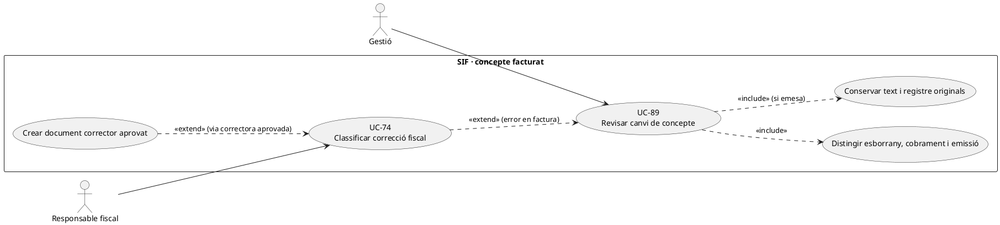
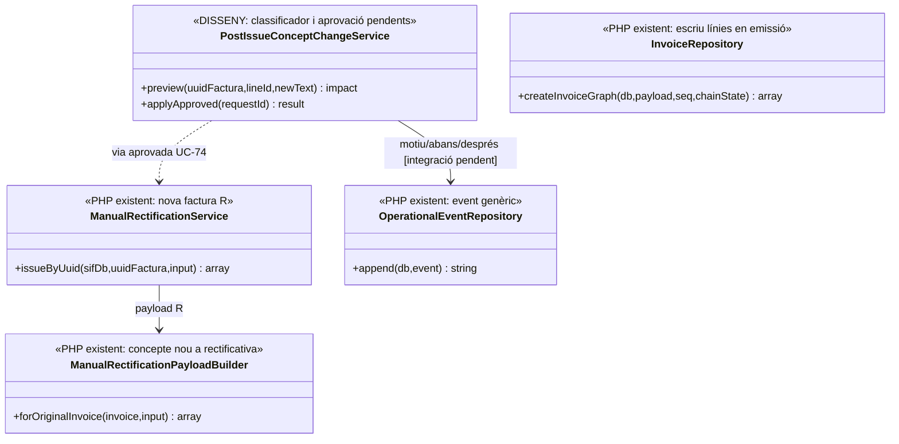

# UC-89 · Canviar el concepte després del cobrament o l'emissió

**Objectiu original:** abans d'emetre es pot versionar l'esborrany; **després d'emetre no hi ha `UPDATE` fiscal directe**, sinó classificació UC-74 o cap efecte. **Estat [DISSENY/BLOQUEJANT]** del servei d'aprovació de canvi; els executors de facturació i rectificativa sí existeixen.

## Evidència del PHP

`InvoiceRepository::insertLines()` escriu `CONCEPTE/DETALL` per cada `UUID_FACTURA`; `createInvoiceGraph()` genera el registre `ALTA` i la cua **del payload emès**. `LegacyCourseInvoicePayloadBuilder` forma el concepte a partir del curs/edició del snapshot. `ManualRectificationService::issueByUuid()` prepara una **nova** factura sèrie `R` via `ManualRectificationPayloadBuilder`, la vincula amb `factura_rectificacio` i marca `ESTAT_FACTURA=RECTIFIED` a l'original; el builder admet un concepte nou a la **línia de la rectificativa**, però **no decideix per si sol** si una errada de text exigeix aquella via ni reescriu el concepte de l'original. No s'ha acreditat un servei PHP que classifiqui i autoritzi sistemàticament totes les modificacions de concepte.

## Variants que canvien la decisió

| Fet | Tractament específic |
| --- | --- |
| Error tipogràfic en oferta **no emesa** | Versionar esborrany i congelar concepte corregit abans de crear factura/intent de pagament. Si hi ha `DS_ORDER` amb snapshot antic, no reutilitzar-lo amb dades diferents. |
| Cobrament real anterior a l'emissió | Conservar `UUID_PAYMENT/DS_ORDER`, comprovar a quina oferta/prestació correspon i congelar concepte correcte **abans** de l'emissió. No tornar a registrar `CHARGE` per corregir el text. |
| Canvi del títol del curs **després de factura emesa** | Distingir dada mestra vigent (UC-70) de prestació ja facturada; el títol nou del catàleg no modifica `factura_linia.CONCEPTE` ni obliga automàticament a un corrector. |
| Descripció errònia del servei facturat | UC-74 revisa document, causa, prestació real, estat AEAT i efecte legal/fiscal i aprova la via; una rectificativa o altre registre només després de decisió justificable. |
| Canvi real de curs o import | UC-71/73/74 gestiona servei i diferència monetària **per inscrit**; no és una edició purament textual. |
| Document lliurat | Guardar còpia/versió i traça d'accés originals; no substituir el PDF silenciosament amb un concepte diferent mantenint el mateix número/hash. |

### Flux objectiu

1. Gestió compara concepte i detall **originals** amb el text sol·licitat, identifica `UUID_FACTURA`, línia, `ID_INSC`/origen, servei real i motiu. Comprovar si només hi ha oferta, si s'ha cobrat o si ja s'ha emès.
2. Sense emissió, aprovar text i versionar snapshot comercial; amb intenció TPV en curs, revalidar import i `DS_ORDER` abans de modificar.
3. Amb factura emesa, conservar concepte/registre/PDF originals i documentar abans/després com a `operational_event` (writer general existent, integració específica pendent); UC-74 classifica si cal document corrector o cap efecte fiscal.
4. Si s'ha aprovat una rectificativa, executar `ManualRectificationService` amb tipus/mode/import/motiu/concepte verificats, vinculant-la a l'original. **El builder actual copia `billing` de l'original** i utilitza un import proporcionat; no és un editor arbitrari de les línies històriques.
5. Informar el receptor autoritzat de la decisió i el document realment disponible. Una modificació de text per si sola no crea `CHARGE/REFUND` ni canvia l'accés Moodle.

**Proves:** catàleg retitulat després de facturar, error de concepte en una línia d'un grup, compra cobrada però encara no emesa, intenció Redsys antiga, rectificativa amb import zero no admesa pel builder actual, retry de rectificativa i PDF històric immutable.

## UML de casos d'ús



## UML de classes



## UML de seqüència — error textual després de l'emissió

```mermaid
sequenceDiagram
actor G as Gestió
participant C as PostIssueConceptChangeService [DISSENY]
participant F as factura_linia + factura_registres [SQL]
participant E as OperationalEventRepository [PHP]
participant T as Classificació UC-74 [DISSENY]
participant R as ManualRectificationService [PHP]
G->>C: Sol·licitar text nou per línia ja emesa
C->>F: Llegir concepte i registre fiscal originals
C->>E: Registrar proposta abans/després [integració pendent]
C->>T: Classificar fet real i via fiscal
alt Sense efecte fiscal aprovat
 T-->>G: Mantenir factura històrica, actualitzar només catàleg si escau
else Rectificativa formalment aprovada
 T-->>C: Tipus, mode, motiu, import i concepte validats
 C->>R: issueByUuid(original,input)
 R-->>C: UUID_FACTURA_RECTIFICATIVA i relació a original
 C-->>G: Nova factura i PDF quan existeixi; original intacta
end
Note over C,R: El servei PHP R no valida per si mateix la justificació fiscal del canvi textual.
```

## Traçabilitat

[UC-89 original](../06-fitxes-funcionals/uc-089.md) · [UC-70 dades mestres](uc-070-modificar-dades-mestres-despres-emetre.md) · [UC-73 ajust](uc-073-documentar-ajust-descompte-despesa.md) · [UC-74 decisió](uc-074-classificar-correccio-fiscal.md) · [InvoiceRepository](../../sif/src/Repository/InvoiceRepository.php) · [ManualRectificationService](../../sif/src/Service/ManualRectificationService.php) · [ManualRectificationPayloadBuilder](../../sif/src/Service/ManualRectificationPayloadBuilder.php) · [OperationalEventRepository](../../sif/src/Repository/OperationalEventRepository.php).
