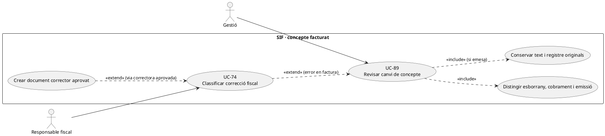
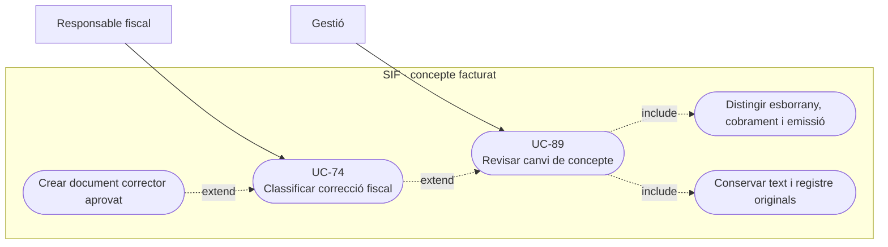
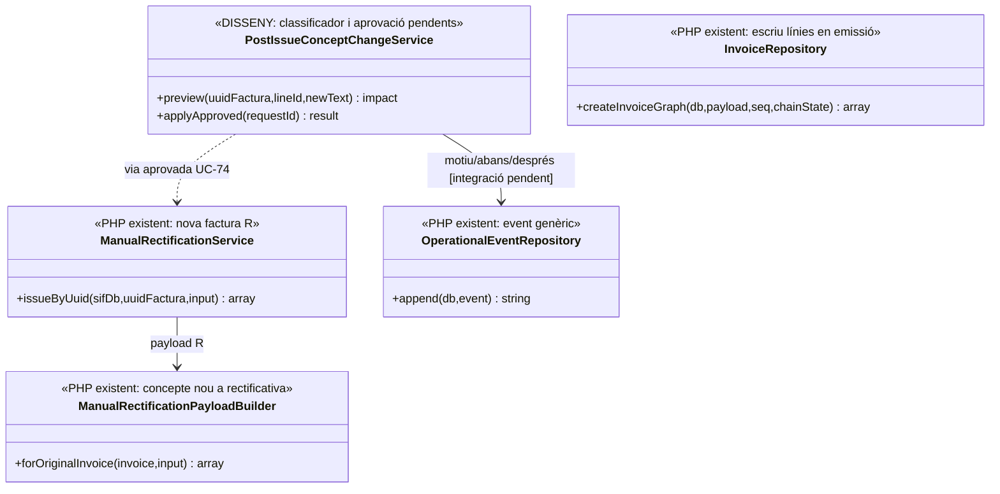
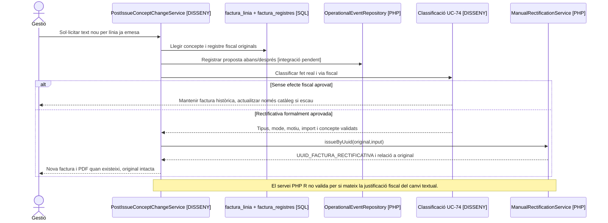

# UC-89 · Canviar el concepte després del cobrament o l'emissió

**Objectiu original:** abans d'emetre es pot versionar l'esborrany; **després d'emetre no hi ha `UPDATE` fiscal directe**, sinó classificació UC-74 o cap efecte. **Estat [DISSENY/BLOQUEJANT]** del servei d'aprovació de canvi; els executors de facturació i rectificativa sí existeixen.

## Evidència del PHP

`InvoiceRepository::insertLines()` escriu `CONCEPTE/DETALL` per cada `UUID_FACTURA`; `createInvoiceGraph()` genera el registre `ALTA` i la cua **del payload emès**. `LegacyCourseInvoicePayloadBuilder` forma el concepte a partir del curs/edició del snapshot. `ManualRectificationService::issueByUuid()` prepara una **nova** factura sèrie `R` via `ManualRectificationPayloadBuilder`, la vincula amb `factura_rectificacio` i marca `ESTAT_FACTURA=RECTIFIED` a l'original; el builder admet un concepte nou a la **línia de la rectificativa**, però **no decideix per si sol** si una errada de text exigeix aquella via ni reescriu el concepte de l'original. No s'ha acreditat un servei PHP que classifiqui i autoritzi sistemàticament totes les modificacions de concepte.

## Variants que canvien la decisió

| Fet | Tractament específic |
| --- | --- |
| Error tipogràfic en oferta **no emesa** | Versionar esborrany i congelar concepte corregit abans de crear factura/intent de pagament. Si hi ha `DS_ORDER` amb snapshot antic, no reutilitzar-lo amb dades diferents. |
| Cobrament real anterior a l'emissió | Conservar `UUID_PAYMENT/DS_ORDER`, comprovar a quina oferta/prestació correspon i congelar concepte correcte **abans** de l'emissió. No tornar a registrar `CHARGE` per corregir el text. |
| Canvi del títol del curs **després de factura emesa** | Distingir dada mestra vigent (UC-70) de prestació ja facturada; el títol nou del catàleg no modifica `factura_linia.CONCEPTE` ni obliga automàticament a un corrector. |
| Descripció errònia del servei facturat | UC-74 revisa document, causa, prestació real, estat AEAT i efecte legal/fiscal i aprova la via; una rectificativa o altre registre només després de decisió justificable. |
| Canvi real de curs o import | UC-71/73/74 gestiona servei i diferència monetària **per inscrit**; no és una edició purament textual. |
| Document lliurat | Guardar còpia/versió i traça d'accés originals; no substituir el PDF silenciosament amb un concepte diferent mantenint el mateix número/hash. |

### Flux objectiu

1. Gestió compara concepte i detall **originals** amb el text sol·licitat, identifica `UUID_FACTURA`, línia, `ID_INSC`/origen, servei real i motiu. Comprovar si només hi ha oferta, si s'ha cobrat o si ja s'ha emès.
2. Sense emissió, aprovar text i versionar snapshot comercial; amb intenció TPV en curs, revalidar import i `DS_ORDER` abans de modificar.
3. Amb factura emesa, conservar concepte/registre/PDF originals i documentar abans/després com a `operational_event` (writer general existent, integració específica pendent); UC-74 classifica si cal document corrector o cap efecte fiscal.
4. Si s'ha aprovat una rectificativa, executar `ManualRectificationService` amb tipus/mode/import/motiu/concepte verificats, vinculant-la a l'original. **El builder actual copia `billing` de l'original** i utilitza un import proporcionat; no és un editor arbitrari de les línies històriques.
5. Informar el receptor autoritzat de la decisió i el document realment disponible. Una modificació de text per si sola no crea `CHARGE/REFUND` ni canvia l'accés Moodle.

**Proves:** catàleg retitulat després de facturar, error de concepte en una línia d'un grup, compra cobrada però encara no emesa, intenció Redsys antiga, rectificativa amb import zero no admesa pel builder actual, retry de rectificativa i PDF històric immutable.

### Concepte editat a la pantalla antiga i correspondència per línia fiscal

**El concepte del PDF antic no identifica una línia SIF.** La documentació del llegat indica que `generaFactura()` construeix la visualització a partir de `web.factures.concepte1/concepte2/import`, sense línies fiscals estructurades. A «Generar factura abans de pagar», el navegador composa `concepte1`, demana `concepte2` amb una crida asíncrona a `calcularTextData.php` i envia les dades de previsualització a `generaFacturaElectronica_Factures.php`. En el SIF, `factura_linia.CONCEPTE/DETALL` pertanyen a **cada** `ID_INSC`/servei de la factura: no substituir el text global del llegat com si hi hagués una única línia quan la factura cobreix grup o pack amb diferents participants o cursos.

**Error abans d'emetre: reconstruir el contingut al servidor.** Si l'error és en el text encara no facturat, confirmar inscripcions seleccionades, curs/edició, títol, receptor i proposta real; esperar l'acabament de `calcularTextData.php` abans de la previsualització. Un text `concepte2` tardà o absent **no** s'ha de deduir del curs actual al callback, perquè el servei pot haver canviat. Si ja existeix una intenció `DS_ORDER`, comparar-ne el snapshot i decidir si correspon una ordre nova; no canviar el text de l'oferta signada sota la mateixa referència.

**Document real ja emès: conservar original i classificar.** Una factura emesa a empresa pot tenir N línies d'inscripció, cadascuna amb el seu concepte i `SOURCE_ID`. Rebre una petició de corregir només la línia d'una persona no significa que s'hagi d'anul·lar o tornar a facturar **tot** el grup; UC-74 ha de classificar tipus d'errada, servei efectivament prestat, import, receptor i document/registre corrector que correspongui. `ManualRectificationPayloadBuilder` crea una línia rectificativa genèrica amb `concept` aportat, però no reconstruïx automàticament la línia original afectada ni el vincle `ID_FACTURA_LINIA`. La correcció ha de preservar relació directa entre factura i document nou, i no substituir el PDF original amb un renderitzat del títol actual.

**Una factura cobrada no exigeix repetir el moviment.** Si `UUID_PAYMENT` està confirmat i l'únic problema és el text, el tractament documental no crea `CHARGE` ni `REFUND`; només hi haurà un moviment monetari nou si es documenta **un fet econòmic real diferent**. Distingir cobrament real pendent d'emissió i factura ja emesa amb document disponible/pending abans de decidir la comunicació al receptor.

### Proves del concepte multilinia i del llegat (no executades)

| ID | Escenari | Resultat exigible |
| --- | --- | --- |
| CO-89-01 | `concepte2` asíncron arriba després que l'usuari confirmi la pantalla | No emetre amb text incomplet; revalidar concepte al servidor. |
| CO-89-02 | Factura de grup amb error textual només a la línia d'un participant | Identificar `UUID_FACTURA` i línia exacta; decisió UC-74 sense reescriure resta de línies. |
| CO-89-03 | Canvia títol al catàleg després de factura original emesa | Concepte/PDF/hash originals intactes; no regeneració amb títol actual. |
| CO-89-04 | Builder rectificatiu rep un concepte nou sense ID de línia afectada | Classificació i relació documental verificades; no donar per feta una correcció automàtica per línia. |
| CO-89-05 | Cobrament bancari confirmat i petició purament textual | Cap segon `CHARGE` ni `REFUND` per canviar paraules. |

## UML de casos d'ús

### Vista de casos d’ús per a GitHub (Mermaid)

## UML de classes

## UML de seqüència — error textual després de l'emissió

## Traçabilitat

[UC-89 original](../06-fitxes-funcionals/uc-089.md) · [UC-70 dades mestres](uc-070-modificar-dades-mestres-despres-emetre.md) · [UC-73 ajust](uc-073-documentar-ajust-descompte-despesa.md) · [UC-74 decisió](uc-074-classificar-correccio-fiscal.md) · [InvoiceRepository](../../sif/src/Repository/InvoiceRepository.php) · [ManualRectificationService](../../sif/src/Service/ManualRectificationService.php) · [ManualRectificationPayloadBuilder](../../sif/src/Service/ManualRectificationPayloadBuilder.php) · [OperationalEventRepository](../../sif/src/Repository/OperationalEventRepository.php).
