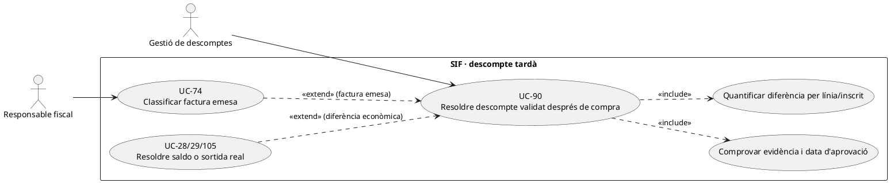
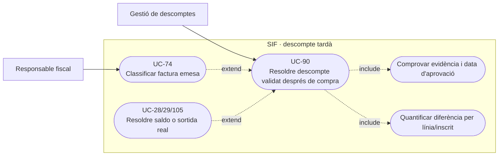
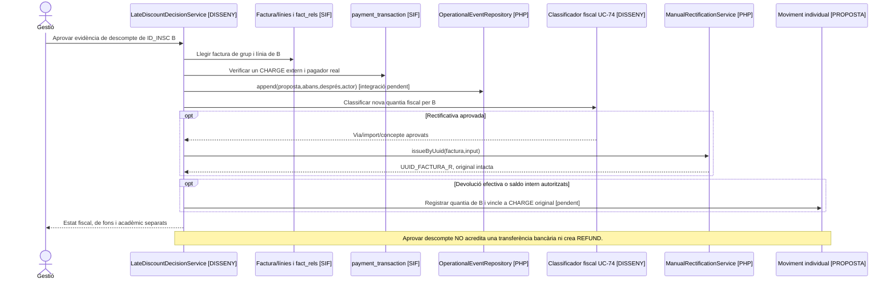

# UC-90 · Resoldre un descompte validat després de la compra

**Objectiu original:** guardar sol·licitud, evidència, moment de validació i diferència; **després d'emetre cal classificar l'impacte fiscal**. **Estat [DISSENY/BLOQUEJANT].** Aplicar un descompte no significa haver tornat diners; aprovar-lo no autoritza reescriure una factura ni una intenció TPV congelada.

## Evidència de la implementació

`LegacyCourseInvoicePayloadBuilder::lineAmounts()` valida **durant la construcció inicial** que base–descompte correspon al total del snapshot (`abs(delta) <= 0.01`). `DiscountSnapshotFileReader::read()` llegeix un JSON opcional dels scripts manuals de proves; **no verifica per si sol dret comercial, vigència, justificants ni data d'aprovació**. `InvoiceRepository::insertLines()` congela `DESC_ORIGEN/MODE/ID/CODI_PROMO/PCT/IMPORT/TEXT_VISIBLE/MOTIU_INTERN` per línia.

`operational_event` té writer PHP general `OperationalEventRepository::append()` per snapshots abans/després, actor, motiu i correlació; no s'ha acreditat l'orquestració d'una validació tardana de descompte que vinculi aquest event a factura, pagament, rectificativa i devolució. `ManualRectificationService` emet un document nou **a partir d'una classificació i import proporcionats**, no decideix si una promoció tardana exigeix aquella factura ni executa cap `REFUND`.

## Variants amb diners per inscrit

| Estat de compra | Procediment |
| --- | --- |
| Oferta abans de factura i abans de TPV | Verificar elegibilitat amb vigència/evidència i recalcular import net; congelar origen/codi/base/descompte/total per línia i nova versió de l'oferta. No generar `REFUND` per la diferència: encara no s'han cobrat aquests diners. |
| Intenció `DS_ORDER` existent però sense ingrés | No modificar silenciosament `EXPECTED_AMOUNT/SNAPSHOT_JSON` de la intenció antiga. Caducar/revocar segons UC-103 i construir una intenció nova per import aprovat; cap nou `CHARGE` fins a confirmació real. |
| Factura emesa **pendent** de pagament | Conservar document original, registrar aprovació i diferència per línia/`ID_INSC`; UC-74 classifica document corrector o altra actuació. Reduir un deute **no és** una devolució. |
| Factura emesa **i pagada** | Conservar `UUID_PAYMENT` i la seva referència bancària. Si es reconeix diferència a favor del pagador, decidir refund bancari UC-28, saldo UC-29 o aplicació interna UC-105 **amb imports individuals** i autorització; `REFUND` només després de sortida externa real. |
| Compra de grup/pack | Fixar exactament quins `ID_INSC` reuneixen el requisit i quina línia es modifica. Un `CHARGE` de 300 € per grup no es converteix en tres cobraments de 100 € per concedir 10 € a un participant. |

### Flux funcional

1. Registrar `UUID_OPERATION/ID_INSC`, norma/versió del descompte, data de compra i sol·licitud, prova amb accés restringit i actor que l'aprova; no copiar documents personals sensibles al payload fiscal.
2. Consultar oferta congelada, possible intenció Redsys, factura/rectificatives i **moviments bancaris existents**. Comparar base original, descompte ja aplicat, descompte nou i total resultant **per línia** amb aritmètica exacta de cèntims.
3. Crear event abans/després i decisió amb motiu, idempotència i classificació fiscal UC-74. Rebutjar un reintent amb mateixa referència però quanties/beneficiari contradictoris; el repositori genèric `operational_event` **no implementa aquesta deduplicació de negoci**.
4. Executar només l'efecte corresponent a l'estat: nova oferta/intenció si no s'ha cobrat; document corrector aprovat si factura emesa; moviment extern o saldo **separat** si el pagador ha avançat més diners que el nou deute.
5. Verificar resultat per document, pagament i inscripció; un error a la comunicació no ha de duplicar rectificativa o transferència.

**Proves:** justificació arriba després del callback; dues fraccions de pagament; codi promocional caducat; grup amb un únic participant elegible; factura no pagada; traspàs de saldo intern sense sortida bancària; aprovació repetida amb import diferent.

### Descompte tardà en pack o grup: reconstruir només la quota afectada

**Regles comercials d'origen diferents.** El flux de PrisMa situa el descompte habitual de **pack** del 25 % en el **segon curs** de la composició acceptada; `LegacyPackSnapshotRepository` recupera els components ordenant `A_PAGAR DESC`, i el constructor fiscal reconstrueix per posició un 25 % si no hi ha bases explícites. En **grup**, la font comercial del preu de participant és `descomptes_grup` i el constructor només consumeix imports aportats, sense calcular el tram. Quan s'aprova un nou descompte després de comprar, no calcular la diferència sobre «la segona fila actual» del pack ni sobre el **total global del grup**: recuperar oferta acceptada, identificador de línia/`ID_INSC`, base original, descompte ja concedit i regla aplicable a aquella persona.

**Validació posterior a una sola persona.** Una aprovació tardana per un membre d'un grup o un component del pack pot ser incompatible o acumulable amb el descompte original **segons la regla comercial pendent d'acreditar**. La decisió ha d'incloure data de sol·licitud/aprovació i evidència restringida, import anterior/nou **per línia**, reavaluació de la resta només si la regla aprovada ho exigeix, i resultat fiscal/monetari separat. `DiscountSnapshotFileReader` llegeix dades JSON per a scripts de prova però no determina elegibilitat; `InvoiceRepository` desa els valors de descompte que se li proporcionen **sense aprovar-los comercialment**.

**L'import reconegut no és un ingrés negatiu.** En factura **emesa i pendent** de grup o empresa, aprovar una bonificació no genera una devolució: UC-74 classifica si cal document corrector i es recalcula el deute del pagador legítim. Si ja s'havia cobrat tota la compra amb **un `UUID_PAYMENT`**, una diferència a favor de l'operació tampoc es retorna automàticament a l'alumne bonificat: cal identificar pagador original, porció real atribuïda, document corrector quan correspongui i sortida bancària/credit intern segons UC-104/28/29/105. L'aprovació de descompte mai no es registra com un segon cobrament extern amb import negatiu.

**Retry després de la decisió.** El writer genèric `OperationalEventRepository::append()` acredita que es pot conservar un abans/després però **no** integra per si sol l'aprovació, la deduplicació comercial o l'execució completa d'un retorn. La comanda objectiu vincula la prova i un `REQUEST_ID` a l'operació de descompte i a la línia, conserva `UUID_FACTURA/UUID_PAYMENT` quan n'hi ha i recupera només la fase fallida. Un segon click no ha d'executar una altra rectificativa o devolució sobre la mateixa diferència.

### Proves de descompte tardà per component (no executades)

| ID | Escenari | Resultat exigible |
| --- | --- | --- |
| DT-90-01 | Pack amb preus diferents, `A_PAGAR` reordena les línies | Descompte posterior vinculat al component/ordinal original, no a la fila de major import. |
| DT-90-02 | Grup pagat per empresa i un participant presenta justificació posterior | Quantificar per `ID_INSC`, identificar pagador i regla; no retornar diners al participant per defecte. |
| DT-90-03 | Factura pendent i aprovació de bonificació de 20 € | Decisió fiscal i reducció de deute quan s'acrediti; cap `REFUND` bancari fictici. |
| DT-90-04 | Factura cobrada amb un únic `CHARGE` per tres participants | Identificar fons atribuïts i document corregit abans d'efectuar retorn/saldo. |
| DT-90-05 | Aprovar dos cops la mateixa evidència però amb imports incompatibles | Conflicte de decisió, no dues rectificatives ni dues sortides de diners. |

## UML de casos d'ús

### Vista de casos d’ús per a GitHub (Mermaid)

## UML de classes

## UML de seqüència — descompte d'un membre d'un grup ja cobrat

## Traçabilitat

[UC-90 original](../06-fitxes-funcionals/uc-090.md) · [UC-73 ajust](uc-073-documentar-ajust-descompte-despesa.md) · [UC-74 classificador](uc-074-classificar-correccio-fiscal.md) · [UC-28 devolució](uc-028-registrar-devolucio.md) · [UC-105 redistribució](uc-105-reassignar-repartir-pagament.md) · [LegacyCourseInvoicePayloadBuilder](../../sif/src/Service/LegacyCourseInvoicePayloadBuilder.php) · [DiscountSnapshotFileReader](../../sif/src/Service/DiscountSnapshotFileReader.php) · [OperationalEventRepository](../../sif/src/Repository/OperationalEventRepository.php) · [Moviments per inscrit](00-revisio-moviments-inscripcions.md).
