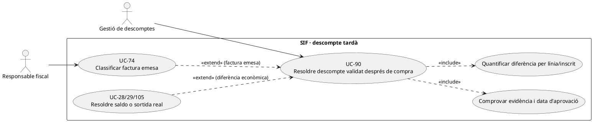
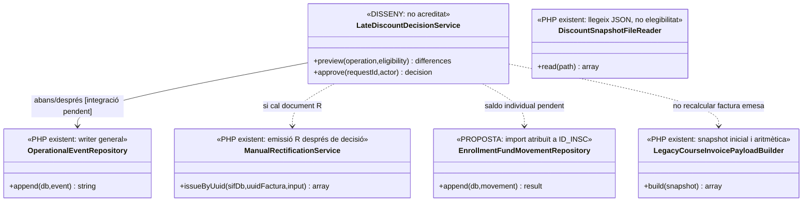

# UC-90 · Resoldre un descompte validat després de la compra

**Objectiu original:** guardar sol·licitud, evidència, moment de validació i diferència; **després d'emetre cal classificar l'impacte fiscal**. **Estat [DISSENY/BLOQUEJANT].** Aplicar un descompte no significa haver tornat diners; aprovar-lo no autoritza reescriure una factura ni una intenció TPV congelada.

## Evidència de la implementació

`LegacyCourseInvoicePayloadBuilder::lineAmounts()` valida **durant la construcció inicial** que base–descompte correspon al total del snapshot (`abs(delta) <= 0.01`). `DiscountSnapshotFileReader::read()` llegeix un JSON opcional dels scripts manuals de proves; **no verifica per si sol dret comercial, vigència, justificants ni data d'aprovació**. `InvoiceRepository::insertLines()` congela `DESC_ORIGEN/MODE/ID/CODI_PROMO/PCT/IMPORT/TEXT_VISIBLE/MOTIU_INTERN` per línia.

`operational_event` té writer PHP general `OperationalEventRepository::append()` per snapshots abans/després, actor, motiu i correlació; no s'ha acreditat l'orquestració d'una validació tardana de descompte que vinculi aquest event a factura, pagament, rectificativa i devolució. `ManualRectificationService` emet un document nou **a partir d'una classificació i import proporcionats**, no decideix si una promoció tardana exigeix aquella factura ni executa cap `REFUND`.

## Variants amb diners per inscrit

| Estat de compra | Procediment |
| --- | --- |
| Oferta abans de factura i abans de TPV | Verificar elegibilitat amb vigència/evidència i recalcular import net; congelar origen/codi/base/descompte/total per línia i nova versió de l'oferta. No generar `REFUND` per la diferència: encara no s'han cobrat aquests diners. |
| Intenció `DS_ORDER` existent però sense ingrés | No modificar silenciosament `EXPECTED_AMOUNT/SNAPSHOT_JSON` de la intenció antiga. Caducar/revocar segons UC-103 i construir una intenció nova per import aprovat; cap nou `CHARGE` fins a confirmació real. |
| Factura emesa **pendent** de pagament | Conservar document original, registrar aprovació i diferència per línia/`ID_INSC`; UC-74 classifica document corrector o altra actuació. Reduir un deute **no és** una devolució. |
| Factura emesa **i pagada** | Conservar `UUID_PAYMENT` i la seva referència bancària. Si es reconeix diferència a favor del pagador, decidir refund bancari UC-28, saldo UC-29 o aplicació interna UC-105 **amb imports individuals** i autorització; `REFUND` només després de sortida externa real. |
| Compra de grup/pack | Fixar exactament quins `ID_INSC` reuneixen el requisit i quina línia es modifica. Un `CHARGE` de 300 € per grup no es converteix en tres cobraments de 100 € per concedir 10 € a un participant. |

### Flux funcional

1. Registrar `UUID_OPERATION/ID_INSC`, norma/versió del descompte, data de compra i sol·licitud, prova amb accés restringit i actor que l'aprova; no copiar documents personals sensibles al payload fiscal.
2. Consultar oferta congelada, possible intenció Redsys, factura/rectificatives i **moviments bancaris existents**. Comparar base original, descompte ja aplicat, descompte nou i total resultant **per línia** amb aritmètica exacta de cèntims.
3. Crear event abans/després i decisió amb motiu, idempotència i classificació fiscal UC-74. Rebutjar un reintent amb mateixa referència però quanties/beneficiari contradictoris; el repositori genèric `operational_event` **no implementa aquesta deduplicació de negoci**.
4. Executar només l'efecte corresponent a l'estat: nova oferta/intenció si no s'ha cobrat; document corrector aprovat si factura emesa; moviment extern o saldo **separat** si el pagador ha avançat més diners que el nou deute.
5. Verificar resultat per document, pagament i inscripció; un error a la comunicació no ha de duplicar rectificativa o transferència.

**Proves:** justificació arriba després del callback; dues fraccions de pagament; codi promocional caducat; grup amb un únic participant elegible; factura no pagada; traspàs de saldo intern sense sortida bancària; aprovació repetida amb import diferent.

## UML de casos d'ús



## UML de classes



## UML de seqüència — descompte d'un membre d'un grup ja cobrat

```mermaid
sequenceDiagram
actor G as Gestió
participant S as LateDiscountDecisionService [DISSENY]
participant I as Factura/línies i fact_rels [SIF]
participant P as payment_transaction [SIF]
participant E as OperationalEventRepository [PHP]
participant F as Classificador fiscal UC-74 [DISSENY]
participant R as ManualRectificationService [PHP]
participant M as Moviment individual [PROPOSTA]
G->>S: Aprovar evidència de descompte de ID_INSC B
S->>I: Llegir factura de grup i línia de B
S->>P: Verificar un CHARGE extern i pagador real
S->>E: append(proposta,abans,després,actor) [integració pendent]
S->>F: Classificar nova quantia fiscal per B
opt Rectificativa aprovada
 F-->>S: Via/import/concepte aprovats
 S->>R: issueByUuid(factura,input)
 R-->>S: UUID_FACTURA_R; original intacta
end
opt Devolució efectiva o saldo intern autoritzats
 S->>M: Registrar quantia de B i vincle a CHARGE original [pendent]
end
S-->>G: Estat fiscal, de fons i acadèmic separats
Note over S,M: Aprovar descompte NO acredita una transferència bancària ni crea REFUND.
```

## Traçabilitat

[UC-90 original](../06-fitxes-funcionals/uc-090.md) · [UC-73 ajust](uc-073-documentar-ajust-descompte-despesa.md) · [UC-74 classificador](uc-074-classificar-correccio-fiscal.md) · [UC-28 devolució](uc-028-registrar-devolucio.md) · [UC-105 redistribució](uc-105-reassignar-repartir-pagament.md) · [LegacyCourseInvoicePayloadBuilder](../../sif/src/Service/LegacyCourseInvoicePayloadBuilder.php) · [DiscountSnapshotFileReader](../../sif/src/Service/DiscountSnapshotFileReader.php) · [OperationalEventRepository](../../sif/src/Repository/OperationalEventRepository.php) · [Moviments per inscrit](00-revisio-moviments-inscripcions.md).
