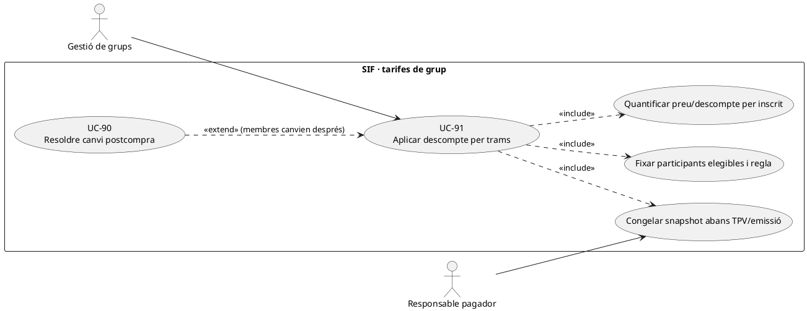
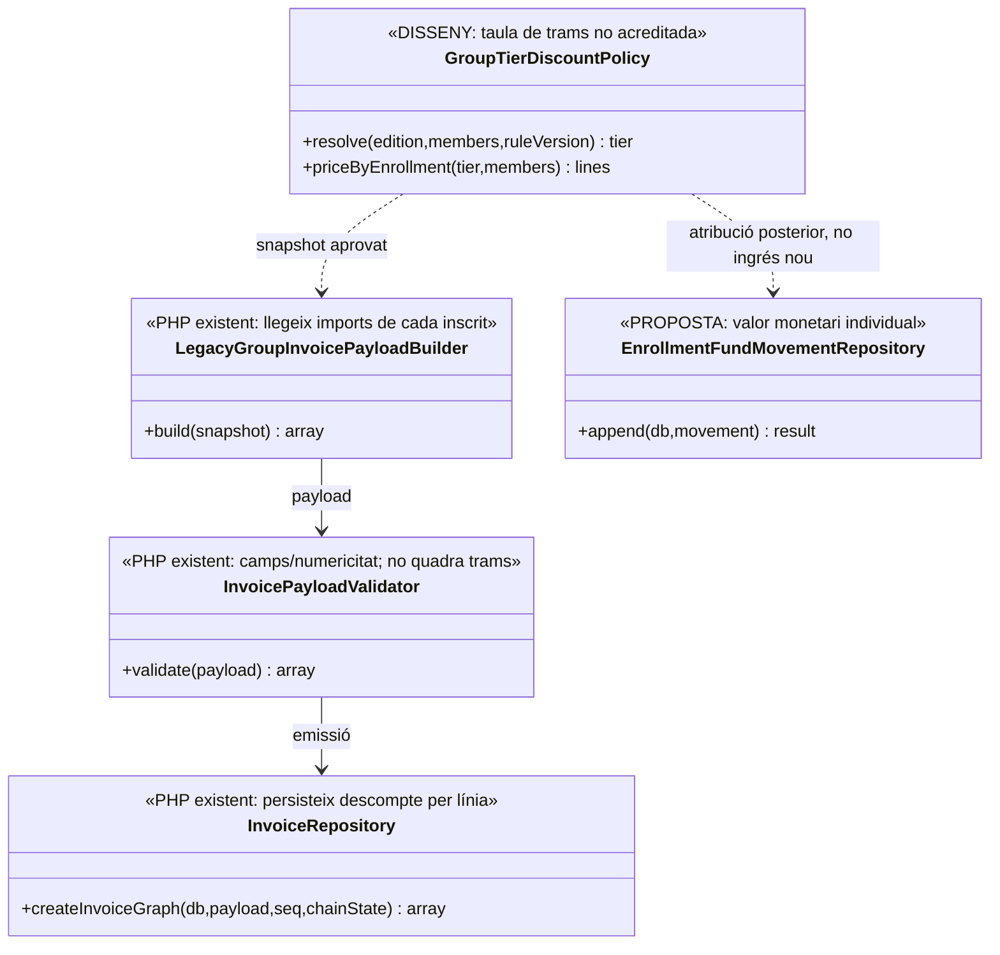
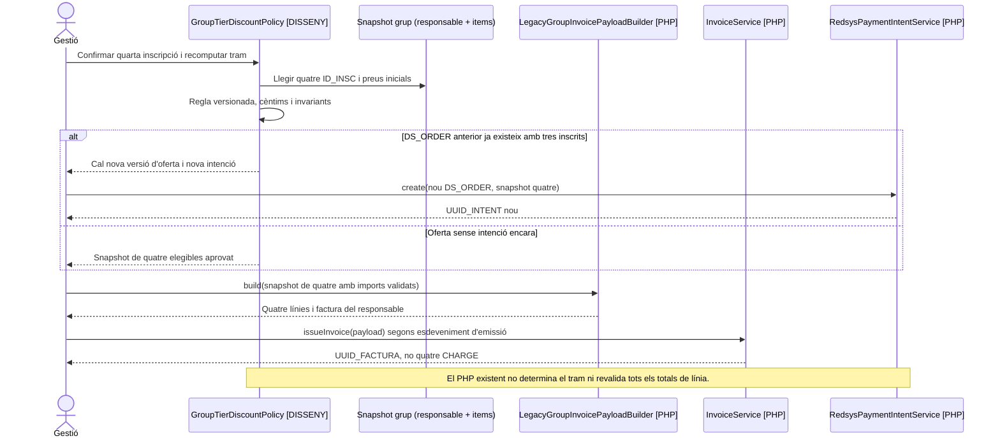

# UC-91 · Aplicar un descompte de grup per trams

**Objectiu original:** deixar congelats tram aplicat, nombre de participants, preu unitari i **descompte de cada línia**. **Estat [DISSENY/PARCIAL].** El builder PHP de grup preserva imports per inscrit, però no acredita que calculi l'elegibilitat i el tram segons una taula de tarifes versionada.

## Evidència PHP: què fa realment

`LegacyGroupInvoicePayloadBuilder::build()` llegeix `responsible` i `items`, crea una línia per `inscription.ID` i una factura amb el responsable com a `billing`. `lineAmounts()` pren `TOTAL` o `A_PAGAR` de cada participant; si rep `IMPORT_BASE`, calcula `DESC_IMPORT` quan no és explícit, o llegeix descompte explícit, i comprova que el descompte no sigui negatiu. **No verifica explícitament que `base - discount = total` quan s'han proporcionat tots tres camps**, ni calcula el tram d'acord amb `count(items)`, data o política de grup. `totals()` suma els imports de línia amb conversions a `float` i formata a dos decimals; el servei específic de trams exactes amb cèntims encara és **disseny**.

`InvoiceRepository::insertLines()` sí que guarda `DESC_ORIGEN/MODE/PCT/IMPORT/TEXT_VISIBLE/MOTIU_INTERN`; `fact_rels` relaciona els participants amb la factura però **no conserva euros cobrats per `ID_INSC`**. Els camps de factura no es recalculen quan algú es dona de baixa després d'emetre: cal classificar l'impacte real.

## Casos de decisió específics

| Fet | Regla de tram i diner |
| --- | --- |
| Alta abans de pagar amb nombre de persones provisional | Comprovar política versionada, membres realment acceptats, curs/edició i venciment de l'oferta; congelar `n`, tram, base i preu net **de cada `ID_INSC`** abans de generar `DS_ORDER`. |
| Tram creuat per incorporar una nova persona | Si cap factura s'ha emès ni s'ha creat intenció, regenerar l'oferta completa amb nova acceptació; amb una intenció TPV ja existent, nova versió i ordre, no canviar el snapshot de `DS_ORDER` original. |
| Grup facturat/cobrat i participant que es dona de baixa | Conservar `UUID_FACTURA`, `UUID_PAYMENT` i descomptes originals; determinar si la política acordada exigeix recalcular els restants. Si canvia el deute real, UC-74/90/105 decideixen documents i moviments **per persona**, no una edició global silenciosa. |
| Responsable paga una factura per quatre inscrits | Una sola entrada externa `CHARGE` i quatre preus nets de línia **no impliquen quatre cobraments independents**. El futur ledger individual atribueix import real sense multiplicar diners. |
| Participació compartida i percentatges | Regles d'elegibilitat, arrodoniment, incompatibilitat amb altres descomptes i descomptes sobre fraccions són **pendents**; no deduir un tram oficial de `DESC_IMPORT` que el PHP ha llegit del llegat. |

### Flux objectiu

1. Reunir llista d'inscrits del mateix grup/edició, responsable/pagador, `IDPAG`, preus base i descomptes ja aprovats; eliminar només duplicitats acreditades, no alumnes legítims amb correu compartit.
2. Consultar la **taula de trams aprovada i versionada** (servei no acreditat), determinar membres elegibles i fixar import net per participant amb cèntims, causa i traça de la regla. Comprovar que `base - descompte = total` per cada línia i que la suma quadra.
3. Congelar snapshot de grup, tram, membres i preus abans d'intenció Redsys i emissió. Si cambia un participant mentre l'oferta és oberta, crear una nova versió i revalidar l'acceptació; no assignar el mateix `DS_ORDER` a import diferent.
4. El builder existent pot construir línies amb els imports **ja validats externament** i `InvoiceService` emetre una factura del responsable. L'assignació real del pagament i l'estat acadèmic dels participants continuen separats.
5. Una modificació posterior a l'emissió es tramita per UC-74/90 amb import per persona i pagador legítim, sense alterar els descomptes històrics ni crear `REFUND` si no hi ha sortida bancària.

**Proves:** canvi de 3 a 4 participants abans/després d'intenció, `IMPORT_BASE=100, DESC_IMPORT=20, TOTAL=90` (**builder actual no comprova aquesta incongruència**), descompte negatiu, dos trams simultanis, fraccions, baixa postemissió i empresa pagadora.

### Comprovar el tram contra el grup llegat abans del constructor fiscal

**Fonts de preu que no s'han de confondre.** La revisió de «Passar pagaments» identifica `TIPUS_INSC='G'`, `IDPAG`, `respGrups` i `descomptes_grup` com a origen del **preu per participant**. `LegacyGroupSnapshotRepository::findGroupInscriptionsByIdpag()` recupera inscripcions per `IDPAG` i el builder `LegacyGroupInvoicePayloadBuilder::lineAmounts()` consumeix `TOTAL` o `A_PAGAR` i, si existeixen, `IMPORT_BASE` i `DESC_IMPORT`; **no consulta `descomptes_grup` ni verifica el tram d'acord amb el nombre de membres**. El recompte d'`items` és dada de la composició, no una validació de la política de tarifes. Quan `A_PAGAR` ha variat després de fraccions o ajustos, no es pot considerar l'import de l'oferta original sense prova separada.

**Error aritmètic concret possible.** Amb una fila de prova `IMPORT_BASE=100.00`, `DESC_IMPORT=20.00` i `TOTAL=90.00`, la funció conserva les tres quantitats perquè només rebutja el descompte **negatiu**; la base i el descompte aportats no quadren amb el net. `totals()` suma posteriorment els camps de les línies, però aquesta suma no valida retrospectivament la coherència de **cada línia**. Abans de congelar l'oferta, exigir `base - descompte = total` en cèntims per `ID_INSC`, validar la suma amb import de la intenció i preservar font/versió del tram, data, elegibilitat i regles d'arrodoniment **quan s'hagin aprovat**. Els imports de l'exemple són dades de prova, no una tarifa real.

**Canvi de membres segons fase.** Abans de crear `DS_ORDER`, afegir un membre pot modificar el preu **de tots** els participants del tram; cal confirmar de nou la composició completa i el receptor. Si `DS_ORDER` ja existeix, no substituir `SNAPSHOT_JSON` ni `EXPECTED_AMOUNT`; tractar la nova oferta amb una altra ordre si pertoca (UC-112/118/121). Si ja hi ha factura prèvia d'empresa o cobrament real, conservar `UUID_FACTURA/UUID_PAYMENT` i classificar la variació per línia i participant (UC-16a/16b/74/105), **sense** recalcular automàticament la factura antiga amb el tram actual.

### Proves del càlcul i del canvi de tram (no executades)

| ID | Escenari | Resultat exigible |
| --- | --- | --- |
| TR-91-01 | Base 100, descompte 20 i total 90 en una línia de prova | Detectar desquadrament de 10 abans d'emetre; el builder actual no ho impedeix. |
| TR-91-02 | Quatre membres, `A_PAGAR` d'un d'ells reduït per fracció | Congelar el preu de prestació segons font comercial, no el deute restant. |
| TR-91-03 | Nou membre modifica el tram amb intenció TPV existent | Nova proposta per a totes les línies afectades; `DS_ORDER` original immutable. |
| TR-91-04 | Grup facturat a empresa i un participant es dona de baixa | Quantificar efecte individual i mantenir factura/pagament originals fins a decisió fiscal/econòmica. |
| TR-91-05 | `descomptes_grup` no coincideix amb els valors aportats al builder | Incidència d'origen de preu, no emissió basada en el saldo actual. |

## UML de casos d'ús

## UML de classes

## UML de seqüència — grup passa de tres a quatre abans del TPV

## Traçabilitat

[UC-91 original](../06-fitxes-funcionals/uc-091.md) · [UC-90 descompte tardà](uc-090-descompte-validat-despres-compra.md) · [UC-88 multiconcepte](uc-088-decidir-agrupacio-linies-factura-multiconcepte.md) · [UC-105 moviments](uc-105-reassignar-repartir-pagament.md) · [LegacyGroupInvoicePayloadBuilder](../../sif/src/Service/LegacyGroupInvoicePayloadBuilder.php) · [InvoiceRepository](../../sif/src/Repository/InvoiceRepository.php) · [InvoicePayloadValidator](../../sif/src/Service/InvoicePayloadValidator.php) · [RedsysPaymentIntentService](../../sif/src/Service/RedsysPaymentIntentService.php) · [Moviments per inscrit](00-revisio-moviments-inscripcions.md).
