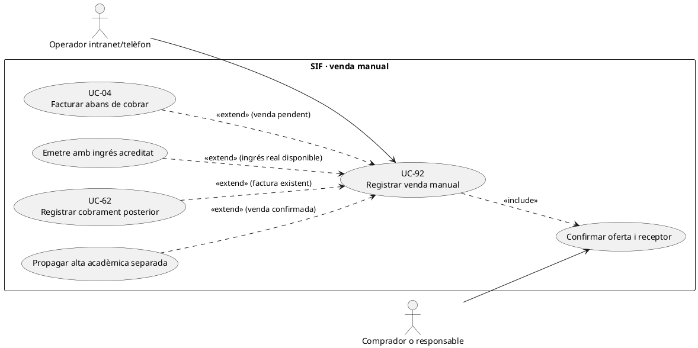
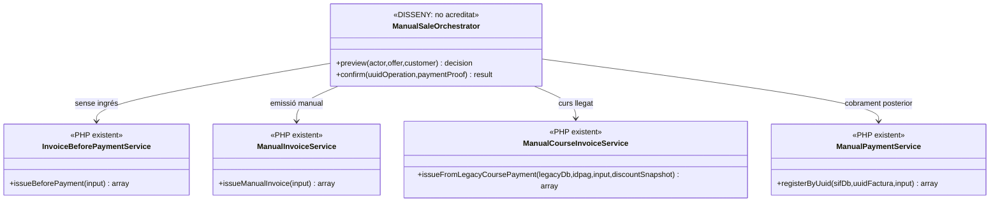

# UC-92 · Registrar una venda manual iniciada per intranet o telèfon

**Objectiu original:** l'operador crea l'operació i el SIF emet/cobra segons l'estat **real**, amb idempotència equivalent a ecommerce. **Estat [DISSENY/PARCIAL].** UC-62 és l'adaptador tècnic d'ordres intranet; UC-92 és la **venda concreta**, amb oferta acceptada, responsable fiscal, prova d'ingrés si ja s'ha cobrat i reserva/matrícula corresponent. Una trucada no és prova d'un `CHARGE` ni d'un consentiment comercial.

## Evidència del PHP

`ManualCourseInvoiceService::issueFromLegacyCoursePayment()` consulta inscripció/curs per `IDPAG`, construeix payload i crida `InvoiceService::issueInvoice()`; `ManualInvoiceService::issueManualInvoice()` permet emissió a partir del payload preparat i `ManualInvoicePayloadBuilder` indica `source_channel=INTRANET`. El builder només inclou un bloc `payment` quan se li facilita; un operador que introdueixi un import **no acredita per si mateix** un ingrés bancari. `InvoiceBeforePaymentService` cobreix factura emesa abans de cobrar i `ManualPaymentService` cobra sobre factura existent. Els scripts `process-manual-course.php`, `process-manual-invoice.php` i `process-manual-payment.php` rebutgen **`SIF_ENV=production`**; no s'ha acreditat el formulari productiu amb sessió/rol i confirmació d'oferta.

`ManualCourseInvoiceService` retorna dades per sincronització llegada, però el resum opcional `--sync-legacy` del CLI s'executa **després** del resultat SIF; un error d'aquest pas no desfà la factura ni el pagament SIF.

## Fitxa funcional específica

| Pas de venda | Contracte |
| --- | --- |
| Identificar | Registrar canal d'origen real (`INTRANET/TELEFON` com a **proposta de traça**) i operador, persona interessada, `ID_INSC` o `UUID_OPERATION`, responsable/pagador i receptor fiscal diferenciats; la clau fiscal del builder segueix `source_channel=INTRANET`. |
| Composar oferta | Triar curs/edició, pack, grup o altre producte amb disponibilitat i preu/descomptes verificats, snapshot d'import/línies i acceptació del comprador. El preu dictat per telèfon no justifica `UPDATE` d'una factura ja emesa. |
| Situació econòmica | Distingir **sense cobrar**, **cobrament real acreditat**, **pagament parcial** i **transferència promesa**. Facturar abans de cobrar no crea `CHARGE`; un ingrés existent a banc no s'ha de tornar a registrar amb una nova clau. |
| Emissió | Si la venda és facturable, només el SIF assigna numeració fiscal i crea factura/registre encadenat/cua. L'alta acadèmica i Moodle són destins posteriors, no proves que la factura sigui pagada. |
| Grup i participant | Una venda telefònica de grup pot generar **una factura i un cobrament** per a N inscrits; conservar línies/relacions per participant però no multiplicar el total bancari ni enviar PDF d'empresa a cada alumne. |
| Traça i reintent | Guardar referència comercial estable i hash de l'oferta, actor, instant i idempotència; `ManualInvoicePayloadBuilder` genera clau per referència o usuari/data/hash, però **no implementa** una comprovació universal de duplicats de venda entre canals. |

### Flux objectiu

1. L'operador registra la petició i confirma curs/places, comprador, receptor i **acceptació concreta**; per operacions amb edició o preu canviat, congelar snapshot UC-112.
2. Previsualitza import i factura prèvia existent per referència/`IDPAG`; separa nova venda de cobrament d'una venda anterior, amb prova externa si afirma que està pagada.
3. Escull un dels circuits excloents: `InvoiceBeforePaymentService` si es factura pendent, `ManualInvoiceService` o variant concreta si hi ha prova d'ingrés ja vinculable, `ManualPaymentService` **només** quan hi ha factura existent i ingrés nou acreditat.
4. Després de resultat SIF, sincronitza inscripció/accés per destinacions separades; si el resum llegat falla, reintentar sync i **no** l'emissió ni el `CHARGE`.
5. Comunicar al comprador el **resultat real**: oferta/plaça, factura emesa, pagament pendent o confirmat, document disponible o pendent, matrícula pendent de Moodle.

**Proves:** telèfon amb transferència promesa, cobrament parcial real després de factura, grup pagat per empresa, doble clic de l'operador, la mateixa venda entrada també per ecommerce, `IDPAG` compartit per fraccions, error de sync llegat i intent de fer servir script CLI en producció.

## UML de casos d'ús



## UML de classes



## UML de seqüència — venda per telèfon amb transferència pendent

```mermaid
sequenceDiagram
actor O as Operador
actor C as Comprador
participant S as ManualSaleOrchestrator [DISSENY]
participant F as InvoiceBeforePaymentService [PHP]
participant P as ManualPaymentService [PHP]
participant A as Prisma/Moodle [destins separats]
O->>S: Registrar curs/edició i comprador per telèfon
S->>C: Confirmar oferta, receptor i import
C-->>S: Acceptació de la venda
S->>S: Comprovar factura prèvia i congelar snapshot
alt Només compromís de transferir
 S->>F: issueBeforePayment(input sense payment)
 F-->>S: UUID_FACTURA i estat PENDING
 S-->>O: Factura emesa, CHARGE inexistent
else Transferència real després de la factura
 O->>S: Aportar referència bancària contrastada
 S->>P: registerByUuid(sifDb,uuidFactura,input)
 P-->>S: UUID_PAYMENT nou o reutilitzat
end
S->>A: Alta/sync acadèmic postcommit [adaptador pendent]
S-->>O: Estat de factura, cobrament i plaça separat
Note over S,A: Orquestrador/acceptació telefònica no acreditats al PHP; CLI refusa producció.
```

## Traçabilitat

[UC-92 original](../06-fitxes-funcionals/uc-092.md) · [UC-62 intranet](uc-062-iniciar-factura-cobrament-intranet.md) · [UC-04 abans de pagar](uc-004-emetre-factura-abans-cobrar.md) · [UC-112 snapshot](uc-112-congelar-snapshot-abans-tpv.md) · [UC-129 Moodle](uc-129-reconciliar-prisma-moodle-matricules.md) · [ManualCourseInvoiceService](../../sif/src/Service/ManualCourseInvoiceService.php) · [ManualInvoiceService](../../sif/src/Service/ManualInvoiceService.php) · [InvoiceBeforePaymentService](../../sif/src/Service/InvoiceBeforePaymentService.php) · [Script CLI manual](../../sif/scripts/process-manual-course.php).
