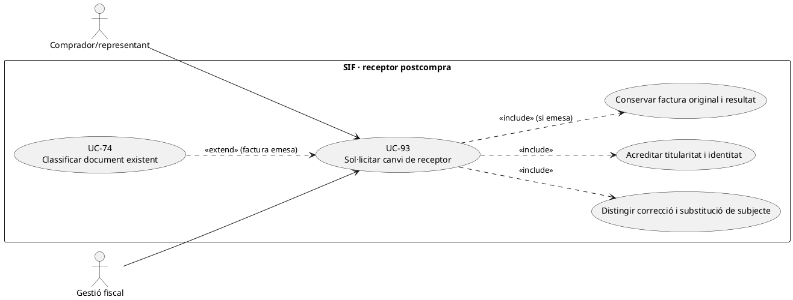
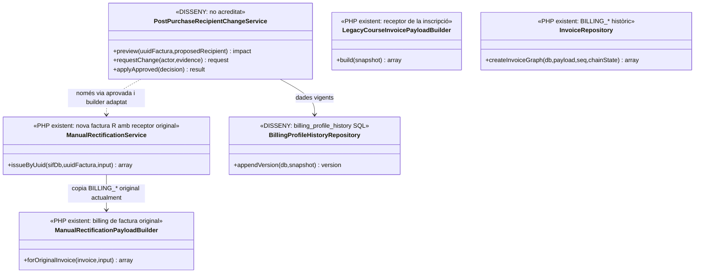
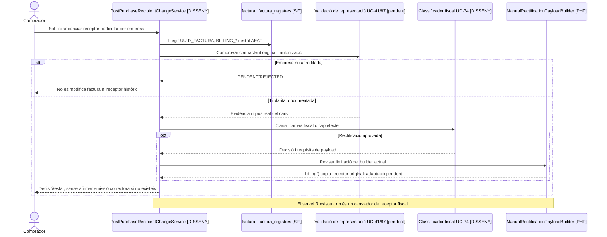

# UC-93 · Canviar el receptor fiscal sol·licitat després d'una compra particular

**Objectiu original:** una petició de canvi de receptor **no reescriu la factura**; cal verificar identitat, títol jurídic de la compra i classificar si correspon rectificació o una altra actuació. **Estat [DISSENY/BLOQUEJANT].** Canviar l'email del perfil, posar una empresa com a destinatària de comunicacions o alterar el titular d'una factura emesa són accions diferents.

## Evidència PHP i SQL

`LegacyCourseInvoicePayloadBuilder::billing()` pren el nom i `DNI` de la inscripció particular; `InvoiceRepository::insertInvoice()` conserva el receptor a `BILLING_NOM_RAO`, `BILLING_NIF_CIF` i altres camps. `ManualRectificationPayloadBuilder::billing()` copia **aquests mateixos camps de la factura original** quan construeix una rectificativa. Per tant, `ManualRectificationService::issueByUuid()` pot generar una factura R vinculada a l'original, però **no implementa per si sol la substitució del receptor amb unes dades noves**; tampoc valida representació, causa o titularitat d'una persona jurídica. `billing_profile_history` defineix versions de dades de perfil, **no** un servei PHP executable de canvi de receptor històric.

## Què ha de decidir-se en aquesta petició

| Moment i fet | Tractament |
| --- | --- |
| Dades d'empresa aportades **abans d'emetre** | Confirmar qui ha comprat/contractat i qui és el receptor fiscal real (UC-69/87); congelar nou perfil i documentar acceptació. Si hi ha `DS_ORDER` anterior amb dades particulars, no reusar la intenció amb snapshot fiscal contradictori. |
| Factura particular **ja emesa**, empresa demana figurar-hi | Registrar petició, prova de relació contractual i autorització; UC-74 determina la via fiscal admissible segons fet **real**. No suposar que «l'empresa paga després» canvia automàticament el receptor original. |
| Nom/DNI erroni del **mateix receptor original** | Distingir correcció identificativa d'un canvi **de persona destinatària**; conservar factura/registre anteriors i documentar decisió UC-74. |
| Empresa paga després una factura particular | `UUID_PAYMENT` i pagador de l'ingrés no són camps equivalents a `BILLING_NIF_CIF`. Associar pagament real sense reescriure el receptor fiscal ni crear un segon `CHARGE`. |
| Grup i comprador corporatiu | Validar responsable/entitat i permís d'accés abans de lliurar document a l'alumne; no traslladar per defecte la factura d'empresa al participant ni a l'inrevés. |

### Flux funcional i controls

1. Rebre `UUID_FACTURA` o operació, actor i relació amb la compra; obtenir factura original, receptor, inscripció, pagador bancari i estat fiscal/AEAT. Determinar si la petició és **correcció del mateix subjecte** o **substitució de subjecte**.
2. Recollir dades i evidència justificativa amb accés limitat; UC-87 valida país/tipus ID quan escaigui i UC-41/126 identitat/representació. Deixar petició pendent si l'empresa no acredita ser receptora legítima.
3. Si encara no hi ha factura, actualitzar només el snapshot **abans d'emetre**. Si hi ha document, conservar `BILLING_*`, línies, hash, PDF i resposta AEAT originals, i obrir un event abans/després amb motiu i actor.
4. UC-74 aprova **si cal i com** corregir documentalment la factura; no cridar el builder de rectificació actual amb `billing` nou esperant que el desi, perquè `billing()` copia l'original. La solució de payload i el circuit d'aprovació de receptor diferent són **pendents**.
5. Si hi ha cobrament/retorn/reassignació real, registrar-lo pel cas econòmic corresponent i titular acreditat. Canviar receptor per si sol **no crea `REFUND`, `CHARGE` ni traspassa diners**.

**Proves:** factura personal ja emesa i empresa demana substitució; mateix subjecte amb error tipogràfic/NIF; pagador companyia però receptor contractat particular; canvi de país; factura de grup consultada per alumne; builder R copia receptor antic; dues peticions contradictòries amb el mateix `REQUEST_ID`.

### Pantalla de canvi d'entitat i límit del builder de rectificatives

**D'on arriben les dades noves.** `/alumnes/genera-entitat/` gestiona separat `entitats.CIF/RAO/ADRECA/CP/POBLACIO` i el contacte `entitats_resp.NOM/COGNOMS/CORREU`; el modal llegat d'edició crida `actualitzaEditaEntitat.php` amb dades a `GET` i no mostra un avís específic quan l'entitat té factures emeses. Afegir o modificar l'entitat a aquesta pantalla **no prova** que fos part contractant en la compra particular anterior ni canvia el receptor fiscal històric de `UUID_FACTURA`. Un mateix correu pot correspondre a alumne i responsable, sense que això impliqui representació.

**Limitació exacta de l'eina de correcció actual.** `ManualRectificationPayloadBuilder::forOriginalInvoice()` emet una proposta de sèrie R i construeix el receptor amb `billing($invoice)`, que copia `BILLING_NOM_RAO/NIF_CIF/ADRECA/CP/POBLACIO/PAIS/EMAIL` de **l'original**. La funció accepta `concept/detail/amount/reason/mode` però **no admet un receptor alternatiu en aquesta ruta**. Per tant, enviar-hi el CIF nou com a dada extra o marcar una entitat com a activa no la converteix en un circuit de substitució de receptor. Cal classificar, aprovar i implementar explícitament la via admesa **per al fet real** amb UC-74 abans de promoure un botó «Canvia el titular» a la intranet; no es pot pressupostar una rectificativa per a tota petició sense distingir error del mateix subjecte i canvi real de destinatari.

**Dues identitats que el formulari pot confondre.** Comparar per separat persona que va contractar el servei, receptor fiscal emès, empresa que demana figurar-hi, contacte que envia la petició i pagador bancari. Si una entitat paga **després** una factura particular, `payment_transaction` identifica el moviment real però no acredita per si sol que fos receptora original del servei. Si la factura ja és d'empresa i el contacte és particular, no traspassar el PDF de grup al participant per l'email coincident. La petició ha de retornar decisió per document/relació, amb original intacte, resultat AEAT i comunicació a qui tingui permís.

### Proves de substitució de receptor no implementada (no executades)

| ID | Escenari | Resultat exigible |
| --- | --- | --- |
| RC-93-01 | Enviar `billing` d'una empresa diferent a `ManualRectificationPayloadBuilder` | Detectar que la ruta actual copia el receptor original; no anunciar canvi implementat. |
| RC-93-02 | Empresa paga una factura particular emesa prèviament | Cobrament relacionat amb factura existent; cap `BILLING_NIF_CIF` canviat pel banc. |
| RC-93-03 | Operador edita `entitats.CIF` després de factura antiga | Perfil futur separat i factura original immutable; classificació si l'emissió era errònia. |
| RC-93-04 | Contacte de l'empresa comparteix email amb l'alumne | Permisos de consulta i representació verificats, no lliurament de PDF per coincidència. |
| RC-93-05 | Correcció de nom del mateix receptor i canvi a un receptor diferent | Causes separades, decisió fiscal documentada abans d'invocar un executor. |

## UML de casos d'ús

## UML de classes

## UML de seqüència — factura particular ja emesa i nova empresa

## Traçabilitat

[UC-93 original](../06-fitxes-funcionals/uc-093.md) · [UC-87 receptor estranger](uc-087-validar-receptor-estranger-dades-incompletes.md) · [UC-41 entitat](uc-041-crear-editar-entitat-responsable.md) · [UC-74 decisió](uc-074-classificar-correccio-fiscal.md) · [UC-70 dades mestres](uc-070-modificar-dades-mestres-despres-emetre.md) · [LegacyCourseInvoicePayloadBuilder](../../sif/src/Service/LegacyCourseInvoicePayloadBuilder.php) · [InvoiceRepository](../../sif/src/Repository/InvoiceRepository.php) · [ManualRectificationPayloadBuilder](../../sif/src/Service/ManualRectificationPayloadBuilder.php) · [SQL perfil fiscal](../../sif/database/migrations/2026_09_15_000003_add_functional_audit_control.sql).
