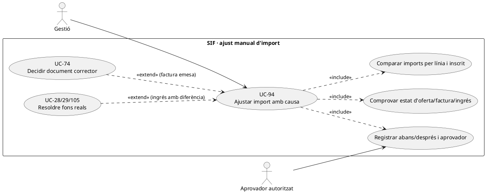
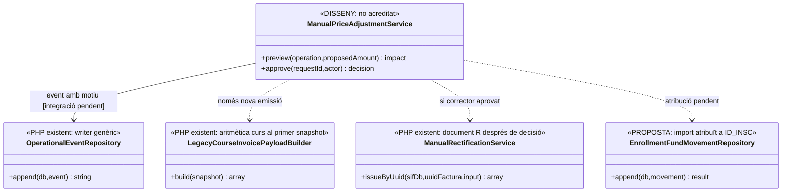
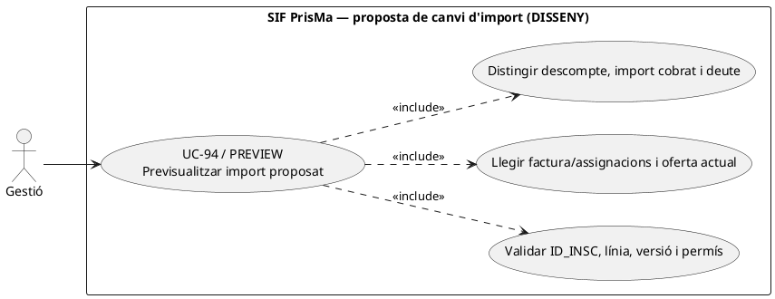
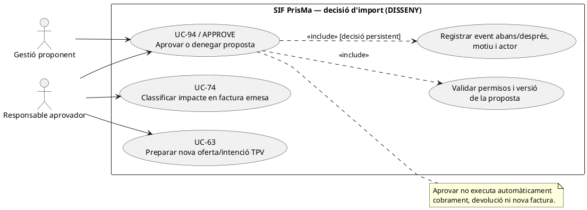
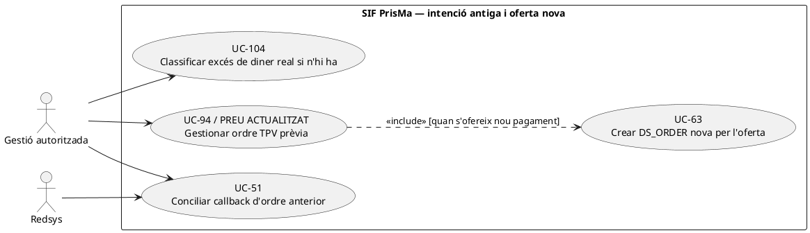

# UC-94 · Ajustar manualment l'import a pagar amb justificació

**Objectiu original:** registrar import anterior/nou, motiu i aprovador a `operational_event`; si existeix una factura emesa, **impedir-ne la mutació directa**. **Estat [DISSENY/BLOQUEJANT]** del flux complet de gestió: hi ha un writer genèric d'events i serveis de facturació, però no un controlador acreditat que autoritzi ajustos, resolgui el snapshot TPV i decideixi el document corrector.

## Evidència i riscos del PHP real

`OperationalEventRepository::append()` escriu `OPERATION_TYPE, FISCAL_IMPACT, ECONOMIC_IMPACT, STATUS, REASON_CODE`, actor, correlació i hashes dels snapshots abans/després. **No fa aprovació de negoci, bloqueig de concurrència ni deduplicació idempotent per ajust**. `LegacyCourseInvoicePayloadBuilder::lineAmounts()` comprova que base–descompte sigui coherent amb total del snapshot per a un curs, però no valida qui ha autoritzat un preu excepcional. `InvoiceRepository::insertInvoice()` desa `TOTAL` i `DESC_IMPORT` de la factura, i el registre encadenat reflecteix el payload emès. `PaymentService::registerPayment()` reusa una clau idempotent sense comparar el payload nou, de manera que canviar l'import sense coordinar clau i referència bancària pot ocultar una divergència.

| Instant de l'ajust | Contracte |
| --- | --- |
| Oferta sense factura ni intent Redsys | Gestió identifica `ID_INSC`, producte, base, descompte ja aplicat, preu nou i causa **diferent de la categoria genèrica «manual»**. Validar cèntims, límits/autorització i impacte per línia; versionar oferta abans de confirmar. |
| Intenció `DS_ORDER` pendent | No reusar `DS_ORDER` si s'ha alterat l'import o el snapshot. Decidir caducitat de la intenció i crear-ne una de nova amb quantia confirmada. No generar `REFUND` perquè no hi ha ingrés. |
| Factura emesa sense cobrar | El deute pendent deriva de factura/assignacions reals; no canviar `factura.TOTAL` o `A_PAGAR` llegat com a substitut de correcció fiscal. UC-74 classifica el document nou, si escau. |
| Factura ja pagada parcialment o totalment | Conservar `UUID_PAYMENT` i les transferències reals. Si l'ajust crea excés: UC-104/28/29/105 decideixen excés no assignat, refund extern, saldo o atribució **per inscrit**; una reducció de preu no demostra sortida bancària. |
| Grup/pack | Documentar el canvi sobre `ID_INSC` i línia concreta, mantenint suma per factura i pagador legítim; no dividir un `CHARGE` conjunt entre persones sense traça d'atribució quantitativa. |

### Flux objectiu

1. El formulari recull **abans/després** amb import original congelat, nou import, motivació i prova, actor proponent i aprovador autoritzat; comprova versió del snapshot i existència de factura/pagament real.
2. El servei de decisió **pendent** calcula diferència en cèntims per línia i verifica que no és una edició del document emès. Rebutja mateixa `REQUEST_ID` amb quanties contradictòries i intents paral·lels de canviar la mateixa oferta.
3. Registra decisió amb `OperationalEventRepository` i `FISCAL_IMPACT/ECONOMIC_IMPACT` classificats. L'ús del writer existeix, però **la seva crida des de la intranet d'ajustos no està acreditada**.
4. Sense factura, publicar oferta/intenció noves; amb factura, derivar a UC-74 per corrector justificat; amb diner extern, executar una única via de saldo/retorn/traspàs i conservar el `CHARGE` original.
5. Comparar SIF amb llegat/estat acadèmic i informar de resultats parcials sense repetir emissió/cobrament per un error de sincronització.

**Proves:** ajust de 80 € a 65 € abans de TPV, intenció antiga de 80 € amb nova oferta de 65 €, factura de 80 € amb 30 € pagats, transferència real de 80 € i descompte tardà de 15 €, empresa de grup amb dos participants, dues aprovacions concurrents, event repetit amb payload diferent.

**Pendents:** política d'import excepcional, rols, bloqueig/idempotència de negoci, writer d'ofertes versionades, classificador fiscal i traça monetària individual `enrollment_fund_movement` (**proposta, no implementada**).

### Modal llegat de pagament: separació entre ajustar un deute i registrar un ingrés

**Punt d'escriptura concret que s'ha de substituir o limitar.** La fitxa d'alumne `/alumnes/mostrar-alumne/` obre `guardarDadesPagament_modalsresultatCerca()`, capaç de modificar directament `A_PAGAR`, `PAGAMENT`, `DATA PAG`, `IDPAG`, `FRACCIONAT`, `FRACCIO` i `FACTURA_RELACIONADA`, juntament amb camps de reclamació. El procediment del projecte **decideix expressament** que aquest bloc no pot continuar sent un editor silenciós de dades econòmiques/fiscals. L'ajust `A_PAGAR` ha d'obrir **una comanda d'ajust amb motiu i impacte fiscal**, mentre que l'ingrés real es tramita per UC-02/22/24 i la relació fiscal per UC-44/74. No copiar un `PAGAMENT` editat com si fos justificació de banc.

**Comparar quatre imports, no un camp únic.** En la previsualització mostrar (1) import de **prestació original congelat** per línia, (2) descomptes ja aprovats, (3) cobrament real extern i atribucions `payment_transaction/payment_allocation`, i (4) saldo exigible i proposta d'ajust. El valor `A_PAGAR` llegat pot ser dada operativa afectada per fracció o canvi de curs i no ha d'omplir per defecte `factura.TOTAL`. En pack o grup, expressar `ID_INSC` i import afectat: un sol `IDPAG` no identifica quin participant rep el benefici ni a qui correspon una eventual devolució.

**Segons l'estat de la factura.** Si només hi ha oferta i cap `DS_ORDER`, aprovar nova base/import i congelar UC-112. Si ja existeix una intenció, no manipular-ne `EXPECTED_AMOUNT/SNAPSHOT_JSON`; obrir-ne una de nova quan correspongui i preservar qualsevol callback anterior. Amb factura real pendent, disminuir `A_PAGAR` **no** esborra l'obligació fiscal: UC-74 classifica la correcció i només llavors es recalcula el saldo. Amb factura cobrada, el menor preu aprovat **no prova una sortida bancària**; UC-104/28/29/105 decideixen excessos, retorn o saldo amb el titular i l'ingrés acreditats.

**Traça i recuperació.** El writer genèric `OperationalEventRepository::append()` desa snapshots i motiu, però la documentació no acredita cap connexió de la pantalla antiga al writer ni un aprovador en línia. La comanda futura porta `ID_INSC/UUID_OPERATION`, versió d'oferta, import antic/nou, causa, actor, decisió autoritzada i identificador de petició. Si l'UPDATE de compatibilitat falla després de confirmar SIF, recuperar el mateix event i tornar a executar només el resum llegat, **no** una segona rectificativa, un segon `CHARGE` o una segona devolució.

### Proves d'ajust separat del moviment monetari (no executades)

| ID | Escenari | Resultat exigible |
| --- | --- | --- |
| AJ-94-01 | Operador modifica `A_PAGAR` sense ingrés extern | Ajust justificat i auditat segons estat; cap `CHARGE` fictici. |
| AJ-94-02 | Canvi del pendent llegat quan existeix factura real emesa | Conservar `factura.TOTAL` i derivar impacte a UC-74; no editar document fiscal. |
| AJ-94-03 | Pack/grup amb `IDPAG` compartit i ajust d'un participant | Línia i `ID_INSC` identificats, no distribució de l'ajust al total del grup. |
| AJ-94-04 | Intenció TPV antiga amb import original i nova oferta de menor import | Ordre antiga immutable i callback tardà conciliat si arriba; no atribuir-lo automàticament a l'oferta nova. |
| AJ-94-05 | Factura pagada i reducció aprovada de preu | Conservar `UUID_PAYMENT`; `REFUND` només quan hi hagi sortida bancària real. |
| AJ-94-06 | SIF confirma ajust/document, sincronització `A_PAGAR` falla | Reintentar només sincronització de compatibilitat, amb el mateix event i UUIDs. |

## UML de casos d'ús



## UML de classes



## UML de seqüència — factura cobrada i preu ajustat

```mermaid
sequenceDiagram
actor G as Gestió
participant S as ManualPriceAdjustmentService [DISSENY]
participant F as factura i factura_linia [SQL]
participant P as payment_transaction/allocation [SQL]
participant E as OperationalEventRepository [PHP]
participant C as Classificació UC-74 [DISSENY]
participant M as Resolució d'excés UC-104/28/29/105
G->>S: Proposar import nou amb ID_INSC i justificació
S->>F: Llegir import original i estat emès
S->>P: Llegir CHARGE real i pagador
S-->>G: Diferència per línia, fiscal i diner
G->>S: Aprovar amb REQUEST_ID i rol verificats
S->>E: append(abans,després,motiu,actor) [integració pendent]
S->>C: Classificar impacte sobre factura original
C-->>S: Via fiscal autoritzada o cap efecte
opt Excés econòmic acreditat
 S->>M: Decidir saldo, refund real o atribució interna
 M-->>S: Resultat o incidència pendent
end
S-->>G: Estat diferenciat; sense UPDATE del TOTAL original
```

## Accions independents de l'ajust manual: previsualitzar, aprovar i gestionar una intenció anterior

### A. Previsualitzar una proposta d'ajust — UC-94, DISSENY

**Actor i disparador:** gestió introdueix un nou import per a una inscripció, línia de pack o participant de grup; encara no confirma el canvi. **Entrades:** `ID_INSC`/línia, import proposat, causa, versió de l'oferta i identitat del pagador. **Resultat:** proposta amb quatre imports separats (preu original congelat, descompte, diners efectivament ingressats i deute actual), diferència en cèntims i possibles efectes sobre oferta, `DS_ORDER`, factura i participant. No genera `operational_event` d'aprovació, factura, `CHARGE` o `REFUND`. `ManualPriceAdjustmentService::preview()` és **disseny**, no mètode PHP acreditat.



```mermaid
sequenceDiagram
autonumber
actor G as Gestió
participant UI as Fitxa alumne/modal [adaptació PENDENT]
participant S as ManualPriceAdjustmentService [DISSENY]
participant L as Dades acadèmiques/oferta llegada [LECTURA]
participant F as factura i factura_linia [LECTURA]
participant P as payment_transaction/allocation [LECTURA]
participant I as redsys_payment_intent [LECTURA]
G->>UI: Proposar nou import 65 per ID_INSC X, preu anterior 80
UI->>S: preview(X,65,causa,versió)
S->>L: Llegir línia, descomptes, pagador i versió d'oferta
S->>F: Llegir factures emeses i imports congelats
S->>P: Llegir ingressos reals i imports atribuïts
S->>I: Llegir DS_ORDER pendents i import/snapshot esperats
alt Permís insuficient, versió canviada o participant ambigu
 S-->>UI: DENIED/CONFLICT sense cap UPDATE
else Proposta de dades consistent
 S-->>UI: Diferència per ID_INSC, efecte fiscal/TPV possible i imports separats
end
UI-->>G: Mostrar la proposta; cap factura, pagament ni ajust confirmat
Note over S,I: Consultes i classificador de previsualització complets: DISSENY, no endpoint acreditat.
```

### B. Aprovar o denegar l'ajust proposat — UC-94, DISSENY

**Actor i disparador:** persona amb permís d'aprovació, separada del simple dret a editar la fitxa, rep una proposta identificada i encara vigent. **Precondicions:** causa i regla de preu explícites, proposta congelada, versió vigent, identitat de pagador/receptor i import per línia. **Resultat:** decisió traçada amb `REQUEST_ID` estable i estats diferenciats: aprovada però pendent de canvis de canal/efectes fiscals, denegada, conflicte de versió o recuperació d'una aprovació equivalent. Aprovar una nova oferta **no** registra un ingrés de banc ni una devolució; si ja hi ha factura, UC-74 decideix el document fiscal corresponent. El writer genèric `OperationalEventRepository::append()` **no** valida aprovador ni conté per si sol una cerca idempotent: el control és pendent.



```mermaid
sequenceDiagram
autonumber
actor A as Responsable aprovador
participant UI as Panell d'ajustos [PENDENT]
participant S as ManualPriceAdjustmentService [DISSENY]
participant V as Guard d'actor/versió i REQUEST_ID [DISSENY]
participant E as OperationalEventRepository [PHP, writer genèric]
participant F as Consulta factura SIF
participant C as Classificador UC-74 [DISSENY]
A->>UI: Aprovar proposta X de 80 a 65 amb motiu
UI->>S: approve(proposalId,actor,requestId)
S->>V: Bloquejar proposta i comparar versió/snapshot
alt Actor no autoritzat o versió de proposta canviada
 V-->>S: DENIED/CONFLICT
 S-->>UI: Cap event d'aprovació ni preu nou
else REQUEST_ID anterior amb proposta equivalent
 V-->>S: Recuperar decisió anterior
 S-->>UI: Reús de decisió, sense duplicar cap efecte
else REQUEST_ID anterior amb nou import/titular
 V-->>S: CONFLICT de contingut
 S-->>UI: Rebuig i revisió
else Decisió nova autoritzada
 V-->>S: Versió consistent, actor i motiu acreditats
 S->>F: Comprovar si existeix factura emesa/ingrés real
 S->>E: append(snapshot abans/després, motiu, actor, correlació) [integració PENDENT]
 E-->>S: UUID_OPERATIONAL_EVENT nou
 alt Factura ja emesa
  S->>C: Classificar possible correcció fiscal per UC-74
  C-->>S: Ruta fiscal separada o decisió pendent
 else Sense factura
  S-->>UI: Publicació de nova oferta a confirmar [PENDENT]
 end
 S-->>UI: Aprovació traçada; efectes fiscal, TPV i diners separats
end
UI-->>A: Decisió i pendents concrets
Note over S,E: El repositori PHP només insereix un event nou. Guard, aprovació i unitat de transacció entre serveis no acreditats.
```

### C. Repreuar una oferta amb DS_ORDER anterior i conciliar-ne el callback — UC-94 amb UC-63/51, DISSENY/PARCIAL

**Disparador propi:** una proposta aprovada modifica preu o concepte quan ja existeix una intenció Redsys anterior. **Invariant comprovada al PHP:** `RedsysPaymentIntentService::create()` rellegeix per `DS_ORDER`, compara import, moneda, terminal, identitat d'origen, `CREATED_BY`, venciment i snapshot normalitzat; si divergeixen, retorna conflicte. Per tant, **no** reutilitzar la mateixa `DS_ORDER` amb 65 € si la intenció original esperava 80 €. Crear una altra intenció (UC-63) després de gestionar l'estat de la primera, i conservar l'antiga per conciliar una notificació bancària tardana (UC-51/82). Un import de 80 € cobrat tard no equival a un ingrés de 65 € ni es pot ignorar perquè hagi canviat l'oferta.



```mermaid
sequenceDiagram
autonumber
actor G as Gestió
participant S as Coordinador d'ajust/TPV [DISSENY]
participant I as RedsysPaymentIntentService::create [PHP]
participant DB as redsys_payment_intent i factura SIF
participant R as Redsys/callback antic
participant C as Conciliació UC-51/82 [PENDENT]
G->>S: Aprovar 65 sobre proposta abans ofertada per 80
S->>DB: Consultar DS_ORDER_A existent i snapshot d'import 80
S->>I: Intentar reutilitzar DS_ORDER_A amb import 65 [cas a rebutjar]
I->>DB: Cercar DS_ORDER_A i comparar tot el contingut
DB-->>I: Import/snapshot diferents
I-->>S: CONFLICT, intenció A intacta
S->>S: Decidir tractament de l'oferta A i generar ordre nova única
S->>I: create(DS_ORDER_B, expected_amount=65, snapshot nou)
I->>DB: INSERT PENDING o reús equivalent de B
I-->>S: UUID_INTENT_B, DS_ORDER_B
S-->>G: Nova oferta pagable de 65, ordre A preservada per conciliació
opt Arriba callback signat de l'ordre A anterior
 R->>C: DS_ORDER_A, import real 80 i estat de banc
 C->>DB: Consultar intencions A/B, factura i pagaments existents
 C-->>G: Preservar el cobrament real i obrir incidència/UC-104 si sobra valor
end
Note over S,C: Create(intenció) és PHP real; expiració de A, publicació de B i resolució de callback després de canvi són integració PENDENT.
```

| Prova pendent | Escenari | Resultat esperat |
| --- | --- | --- |
| AJ-94-07 | Previsualitzar 80→65 amb inscripció de pack i pagador d'empresa | Diferència per línia/persona i imports cobrats separats, cap modificació per previsualitzar. |
| AJ-94-08 | Dos aprovadores amb versions d'oferta diferents | Una decisió efectiva per versió; segona petició en conflicte o recuperació equivalent. |
| AJ-94-09 | Mateix REQUEST_ID, import nou diferent | Conflicte explícit, sense segon event aplicat ni document corrector duplicat. |
| AJ-94-10 | DS_ORDER_A de 80 i `create()` posterior a 65 amb la mateixa ordre | `CONFLICT`; la intenció antiga no es muta ni es fa passar per pagada a 65. |
| AJ-94-11 | Oferta nova DS_ORDER_B de 65 i callback d'A de 80 confirmat tard | Conciliació de l'ingrés de 80 amb la compra real, sense doble CHARGE ni assignació automàtica a B. |
| AJ-94-12 | Factura emesa i proposta de descompte encara pendent | No editar `factura.TOTAL` ni fer `REFUND`; decisió UC-74 abans d'efecte fiscal. |

## Traçabilitat

[UC-94 original](../06-fitxes-funcionals/uc-094.md) · [UC-90 descompte tardà](uc-090-descompte-validat-despres-compra.md) · [UC-74 classificador](uc-074-classificar-correccio-fiscal.md) · [UC-104 excés](uc-104-gestionar-exces-cobrament.md) · [UC-105 reassignació](uc-105-reassignar-repartir-pagament.md) · [OperationalEventRepository](../../sif/src/Repository/OperationalEventRepository.php) · [LegacyCourseInvoicePayloadBuilder](../../sif/src/Service/LegacyCourseInvoicePayloadBuilder.php) · [PaymentService](../../sif/src/Service/PaymentService.php) · [Moviments d'inscripció](00-revisio-moviments-inscripcions.md).
