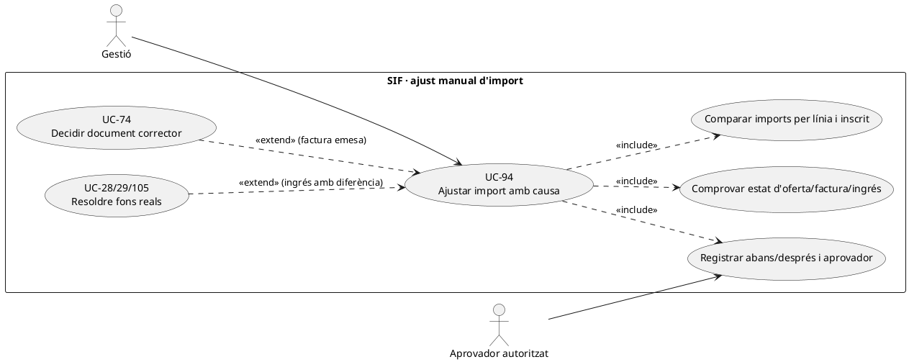

# UC-94 · Ajustar manualment l'import a pagar amb justificació

**Objectiu original:** registrar import anterior/nou, motiu i aprovador a `operational_event`; si existeix una factura emesa, **impedir-ne la mutació directa**. **Estat [DISSENY/BLOQUEJANT]** del flux complet de gestió: hi ha un writer genèric d'events i serveis de facturació, però no un controlador acreditat que autoritzi ajustos, resolgui el snapshot TPV i decideixi el document corrector.

## Evidència i riscos del PHP real

`OperationalEventRepository::append()` escriu `OPERATION_TYPE, FISCAL_IMPACT, ECONOMIC_IMPACT, STATUS, REASON_CODE`, actor, correlació i hashes dels snapshots abans/després. **No fa aprovació de negoci, bloqueig de concurrència ni deduplicació idempotent per ajust**. `LegacyCourseInvoicePayloadBuilder::lineAmounts()` comprova que base–descompte sigui coherent amb total del snapshot per a un curs, però no valida qui ha autoritzat un preu excepcional. `InvoiceRepository::insertInvoice()` desa `TOTAL` i `DESC_IMPORT` de la factura, i el registre encadenat reflecteix el payload emès. `PaymentService::registerPayment()` reusa una clau idempotent sense comparar el payload nou, de manera que canviar l'import sense coordinar clau i referència bancària pot ocultar una divergència.

| Instant de l'ajust | Contracte |
| --- | --- |
| Oferta sense factura ni intent Redsys | Gestió identifica `ID_INSC`, producte, base, descompte ja aplicat, preu nou i causa **diferent de la categoria genèrica «manual»**. Validar cèntims, límits/autorització i impacte per línia; versionar oferta abans de confirmar. |
| Intenció `DS_ORDER` pendent | No reusar `DS_ORDER` si s'ha alterat l'import o el snapshot. Decidir caducitat de la intenció i crear-ne una de nova amb quantia confirmada. No generar `REFUND` perquè no hi ha ingrés. |
| Factura emesa sense cobrar | El deute pendent deriva de factura/assignacions reals; no canviar `factura.TOTAL` o `A_PAGAR` llegat com a substitut de correcció fiscal. UC-74 classifica el document nou, si escau. |
| Factura ja pagada parcialment o totalment | Conservar `UUID_PAYMENT` i les transferències reals. Si l'ajust crea excés: UC-104/28/29/105 decideixen excés no assignat, refund extern, saldo o atribució **per inscrit**; una reducció de preu no demostra sortida bancària. |
| Grup/pack | Documentar el canvi sobre `ID_INSC` i línia concreta, mantenint suma per factura i pagador legítim; no dividir un `CHARGE` conjunt entre persones sense traça d'atribució quantitativa. |

### Flux objectiu

1. El formulari recull **abans/després** amb import original congelat, nou import, motivació i prova, actor proponent i aprovador autoritzat; comprova versió del snapshot i existència de factura/pagament real.
2. El servei de decisió **pendent** calcula diferència en cèntims per línia i verifica que no és una edició del document emès. Rebutja mateixa `REQUEST_ID` amb quanties contradictòries i intents paral·lels de canviar la mateixa oferta.
3. Registra decisió amb `OperationalEventRepository` i `FISCAL_IMPACT/ECONOMIC_IMPACT` classificats. L'ús del writer existeix, però **la seva crida des de la intranet d'ajustos no està acreditada**.
4. Sense factura, publicar oferta/intenció noves; amb factura, derivar a UC-74 per corrector justificat; amb diner extern, executar una única via de saldo/retorn/traspàs i conservar el `CHARGE` original.
5. Comparar SIF amb llegat/estat acadèmic i informar de resultats parcials sense repetir emissió/cobrament per un error de sincronització.

**Proves:** ajust de 80 € a 65 € abans de TPV, intenció antiga de 80 € amb nova oferta de 65 €, factura de 80 € amb 30 € pagats, transferència real de 80 € i descompte tardà de 15 €, empresa de grup amb dos participants, dues aprovacions concurrents, event repetit amb payload diferent.

**Pendents:** política d'import excepcional, rols, bloqueig/idempotència de negoci, writer d'ofertes versionades, classificador fiscal i traça monetària individual `enrollment_fund_movement` (**proposta, no implementada**).

## UML de casos d'ús



## UML de classes


## UML de seqüència — factura cobrada i preu ajustat

```mermaid
sequenceDiagram
actor G as Gestió
participant S as ManualPriceAdjustmentService [DISSENY]
participant F as factura i factura_linia [SQL]
participant P as payment_transaction/allocation [SQL]
participant E as OperationalEventRepository [PHP]
participant C as Classificació UC-74 [DISSENY]
participant M as Resolució d'excés UC-104/28/29/105
G->>S: Proposar import nou amb ID_INSC i justificació
S->>F: Llegir import original i estat emès
S->>P: Llegir CHARGE real i pagador
S-->>G: Diferència per línia, fiscal i diner
G->>S: Aprovar amb REQUEST_ID i rol verificats
S->>E: append(abans,després,motiu,actor) [integració pendent]
S->>C: Classificar impacte sobre factura original
C-->>S: Via fiscal autoritzada o cap efecte
opt Excés econòmic acreditat
 S->>M: Decidir saldo, refund real o atribució interna
 M-->>S: Resultat o incidència pendent
end
S-->>G: Estat diferenciat; sense UPDATE del TOTAL original
```

## Traçabilitat

[UC-94 original](../06-fitxes-funcionals/uc-094.md) · [UC-90 descompte tardà](uc-090-descompte-validat-despres-compra.md) · [UC-74 classificador](uc-074-classificar-correccio-fiscal.md) · [UC-104 excés](uc-104-gestionar-exces-cobrament.md) · [UC-105 reassignació](uc-105-reassignar-repartir-pagament.md) · [OperationalEventRepository](../../sif/src/Repository/OperationalEventRepository.php) · [LegacyCourseInvoicePayloadBuilder](../../sif/src/Service/LegacyCourseInvoicePayloadBuilder.php) · [PaymentService](../../sif/src/Service/PaymentService.php) · [Moviments d'inscripció](00-revisio-moviments-inscripcions.md).
