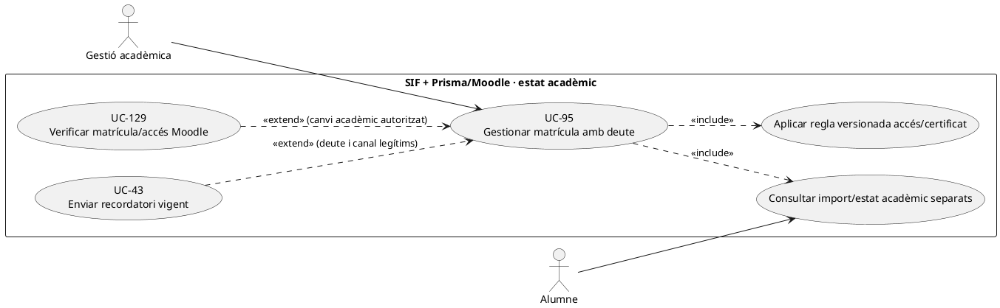
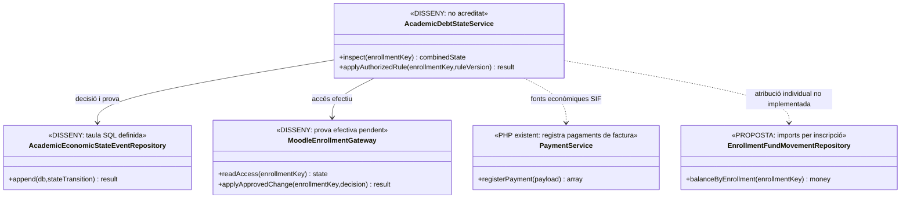

# UC-95 · Gestionar l'estat acadèmic quan hi ha deute pendent

**Objectiu original:** l'estat acadèmic i el cobrament **són dimensions separades**; certificat, reclamació i visibilitat depenen de regles explícites. **Estat [DISSENY].** Una persona pot estar matriculada i tenir factura pendent, o haver pagat sense que la matrícula/accés de Moodle s'hagi executat correctament.

## Evidència tècnica concreta

`academic_economic_state_event` està **definida a SQL** amb `ENROLLMENT_KEY`, `UUID_OPERATION`, estats acadèmic i d'accés abans/després, `ECONOMIC_STATE_SNAPSHOT/HASH`, `RULE_VERSION`, actor, correlació i causació. **No s'ha acreditat** a `sif/src` un writer i un motor d'elegibilitat acadèmica que omplin aquesta taula de manera transversal. `PaymentService::registerPayment()` registra ingressos SIF per `UUID_PAYMENT` però no matricula a Moodle ni emet certificats. `LegacySyncRepository::syncInscripcioSummary()` només afegeix un resum fiscal a `OBSERVACIONS` i `FACTURA_RELACIONADA`, i no prova accés/baixa acadèmica.

`payment_allocation` distribueix ingressos entre factures, **no quantifica automàticament pagat per `ID_INSC`** quan un responsable abona un grup: `enrollment_fund_movement` continua sent proposta no implementada.

| Estat observat | Regla pròpia |
| --- | --- |
| Matriculat amb factura pendent de pagament | Mantenir diferenciats matrícula, dret d'accés, venciment, reclamació i import pendent real. La política sobre accés/certificat **ha de ser aprovada**; no declarar baixa automàtica pel simple `ESTAT_COBRAMENT=PENDING`. |
| Factura pagada però no hi ha matrícula Moodle | Conserva `UUID_PAYMENT` real; crear incidència de sincronització UC-129, no una segona factura ni un nou `CHARGE`. |
| Grup amb una factura i un pagament parcial | Mostrar per participant l'estat acadèmic i la **quantia individual acreditada** quan existeixi traça; fins aleshores declarar atribució monetària `UNKNOWN`, no donar tots per pagats ni tots per morosos de manera automàtica. |
| Baixa o bloqueig acadèmic | Exigeix regla/autorització, data i motiu, tractament d'inscripció i accés UC-124/129, i anàlisi de l'obligació fiscal/econòmica independent. La baixa no esborra factura, pagament real ni deute per decret. |
| Certificat i comunicacions | Només afirmar «certificat disponible» o «baixa efectuada» després de verificar la **destinació efectiva**; recordatoris UC-43 llegeixen saldo i pròrroga actuals. |

### Flux funcional i proves

1. El responsable obre `ID_INSC`, curs/edició i operació/factura; consulta SIF, assignacions, pròrrogues, llegat i Moodle per separat amb data de tall i permisos.
2. El classificador **pendent** calcula deute **per factura** a partir del document i pagaments reals i, si hi ha diverses inscripcions, marca expressament les atribucions individuals no acreditades. `A_PAGAR/PAGAMENT` llegats no són prova bancària.
3. Aplica `RULE_VERSION` d'accés, certificat i reclamació **aprovada per l'organització**, no una regla fiscal implícita. Proposa mantenir, revisar o canviar accés/estat amb evidència, actor i motiu.
4. Si hi ha canvi autoritzat, crear event `academic_economic_state_event` (writer pendent), executar adaptador acadèmic/Moodle i confirmar el resultat. Davant fallada entre BDs, conservar `PENDING_RECONCILIATION` **proposat** i UC-129; no mentir mostrant l'estat desitjat com a complet.
5. El pagament posterior de factura existent registra una vegada l'ingrés real, sense generar nou `ALTA` fiscal; per una venda facturable sense factura, classificar emissió UC-04/74 abans de donar per tancada la gestió.

**Proves:** alumne actiu amb venciment prorrogat, grup de tres i pagament parcial del responsable, transferència acreditada amb matrícula Moodle pendent, baixa sense refund, certificat pendent i factura emesa abans de cobrar, retry del sync acadèmic després del commit SIF.

**Pendents:** política escrita d'accés/certificat/reclamació, motor/writer de decisions, atribució de fons per inscrit, comprovació d'operacions en llegat/Moodle, rols i tests de concurrència.

## UML de casos d'ús



## UML de classes



## UML de seqüència — pagament real però accés Moodle absent

```mermaid
sequenceDiagram
actor G as Gestió
participant S as AcademicDebtStateService [DISSENY]
participant P as SIF factura/payment_allocation
participant M as MoodleEnrollmentGateway [DISSENY]
participant E as academic_economic_state_event [SQL]
G->>S: Consultar matrícula i deute d'ID_INSC
S->>P: Llegir factura i pagaments reals
S->>M: Llegir estat d'accés acadèmic
alt Factura cobrada i accés pendent
 P-->>S: UUID_PAYMENT acreditat
 M-->>S: Alumne sense accés
 S->>E: Registrar divergència i causació [writer pendent]
 S->>M: Reintentar només matrícula autoritzada
 S-->>G: Pagament existent, accés en verificació
else Factura pendent i accés vigent
 S->>E: Registrar estat diferenciat per regla [pendent]
 S-->>G: Matrícula i deute separats; no baixa automàtica
end
Note over S,M: La consulta/actuació Moodle no està acreditada com a servei SIF complet.
```

## Traçabilitat

[UC-95 original](../06-fitxes-funcionals/uc-095.md) · [UC-96 pròrroga original](../06-fitxes-funcionals/uc-096.md) · [UC-124 accés/baixa](uc-124-reconciliar-acces-certificat-baixa-deute.md) · [UC-129 Moodle](uc-129-reconciliar-prisma-moodle-matricules.md) · [UC-43 avisos](uc-043-gestionar-notificacions-recordatoris.md) · [PaymentService](../../sif/src/Service/PaymentService.php) · [LegacySyncRepository](../../sif/src/Repository/LegacySyncRepository.php) · [SQL estat acadèmic/econòmic](../../sif/database/migrations/2026_09_16_000005_add_operation_lifecycle_tables.sql) · [Fons per inscrit](00-revisio-moviments-inscripcions.md).
