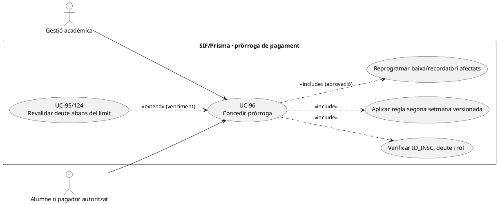
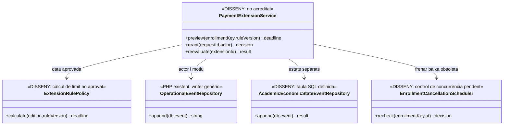
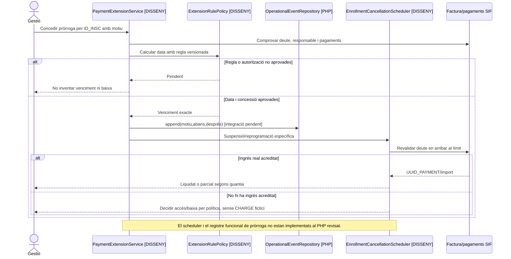

# UC-96 · Concedir una pròrroga de pagament fins a la segona setmana

**Objectiu original:** excepció temporal registrada amb justificació, venciment i resultat abans d'una baixa o de tractar el deute com a morositat. **Estat [DISSENY].** La fitxa original no concreta el dia exacte ni des de quin esdeveniment es compta la «segona setmana» (inici de curs, edició o venciment ordinari), ni els festius; **no s'ha inventat cap data de tall**.

## Evidència PHP i SQL

`academic_economic_state_event` està definida a `2026_09_16_000005_add_operation_lifecycle_tables.sql`: inclou `ENROLLMENT_KEY`, estat acadèmic/d'accés anterior i nou, `ECONOMIC_STATE_SNAPSHOT/HASH`, `RULE_VERSION`, actor, correlació i instant. `OperationalEventRepository::append()` escriu events genèrics amb snapshots i hashes. **No s'ha acreditat un servei PHP de pròrrogues, un worker de venciment o la connexió d'aquest event amb el control real de baixa a Prisma/Moodle.** La fitxa original esmenta `enrollment_cancellation_event`, que **sí està definida** a `2026_09_15_000003_add_functional_audit_control.sql` (no a la migració `000005`, que defineix `academic_economic_state_event`). La disponibilitat d'aquests dos esquemes **no acredita** un servei de pròrrogues, un worker que revalidi el deute abans de la baixa ni una transició entre els dos events executada des del PHP.

`PaymentService::registerPayment()` pot registrar un ingrés real sobre factura existent. Concedir dies addicionals **no altera `factura.TOTAL`, no és un `CHARGE`, no prorroga automàticament un `DS_ORDER` Redsys caducat ni anul·la un deute**.

## Flux i alternatives individuals

| Escenari | Decisió i traça exigida |
| --- | --- |
| Petició abans del venciment | Identificar `ID_INSC`, edició, pagador/responsable, factura i deute acreditat. Comprovar rol de qui aprova i pròrrogues anteriors, no fusionar inscripcions d'una mateixa persona. |
| Càlcul del límit | Aplicar política **formalment aprovada** per inici/segona setmana, instant límit i zona horària; guardar `RULE_VERSION`, regla, data base i data final. Si la política falta, retornar «pendent de decisió», no calcular arbitràriament set dies o el dia 14. |
| Excepció concedida | Crear event amb motiu/actor/abans/després, suspendre únicament l'acció de baixa o reclamació afectada i reprogramar recordatori UC-43. Matrícula/accés i estat de pagament es mantenen separats. |
| Pagament real durant la pròrroga | Verificar moviment bancari, `UUID_PAYMENT` i import atribuït; en grup, `payment_allocation` no prova pagament individual per `ID_INSC`. Tancar total/parcial segons prova, sense emetre una factura nova pel pagament posterior. |
| Límit sense ingrés | Reconsultar saldo, excepcions i pagaments incerts **en l'instant d'execució** i exigir regla d'accés/baixa UC-95/124. No executar automàticament una baixa decidida sobre un snapshot anterior a la pròrroga. |
| Empresa o grup pagador | Distingir el venciment contractual de la factura conjunta de la pròrroga d'un participant; una decisió acadèmica individual no reescriu el deute de l'empresa. |

1. Gestió consulta curs/edició, factura, estat bancari i accés acadèmic; prepara petició individual amb motiu i `REQUEST_ID`.
2. Un servei **pendent** aplica política aprovada i bloqueja una concessió duplicada o concurrent amb una baixa. Registra el venciment concret i modifica només la programació operativa, no els imports fiscals.
3. Event/scheduler pendents guarden decisió i revaliden deute i accés just abans del límit. Si la transferència ha arribat però el sync llegat falla, UC-82/129 repara **la destinació pendent**, sense un segon `CHARGE`.
4. Verificar resultat al SIF, llegat i Moodle i distingir «concessió registrada», «baixa suspesa» i «accés verificat». Sense proves, mantenir incidència/estat pendent.

**Proves pendents:** dos alumnes amb el mateix email, pròrroga i baixa simultànies, transferència el dia límit amb callback tardà, pagament parcial de grup, edició amb inici en festiu, intenció TPV caducada, dues aprovacions amb `REQUEST_ID` igual però dates diferents, i fallada del worker acadèmic.

### Detecció llegada de la «segona setmana» i comprovació al venciment

**Consulta existent, regla exacta no recuperada.** El diccionari del constructor de `Intranet.php` enumera `cnsRegBaixesSegonaSetnaba` (respectar aquesta grafia del nom de consulta), juntament amb `cnsCursosRecordarPag`, `cnsAlumnesRecordarPag` i `cnsCursosClaimBaixes`. Aquestes claus acrediten que el llegat té **detecció/seguiment relacionats amb la segona setmana, baixes i reclamacions**, però el llistat documental **no conté** el SQL complet ni l'algoritme que fixa el dia límit d'una pròrroga concreta. No interpretar el nom de la consulta com si imposés universalment «dia 14», set dies a partir de la matrícula o baixa automàtica a l'acabament de la segona setmana.

**Resolució per inscripció, edició i responsable real.** La petició ha d'identificar `ID_INSC`, `ANY/MES/CURS`, data d'inici o venciment que la política vigent determini, deute real de la factura que correspon, pagador i eventual pròrroga ja concedida. Una factura de grup d'empresa pot incloure persones amb dates d'inici diferents o una inscripció de baixa: la pròrroga acadèmica individual **no modifica** per si mateixa el venciment contractual de la factura de l'empresa, ni en crea una de nova. Si la inscripció ja està coberta per factura d'empresa, preservar la via de regularització autoritzada per al pagador, no habilitar una URL individual incompatible.

**Cursa amb transferència, callback o baixa.** Abans que `updClaimDonarBaixa` o `updInscCursBaixaiMoros` efectuïn un canvi operatiu, l'adaptació ha de rellegir pròrroga vigent, ingrés real `UUID_PAYMENT`, possibles `DS_ORDER` en curs i estat d'inscripció. Un timeout de sincronització de `PAGAMENT` no és impagament: si l'ingrés ja consta al SIF, recuperar només la fase acadèmica/llegada pendent. Si la política no autoritza mantenir accés, registrar la decisió individual amb l'event acadèmic **pendent de writer**, sense alterar factura o `payment_transaction`. La pròrroga no converteix una factura real pendent en proforma.

### Proves específiques de pròrroga i baixa (no executades)

| ID | Escenari | Resultat exigible |
| --- | --- | --- |
| PR-96-01 | `cnsRegBaixesSegonaSetnaba` identifica una inscripció | Revisar política i data base abans de decidir el venciment; cap «dia 14» deduït del nom de consulta. |
| PR-96-02 | Pròrroga aprovada i worker de baixa operativa s'executa amb un snapshot anterior | Rellegir excepció vigent i evitar una baixa basada en l'estat obsolet. |
| PR-96-03 | Transferència confirmada al banc/SIF just abans de la baixa i sync llegat fallit | Reconèixer `UUID_PAYMENT`; no donar de baixa com a impagada per `PAGAMENT=0` antic. |
| PR-96-04 | Factura conjunta d'empresa i pròrroga per un participant | No alterar imports/deute/receptor de la factura global automàticament. |
| PR-96-05 | `DS_ORDER` antiga caducada i pròrroga comercial aprovada | Preparar nova intenció només si és necessària i autoritzada; no mutar la signada anterior. |

## UML de casos d'ús

## UML de classes — model acadèmic SQL vs servei de pròrroga pendent

## UML de seqüència — transferència al límit

## Traçabilitat

[UC-96 original](../06-fitxes-funcionals/uc-096.md) · [UC-95 estat amb deute](uc-095-estat-academic-deute-pendent.md) · [UC-124 accés/baixa](uc-124-reconciliar-acces-certificat-baixa-deute.md) · [UC-43 recordatoris](uc-043-gestionar-notificacions-recordatoris.md) · [UC-129 Moodle](uc-129-reconciliar-prisma-moodle-matricules.md) · [OperationalEventRepository](../../sif/src/Repository/OperationalEventRepository.php) · [SQL estat acadèmic](../../sif/database/migrations/2026_09_16_000005_add_operation_lifecycle_tables.sql) · [SQL event de baixa](../../sif/database/migrations/2026_09_15_000003_add_functional_audit_control.sql).
