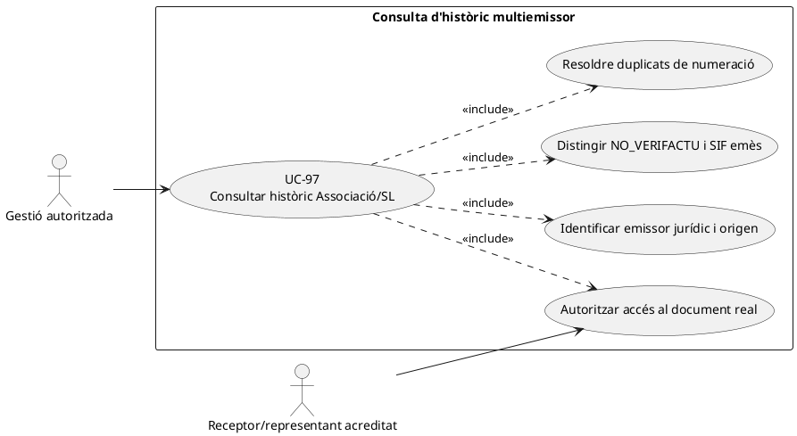
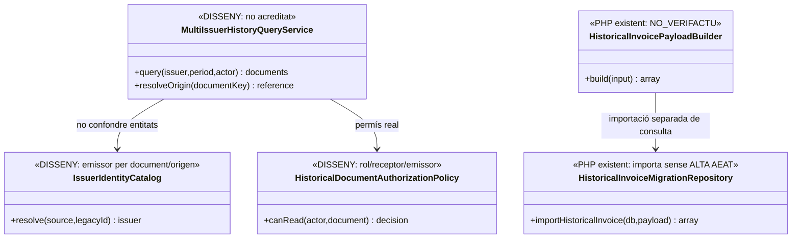
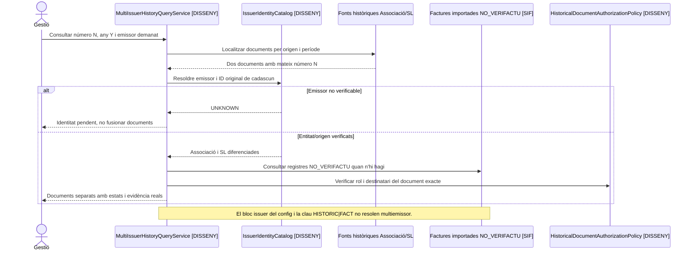

# UC-97 · Consultar un històric barrejat de l'Associació i la SL

**Objectiu original:** cada document conserva **emissor jurídic, data i origen**; cap factura antiga es converteix retroactivament en VERI*FACTU perquè es mostri en una consulta del SIF. **Estat [DISSENY/BLOQUEJANT]** de la vista unificada multiemissor: existeix importador històric però no s'ha acreditat un catàleg d'emissors ni una autorització/consulta transversal de les dues entitats.

## Evidència concreta i riscos

`HistoricalInvoicePayloadBuilder::build()` rep número, any/sèrie, `billing`, totals, línies i relacions; força `source_channel=MIGRACIO`, `source_type=HISTORIC_WEB_FACTURES` i `aeat_status=NO_VERIFACTU`. `HistoricalInvoiceMigrationRepository::importHistoricalInvoice()` insereix `factura`, línies, relacions i, opcionalment, metadades del document; **no crida `InvoiceRepository::createInvoiceGraph()`, no crea `ALTA` a `factura_registres` ni encola l'històric a AEAT**. El script de preview històric refusa `SIF_ENV=production`. La configuració `sif/config/sif.php` té **un únic bloc `issuer` per entorn**; el payload històric i la inserció consultats **no guarden un identificador d'emissor jurídic separat per factura**, de manera que no s'ha acreditat la reconstrucció multiemissor amb només el número visible.

| Tipus de consulta | Contracte |
| --- | --- |
| Consulta d'un document històric | Resoldre identificador d'origen, entitat emissora **acreditada documentalment**, número/sèrie, data, receptor, import i fitxer real. Si l'emissor no es pot verificar, mostrar `UNKNOWN/PENDING` **proposat**, no assignar-lo a l'Associació per defecte. |
| Mateix número visible a Associació i SL | La clau d'identitat no pot ser només `NUM_VISIBLE`; combinar emissor, origen, número/sèrie, any i ID original. `HistoricalInvoicePayloadBuilder` deriva per defecte `HISTORIC|FACT:<número>`: la clau **no discrimina emissor** si no s'aporta explícitament `idempotency_key`. |
| Pagaments històrics | `payment_status=UNKNOWN` és el valor per defecte del builder; no deduir cobrament real a partir del text històric. Cal enllaç amb prova bancària sense generar un `CHARGE` nou per imports d'anys anteriors. |
| Diferència històric vs nou SIF | L'històric importat conserva `ESTAT_AEAT=NO_VERIFACTU`; la consulta ha de mostrar aquesta distinció i **no** fabricar una resposta AEAT o un QR de registre nou. |
| Accés de l'alumne | Ser participant d'una inscripció no dóna visibilitat sobre factura d'empresa o d'una altra entitat; permisos server-side per receptor/representant, emissor i document UC-80/102. |

### Flux específic

1. El consultor autoritzat tria **emissor i període**, a més del número visible o origen; el servei unificat **pendent** interroga les fonts històriques mantenint el seu sistema i emissor.
2. Comparar cada resultat amb la taula/document d'origen; desambiguar numeracions coincidents, factures rectificades i estats de cobrament. Si no existeix una correspondència d'emissor verificable, no completar-la per inferència.
3. Mostrar les factures noves i històriques diferenciades (`SIF emès / històric NO_VERIFACTU / font només llegada`) i conservar links als bytes reals amb permisos. Una metadada de `factura_documents` no garanteix fitxer físic.
4. Abans de migrar més històric, adoptar una clau idempotent **emissor+origen+ID** i comprovar que el model guarda emissor jurídic per fila; l'importador actual no ho resol tot sol.
5. Registrar consultes/denegacions amb actor, abast i correlació. El simple fet de navegar l'històric no emet nova factura, no actualitza `fiscal_chain_state` ni mou diners.

**Proves:** Associació i SL amb mateix número i any, importador amb clau per defecte repetida, document històric sense emissor, factura empresa consultada per alumne, falta PDF físic, cobrament històric incert, i consulta d'històric NO_VERIFACTU junt amb factura SIF recent.

**Pendents:** identificació fiable d'emissor per cada origen, schema/columna d'emissor o partició acreditada, classificació fiscal de cada botiga/SL UC-98, autoritzacions, inventari de dades històriques i proves de no-col·lisió.

## UML de casos d'ús

## UML de classes

## UML de seqüència — numeracions coincidents entre emissors

## Traçabilitat

[UC-97 original](../06-fitxes-funcionals/uc-097.md) · [UC-98 circuit SL original](../06-fitxes-funcionals/uc-098.md) · [UC-80 document](uc-080-servir-registrar-acces-document-fiscal.md) · [UC-102 alumne original](../06-fitxes-funcionals/uc-102.md) · [HistoricalInvoicePayloadBuilder](../../sif/src/Service/HistoricalInvoicePayloadBuilder.php) · [HistoricalInvoiceMigrationRepository](../../sif/src/Repository/HistoricalInvoiceMigrationRepository.php) · [Configuració emissor](../../sif/config/sif.php) · [Preview històric](../../sif/scripts/preview-historical-invoice-migration.php).
