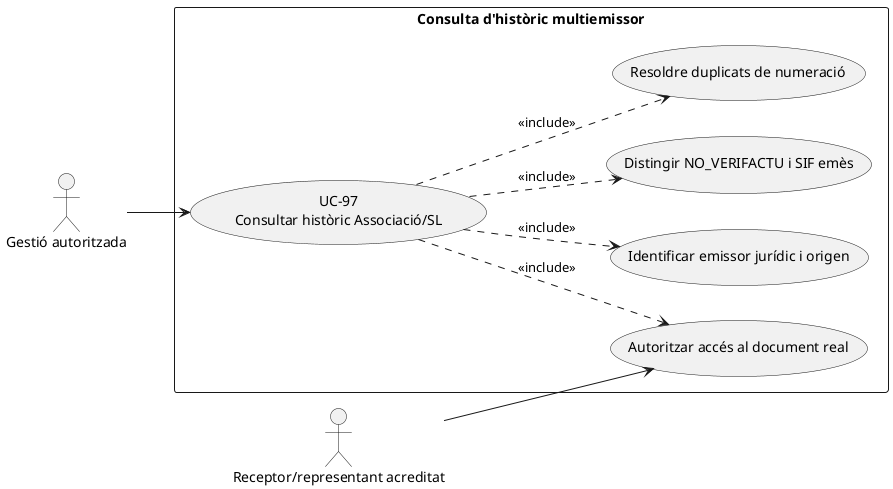
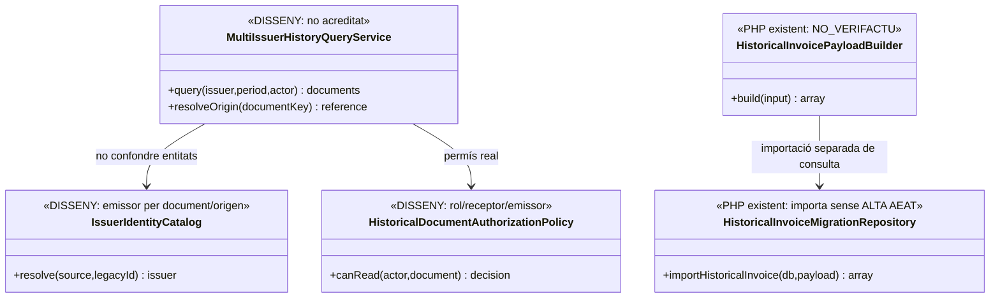
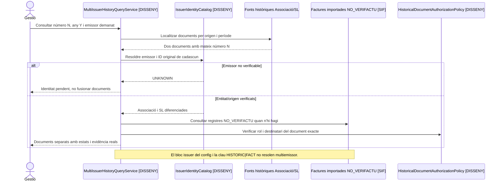
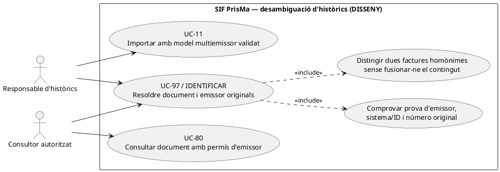

# UC-97 · Consultar un històric barrejat de l'Associació i la SL

**Objectiu original:** cada document conserva **emissor jurídic, data i origen**; cap factura antiga es converteix retroactivament en VERI*FACTU perquè es mostri en una consulta del SIF. **Estat [DISSENY/BLOQUEJANT]** de la vista unificada multiemissor: existeix importador històric però no s'ha acreditat un catàleg d'emissors ni una autorització/consulta transversal de les dues entitats.

## Evidència concreta i riscos

`HistoricalInvoicePayloadBuilder::build()` rep número, any/sèrie, `billing`, totals, línies i relacions; força `source_channel=MIGRACIO`, `source_type=HISTORIC_WEB_FACTURES` i `aeat_status=NO_VERIFACTU`. `HistoricalInvoiceMigrationRepository::importHistoricalInvoice()` insereix `factura`, línies, relacions i, opcionalment, metadades del document; **no crida `InvoiceRepository::createInvoiceGraph()`, no crea `ALTA` a `factura_registres` ni encola l'històric a AEAT**. El script de preview històric refusa `SIF_ENV=production`. La configuració `sif/config/sif.php` té **un únic bloc `issuer` per entorn**; el payload històric i la inserció consultats **no guarden un identificador d'emissor jurídic separat per factura**, de manera que no s'ha acreditat la reconstrucció multiemissor amb només el número visible.

| Tipus de consulta | Contracte |
| --- | --- |
| Consulta d'un document històric | Resoldre identificador d'origen, entitat emissora **acreditada documentalment**, número/sèrie, data, receptor, import i fitxer real. Si l'emissor no es pot verificar, mostrar `UNKNOWN/PENDING` **proposat**, no assignar-lo a l'Associació per defecte. |
| Mateix número visible a Associació i SL | La clau d'identitat no pot ser només `NUM_VISIBLE`; combinar emissor, origen, número/sèrie, any i ID original. `HistoricalInvoicePayloadBuilder` deriva per defecte `HISTORIC|FACT:<número>`: la clau **no discrimina emissor** si no s'aporta explícitament `idempotency_key`. **Encara que s'aportin claus idempotents diferents, la migració base de `factura` exigeix `UNIQUE(NUM_VISIBLE)` i `UNIQUE(TIPUS_SERIE,ANY_FACT,NUM_SEQ)` sense emissor: dues factures originals de diferents emissors amb el mateix número no es poden inserir com a dues files en l'esquema actual.** |
| Pagaments històrics | `payment_status=UNKNOWN` és el valor per defecte del builder; no deduir cobrament real a partir del text històric. Cal enllaç amb prova bancària sense generar un `CHARGE` nou per imports d'anys anteriors. |
| Diferència històric vs nou SIF | L'històric importat conserva `ESTAT_AEAT=NO_VERIFACTU`; la consulta ha de mostrar aquesta distinció i **no** fabricar una resposta AEAT o un QR de registre nou. |
| Accés de l'alumne | Ser participant d'una inscripció no dóna visibilitat sobre factura d'empresa o d'una altra entitat; permisos server-side per receptor/representant, emissor i document UC-80/102. |

### Flux específic

1. El consultor autoritzat tria **emissor i període**, a més del número visible o origen; el servei unificat **pendent** interroga les fonts històriques mantenint el seu sistema i emissor.
2. Comparar cada resultat amb la taula/document d'origen; desambiguar numeracions coincidents, factures rectificades i estats de cobrament. Si no existeix una correspondència d'emissor verificable, no completar-la per inferència.
3. Mostrar les factures noves i històriques diferenciades (`SIF emès / històric NO_VERIFACTU / font només llegada`) i conservar links als bytes reals amb permisos. Una metadada de `factura_documents` no garanteix fitxer físic.
4. Abans de migrar més històric, adoptar una clau idempotent **emissor+origen+ID**, persistir l'emissor jurídic acreditat per document **i resoldre abans la unicitat global de número/sèrie-any-seqüència que imposa `factura`**. Canviar només la clau idempotent no resol la col·lisió de dades. No renumerar ni fusionar silenciosament els documents originals.
5. Registrar consultes/denegacions amb actor, abast i correlació. El simple fet de navegar l'històric no emet nova factura, no actualitza `fiscal_chain_state` ni mou diners.

**Proves:** Associació i SL amb mateix número i any, importador amb clau per defecte repetida, document històric sense emissor, factura empresa consultada per alumne, falta PDF físic, cobrament històric incert, i consulta d'històric NO_VERIFACTU junt amb factura SIF recent.

**Pendents:** identificació fiable d'emissor per cada origen, schema/columna d'emissor o partició acreditada, classificació fiscal de cada botiga/SL UC-98, autoritzacions, inventari de dades històriques i proves de no-col·lisió.

### Dues entitats amb numeració aparentment igual: desambiguació del document original

**La configuració actual no és un catàleg multiemissor.** El mòdul històric registra `NUM_VISIBLE`, sèrie, any, número, receptor i línies, però l'alta importada **no persisteix un identificador d'emissor jurídic per factura** en els camps inspeccionats; `sif/config/sif.php` té un únic bloc `issuer` per entorn. El procés de consulta no pot escollir Associació o SL segons la lletra de la sèrie, el CIF del receptor ni el període sense **evidència pròpia de l'emissor del document original**. Si dues fonts aporten el mateix número visible, la clau `HISTORIC|FACT:<número>` per defecte no les distingeix i la segona alta **pot recuperar erròniament la primera factura per idempotència sense comparar els payloads**. Amb dues claus idempotents explícites diferents, l'`INSERT` de la segona factura **topa igualment** amb la unicitat global de `NUM_VISIBLE` i de `(TIPUS_SERIE, ANY_FACT, NUM_SEQ)` al SQL base. L'esquema actual no preserva emissor per fila i les migracions addicionals revisades no retiren aquestes dues restriccions. Cal definir una identitat composta d'emissor acreditat, sistema i ID original, i decidir **un model de persistència que conservi els dos documents sense canviar-ne la numeració original** abans d'importar-los conjuntament. La consulta històrica separada a les fonts d'origen és una via de disseny a avaluar, no una funcionalitat acreditada.

**Agrupador i dades monetàries llegades.** `FACTURA_RELACIONADA` pot connectar factures A i R històriques i diversos alumnes en grup/pack, però no indica per si mateix quina entitat les va emetre, quin import es va retornar al banc o a qui pertany el saldo actual. La consulta ha de resoldre separadament **emissor**, **receptor fiscal**, **participants**, **pagador real** i **estat de document**. Els valors `ESTAT_COBRAMENT` importats descriuen el resum històric, no són `payment_transaction` i no autoritzen a incorporar `CHARGE` retrospectius per fer coincidir els totals.

**Documento antic localitzat vs PDF regenerat.** El circuit llegat `descarregaFactura.php` pot invocar `generaFactura($id,true)` sobre dades vives. Si falta el PDF conservat de l'època, un PDF reconstruït avui és **còpia de consulta o representació reconstruïda**, no un original antic custodiat amb hash històric acreditat. Les metadades `factura_documents` importades no comproven existència física de bytes. La vista de l'Associació/SL ha d'indicar origen del fitxer i categoria d'evidència, amb accés UC-80 i sense simular QR o registre AEAT de la factura anterior.

**Receptor i permís individual.** `HistoricalInvoiceMigrationRepository::insertRelations()` usa `VISIBLE_ALUMNE=1` per omissió si el payload no en porta valor: per a una antiga factura d'empresa cal **revalidar el receptor** i no lliurar el document complet al participant perquè la relació migrada es marqui visible. Un auditor pot consultar dins del seu abast i una empresa només amb representació provada, independentment de qui tingui el mateix email a la matrícula.

### Proves addicionals de consulta d'històric (no executades)

| ID | Escenari | Resultat exigible |
| --- | --- | --- |
| HS-97-01 | Associació i SL tenen el mateix `NUM_VISIBLE` en dos documents | Desambiguació per emissor/origen/ID, cap fusió ni emissor assignat per deducció. |
| HS-97-02 | Emissor jurídic no consta en les dades d'origen consultades | Estat pendent d'acreditació, no assignació a l'entitat activa. |
| HS-97-03 | Grup amb `VISIBLE_ALUMNE` importat per defecte | No donar accés al PDF complet a l'alumne per aquest únic camp. |
| HS-97-04 | PDF generat avui a partir de `web.factures` actual | Mostrar reconstrucció i no etiquetar-lo com a original històric verificat. |
| HS-97-05 | Llistat barreja històric NO_VERIFACTU i SIF actual | Fonts, emissors i estats fiscals diferenciats; no nova cua AEAT per lectura. |

## UML de casos d'ús



## UML de classes



## UML de seqüència — numeracions coincidents entre emissors



### Acció independent: desambiguar emissor abans d'importar o mostrar dos històrics homònims — UC-97, DISSENY

**Actor/disparador:** responsable de migració o consulta fiscal troba dues factures originals de l'Associació i de la SL amb el mateix número visible i període. **Precondicions:** accés a les fonts originals i prova de l'entitat emissora de cadascun dels dos documents; **no** deduir emissor del nom del receptor o de la sèrie. **Postcondició documental:** dues identitats d'origen diferenciades o incidència d'emissor pendent; el sistema **no** les fusiona, no inventa un número alternatiu ni les classifica com una única factura SIF.



```mermaid
sequenceDiagram
autonumber
actor R as Responsable d'històrics
participant Source as Fonts Associació/SL [LECTURA]
participant S as Resolvedor d'identitat documental [DISSENY]
participant M as HistoricalInvoiceMigrationService [PHP]
participant B as HistoricalInvoicePayloadBuilder [PHP]
participant T as TransactionRunner [PHP]
participant H as HistoricalInvoiceMigrationRepository [PHP]
participant DB as factura [SQL base]
participant I as Incidència/model multiemissor [DISSENY]
R->>S: Contrastar dos originals A2020/000123 de diferents emissors
S->>Source: Recuperar emissor acreditat, sistema i ID de cadascun
alt Emissor no acreditat
 Source-->>S: UNKNOWN
 S-->>R: Incidència; no deduir-lo de número o receptor
else Dos originals acreditats, mateix número
 Source-->>S: Associació i SL, orígens diferents
 Note over S,I: El control objectiu ha de bloquejar la doble importació. Els passos següents il·lustren què fa l'API actual si un adaptador intenta importar tots dos.
 S->>M: importHistoricalInvoice(original Associació)
 M->>B: build(input amb clau per defecte)
 B-->>M: HISTORIC|FACT:A2020/000123
 M->>T: run(callback)
 T->>DB: BEGIN
 M->>H: importHistoricalInvoice(db,payload)
 H->>DB: SELECT per IDEMPOTENCY_KEY; INSERT original si no existeix
 T->>DB: COMMIT
 M-->>S: UUID_FACTURA_A
 alt Segon original amb mateixa clau per defecte
  S->>M: importHistoricalInvoice(original SL, mateixa clau)
  M->>B: build(input SL)
  B-->>M: HISTORIC|FACT:A2020/000123
  M->>T: run(callback)
  T->>DB: BEGIN
  M->>H: importHistoricalInvoice(db,payload SL)
  H->>DB: SELECT per IDEMPOTENCY_KEY
  DB-->>H: UUID_FACTURA_A preexistent
  H-->>M: idempotency_reused=true, sense comparar contingut
  T->>DB: COMMIT
  M-->>S: UUID_FACTURA_A reutilitzat erròniament per al segon original
  S->>I: Conflicte de documents, no declarar importada la SL
 else Segon original amb clau explícita emissor + ID
  S->>M: importHistoricalInvoice(original SL, clau distinta)
  M->>B: build(input SL)
  M->>T: run(callback)
  T->>DB: BEGIN
  M->>H: importHistoricalInvoice(db,payload SL)
  H->>DB: INSERT mateix NUM_VISIBLE / sèrie-any-seqüència
  DB--xH: PDOException per UNIQUE de número
  T->>DB: ROLLBACK del segon intent
  M--xS: Fallada d'importació de SL; primer original intacte
  S->>I: Model de BD no admet els dos originals homònims
 end
 S-->>R: Incident multiemissor pendent de decisió; sense renumeració silenciosa
end
Note over S,DB: El resolvedor de dos emissors i la migració conjunta són DISSENY; els dos comportaments de reús/UNIQUE són contrast PHP/SQL, no test executat.
```

**Decisió de model pendent:** `factura.NUM_VISIBLE` i `(TIPUS_SERIE,ANY_FACT,NUM_SEQ)` són únics globalment al SQL base. Abans de canviar restriccions cal preservar la numeració única exigida per a les noves emissions del SIF i definir si els històrics de diversos emissors han de residir en un model separat o en una identitat composta que **no alteri la cadena/numeració de nova emissió**; cap alternativa es dóna aquí per implementada.

| Prova pendent | Escenari | Resultat exigible |
| --- | --- | --- |
| HS-97-07 | Dues fonts amb mateix número i clau per defecte | Detectar reús erroni de la primera per `HISTORIC|FACT:<número>`; no declarar les dues migrades. |
| HS-97-08 | Mateixos documents amb claus idempotents explícites diferents | Detectar col·lisió per `UNIQUE(NUM_VISIBLE)` i `UNIQUE(TIPUS_SERIE,ANY_FACT,NUM_SEQ)`; no renumerar. |
| HS-97-09 | Consulta de dues factures homònimes però emissor original desconegut en una | No revelar-les com una única factura d'Associació/SL; conservar incidència d'identitat. |
| HS-97-10 | Definició de model multiemissor sense perdre numeració nova del SIF | Dues identitats històriques originals consultables, nova factura immutable amb numeració i cadena pròpies, permisos per emissor. |

## Traçabilitat

[UC-97 original](../06-fitxes-funcionals/uc-097.md) · [UC-98 circuit SL original](../06-fitxes-funcionals/uc-098.md) · [UC-80 document](uc-080-servir-registrar-acces-document-fiscal.md) · [UC-102 alumne original](../06-fitxes-funcionals/uc-102.md) · [HistoricalInvoicePayloadBuilder](../../sif/src/Service/HistoricalInvoicePayloadBuilder.php) · [HistoricalInvoiceMigrationRepository](../../sif/src/Repository/HistoricalInvoiceMigrationRepository.php) · [Configuració emissor](../../sif/config/sif.php) · [Preview històric](../../sif/scripts/preview-historical-invoice-migration.php).
