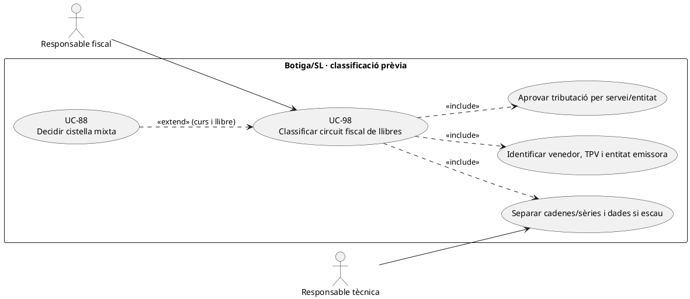
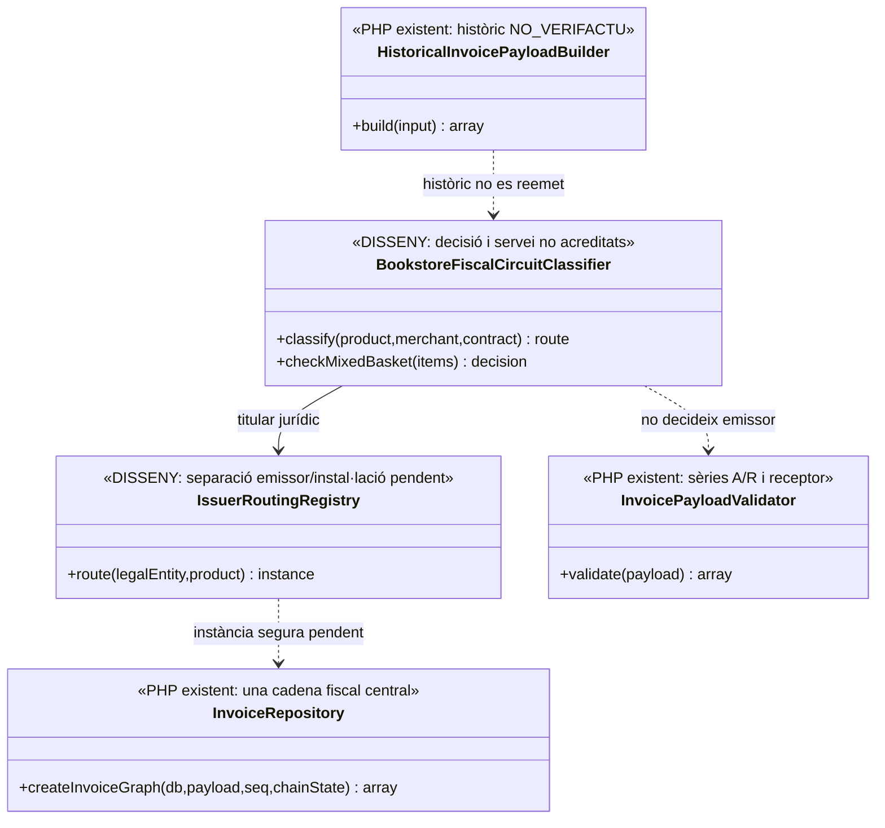
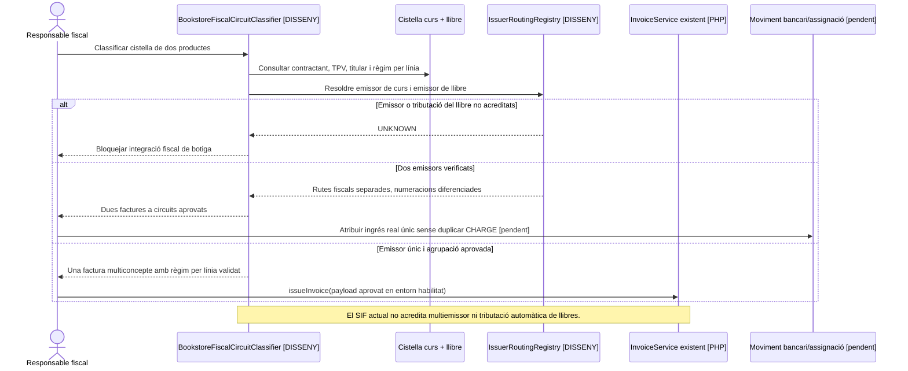

# UC-98 · Classificar el circuit fiscal de la botiga de llibres / SL

**Objectiu original:** decidir **abans d'implementar** titular del SIF, emissor, sèries i dades separades respecte de PrisMa. **Estat [PENDENT/BLOQUEJANT].** La fitxa no atribueix a una entitat un règim tributari concret sense dades d'operació i validació fiscal; constata que **el codi PHP actual no és un SIF multiemissor complet**.

## Evidència i límits reals

`sif/config/sif.php` defineix un sol bloc `issuer.nif/name` per entorn i les sèries `A/R` com a valors de configuració. `InvoicePayloadValidator::validate()` només admet sèries `A/R` i exigeix receptor, totals i línies, **sense un identificador d'emissor per línia ni una decisió de titular jurídic de la botiga**. `InvoiceRepository::insertInvoice()` escriu `BILLING_*` del receptor, `IVA_REGIM/PCT/IMPORT` del payload i `SOURCE_CHANNEL`; no crea una separació d'emissor per venda ni selecciona una cadena fiscal independent per SL. `LegacyCourseInvoicePayloadBuilder` fixa `iva_regim=EXEMPT` en el cas de cursos que construeix; aquest valor **no autoritza aplicar el mateix règim als llibres**.

`HistoricalInvoicePayloadBuilder` pot importar documents `NO_VERIFACTU`, però no transforma una factura antiga de SL en factura nova del SIF ni demostra que totes les entitats puguin compartir la mateixa seqüència/certificat.

| Qüestió específica | Decisió pendent, sense inventar resposta |
| --- | --- |
| Qui fa la venda de llibres? | Identificar empresa/associació que formalitza cada venda, titular del TPV, receptor dels diners, responsable del lliurament i emissor jurídic del document. Un logo o domini comercial comú no acredita que l'emissor sigui l'Associació. |
| És el mateix SIF o un altre? | Aprovar partició per emissor/instal·lació, sèries, numeració, cadena, certificat, credencials, BD, declaració i custòdia. L'esquema actual centralitza `fiscal_chain_state` amb fila ID=1 i `FiscalSequenceRepository` per sèrie/any, **no** per emissor. |
| Línies amb curs i llibre | UC-88 exigeix classificar emissor i tributació per servei abans de decidir agrupació; una sola cistella o cobrament bancari **no implica** factura única de dues entitats. |
| Impost/règim del llibre | Fixar per producte/operació, amb responsable fiscal, la base, tipus, quota i supòsit aplicable; **no** copiar `EXEMPT/0.00` del builder de formació ni inventar un percentatge legal sense verificar-lo. |
| TPV i devolucions | Un banc/DS_ORDER pot tenir relacions amb diversos serveis, però els ingressos reals i assignacions han d'estar vinculats a l'emissor titular acreditat. **No duplicar `CHARGE`** per comptabilitzar dues factures. |
| Històric | UC-97 conserva l'emissor real de factures anteriors i `NO_VERIFACTU`; no barrejar números iguals d'entitats distintes. |

### Flux de decisió abans del desenvolupament

1. Inventariar botiga web, TPV, contractes, entitat venedora, emissor de cada producte, factures històriques i codi de checkout/callback **actiu en producció**. Si no es pot verificar un punt d'entrada, mantenir-lo com a no acreditat.
2. L'àrea fiscal aprova una **matriu per producte i entitat** (titular, tributació, receptor, numeració i responsable de declaració) i el tractament de cistelles mixtes. Documentar explícitament els casos amb devolucions o pagament únic.
3. Arquitectura defineix a partir d'aquesta decisió si són necessàries instàncies/configuracions/seqüències/cadenes diferenciades o un multiemissor segur; **no** reutilitzar sense més `A/R`, `fiscal_chain_state.ID=1` i l'emissor per defecte.
4. Preparar proves de numeració, callbacks duplicats, factures mixtes, exportació/auditoria per entitat i reconciliació de banc/SL/llegat; gate UC-39/46 per entorn i artefacte real.
5. Fins a completar classificació i implementació, **no dirigir vendes de SL al builder de curs de l'Associació** ni certificar que la botiga està incorporada al SIF.

**Proves pendents:** curs Associació + llibre SL en cistella única, dues factures A2026/000001 amb emissors diferents, pagament conjunt, retorn parcial llibre, certificat d'una entitat en l'altra, llibre amb impostos no exempts, històric SL i prova d'accés d'un alumne a document de tercers.

## UML de casos d'ús

## UML de classes

## UML de seqüència — cistella conjunta amb dos possibles emissors

## Traçabilitat

[UC-98 original](../06-fitxes-funcionals/uc-098.md) · [UC-97 històric](uc-097-consultar-historic-associacio-sl.md) · [UC-88 agrupació](uc-088-decidir-agrupacio-linies-factura-multiconcepte.md) · [UC-39 gate](uc-039-proves-gate-go-no-go.md) · [Configuració d'emissor](../../sif/config/sif.php) · [InvoicePayloadValidator](../../sif/src/Service/InvoicePayloadValidator.php) · [InvoiceRepository](../../sif/src/Repository/InvoiceRepository.php) · [HistoricalInvoicePayloadBuilder](../../sif/src/Service/HistoricalInvoicePayloadBuilder.php).
