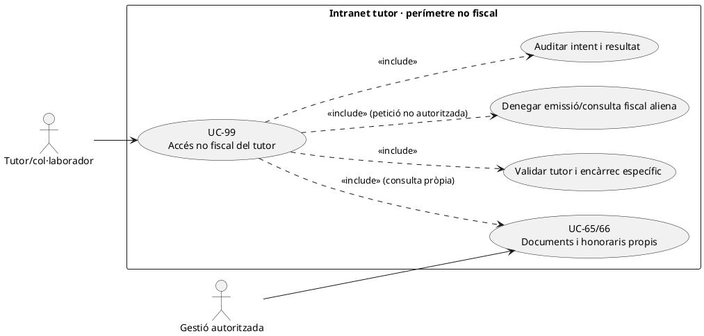
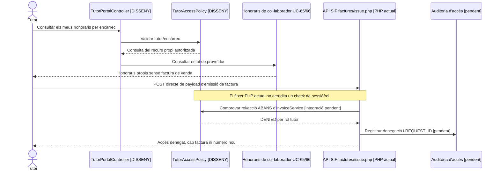

# UC-99 · Limitar la intranet de tutors a un circuit no fiscal de venda

**Objectiu original:** les funcions de consulta i honoraris del col·laborador **no permeten emetre, modificar ni veure factures de venda alienes**. **Estat [DISSENY/PENDENT].** UC-65/66 descriuen el document de proveïdor i la liquidació d'honoraris; UC-99 defineix el **perímetre d'autorització de totes les rutes** de la intranet de tutor.

## Evidència i límit de les API actuals

`sif/public/api/factures/issue.php` llegeix JSON i instancia directament `InvoiceService::issueInvoice()`; `sif/public/api/payments/register.php` instancia directament `PaymentService::registerPayment()`. **No hi consta en aquests dos fitxers cap verificació de sessió/rol**. Això no demostra que un tutor els pugui invocar des del desplegament real —les regles del servidor i de xarxa no s'han verificat—, però **tampoc acredita que s'hi apliqui una prohibició per rol de tutor**. Ocultar els botons de factura o devolució al navegador no substitueix el control del servidor.

`OperationalEventRepository::append()` és writer genèric de traça, no un autenticador. Les dades fiscals `factura, factura_linia, fact_rels` pertanyen al circuit de venda; la consulta d'una factura de tutor/col·laborador UC-65 és **document de proveïdor propi**, no autorització per llegir un PDF de factura d'empresa d'un grup d'alumnes.

| Recurs o acció | Capacitat prevista del tutor |
| --- | --- |
| Servei/activitat que imparteix | Consultar només edicions, participants i dades acadèmiques **necessàries i autoritzades** per la funció, sense exportació massiva de dades personals o bancàries. La matriu exacta de camps és **pendent** segons UC-99 original. |
| Factura/rebut d'honoraris propi | Presentar i consultar només el seu document i estat UC-65, amb identitat del proveïdor verificada; no utilitzar `InvoiceService` de vendes. |
| Cobraments/bestretes propis | Veure estat/honoraris realment corresponents a l'encàrrec UC-66; no invocar `PaymentService::registerPayment()` de vendes ni transferir-se bestretes per autoaprovació. |
| Factura de curs/alumne/empresa | Denegar lectura d'artefactes aliens, numeració, `BILLING_*` de tercer, NIF i altres dades de pagador. Les relacions `fact_rels` amb `VISIBLE_ALUMNE=0` no són autorització per al tutor. |
| API d'emissió, correcció, cobrament, refund o AEAT | Denegar **a nivell servidor** per rol de tutor, fins i tot cridant la ruta directament, canviant el JSON o reutilitzant una URL; registrar denegació i correlació sense exposar secrets. |

### Flux funcional

1. Un controlador real d'identitat **pendent** verifica sessió del tutor, `collaborator_id`, rol i encàrrecs/edicions assignats. No confondre mateixa persona amb rols d'alumne, tutor i pagador; cada rol ha d'acreditar drets per recurs.
2. Cada petició comprova subjecte, rol, propietat del document o adscripció a l'edició **abans** de llegir dades. Filtrar per `idTutor` a la interfície sense verificació backend no és suficient.
3. Les peticions d'honoraris es dirigeixen al circuit adjacent UC-65/66; qualsevol consulta a `factura_documents` o canvi econòmic de venda segueix autorització SIF independent i no deriva del rol de tutor.
4. Requerir control d'entrada autenticat/autoritzat per les API d'emissió i pagaments **i comprovació de segmentació d'entorn/xarxa UC-101**; les rutes PHP existents no porten un check visible de sessió i rol. No afirmar que el servidor produeix ja un 403 fins a provar-ho.
5. Registrar accessos, denegacions i ús de recursos amb actor/rol/abast; provar totes les rutes amb permisos de tutor, no només els menús. UC-45 d'auditor temporal és un rol diferent i no s'hereta automàticament.

**Proves:** tutor que altera `ID_INSC` en URL, col·laborador i alumne amb mateix email, tutor que intenta veure factura d'empresa del grup, POST directe a `factures/issue.php`, POST directe a `payments/register.php`, lectura de dades d'un altre tutor, canvi de rol en sessió oberta i llistat de participants amb NIF bancari.

**Pendents:** inventari de rutes i permisos actuals de la intranet tutor, matriu de camps de participants autoritzats, autenticació API de venda, aplicació al proxy/servidor, auditoria d'accés i proves d'accés denegat a tot el perímetre.

## UML de casos d'ús

## UML de classes

## UML de seqüència — tutor intenta invocar API de venda

## Traçabilitat

[UC-99 original](../06-fitxes-funcionals/uc-099.md) · [UC-65 document proveïdor](uc-065-presentar-factura-rebut-collaborador.md) · [UC-66 honoraris](uc-066-gestionar-cobraments-collaborador.md) · [UC-101 entorns original](../06-fitxes-funcionals/uc-101.md) · [UC-102 alumne original](../06-fitxes-funcionals/uc-102.md) · [Ruta emissió PHP](../../sif/public/api/factures/issue.php) · [Ruta cobrament PHP](../../sif/public/api/payments/register.php) · [OperationalEventRepository](../../sif/src/Repository/OperationalEventRepository.php).
