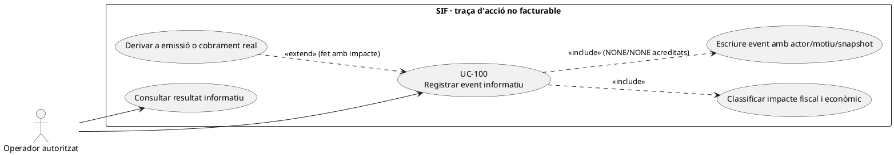
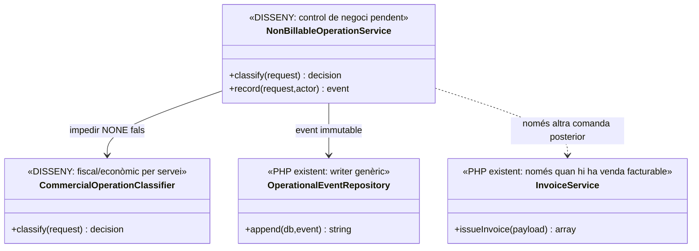
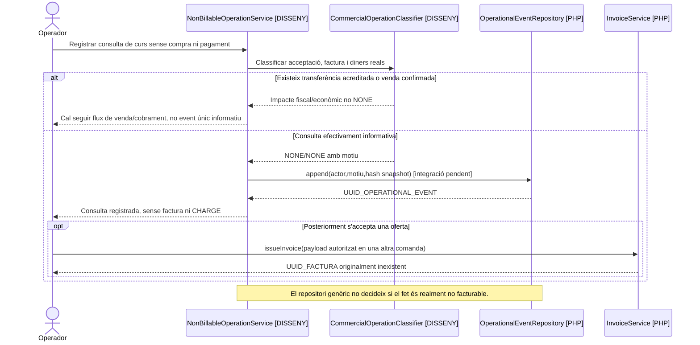

# UC-100 · Registrar una operació informativa o no facturable

**Objectiu original:** documentar un **event auditable** amb motiu i classificació `NONE`; no crear factura ni pagament. **Estat [DISSENY/PARCIAL].** Existeix el repositori PHP que escriu events operatius, però no s'ha acreditat un classificador ni un controlador que separin una acció merament informativa d'una venda, un ingrés real o una correcció fiscal.

## Evidència real i problema d'interpretació

`OperationalEventRepository::append(PDO,array)` comprova camps obligatoris (`operation_type, source_type, fiscal_impact, economic_impact, status, reason_code, actor_type, source_channel, correlation_id, occurred_at`) i desa a `operational_event` snapshots amb hash SHA-256, actor, `UUID_FACTURA/UUID_PAYMENT` **opcionals** i resultat. **No impedeix per si sol que un client digui `FISCAL_IMPACT=NONE` sobre una operació que realment és una venda**, ni proporciona servei de deduplicació de peticions. `InvoiceRepository::createInvoiceGraph()` és un altre circuit: genera factura, línies, registre encadenat i cua AEAT. UC-100 **no l'ha de cridar** quan la classificació informativa està acreditada.

| Fet concret | Classificació i decisió |
| --- | --- |
| Nota de seguiment d'una consulta de curs | Registrar que s'ha atès la consulta, subjecte/actor, instant i propòsit, sense inventar matrícula ni deute. `fiscal_impact=NONE` i `economic_impact=NONE` són valors **objectiu del cas**, no prova que qualsevol petició sigui no facturable. |
| Reserva/sol·licitud **sense** oferta acceptada ni ingrés | Anotar estat i caducitat de l'operació informativa; si després es confirma una venda, crear **un event nou derivat** i executar el circuit fiscal corresponent. No mutar el registre informatiu perquè «es converteixi» en factura emesa. |
| Col·laborador presenta un rebut | UC-65 és recepció de document de **proveïdor**, no factura de venda de cursos ni `CHARGE`. L'event informatiu pot referenciar el document sense reemetre'l. |
| Comprovant/transferència **real** descobert en una operació aparentment informativa | Reclassificar el fet per servei/emissor/receptor, preservar l'event anterior com a antecedent i derivar a UC-02/04/74. No deixar el cobrament real fora de conciliació per una etiqueta `NONE`. |
| Error de contacte o canvis acadèmics | Registrar el motiu si no hi ha efecte fiscal/econòmic, però aplicar UC-120/129 quan hi ha propagació real; un `operational_event` no prova que Moodle s'hagi actualitzat. |

### Flux funcional

1. L'operador autoritzat proposa `SOURCE_TYPE/SOURCE_ID`, acció, actor, motiu i snapshot **mínim**. El classificador **pendent** consulta si existeix factura, ingrés extern, acceptació d'oferta o dret acadèmic afectat.
2. Si la petició conté un fet fiscal o diner real, **no** cridar UC-100 com a camí abreujat; derivar a la comanda del cas corresponent, conservant la correlació.
3. Amb `NONE/NONE` motivat, crear event via `OperationalEventRepository::append()` amb autorització i `REQUEST_ID` de negoci. El PHP actual calcula hashes però **no imposa una clau idempotent pròpia**: servei pendent evita dues anotacions contradictòries per la mateixa comanda.
4. Presentar el resultat com a **registre informatiu**; cap `UUID_FACTURA`, numeració fiscal, `payment_transaction`, `payment_allocation`, `fiscal_queue` ni certificat acadèmic.
5. Si més tard hi ha venda/ingrés o incidència, afegir un nou event correlacionat i executar efecte real sense destruir l'històric de la petició.

**Proves:** operador intenta etiquetar una transferència de curs com a «informativa», consulta sense oferta, rebut de tutor, dues peticions amb mateixa clau i contingut divers, canvi acadèmic pendent de Moodle, event amb dades personals excessives i reintent després de perdre resposta.

**Pendents:** classificador/autorització del canal, idempotència d'`operational_event`, política de minimització de snapshots, relació amb oferta/operació i proves de derivació a facturació real.

## UML de casos d'ús

## UML de classes

## UML de seqüència — nota informativa que després es converteix en venda

## Traçabilitat

[UC-100 original](../06-fitxes-funcionals/uc-100.md) · [UC-65 rebut col·laborador](uc-065-presentar-factura-rebut-collaborador.md) · [UC-94 preu](uc-094-ajustar-manualment-import-pagar-justificacio.md) · [UC-92 venda](uc-092-registrar-venda-manual-intranet-telefon.md) · [UC-74 classificació](uc-074-classificar-correccio-fiscal.md) · [OperationalEventRepository](../../sif/src/Repository/OperationalEventRepository.php) · [InvoiceService](../../sif/src/Service/InvoiceService.php) · [Migració operational_event](../../sif/database/migrations/2026_09_15_000003_add_functional_audit_control.sql).
