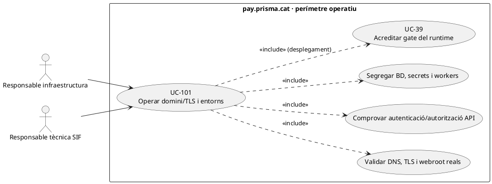
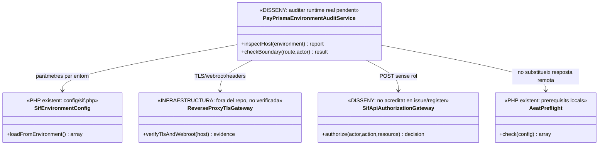

# UC-101 · Operar domini, TLS i separació d'entorns de `pay.prisma.cat`

**Objectiu original:** acreditar DNS/TLS, headers, secrets i separació de test/producció **amb proves diferenciades**, no amb l'existència de fitxers de configuració. **Estat [PARCIAL/BLOQUEJANT].** Aquesta fitxa analitza el codi del repositori; **no s'han consultat el DNS, el certificat TLS servit, la configuració del proxy/FTP ni els secrets reals del domini**, de manera que el desplegament vigent continua pendent de verificació.

## Evidència i perímetre

`sif/config/sif.php` llegeix `SIF_ENV`, DSN/usuaris/passwords de BD, llegat, emissor, clau Redsys i certificat AEAT **des de variables d'entorn**, però té valors per defecte locals (incloent `issuer.nif=G00000000` d'exemple). `sif/public/api/factures/issue.php` i `sif/public/api/payments/register.php` llegeixen JSON i criden serveis de negoci directament; **no contenen un control visible de sessió/rol o d'origen HTTP al mateix fitxer**. La protecció per proxy, ACL/firewall o un servei extern pot existir, però **no s'ha acreditat** al repositori: abans d'obrir el domini s'ha de comprovar el desplegament real.

`go-no-go-preproduction.php` exigeix `SIF_ENV=test/preproduction`; els scripts manuals i d'històric revisats rebutgen `SIF_ENV=production`. `SoapTransport` només accepta l'endpoint AEAT de proves; cap d'aquests fets demostra que la connexió productiva estigui aprovada o el domini configurat correctament.

| Capa | Evidència requerida per entorn |
| --- | --- |
| DNS/TLS | Resolució del FQDN des de xarxes autoritzades, cadena de certificat, nom del host, dates, versió TLS efectiva, renovació i prova de redirecció HTTPS. **No** inferir el resultat actual del nom `pay.prisma.cat` sense consultar DNS/servidor. |
| Proxy i `document root` | Verificar que només `sif/public` (o controladors explícits equivalents) és servible; bloquejar navegació a `config/`, `src/`, `scripts/`, `database/`, dumps, logs, P12, artefactes d'evidència i backups. |
| API | Autenticar i autoritzar cada ordre d'emissió/pagament pel servidor i rol/origen; limitació de peticions, mida JSON, replays, errors sense traces ni secrets. **El PHP actual de dues rutes no prova aquest control.** El callback Redsys segueix autorització especial **per signatura i intenció**, no sessió d'alumne. |
| Separació d'entorns | Host/DNS/rutes, DB, secrets Redsys, certificat AEAT, emissor/config, dades i cron/workers diferenciats. Una clau TPV o DB de prova no es reutilitza per signar notificacions productives. |
| Seguretat del client | Validar cookies/tokens, atributs de sessió, CSRF si s'usen sessions, headers de seguretat aplicables, cookies de domini, CORS i cap token fiscal a URL pública persistent; detalls d'implementació i valors **pendents de la configuració HTTP real**. |
| Observabilitat i deploy | Comprovar log/alertes sense dades personals o secrets, hash del codi/BD/config i backup/rollback UC-38/39/83/85; cap preflight «verd» local substitueix una prova de runtime. |

### Flux específic

1. Inventariar FQDN/hosts, qui administra DNS/TLS, webroot, crons, callbacks bancaris, xarxa/ACL, BDs, magatzem de secrets i vies de desplegament **efectivament actives**.
2. Fer prova tècnica en **test/preproducció**: TLS i headers reals, GET de ruta pública, denegació explícita de `config/sif.php`/P12/SQL i POST a emissió/pagament **sense credencials** sense cap efecte fiscal. El resultat esperat és denegació segura, no document o moviment creat.
3. Verificar a part un callback Redsys vàlid/invalidat amb clau d'**aquell entorn**, i que no accepta replay/quantia diversa; comparar intenció `DS_ORDER` amb l'import i terminal esperats, sense tractar notificació com a login d'alumne.
4. Executar els gates UC-39/46/83 per artefacte i entorn, incloent prova de backup/restauració i configuració del servidor **fora del repositori**. Si no es disposa d'accés al servidor, marcar la capa corresponent com a **UNKNOWN** i mantenir el bloqueig, no omplir-lo per inferència.
5. Desplegar amb canvi coordinat de workers/callbacks i verificar de nou DNS/TLS, URL efectiva i hashes servits. En rollback, reconciliar operacions reals posteriors al punt de tall abans de reobrir.

**Proves:** host de preproducció apuntant a BD de producció, TLS caducat, `/config/sif.php` exposat, POST anònim d'emissió, callback signat amb clau d'altre entorn, secrets al log, dos workers de versions diferents, endpoint AEAT productiu rebutjat pel transport de proves.

**Pendents:** verificació real de DNS, servidor, configuració de proxy/firewall/TLS, middleware d'autorització de cada API, separació completa d'entorns i prova d'acceptació de l'entorn de destí. No s'ha executat cap comprovació de xarxa productiva en aquesta fitxa.

## UML de casos d'ús



## UML de classes — configuració PHP vs host no verificat



## UML de seqüència — API exposada sense comprovació de rol al fitxer PHP

```mermaid
sequenceDiagram
actor I as Responsable infraestructura
participant A as PayPrismaEnvironmentAuditService [DISSENY]
participant N as ReverseProxyTlsGateway [INFRA no verificada]
participant C as config/sif.php [PHP]
participant G as SifApiAuthorizationGateway [DISSENY]
participant P as public/api/factures/issue.php [PHP]
I->>A: Auditar entorn/host abans de posar en servei
A->>N: Comprovar DNS/TLS, webroot i rutes privades
N-->>A: Prova real o UNKNOWN
A->>C: Llegir referències d'entorn i verificar segregació
A->>G: Provar ordre fiscal sense sessió/rol
alt Auth no acreditada al perímetre real
 G-->>A: UNKNOWN o fallada
 A-->>I: Bloqueig de desplegament; no cridar InvoiceService
else Auth real impedeix petició anònima
 G-->>A: DENIED amb evidència
 A->>P: Provar només petició autoritzada de preproducció
 P-->>A: Resultat de prova i correlació
 A-->>I: Gate encara subjecte a UC-39/83
end
Note over A,P: No s'han inspeccionat DNS/TLS ni configuració de servidor productiu.
```

## Traçabilitat

[UC-101 original](../06-fitxes-funcionals/uc-101.md) · [UC-38 secrets](uc-038-configurar-sif-certificat.md) · [UC-39 gate](uc-039-proves-gate-go-no-go.md) · [UC-64 runtime](uc-064-reconciliar-candidata-codi-actual.md) · [UC-83 versió](uc-083-registrar-activar-versio-declaracio.md) · [Configuració SIF](../../sif/config/sif.php) · [API emissió](../../sif/public/api/factures/issue.php) · [API registre cobrament](../../sif/public/api/payments/register.php) · [Script gate preproducció](../../sif/scripts/go-no-go-preproduction.php).
