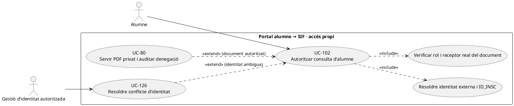
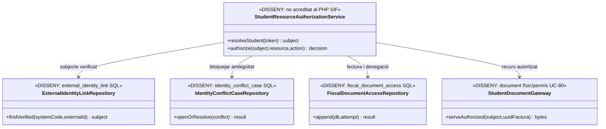

# UC-102 · Autoritzar l'accés de l'alumne sense rol d'intranet

**Objectiu original:** identitat externa o token segur permet **només recursos propis**, amb denegacions auditables. **Estat [DISSENY/BLOQUEJANT].** L'alumne **no** hereta permisos de gestió, tutor, responsable de grup o emissor perquè comparteix `IDPAG`, email o un enllaç de pagament.

## Evidència del model i límits del PHP

La migració `2026_09_16_000006_add_cross_system_control_tables.sql` defineix `external_identity_link` amb `SUBJECT_KEY`, `SYSTEM_CODE`, `EXTERNAL_ID/IDENTITY_TYPE`, hashes de correu/document, `STATUS/VERIFIED_AT/VERIFIED_BY`, vigència i `SNAPSHOT_HASH`. `identity_conflict_case` defineix expedients quan diversos identificadors es contradiuen. **No s'ha acreditat** un writer d'aquestes taules ni un controlador PHP SIF que autentiqui, expedeixi/revoqui tokens d'alumne i transformi de manera segura la identitat verificada en permís sobre recursos.

`fact_rels` relaciona factura i origen, amb `VISIBLE_ALUMNE`; el builder de grup configura `VISIBLE_ALUMNE=0` per participants. `DocumentRepository::registerDocument()` registra **metadades**, no serveix el PDF físic. `fiscal_document_access` té `TOKEN_FINGERPRINT`, actor, rol, acció, resultat i `UUID_FACTURA`, però **la presència d'aquest camp no crea un sistema de tokens ni prova que el servidor revalidi cada descàrrega**.

| Sol·licitud | Autorització específica |
| --- | --- |
| Veure dades/inscripció pròpies | Validar identitat externa ↔ subjecte canònic ↔ `ID_INSC` concret i estat de l'enllaç; no confiar en `ID_INSC` subministrat pel client ni en un email compartit. |
| Veure factura o PDF | Validar `UUID_FACTURA`, receptor/pagador/representant, `fact_rels` i política `VISIBLE_ALUMNE`, amb comprovació del document físic i hash UC-80. Participar en un grup **no** autoritza a veure la factura de l'empresa/responsable. |
| Enllaç de pagament | Una URL/token per pagar una operació permet **únicament** l'acció monetària limitada corresponent, no consultar factures alienes, canviar el titular, demanar refund o actuar com a gestor. |
| Token d'accés | Proposta: secret opac, identificador de subjecte, recurs/acció, expiració, revocació i fingerprint/hash de servidor; no guardar token en clar al log ni reutilitzar secrets d'admin o de Redsys. El protocol complet encara és **pendent**. |
| Canvi de correu, duplicat i baixa | Revalidar `external_identity_link` i expedient UC-126; revocar/enfortir accés quan el subjecte és ambigu. Canviar email no transfereix propietat d'una factura ni d'un ingrés real. |
| Auditoria | Cada lectura/denegació deixa `REQUEST_ID`, subjecte, document, rol/canal i resultat a `fiscal_document_access` mitjançant writer **pendent**. Una resposta HTTP 200 no demostra que la persona hagi llegit realment el document. |

### Flux específic

1. Alumne inicia sessió amb proveïdor extern verificat o presenta token de consulta d'abast concret. El servidor **pendent** comprova emissor del token, vigència, revocació i vincle `external_identity_link` actiu; un conflicte UC-126 bloqueja només recursos lligats a identitat incerta.
2. Resoldre `SUBJECT_KEY`, inscripcions pròpies i paper respecte de cada factura. **Mai** autoritzar només per `IDPAG`, coincidència de NIF/email o per haver pagat un curs en benefici d'un tercer.
3. Quan hi ha factura autoritzada, UC-80 comprova `VISIBLE_ALUMNE`, propietari/receptor, document privat físic i hash; registrar tant intent denegat com consulta legítima. Per un grup/empresa, donar resposta sense dades de tercers ni pistes d'identificació.
4. Caducitat, revocació, canvi de receptor o nova resolució d'identitat han d'impedir futures descàrregues sense alterar PDF, factura, `CHARGE` ni drets d'altres inscrits.
5. La consulta no pot disparar un nou `InvoiceService::issueInvoice()`, `PaymentService::registerPayment()` ni canviar l'accés Moodle; aquestes ordres tenen autoritzacions i efectes independents.

**Proves:** parella amb email compartit, pagador d'una altra persona, factura de grup `VISIBLE_ALUMNE=0`, token de pagament reutilitzat per llegir PDF, URL d'altre `ID_INSC`, alumne que fa POST a API d'admin, canvi d'identitat externa, token revocat i factura amb metadada PDF però fitxer absent.

**Pendents:** proveïdor d'identitat de l'alumne, emissor de tokens i revocació, model/worker d'enllaços canònics, controlador servidor per recurs, integració UC-80 de storage/document i tests de permís denegat.

## UML de casos d'ús



## UML de classes



## UML de seqüència — participant de grup intenta veure factura d'empresa

```mermaid
sequenceDiagram
actor A as Alumne
participant S as StudentResourceAuthorizationService [DISSENY]
participant I as external_identity_link [SQL definit]
participant R as fact_rels + factura [SIF]
participant D as FiscalDocumentAccessRepository [SQL, writer pendent]
participant G as StudentDocumentGateway UC-80 [DISSENY]
A->>S: Demanar PDF de factura F amb token
S->>I: Verificar identitat externa i subjecte canònic
I-->>S: SUBJECT_KEY i enllaç actiu
S->>R: Comprovar ID_INSC, receptor/pagador i VISIBLE_ALUMNE
alt Factura d'empresa amb VISIBLE_ALUMNE=0
 R-->>S: L'alumne no és receptor/representant autoritzat
 S->>D: Registrar intent denegat [pendent]
 S-->>A: Accés denegat, sense dades de l'empresa
else Recurs propi autoritzat
 R-->>S: Accés document concret aprovat
 S->>G: Verificar PDF real i hash; servir bytes
 S->>D: Registrar resultat de consulta [pendent]
 S-->>A: Document propi, cap acció fiscal nova
end
Note over S,G: Les taules d'identitat i d'accés no implementen per si soles un token segur.
```

## Traçabilitat

[UC-102 original](../06-fitxes-funcionals/uc-102.md) · [UC-80 document](uc-080-servir-registrar-acces-document-fiscal.md) · [UC-126 identitat](uc-126-identitat-contacte-conflicte-sistemes.md) · [UC-44 relacions](uc-044-consultar-mantenir-fact-rels-origen-legacy.md) · [UC-99 tutor](uc-099-limitar-intranet-tutors-no-fiscal.md) · [Migració identitat](../../sif/database/migrations/2026_09_16_000006_add_cross_system_control_tables.sql) · [Migració accés documental](../../sif/database/migrations/2026_09_15_000003_add_functional_audit_control.sql) · [DocumentRepository](../../sif/src/Repository/DocumentRepository.php).
