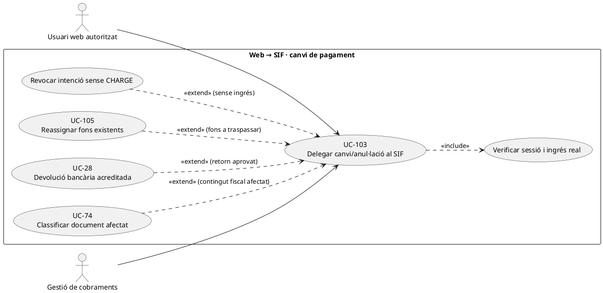
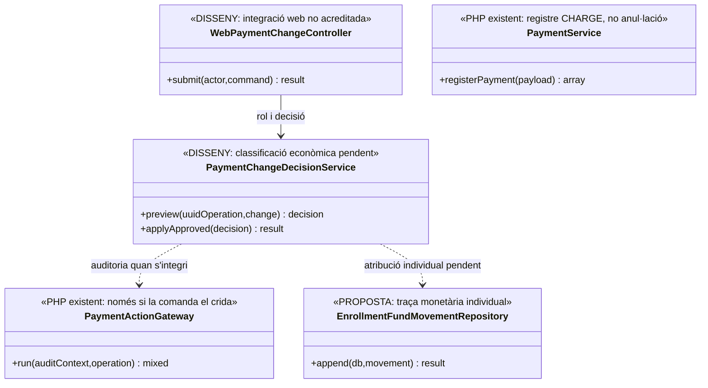
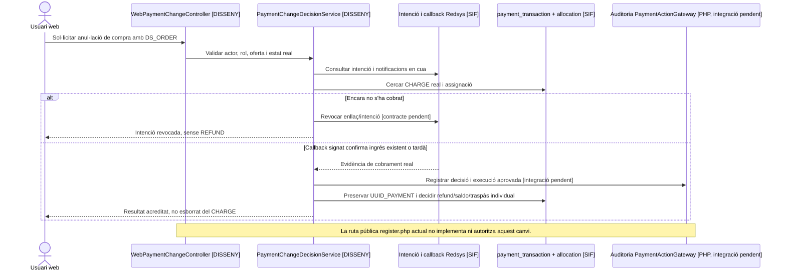

# UC-103 · Delegar l'anul·lació o el canvi d'un pagament web al SIF

**Objectiu original:** la web **no actualitza directament** el pagament; envia una comanda a `pay.prisma.cat`, que registra intent, decisió i resultat. **Estat [DISSENY/BLOQUEJANT].** Cal distingir tres fets: revocar un enllaç/intenció **sense ingrés**, rectificar una assignació de **diners reals ja cobrats** i executar una **devolució bancària**. No són variants d'un `UPDATE PAGAMENT=0`.

## Evidència i límits del PHP consultat

`sif/public/api/payments/register.php` accepta un payload JSON i instancia `PaymentService` directament; aquesta ruta **no és una API de cancel·lació/reassignació**, ni el fragment revisat acredita autenticació de sessió/rol de la web. `ManualPaymentService` registra cobrament `CHARGE` sobre factura existent; no anul·la transaccions. `PaymentActionGateway::run()` registra `REQUESTED` i event terminal per les comandes **que realment el criden**, però el registre directe de pagament citat **no passa pel gateway**. `RedsysCallbackService` ja pot haver rebut i encolat una notificació validada: desactivar l'enllaç visual **no elimina** un ingrés bancari real ni el callback que arriba tard.

`PaymentService::registerPayment()` reutilitza el pagament existent quan coincideix `idempotency_key` sense comparar tot el nou payload, de manera que reutilitzar una clau no demostra equivalència de canvi/quantia. `payment_allocation` atribueix import a factura, no a l'inscrit. **No s'ha acreditat** un `WebPaymentChangeService` que faci comprovació autoritzada de titularitat, deixi traça quantitativa de l'assignació original i coordini les reparacions.

## Fitxa específica

| Petició web | Resposta correcta |
| --- | --- |
| Cancel·lar abans de pagar | Revocar/caducar `payment_link` o intenció segons UC-33/115, impedir nous intents vàlids quan la política ho estableixi, mantenir traça de l'oferta; **cap `REFUND`** si no hi ha ingrés. |
| Anul·lar després de pagar | Identificar `UUID_PAYMENT`, pagador, factura, `DS_ORDER`, evidència bancària i import atribuït; decidir entre devolució real UC-28, saldo UC-29, canvi de curs UC-71/105 o cap canvi. El `CHARGE` original **no esborra**. |
| Canviar import pendent | Si s'ha creat intenció TPV, no reutilitzar `DS_ORDER` amb snapshot/import diferent; construir nova oferta/intenció i registrar caducitat de l'anterior. La factura existent pot requerir UC-74 si el servei/preu fiscal real canvia. |
| Canviar assignació | Traspassar **el tram real d'origen** entre factures/inscripcions amb UUID i quanties comprovades, sense crear un segon `CHARGE`. El ledger `enrollment_fund_movement` és proposta pendent, no prova d'implementació. |
| Grup/tercers | Alumne participant no pot demanar per defecte el refund al seu compte si la factura i el pagament són d'una empresa/responsable. Verificar pagador legítim i autorització. |
| Auditoria | Comanda web autenticada, `REQUEST_ID/CORRELATION_ID`, actor/rol, motiu, abans/després, clau idempotent i event terminal. **No afirmar** que totes les rutes passen per `PaymentActionGateway` actualment. |

### Flux objectiu

1. La web recull sol·licitud autenticada i **no executa escriptura fiscal ni de pagament local**; el servidor SIF pendent valida subjecte/rol, `UUID_OPERATION/UUID_FACTURA/UUID_PAYMENT/DS_ORDER` i versions dels estats.
2. Consultar banc/Redsys, factura, assignacions i intenció original: classificar explícitament `NO_PAYMENT`, ingrés confirmat, parcial, refund anterior o resultat incert. No donar per inexistent un cobrament per falta de sync a Prisma.
3. Previsualitzar decisió fiscal, econòmica i acadèmica per cadascuna de les persones afectades. Revocar enllaç sense ingrés, reassignar fons existents, retornar al pagador legítim o proposar canvi d'oferta/rectificativa segons la situació.
4. Aprovar comanda idempotent amb actor i motiu; una referència repetida amb **payload contradictori** és conflicte, no operació nova ni reús automàtic. El gateway d'events és una peça existent, però l'adaptador/autorització del canal i el ledger individual són pendents.
5. Executar un únic efecte econòmic extern si s'escau, conservar `UUID_PAYMENT` original i verificar resposta real del banc/TPV. Registrar estats parcials del document, fons i accés acadèmic.
6. Respondre a la web només amb el resultat acreditat. Una fallada de sync o avís no ha de repetir devolució, rectificativa o `CHARGE`.

**Proves:** cancel·lació amb `DS_ORDER` sense cobrament; callback tardà després de revocació; import modificat amb intenció vella; refund de factura d'empresa demanat per alumne; canvi de curs parcial en pack; dos operadors simultanis; retry mateixa clau amb import nou; consulta directa d'API sense sessió.

## UML de casos d'ús

## UML de classes

## UML de seqüència — intent revocat però cobrament arriba tard

## Traçabilitat

[UC-103 original](../06-fitxes-funcionals/uc-103.md) · [UC-33 revocar URL original](../06-fitxes-funcionals/uc-033.md) · [UC-105 reassignació](uc-105-reassignar-repartir-pagament.md) · [UC-28 refund](uc-028-registrar-devolucio.md) · [UC-74 fiscal](uc-074-classificar-correccio-fiscal.md) · [RedsysCallbackService](../../sif/src/Service/RedsysCallbackService.php) · [PaymentActionGateway](../../sif/src/Service/PaymentActionGateway.php) · [PaymentService](../../sif/src/Service/PaymentService.php) · [Ruta registre actual](../../sif/public/api/payments/register.php).
