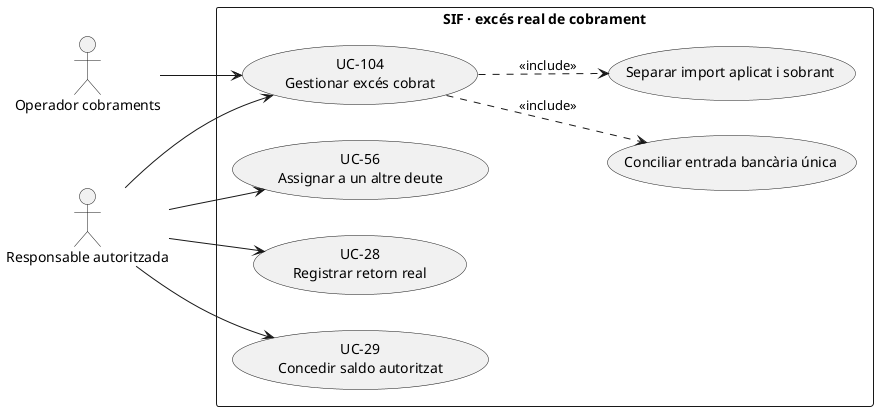
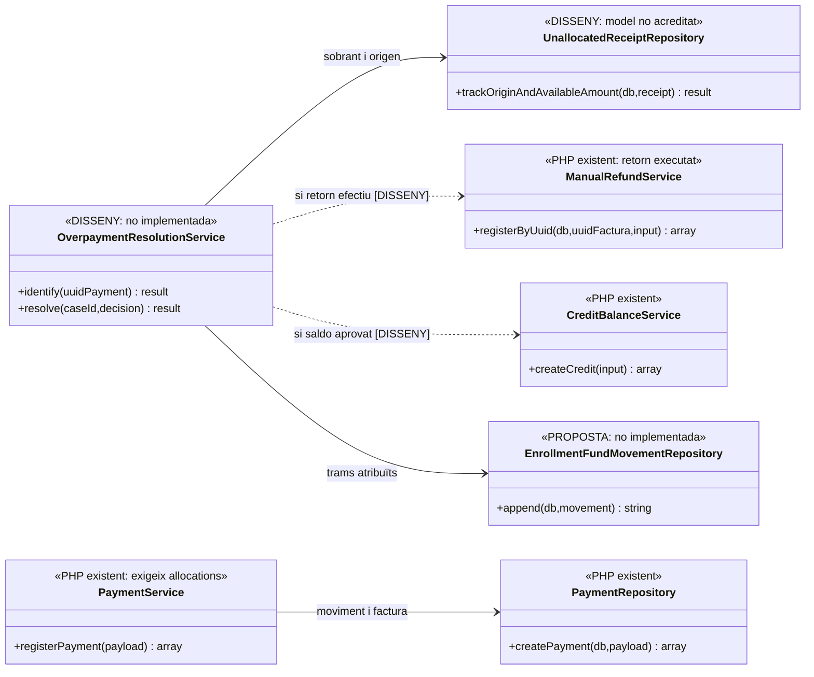

# UC-104 · Gestionar un excés de cobrament sense atribució fictícia

**Objectiu canònic:** un excés real queda **sense assignar** o passa a devolució/saldo segons una decisió autoritzada; no es força l'estat `PAID` d'una factura ni es modifica l'import fiscal per absorbir-lo. **Estat:** `PaymentService` i `PaymentRepository` creen moviments amb assignacions a factura; `ManualRefundService` registra un `REFUND` real i `CreditBalanceService` crea/aplica un crèdit. **No s'ha acreditat** un coordinador que detecti un excés i conservi un import **sense assignació a factura** en el servei actual. `PaymentPayloadValidator` exigeix almenys una assignació; `PaymentRepository::createPayment()` inserta totes les assignacions rebudes.

## 1. Fitxa de cas d'ús

| Dada | Contracte funcional i evidència |
| --- | --- |
| Actors | Operador de cobraments i responsable autoritzat per resoldre titularitat/retorn; pagador original quan sigui necessari. L'alumne inscrit pot no ser la persona que ha pagat. |
| Entrada | Referència bancària/TPV, `UUID_PAYMENT` real si existeix, import ingressat, factura/es, receptor i pagador, total ja assignat, retorns i fons atribuïts a cada `ID_INSC`. |
| Classificació | Diferenciar: import ingressat superior a deute; pagament duplicat **real**; notificació TPV repetida **sense segon ingrés**; transferència d'empresa per diverses factures; diners encara no identificats. No equiparar cap d'aquests casos. |
| Saldo objectiu | `excesDisponible = importExternReal - importJaAssignat - retornExternReal - altresAplicacionsJustificades`, amb tipus de moviment/signatura correcta, decimals, moneda i locks. És fórmula de **disseny**, no càlcul executable de `PaymentService`. |
| Persistència existent | `payment_transaction` conserva els cobraments/reemborsaments reals; `payment_allocation` exigeix factura. `credit_balance` emmagatzema saldo concedit i `payment_action_event` pot auditar petició/resultat quan l'adaptador usa el gateway. |
| Mancança precisa | No s'ha identificat una ruta completa d'`UNALLOCATED_EXTERNAL_RECEIPT` sense factura al PHP consultat. **No** crear una assignació fictícia de l'excés només per satisfer la validació d'`allocations`. |
| Efecte fiscal | Un pagament excessiu no implica automàticament canviar `factura.TOTAL` ni emetre factura/rectificativa; les conseqüències d'un servei/preu realment diferent requereixen UC-74. |
| Efecte per inscripció | Només la part realment aplicada al servei es registra com `EXTERNAL → ID_INSC`; un sobrant encara no atribuït **no pertany per defecte** a cap inscripció del grup. |

### 1.1. Flux objectiu

1. UC-25/56 detecta que hi ha un ingrés extern acreditat superior a l'obligació identificada, i comprova referència/ordre i si `UUID_PAYMENT` ja existeix. Un callback duplicat de la mateixa operació **no** constitueix excés de caixa.
2. El coordinador pendent identifica pagador real, factura/es, inscripcions i import ja atribuït. Per a una factura única de 100 € i un ingrés real de 120 €, separa **100 € aplicables** i **20 € pendents de decisió**, no canvia `factura.TOTAL` a 120 €.
3. Desa un expedient amb import i origen del sobrant, estat `PENDING_DECISION` conceptual, actor i correlació; fins a implementar un model d'ingressos no assignats, la ruta actual de `PaymentService` **no cobreix aquest estat**.
4. La persona autoritzada decideix: assignar a un altre deute acreditat del mateix pagador (UC-56), tramitar retorn **quan s'executa realment** (UC-28), o concedir saldo a titular legitimat (UC-29), amb les implicacions fiscals classificades quan pertoqui.
5. Si s'assigna a una altra factura, es reutilitza `UUID_PAYMENT` i es registra atribució interna per les inscripcions afectades, sense crear un segon `CHARGE`. Si es retorna, `ManualRefundService` és **registre de retorn efectuat**, no ordre automàtica al banc.
6. Si es crea saldo, `CreditBalanceService::createCredit()` pot desar-lo, però el servei **no comprova automàticament** que l'import provingui d'aquest excés concret ni registra per inscripció la sortida: enllaç, identitat del titular i ledger romanen pendents.
7. El cas es tanca només després de conciliar ingrés inicial, trams assignats, saldo o retorn i imports individuals. `ESTAT_COBRAMENT=PAID` de la factura no tanca per si sol un excés extern encara pendent.

### 1.2. Alternatives i proves

| Situació | Control |
| --- | --- |
| Ingrés 120 €, factura 100 € | Aplicar 100 €; 20 € no assignats fins a decisió; un segon `CHARGE` de 20 € és fals. |
| Dues notificacions per una sola operació de 100 € | UC-51/25a: un cobrament i cap excés extern. |
| Empresa ingressa 300 € per tres factures de 100 € | Una entrada real i tres assignacions fiscals; atribucions per inscripció separades quan calgui. |
| Es retorna el sobrant de 20 € | Registrar `REFUND` només després de la sortida efectiva i referenciar ingrés i pagador originals; no tornar l'import a qualsevol alumne del grup. |
| Es concedeix saldo de 20 € | `credit_balance` no substitueix prova del sobrant ni rastre dels fons; l'aplicació futura serà `COMPENSATION`, no nou ingrés. |
| Pagament existent reprocessat amb clau diferent | Comprovar referència bancària real; `PaymentService` només deduplica per clau idempotent, no detecta totes les duplicitats externes. |

**Bloquejant:** persistència i conciliació d'ingressos no assignats, permissos/titularitat, verificació import retornable, idempotència entre canals i registre quantitatiu d'atribucions per inscripció. Cap prova de UC-104 executada.

### 1.3. Excés real, doble notificació i decisió de devolució o saldo — xat i operativa

**Decisió de negoci comunicada.** Quan una persona ingressa **més diners dels que correspon pagar**, PrisMa consulta si vol **devolució** o deixar l'excedent **com a saldo per una altra inscripció**. Aquesta decisió es pren sobre el diner efectivament ingressat que queda disponible: una notificació Redsys repetida amb la mateixa `DS_ORDER` no és un segon pagament ni genera un excés de caixa. Tampoc tota diferència entre `A_PAGAR` i `PAGAMENT` és un excés: en una factura prèvia pot existir deute pendent i, en grups, el pagament pot cobrir més d'una factura legítima.

**Detecció per origen i titular.** Abans de proposar retorn/saldo, cercar `UUID_PAYMENT` i referència bancària/TPV, totes les `payment_allocation`, possibles altres factures del pagador, devolucions reals i titular econòmic. En una transferència d'empresa amb una factura pendent de 100 € i una altra de 20 €, ingressar 120 € **no és excés de 20 €** si la transferència efectivament cobreix totes dues; el mateix import pot ser excés si la segona factura no està relacionada amb el pagador. No atribuir el sobrant a un alumne del grup per defecte.

**Persistència no acreditada del sobrant.** El servei actual `PaymentPayloadValidator` exigeix una o més assignacions a factura i `PaymentRepository::createPayment()` insereix les que rep. Per tant, la fitxa no ha de donar per implementat un import extern confirmat **parcialment sense assignar** ni un origen bancari separat del crèdit concedit. Cal definir la ruta d'ingrés no assignat i enllaçar la posterior decisió UC-28/29/56 amb l'entrada única, sense inventar `UUID_FACTURA` ni augmentar `factura.TOTAL` per quadrar la caixa.

**Moment de sortida o aplicació.** Acceptar una devolució deixa una ordre o decisió **pendent** fins que l'entitat bancària realment retorna diners; UC-28 registra després el `REFUND` únic. Concedir saldo no és un `REFUND` ni un `CHARGE` addicional, i UC-29 ha de conservar l'origen i titular perquè la futura `COMPENSATION` no torni a comptar ingressos. Si queda una fase sense executar, informar-la separadament en comptes de tancar l'expedient quan la factura ja està `PAID`.

### 1.4. Proves addicionals d'excés segons origen (no executades)

| ID | Escenari | Resultat exigible |
| --- | --- | --- |
| EX-01 | Dues notificacions del mateix pagament de 100 € | Un ingrés; cap excés fals ni saldo duplicat. |
| EX-02 | Transferència de 120 € per dues factures legítimes de 100 € i 20 € | Una entrada, dues assignacions; cap excés. |
| EX-03 | Transferència de 120 € per factura única de 100 € | Excedent 20 € sense factura fictícia, decisió pendent i origen traçat. |
| EX-04 | Alumne de grup demana retorn de diners pagats per empresa | Verificar titular econòmic abans de retornar o crear crèdit. |
| EX-05 | Client tria devolució però banc encara no l'ha executat | Cap `REFUND` confirmat; registrar decisió/estat pendent. |
| EX-06 | Client tria saldo i després l'utilitza | Un crèdit d'origen i una aplicació `COMPENSATION`, no segon CHARGE. |

## 2. UML de casos d'ús



## 3. Classes — límit del model de pagaments real



## 4. Seqüència — ingressat 120 €, deguts 100 € (DISSENY)

```mermaid
sequenceDiagram
autonumber
actor Op as Operador
participant S as OverpaymentResolutionService [DISSENY]
participant B as Prova d'ingrés bancari
participant P as PaymentService [PHP]
participant U as UnallocatedReceiptRepository [DISSENY]
participant L as Ledger d'inscripció [PROPOSTA]
participant Refund as ManualRefundService [PHP]
participant Credit as CreditBalanceService [PHP]
Op->>S: Revisar transferència 120 €, factura F de 100 €
S->>B: Verificar entrada única i pagador
B-->>S: Referència i 120 € acreditats
S->>U: Registrar origen extern i pendent 20 € [mètode pendent]
S->>P: Registrar una sola entrada real amb atribució 100 € [model a ampliar]
Note over P,U: La ruta PHP actual no permet reservar 20 € sense assignació fiscal
S->>L: Atribuir 100 € a la inscripció legitimada
alt Decideix retornar 20 € i consta sortida bancària
 Op->>Refund: Registrar REFUND real de 20 € amb origen verificat
 Refund-->>S: UUID_PAYMENT_REFUND
 S->>L: Registrar sortida interna corresponent
else Decideix crear saldo autoritzat de 20 €
 Op->>Credit: createCredit(titular,20 €,origen)
 Credit-->>S: UUID_CREDIT
 S->>L: Enllaçar origen del saldo sense nou CHARGE
else No hi ha decisió
 S-->>Op: Sobrant pendent; factura F intacta
end
Note over S,L: Seqüència conceptual: no executar PaymentService amb total inconsistent 120 €/100 € com si el PHP actual resolgués el sobrant
```

## 5. Traçabilitat

[UC-104 original](../06-fitxes-funcionals/uc-104.md) · [UC-56 assignació](uc-056-cercar-assignar-cobrament.md) · [UC-86 auditoria](uc-086-auditar-accio-pagament.md) · [UC-28 retorn](uc-028-registrar-devolucio.md) · [UC-29 saldo](uc-029-crear-saldo.md) · [PaymentPayloadValidator](../../sif/src/Service/PaymentPayloadValidator.php) · [PaymentRepository](../../sif/src/Repository/PaymentRepository.php) · [CreditBalanceService](../../sif/src/Service/CreditBalanceService.php) · [Revisió transversal de fons](00-revisio-moviments-inscripcions.md).
