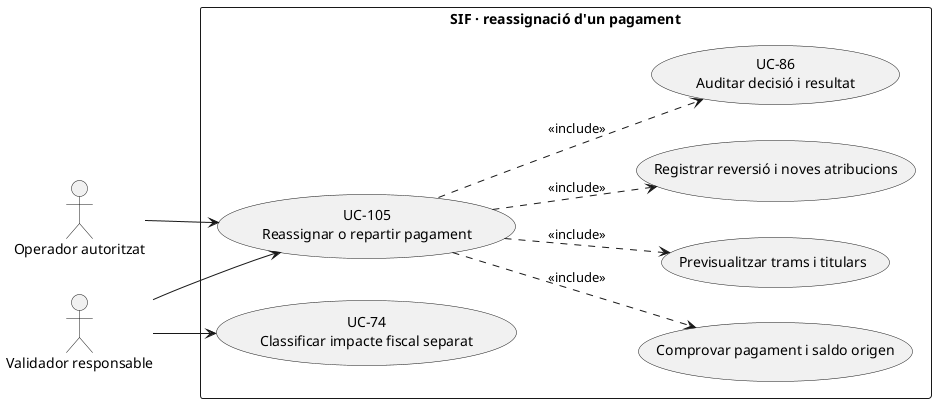
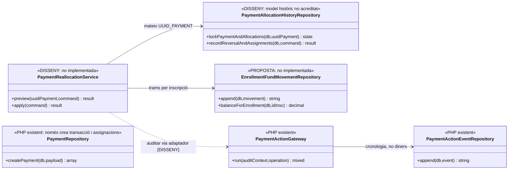
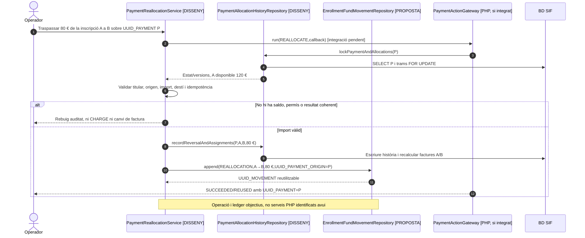
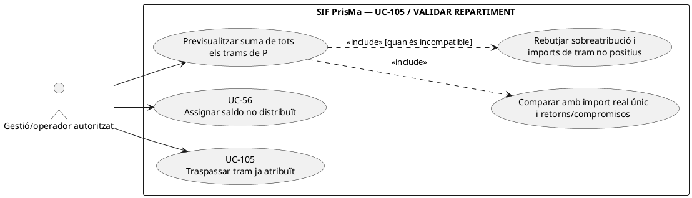
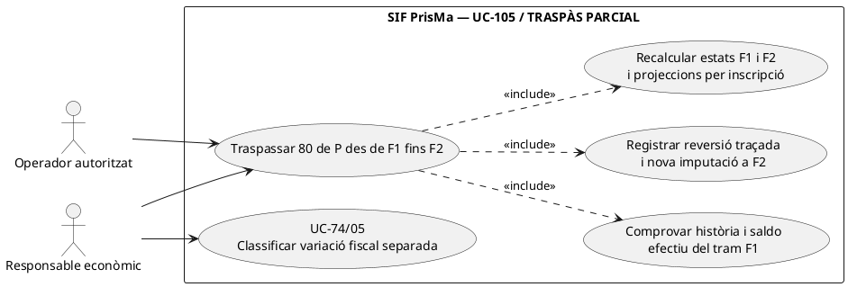
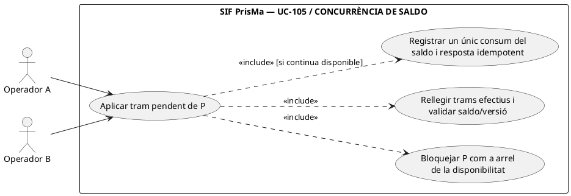

# UC-105 · Reassignar o repartir un pagament conservant la història

**Objectiu canònic:** conservar **assignació anterior, motiu, nova assignació i cronologia append-only** sense editar el moviment bancari original. UC-56 assigna un pagament existent que es troba sense atribució suficient; UC-105 canvia una assignació ja realitzada o divideix l'import entre més d'un destí. La rectificació de la factura, quan correspongui, és un cas fiscal separat.

**Estat verificat:** `payment_transaction` i `payment_allocation` existeixen, i `PaymentRepository::createPayment()` crea un moviment **nou** amb les assignacions del payload. `PaymentActionEventRepository` accepta `REALLOCATE`, `UNALLOCATE` i `SPLIT_ALLOCATION`, però l'acceptació d'aquests codis **no acredita un servei d'assignació**. `payment_allocation` en la migració principal no conté clau idempotent de la partida, estats, UUID d'event ni una relació append-only d'anul·lació. **No s'ha identificat** una implementació segura de `reallocateExistingPayment()` ni del ledger quantitatiu per inscripció.

## 1. Fitxa específica

| Aspecte | Regla funcional |
| --- | --- |
| Actor | Operador autoritzat i validador quan canvia factura, pagador/titular o destinatari; el sistema no permet traspàs de fons d'una empresa a una persona sense decisió legitimada. |
| Identitat | `UUID_PAYMENT` de la **mateixa entrada bancària**, assignació/es d'origen, `UUID_FACTURA` d'origen/destí, `ID_INSC` d'origen/destí quan n'hi ha, import, moneda, actor, motiu, request/correlation ID i versió actual. |
| Tipus | `REALLOCATE` canvia atribució A→B; `SPLIT_ALLOCATION` reparteix una part entre diversos destins; `UNALLOCATE` posa una part pendent de decisió sense convertir-la en cobrament nou. Són etiquetes de **traça** acceptades per `PaymentActionEventRepository`, no mètodes de negoci implementats. |
| Integritat | Suma dels imports assignats d'un cobrament real ≤ import extern disponible, després de retorns i altres sortides. La suma dels canvis interns d'un traspàs és zero a nivell de caixa; cap part d'una atribució anterior no desapareix de la història. |
| Model d'assignació fiscal actual | `payment_allocation` té `UUID_PAYMENT`, `UUID_FACTURA`, `IMPORT_ASSIGNAT`, `TIPUS_ASSIGNACIO`; no guarda `ID_INSC`. La correcció ha de deixar una traça anterior/nova auditable **abans** que es pugui considerar completa. |
| Registre individual necessari | `enrollment_fund_movement` **proposat**, amb una fila per transferència `ID_INSC_A → ID_INSC_B` i import exacte, `UUID_PAYMENT_ORIGIN` de traça i referència a l'event; **no** registrar `CHARGE` per a un traspàs intern. |
| Efecte fiscal | Reassignar diners entre factures **no** canvia els imports fiscals de cap factura ni autoritza a canviar receptor/concepte. Si també canvia el servei o la factura, UC-74 classifica una acció fiscal a part. |

### 1.1. Flux objectiu per trams

1. L'operador consulta `UUID_PAYMENT`, import real i totes les assignacions existents; el sistema mostra el destí de cada tram **amb import**, no només una llista de `fact_rels`.
2. Previsualitza estat actual i resultat: factura A/inscripció A, factura B/inscripció B, quantitat traspassada, import que roman, pagador/titular i efecte sobre deutes. Un pagament de 150 € ja assignat 150 € no es pot assignar novament 150 € a B sense retirar l'atribució a A.
3. El coordinador **pendent** bloqueja pagament, assignacions i saldos d'origen, comprova permisos, disponibilitat, moneda, cap retorn concurrent i versió; exigeix una clau idempotent per **cada tram** si hi ha diversos destins.
4. Escriu un event d'operació amb abans/després, actor i motiu. `PaymentActionGateway` pot donar `REQUESTED` i resultat terminal **només si el canal l'invoca**, però aquesta traça per si sola no conté un ledger per inscripció.
5. La persistència futura conserva els assentaments anteriors i registra la reversió/cessió i les noves assignacions sobre el **mateix `UUID_PAYMENT`**; recalcula l'estat de cobrament de **totes les factures afectades**. No fer `UPDATE payment_transaction.IMPORT` per redistribuir.
6. Per cada canvi d'atribució individual, afegeix una fila al ledger `enrollment_fund_movement` amb origen/destí, import, `UUID_PAYMENT_ORIGIN`, event i clau idempotent. Quan un pagament de grup es reparteix entre N inscrits, és **un** cobrament amb N atribucions, no N cobraments.
7. Si la BD académica llegada no actualitza la vista del participant, mantenir estat de sincronització pendent UC-47/53; **el commit SIF no implica commit automàtic al llegat**.

### 1.2. Escenaris de prova

| Abans → després | Resultat i invariant |
| --- | --- |
| Una entrada real 120 € atribuïda a A; 80 € traspassats a B | A conserva 40 €, B rep 80 €, caixa externa segueix sent **120 €**, cap `CHARGE` nou. |
| Una entrada real 200 € d'empresa atribuïda a dues inscripcions (100/100) | Repartiment individual explícit sense canviar l'única entrada; els drets de devolució segueixen la titularitat real. |
| Assignar 80 € de l'A quan A només disposa de 50 € | Rebuig sense crear saldo negatiu, amb event d'intent/denegació i factura original intacta. |
| Reintent del mateix tram després d'un timeout | Recuperar mateix UUID/partida o conciliar estat abans de reprendre; no repetir una transferència interna. |
| Transferència parcial A→B quan hi ha un REFUND concurrent | Bloquejar/sumar retorn abans de determinar disponibilitat. |
| Canvi de factura però no d'inscripció | Registrar modificació d'imputació fiscal i recalcular deute sense fingir un moviment A→B quan l'atribució individual no ha canviat. |
| Canvi d'inscripció amb factura original ja emesa | Preservar el document fiscal i exigir classificació separada UC-74 quan l'operació comercial ho requereixi. |

**Bloquejants:** model append-only de modificació d'assignacions fiscals, operació idempotent per partida, servei de recalculació de totes les factures afectades, registre per inscripció i prova entre BDs. Ni una fila d'`payment_action_event` ni una consulta SQL simple tanquen UC-105.

### 1.3. Repartiments del llegat, canvi de curs i transferència multifactura

**Com es repartia al llegat.** Els procediments de «Passar pagaments» identifiquen vies diferents per inscripció (`I`), pack (`P`), grup (`G`) o regal (`R`), i mètodes que recorren els membres de grup per actualitzar `PAGAMENT`, `DATA PAG` i `FRACCIO`. Aquests UPDATEs poden repartir un **únic ingrés** entre diversos inscrits, però no constitueixen `payment_allocation` SIF ni garanteixen que s'hagin conservat tots els imports individuals. El nou circuit ha de recuperar els imports d'origen i destí **per `ID_INSC`**, sense recrear N `CHARGE` a partir de N files de matrícula.

**Transferència multifactura i prepagament.** Una escola pot fer una sola transferència per diverses factures de participants/cursos, i també pot haver-hi una factura emesa abans de cobrar. El pagament s'identifica per la seva referència/UUID extern únic, mentre que les assignacions són les quantitats per **factura fiscal concreta**. Per reassignar una transferència ja registrada d'A cap a B, conservar les assignacions d'A com a història i enllaçar la nova imputació al **mateix `UUID_PAYMENT`**; la sortida de caixa neta és zero. `FACTURA_RELACIONADA` pot agrupar documents A/R i no basta per triar els destins.

**Canvi A→B→C després de pagar.** Si els diners atribuïts a una inscripció passen a una altra arran d'un canvi de curs, el primer traspàs i la possible reversió s'han de correlacionar amb l'event original. Una devolució real posterior redueix el fons intern disponible i no pot coexistir amb una atribució íntegra del mateix import a C. Una variació de servei/concepte/import pot requerir **documents fiscals separats** UC-74/05, però traspassar diners no edita automàticament ni l'original A ni els seus correctors.

**Límit precís del PHP.** `PaymentRepository::createPayment()` crea `payment_transaction` amb totes les assignacions de la petició dins del registre d'un moviment nou; no és una API per reassignar una partida d'un `UUID_PAYMENT` ja existent. La disponibilitat d'etiquetes d'event `REALLOCATE`, `UNALLOCATE` o `SPLIT_ALLOCATION` tampoc acredita una reversió append-only implementada. La ruta de reassignació continua **disseny/bloquejant**, amb necessitat de bloquejos, identificació idempotent per tram, traça anterior/nova i recalculació d'estat de **totes** les factures afectades.

### 1.4. Proves de reassignació de diners ja cobrats (no executades)

| ID | Escenari | Resultat exigible |
| --- | --- | --- |
| RA-01 | Una transferència real cobreix dues factures d'empresa | Un UUID_PAYMENT, dues imputacions per import i receptor autoritzat. |
| RA-02 | Grup amb tres inscripcions i un únic pagament | Tres atribucions internes traçables i una sola entrada de caixa. |
| RA-03 | Canvi de curs A→B→C després de pagar | Trams i reversions correlacionats; no duplicar import a B i C. |
| RA-04 | Ja s'ha retornat part del pagament abans del traspàs | Comprovar disponibilitat neta i bloquejar sobreatribució. |
| RA-05 | `FACTURA_RELACIONADA` agrupa factura A i rectificativa R | Identificar `UUID_FACTURA` de cada imputació, no reassignar per l'agrupador sol. |
| RA-06 | Intent de reassignació amb autorització d'un participant, pagador empresa | Validar titularitat i permisos; no traspassar fons de tercer a l'alumne per defecte. |
| RA-07 | Reintent d'una mateixa transferència interna | Recuperar event/partides anteriors i saldo actual, cap segon traspàs. |

## 2. UML de casos d'ús



## 3. Classes — infraestructura present, reassignació no implementada



## 4. Seqüència — traspàs de 80 € A→B (DISSENY)



### 4.1. Acció independent: rebutjar una proposta de repartiment que excedeix l'ingrés únic — PHP actual no aplica l'invariant

**Actor/disparador:** un operador proposa repartir P/100 entre F1/80 i F2/80, o moure 80 de F1 a F2 sense retirar el tram antic. **Precondició objectiu:** P és un `CHARGE` real de 100 acreditat externament; tota assignació té import estrictament positiu, i la suma efectiva no pot superar la base econòmica disponible. **Postcondició:** `CONFLICT` de sobreatribució abans de cap INSERT, sense canviar la factura fiscal ni generar un segon ingrés. Per a diners ja assignats, aplicar la reversió traçada sobre F1 i la nova imputació a F2 en **una transacció d'història**; cap `UPDATE` silenciós dels trams previs.

**Frontera de codi:** el camí genèric `PaymentPayloadValidator` **no exigeix** `amount > 0`, `allocation.amount > 0` ni suma d'assignacions `<= amount`. `PaymentRepository::createPayment()` crea un `CHARGE` i insereix totes les `payment_allocation` abans de recalcular cada factura. La base SQL `payment_allocation` no imposa la suma ni positivitat, i `PaymentStatusCalculator` calcula per **factura** a partir dels trams. Un moviment nominal P/100 amb assignacions 80+80 deixa 160 atribuïts sense que existeixi un segon `CHARGE`; el fet que F1/F2 puguin sortir `PARTIAL` o `PAID` segons els seus totals **no valida** que l'ingrés agregat sigui de 160. La reassignació UC-105 **no és** una nova crida a `registerPayment()` amb una clau diferent: això afegiria una entrada bancària fictícia.



```mermaid
sequenceDiagram
autonumber
actor G as Gestió
participant V as PaymentAllocationInvariantGuard [DISSENY]
participant T as payment_transaction [LECTURA]
participant A as payment_allocation [LECTURA]
participant H as PaymentAllocationHistoryRepository [DISSENY]
G->>V: preview(P, assignar F2/80)
V->>T: Consultar P, CHARGE/100 i prova externa
V->>A: SUM trams: F1/80 + F2/80 ja previstos o existents
alt P/100 i proposta suma 160
 A-->>V: 160 > 100
 V-->>G: CONFLICT abans de registrar ni afirmar PAID a F2
else P/100, F1/100 i es vol moure 80 a F2
 A-->>V: F1/100 ja atribuïts; saldo lliure 0
 V-->>G: No fer INSERT F2/80 directe; proposar reversió traçada F1/-80 + F2/+80 UC-105
 G->>H: Sol·licitar traspàs atòmic idempotent [PENDENT]
 H-->>G: Només després de validar titular, motiu, factura i versió
else P/100, F1/80 i F2/20 proposats
 A-->>V: 100 íntegres amb imports positius
 V-->>G: Proposta compatible; encara cal validar titular i origen, no és confirmació automàtica
end
Note over V,H: Cap d'aquests guards o història de reversió existeix al PaymentRepository/PaymentPayloadValidator examinats.
```

### 4.2. Acció independent: transferir parcialment un tram existent amb reversió i nova imputació traçades — DISSENY

**Actor/disparador:** pagament extern P/120 atribuït a F1; gestió aprova traspassar-ne 80 a F2 mantenint 40 a F1. **Precondicions:** prova del mateix moviment, titular/cobertura de F1 i F2, absència de trams ja retornats/compromesos, permisos i versió actual. **Postcondició:** saldo econòmic de P segueix sent 120; atribució efectiva F1/40 i F2/80 amb cronologia que expliqui F1/120 → F1/40 + F2/80; estats de cobrament de **totes dues factures recalculats**, sense nou `payment_transaction` i sense alterar les factures fiscals originals. Si hi ha canvi comercial que exigeixi rectificació, l'acció fiscal UC-74/05 continua separada.

**Precisió del model:** `payment_allocation` actual només té `IMPORT_ASSIGNAT` i `TIPUS_ASSIGNACIO`, no un vincle a l'assignació compensada, una `effective_version` o `reversed_by_event`. **No** n'hi ha prou amb inserir F1/-80 amb `TIPUS_ASSIGNACIO` normal: el lector de `PaymentRepository::refreshInvoicePaymentStatus()` simplement **SUMA totes les files** d'un tipus de moviment, sense comprendre semàntica de reversió. Encara que una suma signada aritmèticament donés 40, el model actual no demostraria que F1/-80 reverteix exactament el tram F1/120 i no és una atribució negativa injustificada. Cal model append-only amb relació de reversió, validesa efectiva i saldo per inscripció, que no trenqui les consultes d'estat existents.



```mermaid
sequenceDiagram
autonumber
actor O as Gestió
participant S as PaymentReallocationService [DISSENY]
participant R as PaymentAllocationHistoryRepository [DISSENY]
participant E as EnrollmentFundMovementRepository [PROPOSTA]
participant F as Factures i relacions [LECTURA/ESCRIPTURA controlada]
participant DB as BD SIF
O->>S: move(P,F1,F2,80,requestId)
S->>R: BEGIN i lock P, trams efectius, versions, retorns i ordres concurrents
R->>DB: SELECT FOR UPDATE i lectura història
R-->>S: P/120 íntegre, F1/120 disponible, F2/0
S->>F: Validar titular/receptor, import, factura i dret a traspassar
alt Mateix requestId+mateix contingut ja aplicat
 S-->>O: REUSED del resultat anterior; cap nou assentament
else F1 no disposa de 80 o titular/destí incompatible
 S-->>O: CONFLICT i ROLLBACK; cap escriptura
else Traspàs autoritzat
 S->>R: appendReversal(F1,80,referència a tram original,event)
 S->>R: appendEffectiveAllocation(F2,80,mateix P,event)
 R->>DB: Escriure historial + actualitzar projecció efectiva F1/40,F2/80
 S->>E: append atribució per inscripció i vincle al mateix P
 E-->>S: Moviment intern idempotent, no CHARGE
 S->>F: Recalcular ESTAT_COBRAMENT de F1 i F2 amb projecció efectiva
 R->>DB: COMMIT d'història i estat fiscal/econòmic SIF
 S-->>O: UUID_PAYMENT=P, F1/40 + F2/80, requestId reconegut
end
Note over S,DB: Classes, model de reversió i projecció efectiva són DISSENY; no escriure directament imports negatius a l'esquema actual com si ja interpretés l'historial.
```

### 4.3. Acció independent: impedir una doble atribució concurrent del mateix saldo — DISSENY

**Actor/disparador:** dos operadors veuen el mateix P/100 amb F1/80 i saldo aparent de 20, i intenten simultàniament assignar F2/20 i F3/20. **Precondició objectiu:** serialitzar per `UUID_PAYMENT` i revalidar import nominal, suma efectiva actual, retorns i titular després de prendre el bloqueig. **Postcondició:** com a màxim un dels dos trams totals de 20 consumeix la part pendent; l'altre veu saldo zero i rep rebuig/recuperació segons la seva clau. Si els dos intents porten **el mateix requestId però destins diferents**, respondre `CONFLICT`, no reutilitzar el primer resultat com si s'hagués aplicat al segon. Si porten dos requestId diferents però mateix import, no deduplicar pel sol import: comprovar si són dos destins legítims amb saldo suficient.



```mermaid
sequenceDiagram
autonumber
actor A as Operador A
actor B as Operador B
participant S as ExistingPaymentAllocationService [DISSENY]
participant DB as payment_transaction(P) + trams/history
A->>S: allocate(P,F2,20,keyA)
B->>S: allocate(P,F3,20,keyB)
S->>DB: BEGIN A; lock fila payment_transaction de P FOR UPDATE
DB-->>S: A veu import 100; assignat 80; disponible 20
S->>DB: BEGIN B; espera el mateix lock P
S->>DB: A INSERT tram F2/20 + història + COMMIT
DB-->>S: B obté lock P després de COMMIT A
S->>DB: B rellegeix suma efectiva P=100 i saldo 0
S-->>B: CONFLICT, cap INSERT F3 i cap CHARGE nou
S-->>A: SUCCEEDED, mateix UUID_PAYMENT P
Note over S,DB: Es representen dues execucions separades d'un servei dissenyat; PaymentService actual no implementa allocateExistingPayment ni aquesta protecció.
```

| Prova pendent | Escenari | Resultat exigible |
| --- | --- | --- |
| RA-08 | `CHARGE` de 100 amb trams 80+80 al mateix payload | Detectar sobreatribució 160/100 abans de desar; `PaymentPayloadValidator` actual no comprova la suma. |
| RA-09 | Reassignar 80 de P/120 atribuït íntegrament a F1 cap a F2 | Mateix P, projecció efectiva F1/40,F2/80, historial amb reversió identificada i recalculació de totes dues factures. |
| RA-10 | Dues comandes concurrents pretenen consumir els mateixos 20 lliures de P | Només una aplicació efectiva; l'altra rep conflicte després de rellegir sota lock. |
| RA-11 | Una comanda de reassignació repeteix requestId però canvia destí F2→F3 | Rebuig per payload diferent, no reutilització silenciosa d'un altre destí. |
| RA-12 | Intent de registrar «reversió» com a assignació normal de -80 a F1 | Prohibir ús de trams negatius com a drecera de l'esquema actual; modelar història i projecció efectiva explícitament. |
| RA-13 | Dos pagaments externs de 100 diferents, mateix dia/import però refs externes diferents | No fusionar les dues entrades per criteris comptables; cada fet real manté UUID_PAYMENT propi. |

## 5. Traçabilitat

[UC-105 original](../06-fitxes-funcionals/uc-105.md) · [UC-56 assignar](uc-056-cercar-assignar-cobrament.md) · [UC-104 excés](uc-104-gestionar-exces-cobrament.md) · [UC-86 auditoria](uc-086-auditar-accio-pagament.md) · [UC-74 original](../06-fitxes-funcionals/uc-074.md) · [PaymentRepository](../../sif/src/Repository/PaymentRepository.php) · [PaymentActionGateway](../../sif/src/Service/PaymentActionGateway.php) · [Migració payment_allocation](../../sif/database/migrations/2026_06_02_000001_create_sif_core.sql) · [Model de fons individual](00-revisio-moviments-inscripcions.md).
