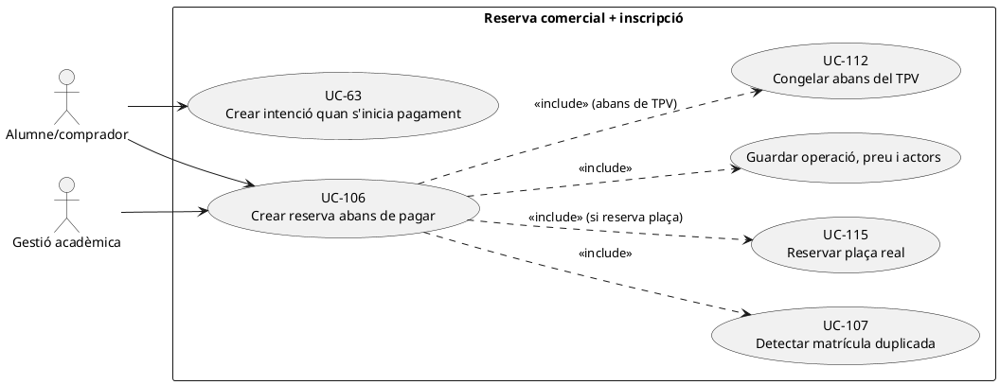
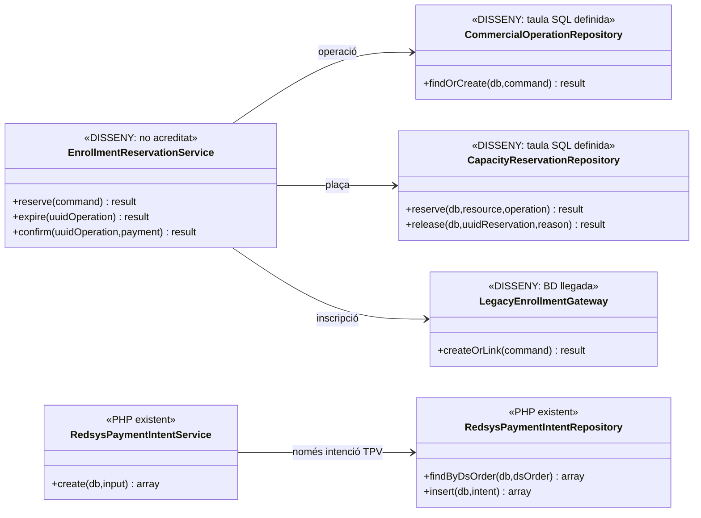

# UC-106 · Crear reserva o inscripció abans del pagament

**Objectiu canònic:** la reserva queda identificada amb **edició, plaça, preu, regla comercial, pagador, receptor fiscal provisional, estat i caducitat**; crear-la encara **no implica factura ni cobrament**. Les regles sobre durada de reserva, moment de consum de plaça i autorització per alliberar/reobrir són **decisions pendents** a la fitxa original.

**Estat contrastat:** el repositori defineix `commercial_operation`, `commercial_operation_party` i `capacity_reservation` a SQL; `RedsysPaymentIntentService::create()` **sí** crea intencions TPV amb snapshot i estat `PENDING`. **No s'ha identificat** un `EnrollmentReservationService` que coordini alta llegada, reserva de capacitat i operació comercial. **Una intenció Redsys existent no és una plaça acadèmica reservada.**

## 1. Fitxa funcional específica

| Element | Contracte |
| --- | --- |
| Actors | Alumne/comprador, ecommerce i operador autoritzat; el pagador i receptor fiscal provisional poden ser diferents de la persona inscrita. |
| Entrada | Persona i identificador d'inscripció si existeix; `PRODUCT_CODE`, `PRODUCT_EDITION`, plaça o `RESOURCE_KEY`, quantitat, preu base, descompte/versionat, import previst, pagador, receptor fiscal provisional, moneda, termini i clau idempotent. |
| Persistència comercial definida | `commercial_operation.UUID_OPERATION`, `IDEMPOTENCY_KEY`, `OPERATION_TYPE`, `PRODUCT_TYPE/CODE/EDITION`, `PRICE_SNAPSHOT_JSON`, `CAPACITY_SNAPSHOT_JSON`, `TAX_SNAPSHOT_JSON`, `CLASSIFICATION`, `STATUS`, `EXPIRES_AT`, `UUID_INTENT/FACTURA/PAYMENT` opcionals. **Són camps SQL, no una escriptura PHP acreditada**. |
| Reserva de plaça definida | `capacity_reservation` preveu `UUID_CAPACITY_RESERVATION`, `UUID_OPERATION`, recurs, quantitat, estat, venciment, `LOCK_VERSION` i clau idempotent; el control de sobreaforament és UC-115 i **no deriva automàticament de la taula**. |
| Intenció TPV **implementada** | `RedsysPaymentIntentService::create()` valida snapshot JSON, `DS_ORDER`, `SOURCE_TYPE` dins `CURS/PACK/GRUP/REGAL/USOC_ALUMNE`, `SOURCE_ID`, import positiu, divisa i terminal; reutilitza una ordre existent si totes les dades rellevants coincideixen. |
| Efectes absents | Una reserva **no** insereix `payment_transaction`, `payment_allocation`, `factura` o `factura_registres` fins a executar els casos de cobrament/emissió corresponents. |
| Límit entre BDs | Reserva/acadèmia llegada i BD fiscal SIF poden requerir comanda/reintents amb correlació; **no** presumir una transacció SQL distribuïda o alta acadèmica confirmada perquè `redsys_payment_intent` tingui fila. |

### 1.1. Flux objectiu

1. El canal identifica persona, curs i edició, producte i sessió, comprova duplicat UC-107, aforament UC-115 i la política comercial vigent. Una relació amb el llegat no prova reserva de capacitat.
2. Crea/reutilitza una **operació de reserva idempotent** i desa snapshot de preu, places, pagador/receptor provisional, regla fiscal preliminar i caducitat acordada; els writers de `commercial_operation`/`capacity_reservation` continuen pendents.
3. Si es confirma una plaça, vincula `UUID_CAPACITY_RESERVATION` a l'operació i l'alta/inscripció llegada. Si la BD acadèmica falla, manté estat de conciliació i allibera o recupera la plaça segons política, sense marcar una matrícula definitiva silenciosament.
4. UC-112 congela els valors acceptats abans del TPV; només després UC-63 crea la intenció Redsys amb snapshot. **No tornar a calcular el preu en el callback** a partir de l'edició mutable.
5. Si no s'inicia o es denega el pagament, la reserva segueix l'estat i el termini aprovat. La **denegació** no és factura ni moviment de diners. Si es cobra i la reserva ha vençut, obrir incidència sobre disponibilitat abans de concedir una plaça fictícia.
6. Després de l'èxit real de cobrament/emissió, l'orquestració objectiu confirma o vincula acadèmicament l'alta i conserva `UUID_OPERATION`, `UUID_INTENT`, `UUID_FACTURA`, `UUID_PAYMENT` i `ID_INSC`, amb una única atribució del valor rebut per inscripció.

### 1.2. Alternatives i proves

| Cas | Resposta |
| --- | --- |
| Dos clics equivalents abans de pagar | Reutilitzar `UUID_OPERATION` i plaça associada; **no** crear dos `IDPAG` ni dos drets de matrícula. |
| Mateixa clau però curs/edició, preu o persona diferents | Conflicte, no tractar com a reintent equivalent. |
| Reserva vençuda sense cobrament | Alliberar plaça segons UC-115 i informar de nova validació de preu; **cap REFUND** de diners inexistents. |
| Callback confirmat quan la reserva ha vençut | Comprovar acceptació temporal/plaça real i obrir incidència o procés autoritzat; no descartar l'ingrés ni concedir plaça per defecte. |
| Empresa paga diverses inscripcions | Una operació/grup amb N participants explícits, un pagament real quan es produeixi i atribucions individuals, sense N CHARGE ficticis. |
| Factura abans del pagament sol·licitada per empresa | És UC-21: el fet fiscal específic pot antecedir el cobrament; **aquesta reserva UC-106 per si sola no crea factura**. |

**Pendents de tancament:** regles de caducitat, plaça i reobertura; schema/writer d'operacions; coordinació amb llegat; duplicats per persona/producte/edició; preus/receptor fiscal definitius; proves TPV tardà i idempotència.

### 1.3. Alta acadèmica llegada, reserva de plaça i intenció Redsys: comprovació per fase

**Fonts que no són intercanviables.** La BD web conserva `inscripcions.ID`, `IDPAG`, `ANY/MES/CURS`, `INSC_CURS` i els imports operatius; el SIF crea `redsys_payment_intent` per `DS_ORDER` amb `SOURCE_TYPE/ID`, import i `SNAPSHOT_JSON`. Les taules `commercial_operation` i `capacity_reservation` **estan definides**, però el servei d'intencions inspeccionat **no hi crea cap reserva ni matrícula**. Tampoc el valor `INSC_CURS` llegat confirma que hi hagi una plaça consumida segons la futura política d'aforament. Abans de mostrar «plaça reservada», confirmar el resultat al sistema de capacitat definit i conservar la relació amb l'alta real `ID_INSC` quan existeixi.

**Efectes parcials entre sistemes.** Si l'alta web s'ha confirmat i falla l'obertura d'una intenció TPV, recuperar l'`ID_INSC` original i decidir manteniment/alliberament de la plaça segons la regla aprovada, **sense** inserir una segona inscripció per fer un altre intent. Si la intenció Redsys ja existeix i falla la inscripció, conservar `DS_ORDER`, snapshot i resultat: **no** presentar una matrícula com a confirmada per haver obtingut una URL de pagament. El reintent de l'adaptador ha de verificar cada destí amb identificador i versió; no es pressuposa una transacció distribuïda entre BD web i SIF.

**Inscripcions de grup, pack o responsable.** `SOURCE_TYPE` actual admet `CURS/PACK/GRUP/REGAL/USOC_ALUMNE`; una intenció de pack/grup pot relacionar-se amb **més d'un `ID_INSC`**. La reserva de places és **per recurs/edició i quantitat real**, no «una plaça per `IDPAG`» ni «una matrícula per pagament»; el receptor fiscal empresa no substitueix els participants. Si ja existeix factura real emesa abans de cobrar, la posterior intenció de pagament ha de respectar la cobertura fiscal i no tornar a crear factura en confirmar Redsys.

### 1.4. Proves d'integració entre alta i intenció (no executades)

| ID | Escenari | Resultat exigible |
| --- | --- | --- |
| RE-106-01 | `ID_INSC` creat, `DS_ORDER` no creada per error de xarxa | Recuperar alta real en el reintent; no segona matrícula ni plaça duplicada. |
| RE-106-02 | Intenció Redsys existeix però falla la reserva acadèmica | Intenció i fase fallida diferenciades; no prometre plaça ni factura. |
| RE-106-03 | Grup de tres persones amb un sol `IDPAG` | Tres comprovacions de dret de plaça, una referència de pagament, sense confondre identitats. |
| RE-106-04 | Empresa ja disposa de factura prèvia i inicia TPV | Localitzar `UUID_FACTURA` i registrar el cobrament posterior, no segon document. |
| RE-106-05 | Callback d'ordre antiga després de caducar reserva | Preservar cobrament extern i investigar plaça; no alta fictícia ni REFUND automàtic. |

## 2. Diagrama UML de casos d'ús



## 3. Diagrama de classes: intenció executable vs reserva pendent



## 4. Seqüència — reservar i iniciar pagament (DISSENY/PARCIAL)

```mermaid
sequenceDiagram
autonumber
actor A as Alumne
participant UI as Ecommerce [integració pendent]
participant S as EnrollmentReservationService [DISSENY]
participant O as CommercialOperationRepository [DISSENY]
participant Cap as CapacityReservationRepository [DISSENY]
participant L as BD d'inscripcions llegada
participant I as RedsysPaymentIntentService [PHP]
A->>UI: Triar activitat i demanar reserva
UI->>S: reserve(persona,edició,preu,requestId)
S->>O: findOrCreate(operació i snapshots)
S->>Cap: reserve(recurs,plaça,caducitat) [UC-115]
alt No hi ha plaça o matrícula ja activa
 Cap-->>S: Conflicte o reús d'inscripció equivalent
 S-->>UI: No duplicar reserva/alta
else Reserva disponible
 Cap-->>S: UUID_CAPACITY_RESERVATION
 S->>L: Crear/vincular inscripció provisional
 L-->>S: ID_INSC
 S-->>UI: UUID_OPERATION, ID_INSC, plaça i venciment
 A->>UI: Confirmar compra
 UI->>I: create(DS_ORDER,snapshot congelat UC-112)
 I-->>UI: UUID_INTENT PENDING
end
Note over S,L: Reserva i coordinació llegat = DISSENY; intenció TPV ≠ plaça ni factura
```

## 5. Traçabilitat

[UC-106 original](../06-fitxes-funcionals/uc-106.md) · [UC-107 duplicat original](../06-fitxes-funcionals/uc-107.md) · [UC-115 aforament original](../06-fitxes-funcionals/uc-115.md) · [UC-63 intenció](uc-063-crear-intencio-redsys.md) · [UC-04 factura abans de pagar](uc-004-emetre-factura-abans-cobrar.md) · [RedsysPaymentIntentService](../../sif/src/Service/RedsysPaymentIntentService.php) · [Migració operació comercial](../../sif/database/migrations/2026_09_16_000004_add_commercial_operation_and_fiscal_fields.sql) · [Migració reserva capacitat](../../sif/database/migrations/2026_09_16_000005_add_operation_lifecycle_tables.sql).
