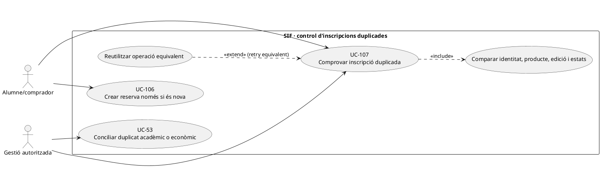
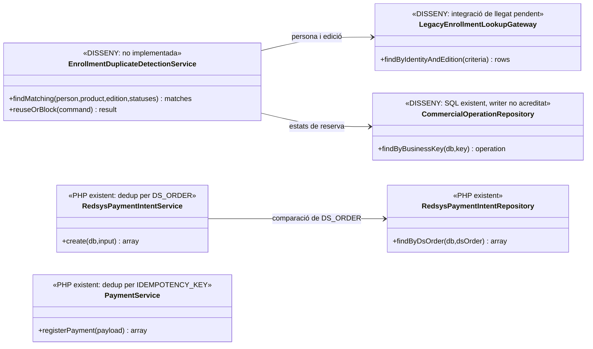

# UC-107 · Detectar una inscripció duplicada i evitar efectes econòmics dobles

**Objectiu canònic:** comparar **persona, producte i edició** abans de crear o recuperar una reserva. Una petició equivalent reutilitza l'operació/inscripció anterior i no crea un segon `IDPAG`, enllaç de pagament, factura, cobrament ni comunicació contradictòria. **Decisió pendent al catàleg:** combinació exacta de document/correu/persona, producte i edició que defineix duplicat, i estats que permeten una nova alta.

**Estat:** `RedsysPaymentIntentService::create()` compara dades i snapshot en reutilitzar **el mateix `DS_ORDER`**; `InvoiceService` i `PaymentService` disposen de claus d'idempotència pròpies, però **cap d'aquestes defenses comprova per si sola que una persona no hagi creat dues inscripcions diferents a la mateixa edició**. `LegacyCourseSnapshotRepository::findInscriptionByIdpag()` recupera la primera inscripció d'un `IDPAG` sense un contracte universal de detecció de duplicats. La unicitat comercial per persona/producte/edició és **orquestració pendent**.

## 1. Fitxa funcional específica

| Element | Regla |
| --- | --- |
| Actors | Persona que es vol inscriure, ecommerce, gestió i procés d'importació en lot UC-113; els processos asíncrons també han de respectar l'operació d'origen. |
| Clau funcional objectiu | Identitat de la persona acreditada, producte/curs i **edició** i estats rellevants. No convertir el mateix correu electrònic en identitat jurídica universal ni considerar una mateixa `IDPAG` prova absoluta de duplicació de cobrament. |
| Existències a comparar | Reserva provisional/expirada, inscripció acadèmica activa/baixa, intenció TPV pendent/confirmada, factures existents, `UUID_PAYMENT` real, assignacions i snapshots de canvi de curs. |
| Efecte de reintent equivalent | Tornar `UUID_OPERATION`, `ID_INSC`, reserva i `DS_ORDER` anterior quan sigui apropiat; **no crear una segona intenció amb dades contradictòries**. |
| Efecte d'inscripció realment nova | Quan la política comercial permet una segona inscripció (nova edició, substitució autoritzada o baixa prèvia segons regla), és una **nova operació traçada**, no un reintent de la primera amb una clau forçada. |
| Persistència pendent | `commercial_operation` i `capacity_reservation` estan definides; falta el comparador i una regla d'unicitat/lock de negoci sobre persona+producte+edició+estat que tingui en compte el llegat. |
| Efecte monetari | Detectar dos registres no significa dos ingressos: només `payment_transaction`/referència bancària permet saber si hi ha un o dos `CHARGE` reals. No esborrar, refundar o duplicar diners per una detecció acadèmica automàtica. |

### 1.1. Flux objectiu

1. Abans de confirmar UC-106, el canal normalitza identitat, producte i edició amb la política acordada; no exposa a un tercer si una altra persona té matrícula per coincidència de correu o document.
2. El detector **pendent** cerca en `commercial_operation`, l'alta llegada, les reserves i les relacions fiscals si existeix una operació equivalent, en curs, ja completada, cancel·lada o canviada. La consulta es fa amb control de concurrència perquè dues peticions paral·leles no superin ambdues la comprovació.
3. Si és un **retry equivalent**, retorna la mateixa reserva i intenció quan escau; `RedsysPaymentIntentService` sí que rebutja reús de `DS_ORDER` amb import, origen, snapshot, terminal o venciment diferents.
4. Si s'ha cobrat una operació anterior, retorna el resultat de factura/pagament ja emesos al titular autoritzat i no crea nova `payment_transaction`; si només existeix una reserva vençuda, aplica UC-121/115 abans de crear una nova.
5. Si hi ha dues sol·licituds diferents però legítimes segons estats i edicions, crea un **nou** `UUID_OPERATION` amb causa i snapshots propis, sense reutilitzar una clau de l'altra compra.
6. Si la BD llegada mostra doble inscripció però només un cobrament, inicia incidència i conciliació UC-53/105; no duplica l'entrada bancària per quadrar els dos registres acadèmics.
7. El resultat correlaciona `ID_INSC`, `IDPAG`, `UUID_OPERATION`, `UUID_INTENT`, `UUID_FACTURA` i `UUID_PAYMENT` que realment existeixin, sense donar-los per creats en una reserva provisional.

### 1.2. Matriu de proves

| Entrada | Resultat |
| --- | --- |
| Mateixa persona, curs i edició: doble clic simultani | Una operació/reserva/inscripció, reús o conflicte, mai dues places confirmades; cal clau/lock de negoci. |
| Mateixa persona i curs, edició diferent | No deduir duplicat; són serveis/edicions potencialment diferents. |
| Mateix correu, dos docents diferents | No fusionar matrícules només pel correu; verificar identitat legítima i privacitat. |
| Inscripció antiga donada de baixa i nova petició | Seguir la regla de reobertura/nova alta per estat, encara pendent de decisió; no reutilitzar una reserva caducada silenciosament. |
| Mateixa `DS_ORDER`, snapshot fiscal diferent | El servei d'intencions **existent** rebutja contradicció; no crear factura sobre els nous imports. |
| Dos `DS_ORDER` diferents per una única persona/edició | La deduplicació per `DS_ORDER` no és suficient; cal comparar clau funcional abans del checkout. |
| Dues matrícules llegades, un `UUID_PAYMENT` real | No fabricar segon `CHARGE`; reparar l'alta i l'atribució mitjançant expedient, preservant factures immutables. |

**Pendents:** política de clau funcional per persona/edició, estats de reingrés, comprovació sobre BD llegada, lock/unicitat concurrent, importacions en lot, permisos, divergències acadèmiques i proves de callbacks duplicats.

## 2. UML de casos d'ús



## 3. Classes: validador de checkout existent vs detector pendent



**No** existeix una dependència PHP demostrada de `RedsysPaymentIntentService` al detector de duplicats acadèmics; el mateix `DS_ORDER` és un altre nivell d'idempotència.

## 4. Seqüència — dos clics i una sola matrícula (DISSENY)

```mermaid
sequenceDiagram
autonumber
actor A as Alumne
participant UI as Ecommerce [pendent]
participant D as EnrollmentDuplicateDetectionService [DISSENY]
participant L as Inscripcions llegades
participant O as commercial_operation [SQL, writer pendent]
participant R as EnrollmentReservationService [DISSENY]
participant I as RedsysPaymentIntentService [PHP]
A->>UI: Comprar curs/edició (primer clic)
UI->>D: reuseOrBlock(persona,producte,edició,requestId)
D->>L: Cercar inscripció amb estats rellevants i lock
D->>O: Cercar operació comercial equivalent
alt Reserva anterior activa i mateixa comanda
 O-->>D: UUID_OPERATION original
 D-->>UI: Reutilitzar ID_INSC/operació/intenció quan existeixi
else Matrícula anterior contradictòria o pagada
 D-->>UI: Bloqueig/incidència; no crear segon pagament
else Sense operació equivalent
 D->>R: reserve(command) amb clau de negoci única
 R-->>D: UUID_OPERATION i ID_INSC nous
 D-->>UI: Reserva única
 A->>UI: Confirmar pagament
 UI->>I: create(DS_ORDER,snapshot congelat)
 I-->>UI: UUID_INTENT PENDING o reús equivalent
end
Note over D,I: Per a dos clics paral·lels, les consultes objectiu requereixen unicitat/lock; el codi actual només deduplica DS_ORDER.
```

## 5. Traçabilitat

[UC-107 original](../06-fitxes-funcionals/uc-107.md) · [UC-106 reserva](uc-106-crear-reserva-abans-pagament.md) · [UC-115 aforament original](../06-fitxes-funcionals/uc-115.md) · [UC-25a IDPAG](uc-025a-comprovar-idpag-duplicats.md) · [UC-53 conciliació](uc-053-detectar-resoldre-divergencies.md) · [RedsysPaymentIntentService](../../sif/src/Service/RedsysPaymentIntentService.php) · [Migració comercial](../../sif/database/migrations/2026_09_16_000004_add_commercial_operation_and_fiscal_fields.sql).
