# UC-108 — Diagrames d'activitat UML de TOTES les pàgines i els apartats del recorregut tastets

**Versió:** 0.9 PER DEFINIR AMB MERIEM · 22/09/2026 · Font: `main` a `e71958b3026549bde09fb4b25f2ec3ba370937ec`. **Lliurable:** 4 pàgines amb un diagrama ACTUAL i un FINAL cadascuna, més diagrames propis dels 12 apartats/accions agrupats segons el seu flux amb decisions i efectes separats. **ACTUAL** és lectura del codi disponible, no prova de l'execució productiva; **FINAL** és disseny preliminar condicionat a les decisions de [fitxa funcional UC-108, apartat 20](../06-fitxes-funcionals/uc-108.md#20-decisions-que-volem-definir-amb-negoci-abans-de-passar-a-un-altre-uc).

**Vista gràfica a GitHub:** [obrir els diagrames de les quatre pàgines, ACTUAL i FINAL](uc-108-vistes-grafiques-activitats-pagines.md). Els 32 diagrames PlantUML d'aquesta pàgina continuen sent la font UML detallada de cada pàgina i apartat.

**Regla:** no substituir un diagrama de pàgina per un dibuix genèric d'endpoint; les pàgines reals i cada acció amb decisió/efecte propi han de tenir traça. **L'alta del tastet UC-108 és gratuïta i no té TPV/AEAT**; el butlletí és un flux adjacent UC-125, no un pas obligatori de la matrícula. Les capçaleres/peus i cookies comuns de tota la web es maparan als seus casos de comunicació i cookies, no es copiaran com a activitats comercials d'UC-108.

## 0. Índex de pàgines i apartats auditats

| ID de pàgina | Pàgina PHP i ruta generada | Apartats reals i subdiagrames | Font de vista / acció |
| --- | --- | --- | --- |
| P-TAS-01 | [`pagina_tastets.php`](../../codi-drive/web-actual/pagina_tastets.php), `/tastets` | 01.A capçalera/portada, 01.B explicació gratuïtat, 01.C llista i selecció, 01.D modal d'avisos opcional UC-125. | `Tastets::__mostrarSeccio1–4`, `__mostrarTastets`, [JS de llistat](../../codi-drive/web-actual/js1619773569/mostrarTastets.min.js). |
| P-TAS-02 | [`pagina_tastet.php`](../../codi-drive/web-actual/pagina_tastet.php), `/tastets/{slug}` | 02.A títol/tornada, 02.B portada GRATUÏT, 02.C presentació, 02.D botó alta, 02.E curs original i previsualització quan existeix. | `Tastet::__mostrarSeccio1–5`, [`__mostraBotoInscripcio`](../../codi-drive/web-actual/Tastet.php#L474-L495), [JS de fitxa](../../codi-drive/web-actual/js1619773569/mostrarTastet.min.js). |
| P-TAS-03 | [`pagina_inscripcions_tastets.php`](../../codi-drive/web-actual/pagina_inscripcions_tastets.php), `/inscripcions/tastets/{slug}` | 03.A carregar formulari, 03.B dades personals/document/email, 03.C «Com has conegut»/comentaris/mailing, 03.D errors/duplicat, 03.E enviar i persistir. | `InscripcioTastet::mostrar`, [JS de formulari](../../codi-drive/web-actual/js1619773569/mostrarInscripcionsTastets.min.js), dos endpoints d'alta. |
| P-TAS-04 | [`pagina_confirmacio_tastets_automatic.php`](../../codi-drive/web-actual/pagina_confirmacio_tastets_automatic.php), `/tastets/confirmacio/{slug}/{token}` | 04.A validar token i recuperar fila, 04.B mostrar estat/termini/avisos, 04.C incidència o contacte. | [AJAX de confirmació](../../codi-drive/web-actual/ajax/mostrar_confirmacio_inscripcio_tastet_automatic.php), [`PaginaConfirmacioTastet.php`](../../codi-drive/web-actual/PaginaConfirmacioTastet.php). |

**Límit:** cap de les rutes de servidor `mod_rewrite` ni el runtime productiu s'ha comprovat. Les rutes amigables se sustenten en el PHP que construeix botons i en JS que redirigeix.

## 1. P-TAS-01 — Pàgina del llistat de tastets

### 1.1 ACTUAL — pàgina completa: apartats 01.A–01.D

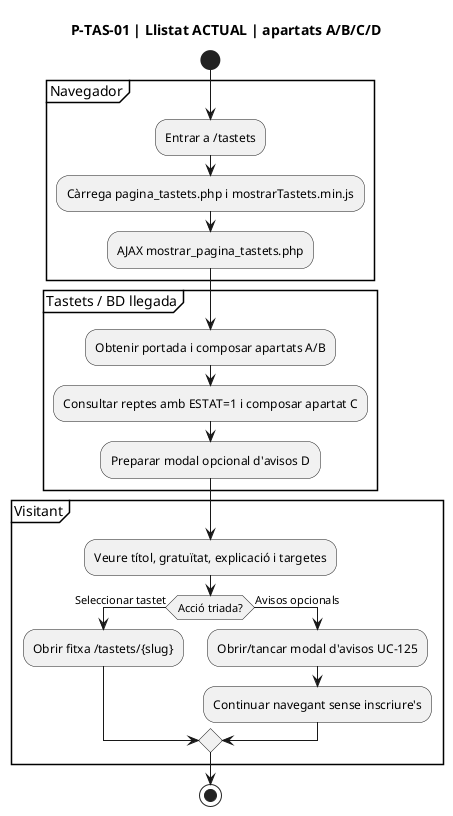

### 1.2 FINAL PROPOSAT — pàgina completa

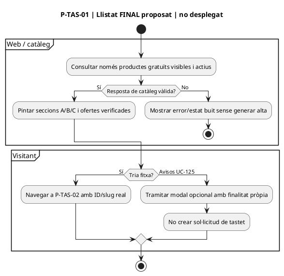

### 1.3 Apartats 01.A/B — títol, portada, explicació de gratuïtat

**Fonts:** `Tastets::__mostrarSeccio1()` presenta títol i etiqueta GRATUÏT; `__mostrarSeccio2()` presenta portada; `__mostrarSeccio3()` explica que són càpsules gratuïtes, asíncrones i autònomes. **No hi ha operació fiscal ni matrícula en consultar aquestes seccions.**

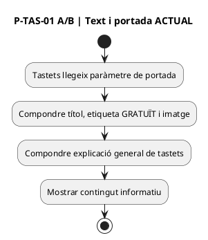

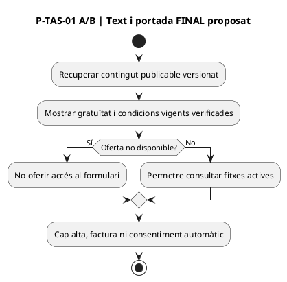

### 1.4 Apartat 01.C — llista i selecció de tastet

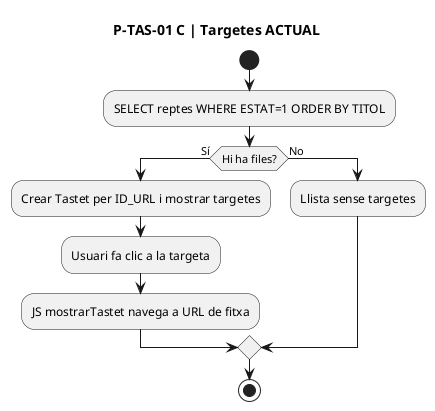

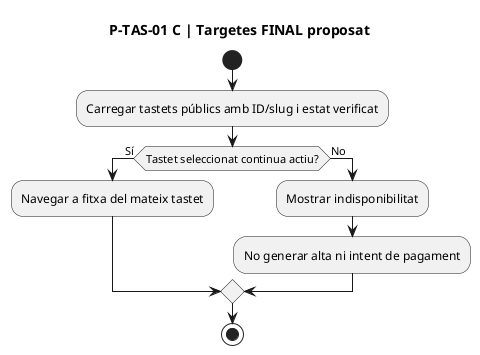

### 1.5 Apartat 01.D — modal opcional d'avisos de tastets (UC-125, NO alta UC-108)

**Font:** `Tastets::__modalSubscription()`; `mostrarTastets.min.js` obre modal per `#avis-trobada`, exigeix marcar `mailing-all`, email vàlid i llegeix `mailing-course` com a opció adicional. El fragment revisat acaba mostrant càrrega/modal, però no s'ha acreditat en aquest handler el POST final ni la confirmació al destinatari: **no declarar subscripció efectiva**.

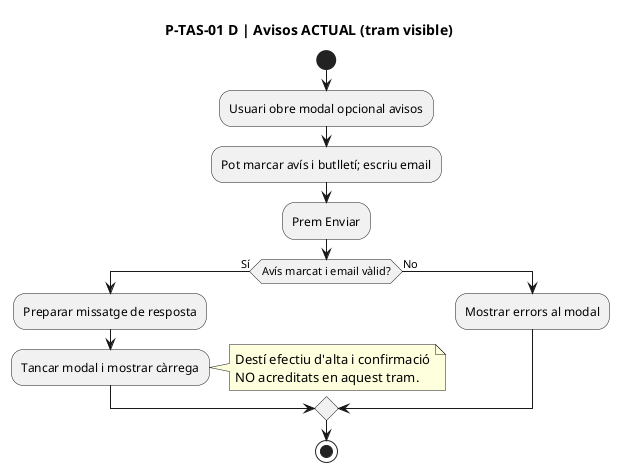

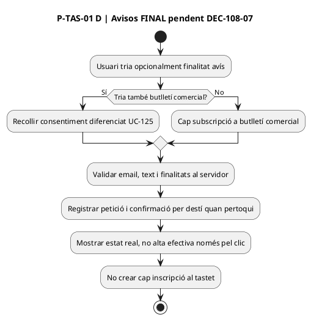

## 2. P-TAS-02 — Fitxa individual del tastet

### 2.1 ACTUAL — apartats 02.A–02.E

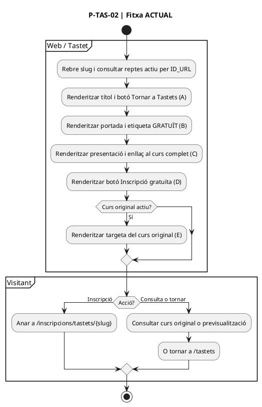

### 2.2 FINAL PROPOSAT — apartats 02.A–02.E

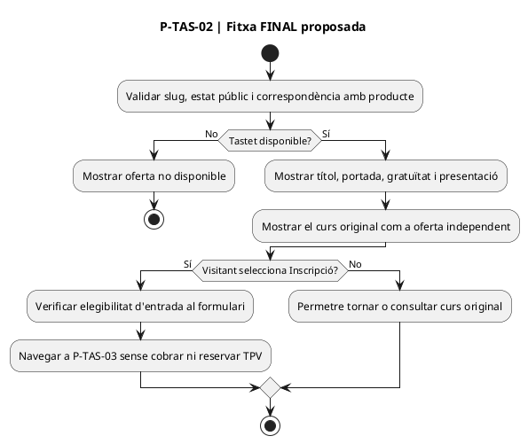

### 2.3 Apartats 02.A/B/C — títol, imatge, presentació i curs original

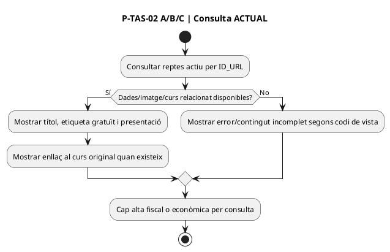

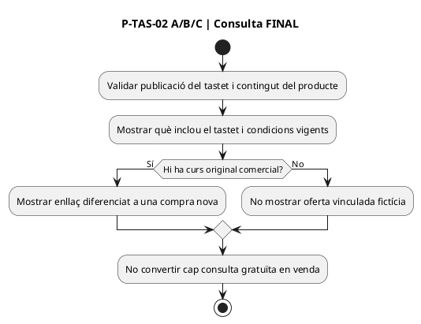

### 2.4 Apartats 02.D/E — botó d'inscripció, retorn i previsualització

**Fonts:** `Tastet::__mostraBotoInscripcio()` construeix `/inscripcions/tastets/{slug}`; el botó «Tastets» retorna al llistat; el JS de la fitxa usa `mostrarTaset` per carregar un resum/previsualització quan es demana. El curs original es mostra com una oferta diferenciada.

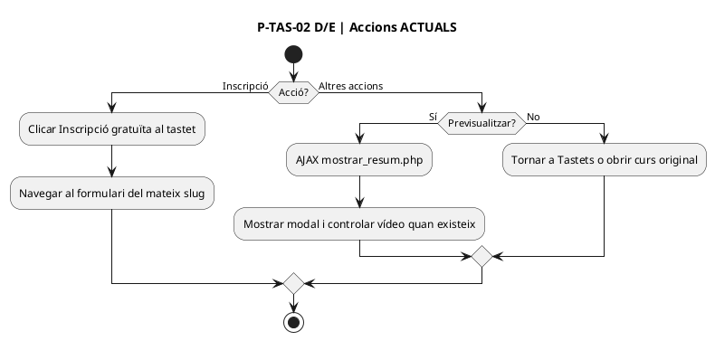

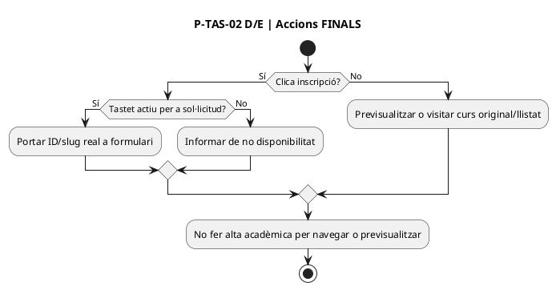

## 3. P-TAS-03 — Pàgina i formulari d'inscripció

### 3.1 ACTUAL — pàgina completa: apartats 03.A–03.E

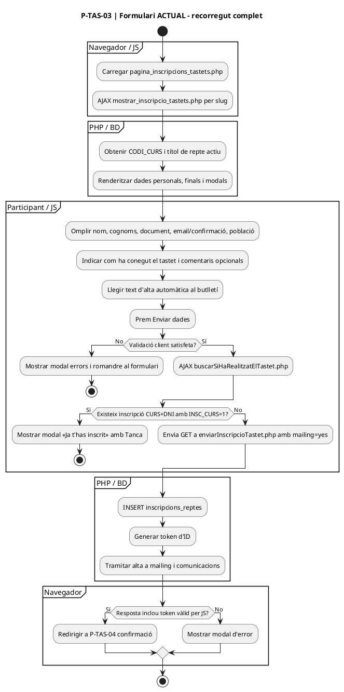

### 3.2 FINAL PROPOSAT — pàgina completa condicionada a decisions 01–06

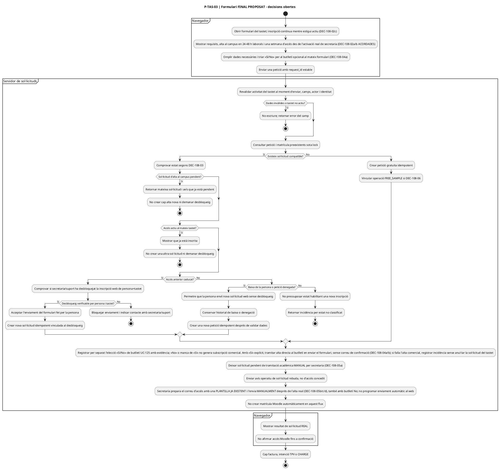

### 3.3 Apartat 03.A — carregar formulari i resoldre producte

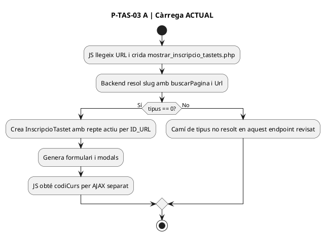

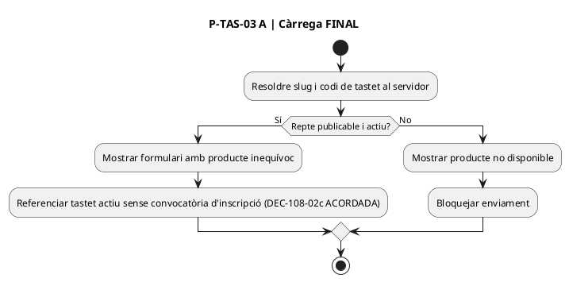

### 3.4 Apartat 03.B — dades personals i validació

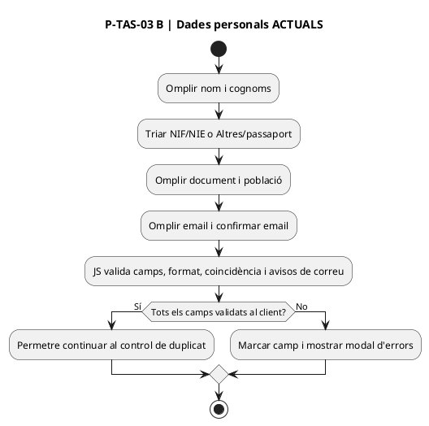

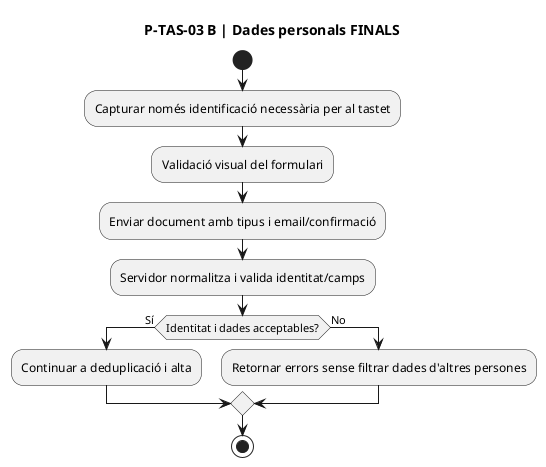

### 3.5 Apartat 03.C — «Com has conegut», comentaris i mailing

```plantuml
@startuml
title P-TAS-03 C | Dades finals i mailing ACTUALS
start
:Triar com ha conegut el tastet;
if (Resposta Altres?) then (Sí)
  :Omplir c_altres obligatori segons JS;
endif
:Escriure comentaris si es vol;
:Llegir text que anuncia alta automàtica al butlletí;
:No apareix camp Sí/No de mailing en aquest formulari;
:JS prepara mailing=yes;
:PHP posteriorment força mailingBD=1;
stop
@enduml
```

```plantuml
@startuml
title P-TAS-03 C | Dades finals i mailing FINALS
start
:Triar procedència, Altres si escau i comentaris opcionals;
:Mostrar al formulari opció explícita «Sí/No» de butlletí opcional, separada de la inscripció (DEC-108-04a);
if (Persona opta per Sí explícit?) then (Sí)
  :Registrar «Sí» explícit i evidència UC-125;
  :Donar d'alta directament al butlletí en enviar el formulari, sense segon correu/enllaç de confirmació (DEC-108-04b);
  :Si la persistència comercial falla, registrar incidència sense afirmar subscripció efectiva;
else (No)
  :No atribuir un Sí a l'absència d'elecció; si tria No, registrar-la separadament segons UC-125;
  :No subscriure comercialment;
endif
:Amb Sí o No, permetre la sol·licitud gratuïta sense condicionar-la a l'alta comercial;
:Avisos operatius segueixen circuit propi;
stop
@enduml
```

### 3.6 Apartat 03.D — validar i decidir davant una altra inscripció

**Font específica:** [`buscarSiHaRealitzatElTastet.php`](../../codi-drive/web-actual/ajax/buscarSiHaRealitzatElTastet.php#L20-L45) consulta `CURS+DNI+INSC_CURS=1`. [JS L835–878](../../codi-drive/web-actual/js1619773569/mostrarInscripcionsTastets.min.js#L835-L878) mostra modal; [HTML del modal](../../codi-drive/web-actual/InscripcioTastet.php#L307-L326) té «Tanca», no botó «Continuar». **DEC-108-03a ACORDADA:** si l'accés anterior ha caducat, secretaria/suport desbloqueja la inscripció web per persona+tastet i la persona torna a fer l'enviament del formulari; secretaria/suport no crea la nova inscripció. El mecanisme de desbloqueig continua per definir. **DEC-108-03d ACORDADA:** després d'una baixa de la persona o denegació per secretaria, es permet una nova inscripció directa des de la web sense desbloqueig; es conserva l'historial i s'eviten dobles altes. **DEC-108-03c ACORDADA:** amb accés actiu, mostrar que ja està inscrita i impedir una segona sol·licitud, sense demanar desbloqueig. **DEC-108-03b ACORDADA:** amb una sol·licitud d'alta al campus encara pendent, mostrar que ja hi ha una sol·licitud pendent i no crear-ne una altra, sense demanar desbloqueig.

```plantuml
@startuml
title P-TAS-03 D | Duplicats ACTUALS
start
:Validacions client superades;
:AJAX comprova CURS+DNI+INSC_CURS=1;
if (Hi ha matrícula amb INSC_CURS=1?) then (Sí)
  :Mostrar data/títol d'alta anterior;
  :Modal «CONFIRMA LA INSCRIPCIÓ» amb Tanca;
  :No cridar enviarInscripcio en aquesta branca JS;
else (No)
  :Enviar nova sol·licitud;
  note right
    El detector no cerca INSC_CURS=0.
    No és protecció concurrent de servidor.
  end note
endif
stop
@enduml
```

```plantuml
@startuml
title P-TAS-03 D | Duplicats FINAL - decidir política
start
:Servidor identifica subjecte+tastet actiu, sense convocatòria pròpia (DEC-108-02c);
:Consultar sota protecció concurrent peticions i matrícules;
if (Hi ha estat preexistent?) then (No)
  :Crear petició nova una vegada;
else (Sí)
  if (Petició pendent d'alta al campus?) then (Sí)
    :Mostrar «Ja tens una sol·licitud pendent»;
    :Retornar mateixa petició; no crear cap altra alta;
    :No aplicar desbloqueig de secretaria/suport;
  else (No)
    if (Accés actiu?) then (Sí)
      :Mostrar «Ja estàs inscrit/a en aquest tastet»;
      :No crear una altra sol·licitud ni demanar desbloqueig;
    else (No)
      if (Accés anterior caducat?) then (Sí)
        :Bloquejar la inscripció web fins al desbloqueig de secretaria/suport;
        if (Inscripció desbloquejada per persona+tastet?) then (Sí)
          :La persona torna al formulari i envia la nova sol·licitud;
          :Servidor valida el desbloqueig i crea alta idempotent;
        else (No)
          :No crear altra alta ni reactivar accés;
          :Informar de contacte amb secretaria o suport;
        endif
      else (No)
        if (Baixa de la persona o sol·licitud denegada?) then (Sí)
          :Permetre nova inscripció directa des de formulari web;
          :Conservar historial anterior i crear petició nova idempotent;
          :No requerir desbloqueig de secretaria/suport;
        else (No)
          :Estat no classificat; revisar abans de crear altra alta;
        endif
      endif
    endif
  endif
endif
:Cap segona alta per doble clic;
stop
@enduml
```

### 3.7 Apartat 03.E — enviar, escriure dades i generar resultat

```plantuml
@startuml
title P-TAS-03 E | Enviament ACTUAL
start
:JS GET enviarInscripcioTastet.php amb mailing=yes;
:PHP consulta reptes.ESTAT=1 per codiCurs;
:Compon correus de gratuïtat i presumpta acceptació de mailing;
:PHP fixa mailingBD=1;
:INSERT a inscripcions_reptes;
:Genera token xifrat+HMAC de l'ID;
:Echo del token;
:Consulta i INSERT a mailing si email no hi consta;
:Tramita altres escrits/comunicacions llegats;
if (JS rep token sense cadena error?) then (Sí)
  :Redirigeix a confirmació;
else (No)
  :Mostra modal error;
endif
stop
@enduml
```

```plantuml
@startuml
title P-TAS-03 E | Enviament FINAL proposat
start
:POST amb request_id, producte validable i dades mínimes;
:Revalidar oferta, persona, estat i opció mailing al servidor;
if (Sol·licitud vàlida?) then (No)
  :Error tipificat sense alta;
  stop
endif
:Crear o recuperar petició gratuïta amb idempotència;
if (DEC-108-06: registrar operació no facturable?) then (Sí)
  :Vincular NON_BILLABLE/FREE_SAMPLE;
endif
:Persistir decisió comercial «Sí/No» independent UC-125 amb evidència;
if (Ha triat Sí explícit?) then (Sí)
  :Activar subscripció directament en enviar formulari sense correu/enllaç de confirmació (DEC-108-04b);
  :Registrar resultat comercial real, incidència si falla i evitar duplicats en reintents;
else (No)
  :No donar d'alta al butlletí; continuar inscripció gratuïta i avisos operatius (DEC-108-04a);
endif
:Registrar petició pendent d'alta MANUAL per secretaria i notificació operativa de sol·licitud rebuda (DEC-108-05a);
:No executar alta automàtica Moodle en aquesta fase;
:El correu operatiu d'accés activat es prepara a partir d'una PLANTILLA JA EXISTENT que NOMÉS informa de l'accés, sense enllaç ni instruccions de claus, i l'ENVIA MANUALMENT secretaria després de l'alta real (DEC-108-05b/c/d/e). Quan secretaria crea MANUALMENT un compte NOU al campus, el CAMPUS envia AUTOMÀTICAMENT per correu les claus a aquella persona (DEC-108-05f); no és un correu del web ni el de la plantilla manual. **DEC-108-05g:** si el correu de claus no arriba, mantenir igualment l'avís manual posterior a l'activació real i gestionar la incidència de claus per separat; l'avís no demostra recepció de claus ni entrada al campus. **DEC-108-05h i DEC-108-05i:** secretaria intenta primer reenviar o regenerar claus des del campus; si no ho resol, deriva a Isa (suport tècnic) i després a desenvolupament (Meriem). **DEC-108-05j/k:** si la incidència de claus impedeix entrar-hi durant part de la setmana, cal PRORROGAR l'accés: **NOVA SETMANA COMPLETA a partir de la resolució de la incidència (DEC-108-05k)**, no sumar només els dies perduts al venciment original. Acreditar l'instant de resolució; **secretaria o Isa ajusten el venciment real al campus (DEC-108-05l)** i, després de concedir la nova setmana, **s'avisa per correu la persona de la nova data de venciment (DEC-108-05m)**. Verificar permisos, acció concreta, registre d'actor, nou venciment i remitent/mecanisme/evidència del correu de pròrroga. L'alta automàtica al campus prevista per al 2027 és fora d'abast;
if (Alguna fase posterior falla?) then (Sí)
  :Guardar incidència i reintentar només aquella fase;
endif
:Retornar ID, estat de sol·licitud i token segur si aprovat;
:Mai crear factura, TPV o CHARGE; no crear mailing si No o manca Sí. Amb Sí explícit, alta comercial directa sense segon correu, però només declarar-la efectiva si ha quedat registrada (DEC-108-04a/b);
stop
@enduml
```

## 4. P-TAS-04 — Pàgina de confirmació i accés acadèmic posterior

### 4.1 ACTUAL — pàgina completa: apartats 04.A–04.C

```plantuml
@startuml
title P-TAS-04 | Confirmació ACTUAL
start
partition "Navegador" {
  :Rebre URL /tastets/confirmacio/{slug}/{token};
  :JS crida mostrar_confirmacio_inscripcio_tastet_automatic.php;
}
partition "PHP / BD" {
  :Recuperar clau i token de la URL;
  :Comprovar HMAC i desxifrar ID;
  if (HMAC vàlid?) then (Sí)
    :Buscar inscripcions_reptes per ID i INSC_CURS en 0/1;
    if (Registre acceptable?) then (Sí)
      :Construir pàgina de sol·licitud rebuda;
    else (No)
      :Mostrar error / registre no disponible;
    endif
  else (No)
    :Mostrar error de token;
  endif
}
partition "Visitant" {
  :Llegir estat, email i termini orientatiu;
  :Pot contactar amb secretaria en cas d'incidència;
}
stop
@enduml
```

### 4.2 FINAL PROPOSAT — pàgina completa

```plantuml
@startuml
title P-TAS-04 | Confirmació FINAL condicionada
start
:Obrir enllaç de resultat;
:Verificar token i dret a consultar només la petició pròpia;
if (No autoritzat o token invàlid?) then (Sí)
  :No revelar email, document o existència aliena;
  stop
endif
 :Consultar estat real de petició i matrícula; només secretaria fa manualment l'alta al campus en la fase actual (DEC-108-05a);
if (Accés Moodle confirmat després d'alta manual?) then (Sí)
  :Mostrar activació efectiva al campus i venciment ordinari una setmana després (DEC-108-02b ACORDADA), si les dates estan verificades; si hi ha pròrroga per incidència de claus que ha impedit entrar, mostrar el venciment REAL prorrogat quan s'hagi acreditat (DEC-108-05j/k; nova setmana completa des de la resolució de la incidència; registre real pendent de verificar);
  :Mostrar l'estat verificat; en crear MANUALMENT un compte nou, el campus pot haver generat/enviat el correu AUTOMÀTIC de credencials a aquella persona (DEC-108-05f), però la seva recepció NO és prerequisit del correu manual d'accés (DEC-108-05g); els membres existents conserven les claus. Secretaria prepara amb una plantilla existent i envia MANUALMENT el correu d'accés activat, també amb butlletí No (DEC-108-05b/c/d/e). El missatge manual només informa de l'accés, sense enllaç ni instruccions de claus. Obrir aquesta pàgina no ha de disparar cap correu;
else (No)
  :Mostrar sol·licitud rebuda / alta manual per secretaria encara pendent, sense afirmar accés;
endif
:Mostrar incidència i via de contacte si escau;
:No afirmar pagament, factura ni consentiment comercial;
stop
@enduml
```

### 4.3 Apartat 04.A — validar token i recuperar el registre

```plantuml
@startuml
title P-TAS-04 A | Recuperació ACTUAL
start
:Extreure token de REQUEST_URI;
:Descodificar base64 i separar IV/HMAC/ciphertext;
:Desxifrar identificador;
if (hash_equals(HMAC calculat, HMAC aportat)?) then (Sí)
  :Buscar ID i INSC_CURS 0/1 a inscripcions_reptes;
  if (Existeix registre?) then (Sí)
    :Recuperar repte i email per mostrar;
  else (No)
    :Error/registre no disponible;
  endif
else (No)
  :Error de token;
endif
stop
@enduml
```

```plantuml
@startuml
title P-TAS-04 A | Recuperació FINAL
start
:Validar token, caducitat/política i vinculació al subjecte;
if (Consulta autoritzada?) then (Sí)
  :Consultar petició i versions d'estat acadèmic;
  :Minimitzar dades personals que es mostren;
else (No)
  :Error sense exposar dada d'un altre participant;
endif
stop
@enduml
```

### 4.4 Apartats 04.B/C — missatge, termini, contacte i incidències

```plantuml
@startuml
title P-TAS-04 B/C | Missatge ACTUAL
start
:Mostrar «La teva sol·licitud ha estat enviada»;
:Indicar revisar email i correu brossa;
:Informar que el tastet és gratuït;
:Indicar 24/48 h laborals per activar i una setmana després de l'alta;
:Mostrar contacte secretaria en cas de problema;
:No verificar Moodle des d'aquesta vista;
stop
@enduml
```

```plantuml
@startuml
title P-TAS-04 B/C | Missatge FINAL condicionat
start
if (Sol·licitud rebuda però sense accés?) then (Sí)
  :Mostrar petició rebuda, pendent de tramitació MANUAL per secretaria en 24–48 h laborals i una setmana d'accés des de l'activació real (DEC-108-02a/b, DEC-108-05a ACORDADES);
  :No mostrar «ja tens accés»;
else (No)
  :Mostrar matrícula i dates confirmades si existeixen;
endif
if (Notificació o Moodle han fallat?) then (Sí)
  :Mostrar incidència/pendent i via de contacte;
  :Reintentar només les fases tècniques idempotents; si l'alta MANUAL de secretaria és pendent o ha fallat, registrar/escalar la incidència sense crear automàticament la matrícula Moodle;
endif
:No atribuir consentiment de mailing ni resultat fiscal;
stop
@enduml
```

## 5. Matriu de traçabilitat ACTUAL → FINAL de les activitats

| Pàgina/apartat | Acció → codi / mètode / dades | UC | Estat actual → modificació | Prova pendent |
| --- | --- | --- | --- | --- |
| 01.A/B/C | `Tastets::__mostrarSeccio1–4` i `__mostrarTastets` → `reptes.ESTAT` | 108 | Contingut i targetes actives → revalidació de disponibilitat per selecció. | TG-108-01 |
| 01.D | `Tastets::__modalSubscription`, `mostrarTastets.min.js` → modal/email | 125 | Opcions avisos/butlletí amb resultat parcialment desconegut → finalitats i confirmació independents. | DEC-108-07 |
| 02.A/B/C/E | `Tastet::__mostrarSeccio1–5` → `reptes` i curs original | 108 | Contingut gratuït, link curs i modal → oferta separada i contingut vigent. | TG-108-01 |
| 02.D | `Tastet::__mostraBotoInscripcio` → ruta `/inscripcions/tastets/{slug}` | 108 | Navegació → producte revalidat al servidor de l'alta. | TG-108-01/08 |
| 03.A | `mostrar_inscripcio_tastets.php`, `InscripcioTastet::__construct/mostrar` → `reptes` | 108 | Formulari dinàmic → tastet actiu, sense convocatòria d'inscripció pròpia; revalidar l'estat actiu en l'enviament. | TG-108-01/01a/08 |
| 03.B | `InscripcioTastet::__mostrarDadesPersonals`, validacions JS | 108/126 | Validació navegador → validació server / identitat correcta. | TG-108-02/03 |
| 03.C | `InscripcioTastet::__mostrarFinal`, JS `mailing='yes'` | 108/125 | Alta comercial automàtica → **DEC-108-04a ACORDADA: elecció opcional Sí/No al formulari; No no impedeix la inscripció ni els avisos operatius.** | TG-108-06/06a/06b/07 |
| 03.D | `buscarSiHaRealitzatElTastet.php` → `inscripcions_reptes.INSC_CURS=1` | 108/107 | Modal «Tanca», sense protecció pendents → **DEC-108-03b: mostrar avís de sol·licitud pendent i no crear alta nova; aplicar al servidor amb lock; caducats segons DEC-108-03a; **actius segons DEC-108-03c: mostrar ja inscrita sense alta nova ni desbloqueig; baixa/denegació segons DEC-108-03d: nova sol·licitud web sense desbloqueig.** | TG-108-04/05/05d/05e/05f/05g |
| 03.E | `enviarInscripcioTastet.php` → `inscripcions_reptes`, `mailing`; token i correus | 108/125/129 | Efectes successius → orquestració/reintent separat. | TG-108-06/09/12/13 |
| 04.A | `mostrar_confirmacio_inscripcio_tastet_automatic.php` → token/HMAC, ID/INSC_CURS | 108/126 | Comprovació de token i registre → permís de lectura al subjecte i minimització. | TG-108-11 |
| 04.B/C | `PaginaConfirmacioTastet::mostrarPaginaConfirmacio` → email i text orientatiu | 108/129 | Sol·licitud rebuda amb previsió d'accés → mostrar estat d'accés efectiu quan existeixi. | TG-108-09/10 |

## 6. Decisions pendents abans de donar aquests diagrames per «finals»

**DEC-108-01:** política d'identitat/token/lectura del resultat. **DEC-108-02a ACORDADA:** mantenir alta al campus en 24–48 hores laborals després de rebre la sol·licitud, sense confondre petició rebuda amb accés activat. **DEC-108-02b ACORDADA:** una setmana d'accés des de l'activació real per secretaria al campus, no des de l'enviament de la petició. **DEC-108-02c ACORDADA:** tastets oberts a sol·licituds en qualsevol moment mentre `reptes.ESTAT=1`, sense convocatòries d'inscripció; revalidar disponibilitat en l'enviament. **DEC-108-02 OBERTA parcialment:** còmput tècnic exacte del venciment; **la repetició després de caducar requereix autorització**. **DEC-108-03:** sol·licituds pendents (DEC-108-03b), accessos actius (DEC-108-03c), caducats (DEC-108-03a) i baixa/denegació (DEC-108-03d) ACORDATS. **DEC-108-03d ACORDADA:** després de baixa voluntària o petició denegada, nova inscripció directa al formulari web sense desbloqueig; conservar historial, validar i prevenir dobles altes. **DEC-108-03c ACORDADA:** amb accés actiu al mateix tastet, mostrar que ja està inscrita i no crear una altra sol·licitud, sense desbloqueig. **DEC-108-03b ACORDADA:** segona petició de la mateixa persona i tastet mentre la primera segueix pendent d'alta al campus → mostrar avís «Ja tens una sol·licitud pendent» i no crear cap altra alta ni exigir desbloqueig. **DEC-108-03a ACORDADA:** si l'accés ha caducat, secretaria/suport desbloqueja la inscripció web per aquella persona+tastet i és la persona qui torna a omplir i enviar el formulari; via de sol·licitud, control tècnic i vigència pendents. **DEC-108-04a ACORDADA:** butlletí opcional amb elecció explícita «Sí/No» al formulari del tastet; No no bloqueja inscripció ni comunicacions operatives, i no hi ha alta comercial sense Sí. **DEC-108-04b ACORDADA:** amb Sí explícit i persistència comercial satisfactòria, alta directa al butlletí en enviar el formulari, sense correu/enllaç de confirmació; no afirmar-la si la persistència falla. **DEC-108-04 OBERTA parcialment:** text/evidència/versió del consentiment i detalls de registre (UC-125); les altres vies de subscripció tenen circuit propi. **DEC-108-05a ACORDADA:** secretaria fa manualment l'alta al campus en la fase actual, un cop rebuda la sol·licitud web; el formulari i els workers no han de crear automàticament la matrícula Moodle ara. L'automatització es vol per al 2027 però queda fora de l'abast actual. **DEC-108-05b ACORDADA:** després d'haver completat l'alta manual efectiva, secretaria envia un correu operatiu a la persona informant que ja pot accedir al campus; és diferent de la confirmació de recepció i també s'envia si ha triat No al butlletí. **DEC-108-05c ACORDADA:** per ara secretaria prepara i envia el correu MANUALMENT; el sistema no el dispara automàticament i no s'ha d'implementar una automatització de tramesa en la fase actual. **DEC-108-05d ACORDADA:** secretaria utilitza una PLANTILLA JA PREPARADA per a aquest correu; el text literal, la ubicació i els camps concrets de la plantilla encara s'han de contrastar. **DEC-108-05e ACORDADA:** el correu manual només informa de l'accés activat, sense enllaç al campus ni instruccions per obtenir claus; els membres existents conserven les claus. **DEC-108-05f ACORDADA:** quan secretaria dona d'alta MANUALMENT una persona que encara no té compte al campus, el CAMPUS li envia AUTOMÀTICAMENT per correu les claus; és independent del correu manual posterior i no representa una alta Moodle automàtica. Pendent de comprovar plantilla, disparador i resultat reals del correu del campus, sense consignar claus en la documentació. Pendent verificar el registre real de dates d'activació/venciment, destinatari, plantilla, evidència de l'enviament i possible implementació tècnica del correu (UC-129). **DEC-108-05g ACORDADA:** si un nou membre no rep el correu automàtic de claus, secretaria envia igualment la plantilla manual informativa DESPRÉS de l'activació real; registrar/tractar la incidència de claus separadament, sense equiparar avís enviat a credencials rebudes o sessió iniciada. **DEC-108-05h/i ACORDADES:** incidència de claus separada de l'avís manual: secretaria és el primer punt d'atenció i intenta reenviar o regenerar les claus des del campus; si no ho resol, deriva a Isa (suport tècnic) i, si persisteix, a desenvolupament (Meriem). Funcions reals de campus, permisos i traça pendents de contrastar, sense exposar credencials ni duplicar comptes. **DEC-108-05j/k/l ACORDADES:** quan una incidència de claus impedeix entrar durant part de la setmana, **concedir una NOVA SETMANA COMPLETA des de la resolució acreditada de la incidència**, no conservar el venciment original ni afegir només els dies perduts. **Secretaria o Isa modifiquen el venciment al campus (DEC-108-05l)** i es comunica **per correu la nova data de venciment a la persona després de concedir la pròrroga (DEC-108-05m)**. Pendent d'aclarir qui envia l'avís, si el procediment és manual/automàtic i quina plantilla s'utilitza. Verificar instant de resolució, inclusivitat de l'hora final, permisos, actor que executa el canvi, registre i nou venciment Moodle/BD; no confondre-ho amb una nova matrícula ni amb l'avís manual d'activació. **DEC-108-06:** registrar o no al SIF una operació `FREE_SAMPLE` per cada alta gratuïta. **DEC-108-07:** separar avís de tastets, butlletí i peu compartit.

**Estat real:** la representació ACTUAL està contrastada amb el codi esmentat; la regla de reinscripció amb autorització és **ACORDADA però NO IMPLEMENTADA**, i la resta del flux FINAL encara està per aprovar. S'han de revisar les decisions amb Meriem, actualitzar les condicions exactes dels diagrames i després executar les proves. **No iniciar l'auditoria d'altres UC mentre la revisió funcional d'aquest cas segueix oberta.**
