# UC-108 — Diagrames d'activitat UML de TOTES les pàgines i els apartats del recorregut tastets

## Revisió d'auditoria 29/09/2026

**Regles que prevalen sobre redaccions anteriors:** DEC-108-04 = alta obligatòria al mailing associada al tastet gratuït, amb baixa posterior i sense Sí/No; retry de la mateixa petició no reactiva una baixa. DEC-108-06 = **OBERTA**. Vegeu també [classes](uc-108-classes-actual-final.md), [seqüències](uc-108-sequencies-actual-final.md) i [auditoria consolidada](uc-108-auditoria-tracabilitat-2026-09-29.md).

**Decisions confirmades el 25/09/2026:** (DEC-108-03m) es pot tornar a sol·licitar el tastet quan la persona ho demana, però si l'accés està caducat s'aplica DEC-108-03a: desbloqueig persona+tastet i nova sol·licitud web; no hi ha renovació automàtica. (DEC-108-01a) la identificació per comprovar repetició del tastet és el **DNI**, conjuntament amb el tastet. (DEC-108-07) avisos de tastets i butlletí general pertanyen a **la mateixa subscripció**; no dissenyar dues subscripcions independents per aquests dos noms. Els avisos operatius d’accés/renovació continuen independents de l’opció comercial.

**DEC-108-03j/k/l — SUPERADES:** la redacció que permetia renovar un accés caducat només canviant el venciment, sense formulari nou, **no és la regla vigent**. Regla actual: si l'accés ha caducat, secretaria/suport desbloqueja **persona+tastet** i la persona torna al formulari web i envia una **nova sol·licitud**, conservant historial (DEC-108-03a). La pròrroga per incidència de credencials és un cas diferent: si la incidència ha impedit entrar, s'ajusta el venciment per donar set dies complets des de la resolució.

**Lectura de l’historial:** les notes anteriors de 03a/e/f sobre nova inscripció i vigència del desbloqueig es conserven com a antecedents superats; no prevalen sobre 03j/k/l.

**Versió:** 0.9 PER DEFINIR AMB MERIEM · 22/09/2026 · Font: `main` a `e71958b3026549bde09fb4b25f2ec3ba370937ec`. **Lliurable:** 4 pàgines amb un diagrama ACTUAL i un FINAL cadascuna, més diagrames propis dels 12 apartats/accions agrupats segons el seu flux amb decisions i efectes separats. **ACTUAL** és lectura del codi disponible, no prova de l'execució productiva; **FINAL** és disseny preliminar condicionat a les decisions de [fitxa funcional UC-108, apartat 20](../06-fitxes-funcionals/uc-108.md#20-decisions-que-volem-definir-amb-negoci-abans-de-passar-a-un-altre-uc).

**Vista gràfica a GitHub:** [obrir els diagrames de les quatre pàgines, ACTUAL i FINAL](uc-108-vistes-grafiques-activitats-pagines.md). Els 32 diagrames PlantUML d'aquesta pàgina continuen sent la font UML detallada de cada pàgina i apartat.

**Regla:** no substituir un diagrama de pàgina per un dibuix genèric d'endpoint; les pàgines reals i cada acció amb decisió/efecte propi han de tenir traça. **L'alta del tastet UC-108 és gratuïta i no té TPV/AEAT**; l'alta al mailing forma part de la condició comercial del tastet i UC-125 governa baixa/supressió/estat posterior. Les capçaleres/peus i cookies comuns de tota la web es maparan als seus casos propis.

## 0. Índex de pàgines i apartats auditats

| ID de pàgina | Pàgina PHP i ruta generada | Apartats reals i subdiagrames | Font de vista / acció |
| --- | --- | --- | --- |
| P-TAS-01 | [`pagina_tastets.php`](../../codi-drive/web-actual/pagina_tastets.php), `/tastets` | 01.A capçalera/portada, 01.B explicació gratuïtat, 01.C llista i selecció, 01.D modal d'avisos opcional UC-125. | `Tastets::__mostrarSeccio1–4`, `__mostrarTastets`, [JS de llistat](../../codi-drive/web-actual/js1619773569/mostrarTastets.min.js). |
| P-TAS-02 | [`pagina_tastet.php`](../../codi-drive/web-actual/pagina_tastet.php), `/tastets/{slug}` | 02.A títol/tornada, 02.B portada GRATUÏT, 02.C presentació, 02.D botó alta, 02.E curs original i previsualització quan existeix. | `Tastet::__mostrarSeccio1–5`, [`__mostraBotoInscripcio`](../../codi-drive/web-actual/Tastet.php#L474-L495), [JS de fitxa](../../codi-drive/web-actual/js1619773569/mostrarTastet.min.js). |
| P-TAS-03 | [`pagina_inscripcions_tastets.php`](../../codi-drive/web-actual/pagina_inscripcions_tastets.php), `/inscripcions/tastets/{slug}` | 03.A carregar formulari, 03.B dades personals/document/email, 03.C «Com has conegut»/comentaris/mailing, 03.D errors/duplicat, 03.E enviar i persistir. | `InscripcioTastet::mostrar`, [JS de formulari](../../codi-drive/web-actual/js1619773569/mostrarInscripcionsTastets.min.js), dos endpoints d'alta. |
| P-TAS-04 | [`pagina_confirmacio_tastets_automatic.php`](../../codi-drive/web-actual/pagina_confirmacio_tastets_automatic.php), `/tastets/confirmacio/{slug}/{token}` | 04.A validar token i recuperar fila, 04.B mostrar estat/termini/avisos, 04.C incidència o contacte. | [AJAX de confirmació](../../codi-drive/web-actual/ajax/mostrar_confirmacio_inscripcio_tastet_automatic.php), [`PaginaConfirmacioTastet.php`](../../codi-drive/web-actual/PaginaConfirmacioTastet.php). |

**Límit:** cap de les rutes de servidor `mod_rewrite` ni el runtime productiu s'ha comprovat. Les rutes amigables se sustenten en el PHP que construeix botons i en JS que redirigeix.

## 1. P-TAS-01 — Pàgina del llistat de tastets

### 1.1 ACTUAL — pàgina completa: apartats 01.A–01.D

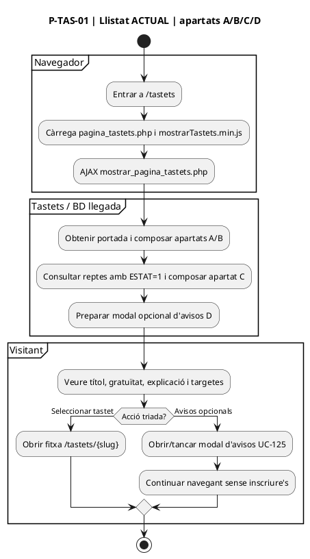
```plantuml
@startuml
title P-TAS-01 | Llistat ACTUAL | apartats A/B/C/D
start
partition "Navegador" {
  :Entrar a /tastets;
  :Càrrega pagina_tastets.php i mostrarTastets.min.js;
  :AJAX mostrar_pagina_tastets.php;
}
partition "Tastets / BD llegada" {
  :Obtenir portada i composar apartats A/B;
  :Consultar reptes amb ESTAT=1 i composar apartat C;
  :Preparar modal opcional d'avisos D;
}
partition "Visitant" {
  :Veure títol, gratuïtat, explicació i targetes;
  if (Acció triada?) then (Seleccionar tastet)
    :Obrir fitxa /tastets/{slug};
  else (Avisos opcionals)
    :Obrir/tancar modal d'avisos UC-125;
    :Continuar navegant sense inscriure's;
  endif
}
stop
@enduml
```

### 1.2 FINAL PROPOSAT — pàgina completa

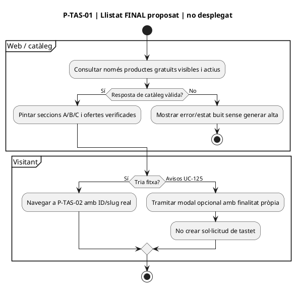
```plantuml
@startuml
title P-TAS-01 | Llistat FINAL proposat | no desplegat
start
partition "Web / catàleg" {
  :Consultar només productes gratuïts visibles i actius;
  if (Resposta de catàleg vàlida?) then (Sí)
    :Pintar seccions A/B/C i ofertes verificades;
  else (No)
    :Mostrar error/estat buit sense generar alta;
    stop
  endif
}
partition "Visitant" {
  if (Tria fitxa?) then (Sí)
    :Navegar a P-TAS-02 amb ID/slug real;
  else (Avisos UC-125)
    :Tramitar modal opcional amb finalitat pròpia;
    :No crear sol·licitud de tastet;
  endif
}
stop
@enduml
```

### 1.3 Apartats 01.A/B — títol, portada, explicació de gratuïtat

**Fonts:** `Tastets::__mostrarSeccio1()` presenta títol i etiqueta GRATUÏT; `__mostrarSeccio2()` presenta portada; `__mostrarSeccio3()` explica que són càpsules gratuïtes, asíncrones i autònomes. **No hi ha operació fiscal ni matrícula en consultar aquestes seccions.**

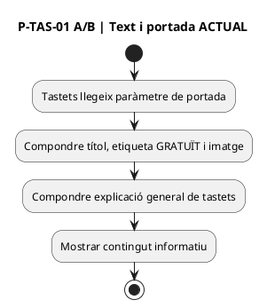
```plantuml
@startuml
title P-TAS-01 A/B | Text i portada ACTUAL
start
:Tastets llegeix paràmetre de portada;
:Compondre títol, etiqueta GRATUÏT i imatge;
:Compondre explicació general de tastets;
:Mostrar contingut informatiu;
stop
@enduml
```

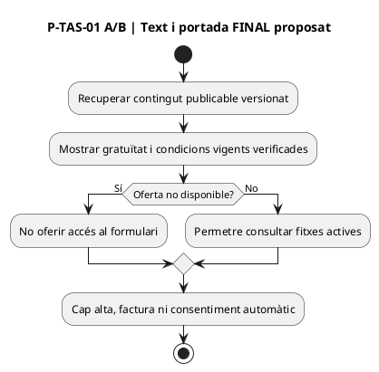
```plantuml
@startuml
title P-TAS-01 A/B | Text i portada FINAL proposat
start
:Recuperar contingut publicable versionat;
:Mostrar gratuïtat i condicions vigents verificades;
if (Oferta no disponible?) then (Sí)
  :No oferir accés al formulari;
else (No)
  :Permetre consultar fitxes actives;
endif
:Cap alta, factura ni consentiment automàtic;
stop
@enduml
```

### 1.4 Apartat 01.C — llista i selecció de tastet

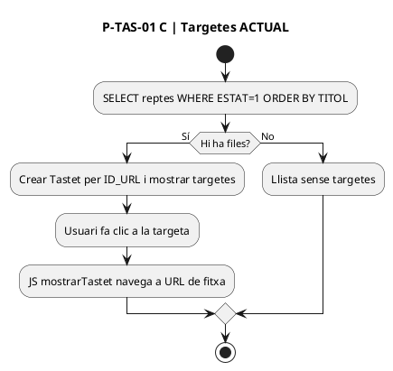
```plantuml
@startuml
title P-TAS-01 C | Targetes ACTUAL
start
:SELECT reptes WHERE ESTAT=1 ORDER BY TITOL;
if (Hi ha files?) then (Sí)
  :Crear Tastet per ID_URL i mostrar targetes;
  :Usuari fa clic a la targeta;
  :JS mostrarTastet navega a URL de fitxa;
else (No)
  :Llista sense targetes;
endif
stop
@enduml
```

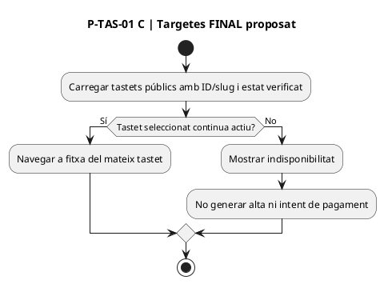
```plantuml
@startuml
title P-TAS-01 C | Targetes FINAL proposat
start
:Carregar tastets públics amb ID/slug i estat verificat;
if (Tastet seleccionat continua actiu?) then (Sí)
  :Navegar a fitxa del mateix tastet;
else (No)
  :Mostrar indisponibilitat;
  :No generar alta ni intent de pagament;
endif
stop
@enduml
```

### 1.5 Apartat 01.D — modal opcional d'avisos de tastets (UC-125, NO alta UC-108)

**Font:** `Tastets::__modalSubscription()`; `mostrarTastets.min.js` obre modal per `#avis-trobada`, exigeix marcar `mailing-all`, email vàlid i llegeix `mailing-course` com a opció adicional. El fragment revisat acaba mostrant càrrega/modal, però no s'ha acreditat en aquest handler el POST final ni la confirmació al destinatari: **no declarar subscripció efectiva**.

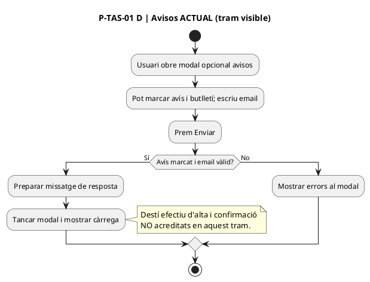
```plantuml
@startuml
title P-TAS-01 D | Avisos ACTUAL (tram visible)
start
:Usuari obre modal opcional avisos;
:Pot marcar avís i butlletí; escriu email;
:Prem Enviar;
if (Avís marcat i email vàlid?) then (Sí)
  :Preparar missatge de resposta;
  :Tancar modal i mostrar càrrega;
  note right
    Destí efectiu d'alta i confirmació
    NO acreditats en aquest tram.
  end note
else (No)
  :Mostrar errors al modal;
endif
stop
@enduml
```

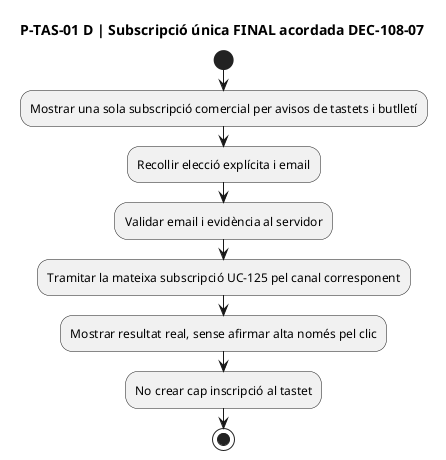
```plantuml
@startuml
title P-TAS-01 D | Subscripció única FINAL acordada DEC-108-07
start
:Mostrar una sola subscripció comercial per avisos de tastets i butlletí;
:Recollir elecció explícita i email;
:Validar email i evidència al servidor;
:Tramitar la mateixa subscripció UC-125 pel canal corresponent;
:Mostrar resultat real, sense afirmar alta només pel clic;
:No crear cap inscripció al tastet;
stop
@enduml
```

## 2. P-TAS-02 — Fitxa individual del tastet

### 2.1 ACTUAL — apartats 02.A–02.E

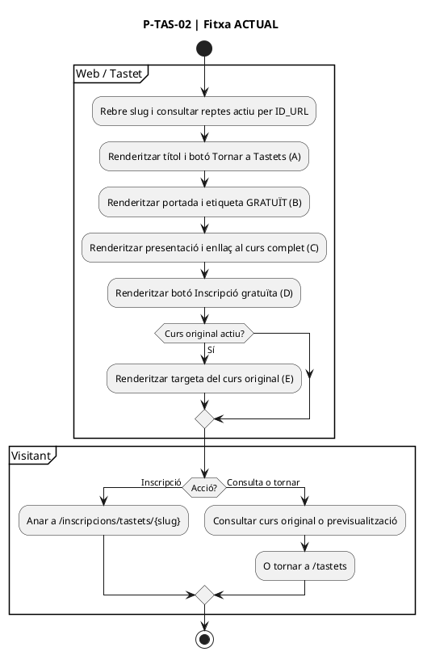
```plantuml
@startuml
title P-TAS-02 | Fitxa ACTUAL
start
partition "Web / Tastet" {
  :Rebre slug i consultar reptes actiu per ID_URL;
  :Renderitzar títol i botó Tornar a Tastets (A);
  :Renderitzar portada i etiqueta GRATUÏT (B);
  :Renderitzar presentació i enllaç al curs complet (C);
  :Renderitzar botó Inscripció gratuïta (D);
  if (Curs original actiu?) then (Sí)
    :Renderitzar targeta del curs original (E);
  endif
}
partition "Visitant" {
  if (Acció?) then (Inscripció)
    :Anar a /inscripcions/tastets/{slug};
  else (Consulta o tornar)
    :Consultar curs original o previsualització;
    :O tornar a /tastets;
  endif
}
stop
@enduml
```

### 2.2 FINAL PROPOSAT — apartats 02.A–02.E

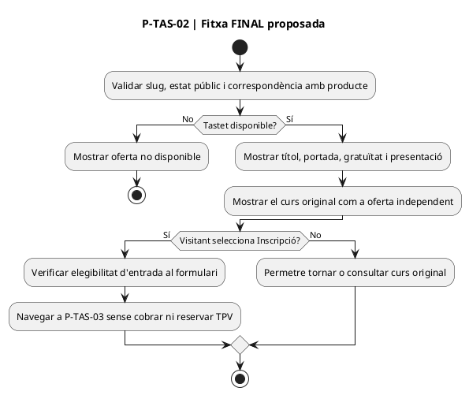
```plantuml
@startuml
title P-TAS-02 | Fitxa FINAL proposada
start
:Validar slug, estat públic i correspondència amb producte;
if (Tastet disponible?) then (No)
  :Mostrar oferta no disponible;
  stop
else (Sí)
  :Mostrar títol, portada, gratuïtat i presentació;
  :Mostrar el curs original com a oferta independent;
endif
if (Visitant selecciona Inscripció?) then (Sí)
  :Verificar elegibilitat d'entrada al formulari;
  :Navegar a P-TAS-03 sense cobrar ni reservar TPV;
else (No)
  :Permetre tornar o consultar curs original;
endif
stop
@enduml
```

### 2.3 Apartats 02.A/B/C — títol, imatge, presentació i curs original

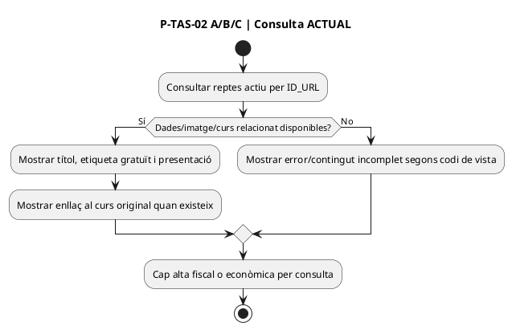
```plantuml
@startuml
title P-TAS-02 A/B/C | Consulta ACTUAL
start
:Consultar reptes actiu per ID_URL;
if (Dades/imatge/curs relacionat disponibles?) then (Sí)
  :Mostrar títol, etiqueta gratuït i presentació;
  :Mostrar enllaç al curs original quan existeix;
else (No)
  :Mostrar error/contingut incomplet segons codi de vista;
endif
:Cap alta fiscal o econòmica per consulta;
stop
@enduml
```

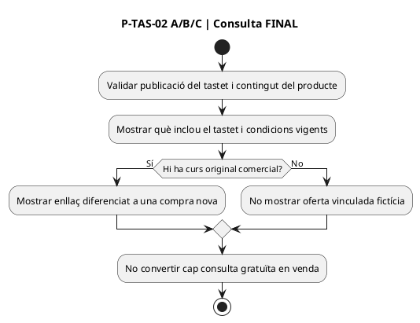
```plantuml
@startuml
title P-TAS-02 A/B/C | Consulta FINAL
start
:Validar publicació del tastet i contingut del producte;
:Mostrar què inclou el tastet i condicions vigents;
if (Hi ha curs original comercial?) then (Sí)
  :Mostrar enllaç diferenciat a una compra nova;
else (No)
  :No mostrar oferta vinculada fictícia;
endif
:No convertir cap consulta gratuïta en venda;
stop
@enduml
```

### 2.4 Apartats 02.D/E — botó d'inscripció, retorn i previsualització

**Fonts:** `Tastet::__mostraBotoInscripcio()` construeix `/inscripcions/tastets/{slug}`; el botó «Tastets» retorna al llistat; el JS de la fitxa usa `mostrarTaset` per carregar un resum/previsualització quan es demana. El curs original es mostra com una oferta diferenciada.

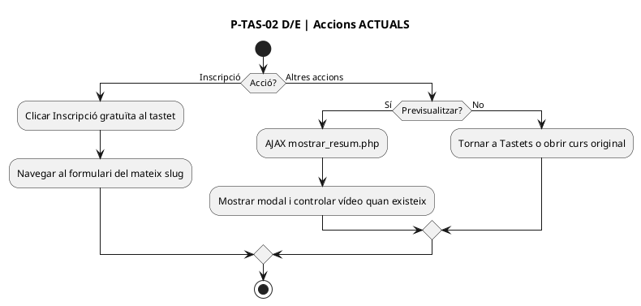
```plantuml
@startuml
title P-TAS-02 D/E | Accions ACTUALS
start
if (Acció?) then (Inscripció)
  :Clicar Inscripció gratuïta al tastet;
  :Navegar al formulari del mateix slug;
else (Altres accions)
  if (Previsualitzar?) then (Sí)
    :AJAX mostrar_resum.php;
    :Mostrar modal i controlar vídeo quan existeix;
  else (No)
    :Tornar a Tastets o obrir curs original;
  endif
endif
stop
@enduml
```

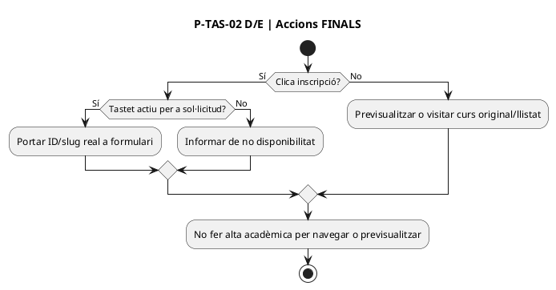
```plantuml
@startuml
title P-TAS-02 D/E | Accions FINALS
start
if (Clica inscripció?) then (Sí)
  if (Tastet actiu per a sol·licitud?) then (Sí)
    :Portar ID/slug real a formulari;
  else (No)
    :Informar de no disponibilitat;
  endif
else (No)
  :Previsualitzar o visitar curs original/llistat;
endif
:No fer alta acadèmica per navegar o previsualitzar;
stop
@enduml
```

## 3. P-TAS-03 — Pàgina i formulari d'inscripció

### 3.1 ACTUAL — pàgina completa: apartats 03.A–03.E

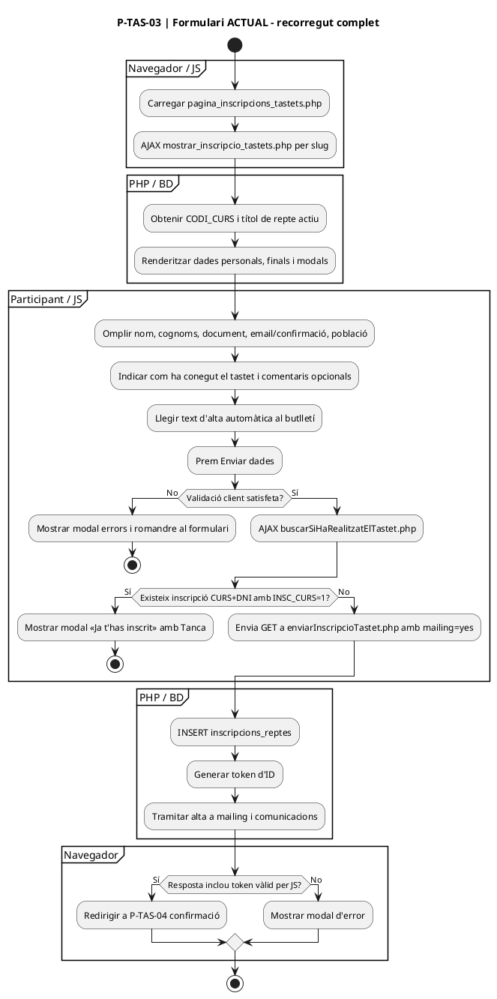
```plantuml
@startuml
title P-TAS-03 | Formulari ACTUAL - recorregut complet
start
partition "Navegador / JS" {
  :Carregar pagina_inscripcions_tastets.php;
  :AJAX mostrar_inscripcio_tastets.php per slug;
}
partition "PHP / BD" {
  :Obtenir CODI_CURS i títol de repte actiu;
  :Renderitzar dades personals, finals i modals;
}
partition "Participant / JS" {
  :Omplir nom, cognoms, document, email/confirmació, població;
  :Indicar com ha conegut el tastet i comentaris opcionals;
  :Llegir text d'alta automàtica al butlletí;
  :Prem Enviar dades;
  if (Validació client satisfeta?) then (No)
    :Mostrar modal errors i romandre al formulari;
    stop
  else (Sí)
    :AJAX buscarSiHaRealitzatElTastet.php;
  endif
  if (Existeix inscripció CURS+DNI amb INSC_CURS=1?) then (Sí)
    :Mostrar modal «Ja t'has inscrit» amb Tanca;
    stop
  else (No)
    :Envia GET a enviarInscripcioTastet.php amb mailing=yes;
  endif
}
partition "PHP / BD" {
  :INSERT inscripcions_reptes;
  :Generar token d'ID;
  :Tramitar alta a mailing i comunicacions;
}
partition "Navegador" {
  if (Resposta inclou token vàlid per JS?) then (Sí)
    :Redirigir a P-TAS-04 confirmació;
  else (No)
    :Mostrar modal d'error;
  endif
}
stop
@enduml
```

### 3.2 FINAL PROPOSAT — pàgina completa condicionada a decisions 01–06

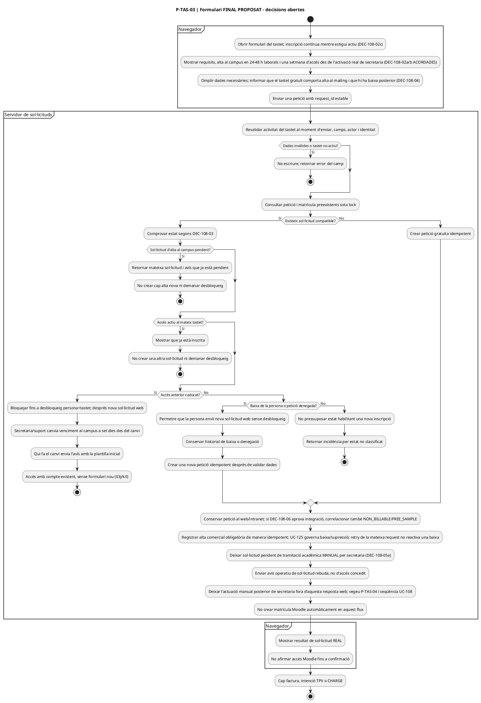
```plantuml
@startuml
title P-TAS-03 | Formulari FINAL PROPOSAT - decisions obertes
start
partition "Navegador" {
  :Obrir formulari del tastet; inscripció contínua mentre estigui actiu (DEC-108-02c);
  :Mostrar requisits, alta al campus en 24–48 h laborals i una setmana d'accés des de l'activació real de secretaria (DEC-108-02a/b ACORDADES);
  :Omplir dades necessàries; informar que el tastet gratuït comporta alta al mailing i que hi ha baixa posterior (DEC-108-04);
  :Enviar una petició amb request_id estable;
}
partition "Servidor de sol·licituds" {
  :Revalidar activitat del tastet al moment d'enviar, camps, actor i identitat;
  if (Dades invàlides o tastet no actiu?) then (Sí)
    :No escriure; retornar error del camp;
    stop
  endif
  :Consultar petició i matrícula preexistents sota lock;
  if (Existeix sol·licitud compatible?) then (Sí)
    :Comprovar estat segons DEC-108-03;
    if (Sol·licitud d'alta al campus pendent?) then (Sí)
      :Retornar mateixa sol·licitud i avís que ja està pendent;
      :No crear cap alta nova ni demanar desbloqueig;
      stop
    endif
    if (Accés actiu al mateix tastet?) then (Sí)
      :Mostrar que ja està inscrita;
      :No crear una altra sol·licitud ni demanar desbloqueig;
      stop
    endif
    if (Accés anterior caducat?) then (Sí)
      :Bloquejar fins a desbloqueig persona+tastet; després nova sol·licitud web;
      :Secretaria/suport canvia venciment al campus a set dies des del canvi;
      :Qui fa el canvi envia l’avís amb la plantilla inicial;
      :Accés amb compte existent, sense formulari nou (03j/k/l);
      stop
    else (No)
      if (Baixa de la persona o petició denegada?) then (Sí)
        :Permetre que la persona enviï nova sol·licitud web sense desbloqueig;
        :Conservar historial de baixa o denegació;
        :Crear una nova petició idempotent després de validar dades;
      else (No)
        :No pressuposar estat habilitant una nova inscripció;
        :Retornar incidència per estat no classificat;
        stop
      endif
    endif
  else (No)
    :Crear petició gratuïta idempotent;
  endif
  :Conservar petició al web/intranet; si DEC-108-06 aprova integració, correlacionar també NON_BILLABLE/FREE_SAMPLE;
  :Registrar alta comercial obligatòria de manera idempotent; UC-125 governa baixa/supressió; retry de la mateixa request no reactiva una baixa;
  :Deixar sol·licitud pendent de tramitació acadèmica MANUAL per secretaria (DEC-108-05a);
  :Enviar avís operatiu de sol·licitud rebuda, no d'accés concedit;
  :Deixar l’actuació manual posterior de secretaria fora d’aquesta resposta web; vegeu P-TAS-04 i seqüència UC-108;
  :No crear matrícula Moodle automàticament en aquest flux;
}
partition "Navegador" {
  :Mostrar resultat de sol·licitud REAL;
  :No afirmar accés Moodle fins a confirmació;
}
:Cap factura, intenció TPV o CHARGE;
stop
@enduml
```

### 3.3 Apartat 03.A — carregar formulari i resoldre producte

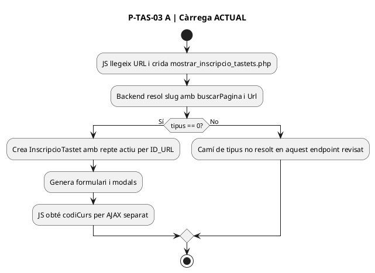
```plantuml
@startuml
title P-TAS-03 A | Càrrega ACTUAL
start
:JS llegeix URL i crida mostrar_inscripcio_tastets.php;
:Backend resol slug amb buscarPagina i Url;
if (tipus == 0?) then (Sí)
  :Crea InscripcioTastet amb repte actiu per ID_URL;
  :Genera formulari i modals;
  :JS obté codiCurs per AJAX separat;
else (No)
  :Camí de tipus no resolt en aquest endpoint revisat;
endif
stop
@enduml
```

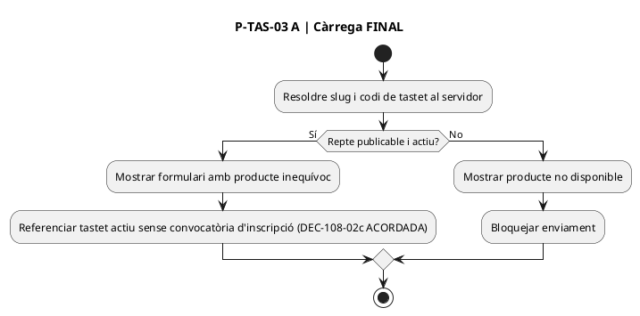
```plantuml
@startuml
title P-TAS-03 A | Càrrega FINAL
start
:Resoldre slug i codi de tastet al servidor;
if (Repte publicable i actiu?) then (Sí)
  :Mostrar formulari amb producte inequívoc;
  :Referenciar tastet actiu sense convocatòria d'inscripció (DEC-108-02c ACORDADA);
else (No)
  :Mostrar producte no disponible;
  :Bloquejar enviament;
endif
stop
@enduml
```

### 3.4 Apartat 03.B — dades personals i validació

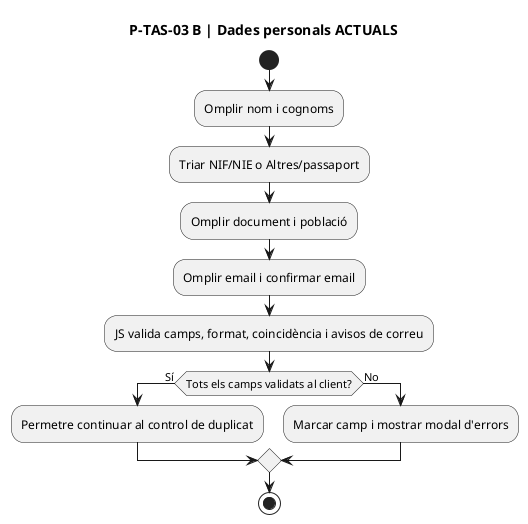
```plantuml
@startuml
title P-TAS-03 B | Dades personals ACTUALS
start
:Omplir nom i cognoms;
:Triar NIF/NIE o Altres/passaport;
:Omplir document i població;
:Omplir email i confirmar email;
:JS valida camps, format, coincidència i avisos de correu;
if (Tots els camps validats al client?) then (Sí)
  :Permetre continuar al control de duplicat;
else (No)
  :Marcar camp i mostrar modal d'errors;
endif
stop
@enduml
```

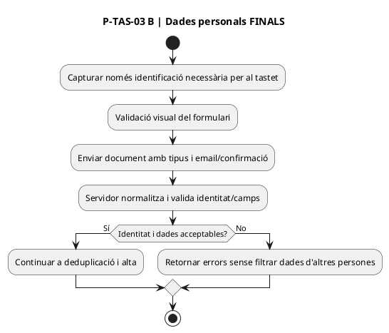
```plantuml
@startuml
title P-TAS-03 B | Dades personals FINALS
start
:Capturar només identificació necessària per al tastet;
:Validació visual del formulari;
:Enviar document amb tipus i email/confirmació;
:Servidor normalitza i valida identitat/camps;
if (Identitat i dades acceptables?) then (Sí)
  :Continuar a deduplicació i alta;
else (No)
  :Retornar errors sense filtrar dades d'altres persones;
endif
stop
@enduml
```

### 3.5 Apartat 03.C — «Com has conegut», comentaris i mailing

```plantuml
@startuml
title P-TAS-03 C | Dades finals i mailing ACTUALS
start
:Triar com ha conegut el tastet;
if (Resposta Altres?) then (Sí)
  :Omplir c_altres obligatori segons JS;
endif
:Escriure comentaris si es vol;
:Llegir text que anuncia alta automàtica al butlletí;
:No apareix camp Sí/No de mailing en aquest formulari;
:JS prepara mailing=yes;
:PHP posteriorment força mailingBD=1;
stop
@enduml
```

```plantuml
@startuml
title P-TAS-03 C | Dades finals i mailing FINALS
start
:Triar procedència, Altres si escau i comentaris opcionals;
:Mostrar text explícit: l'alta gratuïta comporta alta al butlletí/mailing; baixa posterior possible (DEC-108-04);
if (Persona opta per Sí explícit?) then (Sí)
  :Registrar «Sí» explícit i evidència UC-125;
  :Donar d'alta/reutilitzar subscripció de manera idempotent en registrar la petició;
  :Si la persistència comercial falla, registrar incidència sense afirmar subscripció efectiva;
else (No)
  :No atribuir un Sí a l'absència d'elecció; si tria No, registrar-la separadament segons UC-125;
  :No subscriure comercialment;
endif
:Amb Sí o No, permetre la sol·licitud gratuïta sense condicionar-la a l'alta comercial;
:Avisos operatius segueixen circuit propi;
stop
@enduml
```

### 3.6 Apartat 03.D — validar i decidir davant una altra inscripció

**Font específica:** [`buscarSiHaRealitzatElTastet.php`](../../codi-drive/web-actual/ajax/buscarSiHaRealitzatElTastet.php#L20-L45) consulta `CURS+DNI+INSC_CURS=1`. [JS L835–878](../../codi-drive/web-actual/js1619773569/mostrarInscripcionsTastets.min.js#L835-L878) mostra modal; [HTML del modal](../../codi-drive/web-actual/InscripcioTastet.php#L307-L326) té «Tanca», no botó «Continuar». **DEC-108-03a ACORDADA:** si l'accés anterior ha caducat, secretaria/suport desbloqueja la inscripció web per persona+tastet i la persona torna a fer l'enviament del formulari; secretaria/suport no crea la nova inscripció. El mecanisme de desbloqueig continua per definir. **DEC-108-03d ACORDADA:** després d'una baixa de la persona o denegació per secretaria, es permet una nova inscripció directa des de la web sense desbloqueig; es conserva l'historial i s'eviten dobles altes. **DEC-108-03c ACORDADA:** amb accés actiu, mostrar que ja està inscrita i impedir una segona sol·licitud, sense demanar desbloqueig. **DEC-108-03b ACORDADA:** amb una sol·licitud d'alta al campus encara pendent, mostrar que ja hi ha una sol·licitud pendent i no crear-ne una altra, sense demanar desbloqueig.

```plantuml
@startuml
title P-TAS-03 D | Duplicats ACTUALS
start
:Validacions client superades;
:AJAX comprova CURS+DNI+INSC_CURS=1;
if (Hi ha matrícula amb INSC_CURS=1?) then (Sí)
  :Mostrar data/títol d'alta anterior;
  :Modal «CONFIRMA LA INSCRIPCIÓ» amb Tanca;
  :No cridar enviarInscripcio en aquesta branca JS;
else (No)
  :Enviar nova sol·licitud;
  note right
    El detector no cerca INSC_CURS=0.
    No és protecció concurrent de servidor.
  end note
endif
stop
@enduml
```

```plantuml
@startuml
title P-TAS-03 D | Duplicats FINAL - decidir política
start
:Servidor identifica subjecte+tastet actiu, sense convocatòria pròpia (DEC-108-02c);
:Consultar sota protecció concurrent peticions i matrícules;
if (Hi ha estat preexistent?) then (No)
  :Crear petició nova una vegada;
else (Sí)
  if (Petició pendent d'alta al campus?) then (Sí)
    :Mostrar «Ja tens una sol·licitud pendent»;
    :Retornar mateixa petició; no crear cap altra alta;
    :No aplicar desbloqueig de secretaria/suport;
  else (No)
    if (Accés actiu?) then (Sí)
      :Mostrar «Ja estàs inscrit/a en aquest tastet»;
      :No crear una altra sol·licitud ni demanar desbloqueig;
    else (No)
      if (Accés anterior caducat?) then (Sí)
        :No crear nova petició fins al desbloqueig; després la persona torna al formulari;
        :Secretaria/suport fixa venciment a set dies des del canvi al campus;
        :Qui modifica la data envia l’avís amb la plantilla inicial;
        :La persona accedeix amb el compte existent (03j/k/l);
      else (No)
        if (Baixa de la persona o sol·licitud denegada?) then (Sí)
          :Permetre nova inscripció directa des de formulari web;
          :Conservar historial anterior i crear petició nova idempotent;
          :No requerir desbloqueig de secretaria/suport;
        else (No)
          :Estat no classificat; revisar abans de crear altra alta;
        endif
      endif
    endif
  endif
endif
:Cap segona alta per doble clic;
stop
@enduml
```

### 3.7 Apartat 03.E — enviar, escriure dades i generar resultat

```plantuml
@startuml
title P-TAS-03 E | Enviament ACTUAL
start
:JS GET enviarInscripcioTastet.php amb mailing=yes;
:PHP consulta reptes.ESTAT=1 per codiCurs;
:Compon correus de gratuïtat i presumpta acceptació de mailing;
:PHP fixa mailingBD=1;
:INSERT a inscripcions_reptes;
:Genera token xifrat+HMAC de l'ID;
:Echo del token;
:Consulta i INSERT a mailing si email no hi consta;
:Tramita altres escrits/comunicacions llegats;
if (JS rep token sense cadena error?) then (Sí)
  :Redirigeix a confirmació;
else (No)
  :Mostra modal error;
endif
stop
@enduml
```

```plantuml
@startuml
title P-TAS-03 E | Enviament FINAL proposat
start
:POST amb request_id, producte validable i dades mínimes;
:Revalidar tastet, persona, estat i regla de mailing al servidor;
if (Sol·licitud invàlida?) then (Sí)
  :Error tipificat sense alta;
  stop
endif
:Crear o recuperar petició gratuïta amb idempotència;
:Gestionar petició al web/intranet i accés al campus; integració SIF només si DEC-108-06 ho aprova;
:Persistir alta comercial obligatòria amb idempotència i traça; UC-125 governa baixa/supressió;
if (Ha triat Sí explícit?) then (Sí)
  :Activar/reutilitzar subscripció en enviar la petició sense segon correu de confirmació;
  :Registrar resultat comercial real, incidència si falla i evitar duplicats en reintents;
else (No)
  :Si hi ha baixa comercial posterior, no reactivar-la per simple retry de la mateixa petició;
endif
:Registrar petició pendent d'alta MANUAL per secretaria i notificació operativa de sol·licitud rebuda (DEC-108-05a);
:No executar alta automàtica Moodle en aquesta fase;
note right
  L’alta manual de secretaria, els avisos i la pròrroga són actuacions posteriors.
  Vegeu P-TAS-04 i la seqüència UC-108; no condicionen la resposta web.
end note
:Retornar ID, estat de sol·licitud i token segur si aprovat;
:Mai crear factura, TPV o CHARGE. Alta mailing obligatòria i idempotent; baixa posterior possible; cas tastet A → baixa → tastet B continua obert;
stop
@enduml
```

## 4. P-TAS-04 — Pàgina de confirmació i accés acadèmic posterior

### 4.1 ACTUAL — pàgina completa: apartats 04.A–04.C

```plantuml
@startuml
title P-TAS-04 | Confirmació ACTUAL
start
partition "Navegador" {
  :Rebre URL /tastets/confirmacio/{slug}/{token};
  :JS crida mostrar_confirmacio_inscripcio_tastet_automatic.php;
}
partition "PHP / BD" {
  :Recuperar clau i token de la URL;
  :Comprovar HMAC i desxifrar ID;
  if (HMAC vàlid?) then (Sí)
    :Buscar inscripcions_reptes per ID i INSC_CURS en 0/1;
    if (Registre acceptable?) then (Sí)
      :Construir pàgina de sol·licitud rebuda;
    else (No)
      :Mostrar error / registre no disponible;
    endif
  else (No)
    :Mostrar error de token;
  endif
}
partition "Visitant" {
  :Llegir estat, email i termini orientatiu;
  :Pot contactar amb secretaria en cas d'incidència;
}
stop
@enduml
```

### 4.2 FINAL PROPOSAT — pàgina completa

```plantuml
@startuml
title P-TAS-04 | Confirmació FINAL condicionada
start
:Obrir enllaç de resultat;
:Verificar token i dret a consultar només la petició pròpia;
if (No autoritzat o token invàlid?) then (Sí)
  :No revelar email, document o existència aliena;
  stop
endif
 :Consultar estat real de petició i matrícula; només secretaria fa manualment l'alta al campus en la fase actual (DEC-108-05a);
if (Accés Moodle confirmat després d'alta manual?) then (Sí)
  :Mostrar activació efectiva al campus i venciment ordinari SET DIES DESPRÉS A LA MATEIXA HORA de l'activació real (DEC-108-02b/d), si les dates estan verificades; si hi ha pròrroga per incidència de claus que ha impedit entrar, mostrar el venciment REAL SET DIES DESPRÉS A LA MATEIXA HORA de la resolució (DEC-108-05j/k i DEC-108-02d; registre real pendent de verificar), MAI arrodonir a 23.59 h;
  :Mostrar l'estat verificat; en crear MANUALMENT un compte nou, el campus pot generar/enviar el correu AUTOMÀTIC de credencials; els membres existents conserven les claus. Secretaria prepara amb la plantilla existent i envia MANUALMENT l'avís d'accés activat, independentment de l'estat comercial del mailing. Obrir aquesta pàgina no ha de disparar cap correu;
else (No)
  :Mostrar sol·licitud rebuda / alta manual per secretaria encara pendent, sense afirmar accés;
endif
:Mostrar incidència i via de contacte si escau;
:No afirmar pagament, factura ni consentiment comercial;
stop
@enduml
```

### 4.3 Apartat 04.A — validar token i recuperar el registre

```plantuml
@startuml
title P-TAS-04 A | Recuperació ACTUAL
start
:Extreure token de REQUEST_URI;
:Descodificar base64 i separar IV/HMAC/ciphertext;
:Desxifrar identificador;
if (hash_equals(HMAC calculat, HMAC aportat)?) then (Sí)
  :Buscar ID i INSC_CURS 0/1 a inscripcions_reptes;
  if (Existeix registre?) then (Sí)
    :Recuperar repte i email per mostrar;
  else (No)
    :Error/registre no disponible;
  endif
else (No)
  :Error de token;
endif
stop
@enduml
```

```plantuml
@startuml
title P-TAS-04 A | Recuperació FINAL
start
:Validar token, caducitat/política i vinculació al subjecte;
if (Consulta autoritzada?) then (Sí)
  :Consultar petició i versions d'estat acadèmic;
  :Minimitzar dades personals que es mostren;
else (No)
  :Error sense exposar dada d'un altre participant;
endif
stop
@enduml
```

### 4.4 Apartats 04.B/C — missatge, termini, contacte i incidències

```plantuml
@startuml
title P-TAS-04 B/C | Missatge ACTUAL
start
:Mostrar «La teva sol·licitud ha estat enviada»;
:Indicar revisar email i correu brossa;
:Informar que el tastet és gratuït;
:Indicar 24/48 h laborals per activar i una setmana després de l'alta;
:Mostrar contacte secretaria en cas de problema;
:No verificar Moodle des d'aquesta vista;
stop
@enduml
```

```plantuml
@startuml
title P-TAS-04 B/C | Missatge FINAL condicionat
start
if (Sol·licitud rebuda però sense accés?) then (Sí)
  :Mostrar petició rebuda, pendent de tramitació MANUAL per secretaria en 24–48 h laborals i una setmana d'accés des de l'activació real (DEC-108-02a/b, DEC-108-05a ACORDADES);
  :No mostrar «ja tens accés»;
else (No)
  :Mostrar matrícula i dates confirmades si existeixen;
endif
if (Notificació o Moodle han fallat?) then (Sí)
  :Mostrar incidència/pendent i via de contacte;
  :Reintentar només les fases tècniques idempotents; si l'alta MANUAL de secretaria és pendent o ha fallat, registrar/escalar la incidència sense crear automàticament la matrícula Moodle;
endif
:No atribuir consentiment de mailing ni resultat fiscal;
stop
@enduml
```

## 5. Matriu de traçabilitat ACTUAL → FINAL de les activitats

| Pàgina/apartat | Acció → codi / mètode / dades | UC | Estat actual → modificació | Prova pendent |
| --- | --- | --- | --- | --- |
| 01.A/B/C | `Tastets::__mostrarSeccio1–4` i `__mostrarTastets` → `reptes.ESTAT` | 108 | Contingut i targetes actives → revalidació de disponibilitat per selecció. | TG-108-01 |
| 01.D | `Tastets::__modalSubscription`, `mostrarTastets.min.js` → modal/email | 125 | Opcions avisos/butlletí amb resultat parcialment desconegut → finalitats i confirmació independents. | DEC-108-07 |
| 02.A/B/C/E | `Tastet::__mostrarSeccio1–5` → `reptes` i curs original | 108 | Contingut gratuït, link curs i modal → oferta separada i contingut vigent. | TG-108-01 |
| 02.D | `Tastet::__mostraBotoInscripcio` → ruta `/inscripcions/tastets/{slug}` | 108 | Navegació → producte revalidat al servidor de l'alta. | TG-108-01/08 |
| 03.A | `mostrar_inscripcio_tastets.php`, `InscripcioTastet::__construct/mostrar` → `reptes` | 108 | Formulari dinàmic → tastet actiu, sense convocatòria d'inscripció pròpia; revalidar l'estat actiu en l'enviament. | TG-108-01/01a/08 |
| 03.B | `InscripcioTastet::__mostrarDadesPersonals`, validacions JS | 108/126 | Validació navegador → validació server / identitat correcta. | TG-108-02/03 |
| 03.C | `InscripcioTastet::__mostrarFinal`, JS `mailing='yes'` | 108/125 | Alta comercial automàtica actual → **DEC-108-04: condició obligatòria del tastet; fer-la idempotent, amb baixa posterior i sense selector Sí/No.** | TG-108-06/06a/06b/07/69–74 |
| 03.D | `buscarSiHaRealitzatElTastet.php` → `inscripcions_reptes.INSC_CURS=1` | 108/107 | Modal «Tanca», sense protecció pendents → **DEC-108-03b: mostrar avís de sol·licitud pendent i no crear alta nova; aplicar al servidor amb lock; caducats segons DEC-108-03a; **actius segons DEC-108-03c: mostrar ja inscrita sense alta nova ni desbloqueig; baixa/denegació segons DEC-108-03d: nova sol·licitud web sense desbloqueig.** | TG-108-04/05/05d/05e/05f/05g |
| 03.E | `enviarInscripcioTastet.php` → `inscripcions_reptes`, `mailing`; token i correus | 108/125/129 | Efectes successius → orquestració/reintent separat. | TG-108-06/09/12/13 |
| 04.A | `mostrar_confirmacio_inscripcio_tastet_automatic.php` → token/HMAC, ID/INSC_CURS | 108/126 | Comprovació de token i registre → permís de lectura al subjecte i minimització. | TG-108-11 |
| 04.B/C | `PaginaConfirmacioTastet::mostrarPaginaConfirmacio` → email i text orientatiu | 108/129 | Sol·licitud rebuda amb previsió d'accés → mostrar estat d'accés efectiu quan existeixi. | TG-108-09/10 |

## 6. Decisions pendents abans de donar aquests diagrames per «finals»

**DEC-108-01:** política d'identitat/token/lectura del resultat. **DEC-108-02a ACORDADA:** mantenir alta al campus en 24–48 hores laborals després de rebre la sol·licitud, sense confondre petició rebuda amb accés activat. **DEC-108-02b/d ACORDADES:** una setmana d'accés des de l'activació real per secretaria al campus, no des de l'enviament de la petició, **amb venciment EXACTAMENT set dies després a la mateixa hora de l'activació**; per a la pròrroga, EXACTAMENT set dies després a la mateixa hora de la resolució de la incidència, **mai fins a les 23.59 h**. **DEC-108-02c ACORDADA:** tastets oberts a sol·licituds en qualsevol moment mentre `reptes.ESTAT=1`, sense convocatòries d'inscripció; revalidar disponibilitat en l'enviament. **DEC-108-02 · REGLA HORÀRIA ACORDADA (DEC-108-02d):** venciment set dies després a la mateixa hora d'inici en accés ordinari i en pròrroga; pendent comprovar el càlcul i l'aplicació efectius al campus, no definir una altra hora de negoci; **la repetició després de caducar requereix autorització**. **DEC-108-03:** sol·licituds pendents (DEC-108-03b), accessos actius (DEC-108-03c), caducats (DEC-108-03a) i baixa/denegació (DEC-108-03d) ACORDATS. **DEC-108-03d ACORDADA:** després de baixa voluntària o petició denegada, nova inscripció directa al formulari web sense desbloqueig; conservar historial, validar i prevenir dobles altes. **DEC-108-03c ACORDADA:** amb accés actiu al mateix tastet, mostrar que ja està inscrita i no crear una altra sol·licitud, sense desbloqueig. **DEC-108-03b ACORDADA:** segona petició de la mateixa persona i tastet mentre la primera segueix pendent d'alta al campus → mostrar avís «Ja tens una sol·licitud pendent» i no crear cap altra alta ni exigir desbloqueig. **DEC-108-03a ACORDADA:** si l'accés ha caducat, secretaria/suport desbloqueja la inscripció web per aquella persona+tastet i és la persona qui torna a omplir i enviar el formulari; via de sol·licitud per correu acordada (DEC-108-03g); control tècnic pendent; ús únic i sense caducitat temporal acordats (DEC-108-03e/f). **DEC-108-04 ACORDADA:** l'alta al tastet gratuït comporta alta obligatòria al mailing, sense selector Sí/No, amb baixa posterior. Un retry de la mateixa petició no pot duplicar ni reactivar la subscripció. **OBERT:** tastet A → baixa → tastet B i el model tècnic de baixa/supressió amb UC-125. **DEC-108-05a ACORDADA:** secretaria fa manualment l'alta al campus en la fase actual, un cop rebuda la sol·licitud web; el formulari i els workers no han de crear automàticament la matrícula Moodle ara. L'automatització es vol per al 2027 però queda fora de l'abast actual. **DEC-108-05b ACORDADA:** després d'haver completat l'alta manual efectiva, secretaria envia un correu operatiu a la persona informant que ja pot accedir al campus; és diferent de la confirmació de recepció i també s'envia després d'una baixa comercial. **DEC-108-05c ACORDADA:** per ara secretaria prepara i envia el correu MANUALMENT; el sistema no el dispara automàticament i no s'ha d'implementar una automatització de tramesa en la fase actual. **DEC-108-05d ACORDADA:** secretaria utilitza una PLANTILLA JA PREPARADA per a aquest correu; el text literal, la ubicació i els camps concrets de la plantilla encara s'han de contrastar. **DEC-108-05e ACORDADA:** el correu manual només informa de l'accés activat, sense enllaç al campus ni instruccions per obtenir claus; els membres existents conserven les claus. **DEC-108-05f ACORDADA:** quan secretaria dona d'alta MANUALMENT una persona que encara no té compte al campus, el CAMPUS li envia AUTOMÀTICAMENT per correu les claus; és independent del correu manual posterior i no representa una alta Moodle automàtica. Pendent de comprovar plantilla, disparador i resultat reals del correu del campus, sense consignar claus en la documentació. Pendent verificar el registre real de dates d'activació/venciment, destinatari, plantilla, evidència de l'enviament i possible implementació tècnica del correu (UC-129). **DEC-108-05g ACORDADA:** si un nou membre no rep el correu automàtic de claus, secretaria envia igualment la plantilla manual informativa DESPRÉS de l'activació real; registrar/tractar la incidència de claus separadament, sense equiparar avís enviat a credencials rebudes o sessió iniciada. **DEC-108-05h/i ACORDADES:** incidència de claus separada de l'avís manual: secretaria és el primer punt d'atenció i intenta reenviar o regenerar les claus des del campus; si no ho resol, deriva a Isa (suport tècnic) i, si persisteix, a desenvolupament (Meriem). Funcions reals de campus, permisos i traça pendents de contrastar, sense exposar credencials ni duplicar comptes. **DEC-108-05j/k/l ACORDADES:** quan una incidència de claus impedeix entrar durant part de la setmana, **concedir una NOVA SETMANA COMPLETA des de la resolució acreditada de la incidència**, no conservar el venciment original ni afegir només els dies perduts. **Secretaria o Isa modifiquen el venciment al campus (DEC-108-05l)** i es comunica **per correu que tindrà 7 dies d’accés, sense data exacta de venciment, després de concedir la pròrroga (DEC-108-05m/n/o/p)**. **DEC-108-05q — SITUACIÓ ACTUAL:** no hi ha seguiment específic de la incidència de claus ni de la pròrroga a la intranet o en cap eina addicional. Aquesta manca de seguiment no elimina l'ajust del venciment al campus ni l'avís manual, i no autoritza a donar per provada la seva execució. **DEC-108-05m, DEC-108-05n, DEC-108-05o i DEC-108-05p ACORDADES:** el missatge de pròrroga informa que tindrà 7 dies d'accés, sense data exacta de venciment; **Isa o secretaria l'envien MANUALMENT utilitzant LA MATEIXA plantilla que l'avís inicial, amb el missatge adaptat per a la pròrroga**, i el campus no l'envia automàticament pel canvi del venciment. Pendent de contrastar la plantilla, el destinatari i la traça real de la tramesa. Verificar instant de resolució, aplicació del venciment set dies després a la mateixa hora ja acordada, permisos, actor que executa el canvi i nou venciment al campus, sense exigir un registre addicional de seguiment (DEC-108-05q); no confondre-ho amb una nova matrícula ni amb l'avís manual d'activació. **DEC-108-06 OBERTA:** decidir entre correlacionar la petició amb `commercial_operation NON_BILLABLE/FREE_SAMPLE` o mantenir UC-108 fora del SIF. Cap opció crea factura, pagament, `CHARGE` ni AEAT; una compra posterior de pagament té cas propi. **DEC-108-07 ACORDADA:** avisos de tastets i butlletí són la mateixa subscripció; ajustar els controls/textos que els separen i traçar el peu compartit.

**Estat documental reconciliat (25/09/2026):** la representació ACTUAL remet al tall de codi citat, no al desplegament. Les regles DEC-108-02a–d, 03a–d, 04a/b i 05a–q ja estan acordades i no s’han de tornar a presentar com a decisions obertes. Resten per definir identitat/token (01), detalls tècnics del desbloqueig, text/evidència de consentiment (04), adequació dels controls a la subscripció única ja acordada (07). Implementació i proves continuen sense quedar acreditades per aquests diagrames. **No iniciar l'auditoria d'altres UC mentre la revisió funcional d'aquest cas segueix oberta.**

### Precisió del desbloqueig d’un sol ús

**DEC-108-03e ACORDADA (25/09/2026):** cada desbloqueig de secretaria/suport autoritza una única nova inscripció de la mateixa persona al mateix tastet després de caducar l’accés. Un cop utilitzat, repetir el tastet després d’una nova caducitat requereix una nova autorització. Els reintents de la mateixa petició no són noves inscripcions. DEC-108-03f confirma que el desbloqueig no caduca abans d’utilitzar-lo.

**Criteri tècnic derivat (disseny, no implementat):** vincular el desbloqueig a la nova sol·licitud acceptada i consumir-lo juntament amb la persistència d’aquesta sol·licitud. Un formulari invàlid o una alta no persistida no el consumeix. Dues peticions simultànies no poden crear dues altes amb el mateix desbloqueig; un reintent equivalent recupera la sol·licitud ja creada. No és un nou registre SIF ni un seguiment de les incidències de claus.

### 25/09/2026 — Vigència del desbloqueig

**DEC-108-03f ACORDADA (25/09/2026):** el desbloqueig no té caducitat temporal mentre no s’hagi utilitzat: la persona pot enviar el formulari quan vulgui. Es manté l’ús únic per persona+tastet (DEC-108-03e) i la validació que el tastet estigui actiu. Els set dies d’accés comencen amb l’activació efectiva al campus (DEC-108-02b/d), no amb el desbloqueig ni amb l’enviament del formulari.

Font: resposta explícita «pot fer-ho quan vulgui». Decisió documental; implementació i proves no acreditades per aquesta actualització.

### 25/09/2026 — Canal de petició del desbloqueig

**DEC-108-03g ACORDADA (25/09/2026):** la persona demana el desbloqueig del tastet per correu electrònic. Secretaria/suport gestiona el desbloqueig segons DEC-108-03a; l’enviament del correu no és una nova inscripció ni activa l’accés al campus. Després del desbloqueig, és la persona qui emplena i envia el formulari web. El desbloqueig es fa des del campus (DEC-108-03h); l’adreça destinatària i el control concret del campus no s’han precisat.

Font: resposta explícita «escriu un coreu». Actualització documental; cap correu enviat ni canvi de codi.

### 25/09/2026 — Sistema de gestió del desbloqueig

**DEC-108-03h ACORDADA (25/09/2026):** secretaria o suport fa el desbloqueig des del campus, segons resposta explícita de la usuària. El canal de petició és el correu electrònic (03g). Resta identificar l’acció concreta del campus i el seu efecte sobre l’accés i la possible reinscripció web; no s’infereix una sincronització campus→web ni un nou servei automàtic. Es mantenen les regles acordades d’ús únic, absència de caducitat abans de l’ús i set dies des de l’activació efectiva.

Actualització de fitxes i diagrames; no s’ha operat al campus ni modificat PHP/BD.

### 25/09/2026 — Acció concreta al campus i coherència pendent

**DEC-108-03i ACORDADA (25/09/2026):** el desbloqueig es fa canviant la data de venciment al campus. Aquesta és l’acció concreta confirmada per la usuària. **COHERÈNCIA PENDENT:** precisar si aquest canvi renova directament l’accés existent o si encara cal el nou formulari web descrit a DEC-108-03a/e/f, i des de quin instant es calcula el nou venciment. No afirmar que canviar la data crea una autorització web ni una nova matrícula. La regla dels set dies des de l’activació efectiva es manté; no s’infereix un còmput des del primer inici de sessió. El circuit de repetició de tastet i la pròrroga per incidència de claus no s’assimilen automàticament.

Font: resposta explícita «Canvieu la data de venciment». La usuària demana agrupar les preguntes per agilitzar la definició. Actualització documental; cap acció executada al campus.

### 25/09/2026 — Renovació aclarida per la usuària

**DEC-108-03j/k/l — SUPERADES:** la redacció que permetia renovar un accés caducat només canviant el venciment, sense formulari nou, **no és la regla vigent**. Regla actual: si l'accés ha caducat, secretaria/suport desbloqueja **persona+tastet** i la persona torna al formulari web i envia una **nova sol·licitud**, conservant historial (DEC-108-03a). La pròrroga per incidència de credencials és un cas diferent: si la incidència ha impedit entrar, s'ajusta el venciment per donar set dies complets des de la resolució.

Font: respostes agrupades 1–3 de la usuària. La renovació queda definida documentalment; no s’ha executat cap canvi al campus, enviament ni prova funcional.

### Contrast de les respostes amb el codi disponible — 25/09/2026

**Contrast amb codi abans de preguntar:** `web-actual/ajax/buscarSiHaRealitzatElTastet.php:20` consulta `CURS=? AND DNI=? AND INSC_CURS=1`; acredita el criteri DNI+tastet, però no una consulta del venciment real al campus. `web-actual/ajax/enviarInscripcioTastet.php:213,255–269` força mailing a 1 i consulta/insereix `mailing`: la persistència llegida fa alta directa però no acredita idempotència, baixa/supressió ni política de reentrada. `Tastets.php:200–239` i `js1619773569/mostrarTastets.min.js:238–259` conserven textos i controls de xerrades/dues opcions: són una discrepància de la còpia, no motiu per tornar a preguntar si el negoci vol dues subscripcions. La decisió 07 és única; resta adequar el codi i comprovar els consumidors reals.

La resta de l’autenticació i l’accés segur a la confirmació no es dedueix només de conèixer el DNI. No s’ha accedit al campus ni s’han enviat correus.
