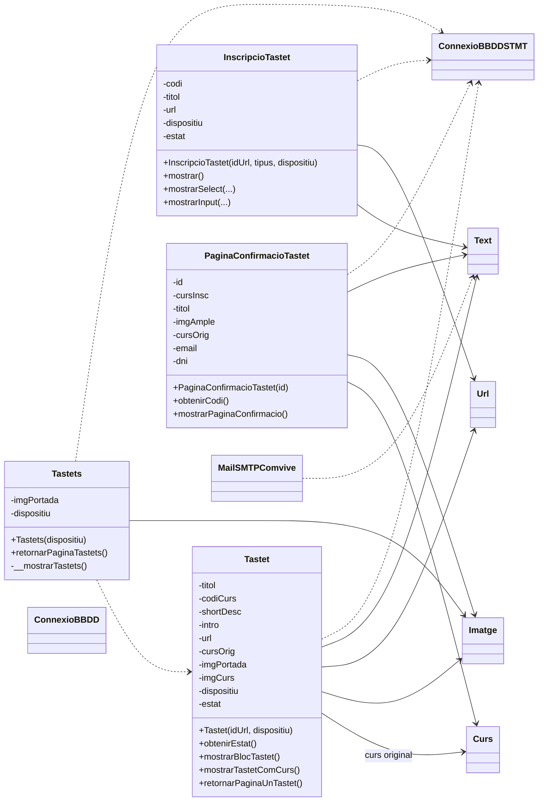
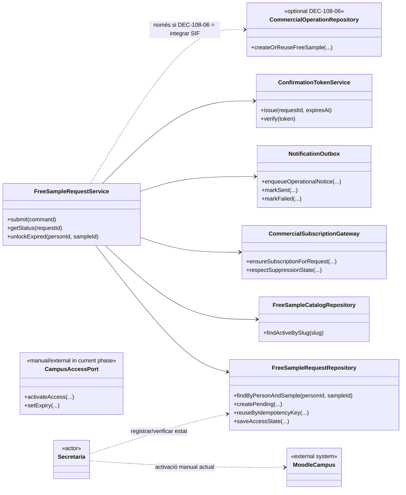

# UC-108 — Diagrames de classes ACTUAL i FINAL auditats

**Data d'auditoria:** 29/09/2026  
**Base de codi contrastada:** `main` / snapshot versionat del web llegat.  
**Estat:** documentació d'auditoria. ACTUAL = observat estàticament al codi versionat; FINAL = arquitectura objectiu, no implementació acreditada.

## 1. Decisions de negoci que governen el model FINAL

- El tastet és gratuït i la sol·licitud no crea per si mateixa factura, pagament ni registre AEAT.
- **DEC-108-04:** l'alta al tastet comporta l'alta al butlletí/mailing com a condició comercial del servei gratuït. No hi ha selector Sí/No al formulari del tastet. La persona es pot donar de baixa posteriorment.
- Un reintent tècnic de la **mateixa sol·licitud** no pot reactivar ni duplicar el mailing.
- Cas encara obert: tastet A → baixa del mailing → tastet B. Cal decidir si la nova alta reactiva o respecta la baixa prèvia.
- **DEC-108-06 continua OBERTA:** o bé es crea `commercial_operation NON_BILLABLE/FREE_SAMPLE`, o bé UC-108 resta fora del SIF. Cap de les dues opcions es representa com a implementada.
- Secretaria activa manualment el campus en 24–48 hores laborals.
- L'accés dura set dies exactes des de l'activació efectiva, a la mateixa hora del setè dia.
- Pendent bloqueja duplicat; accés actiu bloqueja duplicat; caducat requereix desbloqueig persona+tastet; baixa/denegació permet nova sol·licitud conservant historial.
- Moodle només envia credencials automàticament quan crea un compte nou; els usuaris existents conserven les credencials.
- Incidència de credencials: secretaria → Isa → desenvolupament. Si ha impedit l'accés, es concedeixen set dies complets des de la resolució.
- No es crea un tracker d'incidències específic del UC-108 en la fase actual.

## 2. Classes ACTUALS observades

### 2.1 Controladors procedurals ACTUALS

No són classes i no s'han de representar com si ho fossin:

- `ajax/mostrar_pagina_tastets.php`
- `ajax/mostrar_pagina_tastet.php`
- `ajax/mostrar_inscripcio_tastets.php`
- `ajax/obtenirCodiTastet.php`
- `ajax/buscarSiHaRealitzatElTastet.php`
- `ajax/enviarInscripcioTastet.php`
- `ajax/mostrar_confirmacio_inscripcio_tastet_automatic.php`

`InscripcioTastet` **renderitza** el formulari; no registra la fila d'inscripció. L'INSERT real és al controlador procedural `enviarInscripcioTastet.php`.

## 3. Problemes estructurals ACTUALS que el diagrama ha de fer visibles

1. `Tastet` fixa `estat=1` de manera incondicional encara que el SELECT no trobi cap repte actiu.
2. `Tastet` pot deixar `cursOrig` sense inicialitzar si el curs original existeix però `Curs::obtenirEstat()==0`.
3. P-TAS-02 queda acoblada al curs comercial original encara que el tastet estigui actiu.
4. `InscripcioTastet` calcula `estat=0` quan no hi ha repte actiu però `mostrar()` no utilitza aquest estat abans de demanar títol/codi.
5. `PaginaConfirmacioTastet` construeix `Imatge` i `Curs` encara que la confirmació textual no els necessita.
6. `MailSMTPComvive` ignora el resultat booleà de `PHPMailer::send()`.
7. El flux mutador i els seus efectes de mailing/correu no estan encapsulats en cap servei transaccional/idempotent.

## 4. Classes FINAL proposades

## 5. Regles del model FINAL

### 5.1 Petició web

`FreeSampleRequestService` només registra/reutilitza la petició. **No espera** l'activació manual de Moodle per respondre.

### 5.2 Mailing

`CommercialSubscriptionGateway` no representa un selector opcional. Representa l'efecte comercial obligatori de l'alta gratuïta i ha de:

- ser idempotent per `request_id`;
- no duplicar contactes;
- no reactivar una baixa a causa d'un simple retry;
- consultar l'estat de supressió/baixa canònic;
- deixar explícit com es resol el cas tastet A → baixa → tastet B quan es tanqui aquesta decisió.

### 5.3 Campus

En la fase actual no s'introdueix un `MoodleEnrollmentGateway` automàtic dins del submit web. Secretaria continua sent l'actor que activa manualment l'accés. L'automatització prevista per al 2027 és fora d'abast.

### 5.4 SIF

`CommercialOperationRepository` és **opcional** i condicionat a DEC-108-06. No s'ha de dibuixar com a dependència obligatòria fins que la decisió es tanqui.

## 6. Estat d'auditoria

| Element | Documentat | Implementat al snapshot | Verificat en runtime |
|---|---:|---:|---:|
| Classes llegades principals | Sí | Sí | No |
| Servei idempotent FINAL | Sí, proposat | No acreditat | No |
| Mailing obligatori + baixa posterior | Sí, decisió negoci | Parcialment: alta forçada actual | No |
| Activació manual campus | Sí, decisió negoci | Fora del web auditat | No |
| Venciment 7 dies exactes | Sí, decisió negoci | No acreditat | No |
| Integració SIF FREE_SAMPLE | Decisió oberta | No acreditada | No |

## 7. Traçabilitat

- Fitxa funcional: [UC-108](../06-fitxes-funcionals/uc-108.md)
- Activitats ACTUAL/FINAL: [UC-108 activitats](uc-108-activitats-pagines-tastets-actual-final.md)
- Seqüències ACTUAL/FINAL: [UC-108 seqüències](uc-108-sequencies-actual-final.md)
- Auditoria i matriu de troballes: [UC-108 auditoria 29/09/2026](uc-108-auditoria-tracabilitat-2026-09-29.md)
