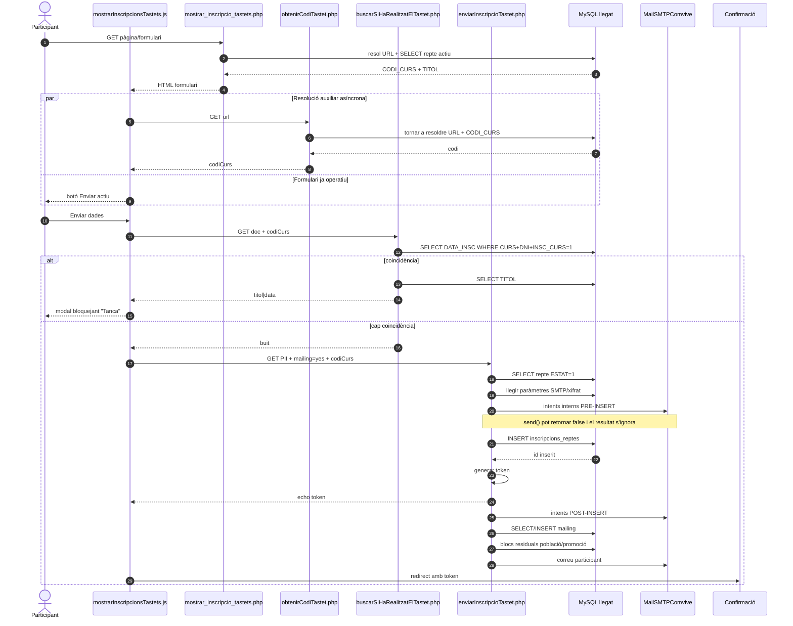
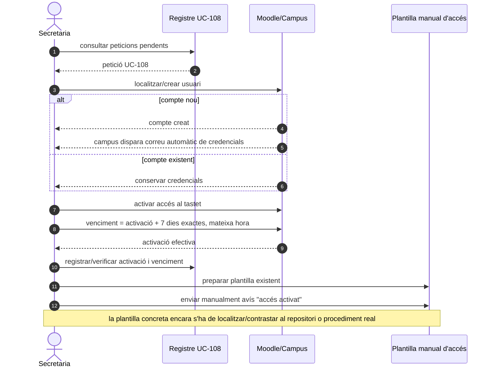
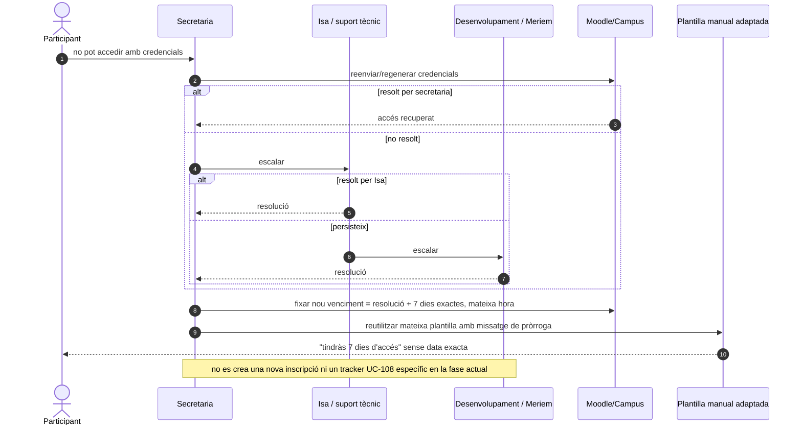
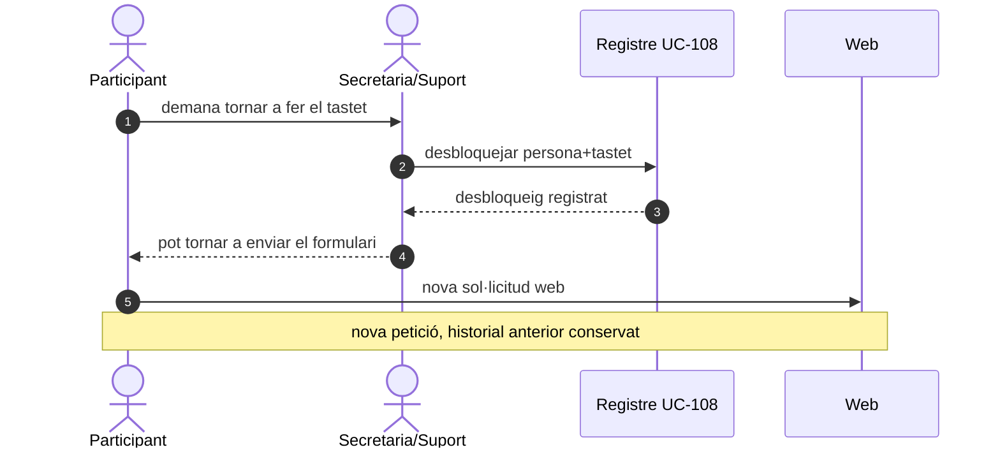

# UC-108 — Diagrames de seqüència ACTUAL i FINAL

**Data:** 29/09/2026  
**Regla:** ACTUAL descriu el codi versionat; FINAL descriu l'objectiu i no acredita implementació.

## 1. SEQ-108-ACTUAL · Alta web llegada



### Riscos visibles a la seqüència ACTUAL

- cursa perquè `codiCurs` es resol en segon AJAX sense bloquejar el botó;
- GET mutador amb PII;
- precheck de duplicat separat de l'INSERT;
- correus abans de persistir;
- efectes posteriors després de l'`echo token`;
- resultat SMTP ignorat;
- cap `request_id` idempotent.

## 2. SEQ-108-FINAL-A · Sol·licitud web

```mermaid
sequenceDiagram
autonumber
actor P as Participant
participant WEB as Web
participant S as FreeSampleRequestService
participant CAT as FreeSampleCatalogRepository
participant R as FreeSampleRequestRepository
participant M as CommercialSubscriptionGateway
participant O as NotificationOutbox
participant T as ConfirmationTokenService
participant C as CommercialOperationRepository (opcional)

P->>WEB: POST /tastets/{slug}/requests + idempotency_key
WEB->>S: submit(command)
S->>CAT: findActiveBySlug(slug)

alt tastet inexistent/inactiu
  CAT-->>S: no disponible
  S-->>WEB: INVALID_PRODUCT
  WEB-->>P: no disponible
else tastet actiu
  CAT-->>S: sample
  S->>R: findByPersonAndSample(person,sample)

  alt pendent existent
    R-->>S: PENDING
    S-->>WEB: DUPLICATE_PENDING + request_id
  else accés actiu
    R-->>S: ACTIVE
    S-->>WEB: ALREADY_ENROLLED + request_id
  else caducat sense desbloqueig
    R-->>S: EXPIRED_LOCKED
    S-->>WEB: ACCESS_EXPIRED
  else baixa/denegació o nou
    S->>R: createOrReusePending(idempotency_key)
    R-->>S: request_id

    S->>M: ensureSubscriptionForRequest(request_id, person)
    Note over S,M: alta comercial obligatòria del tastet; retry idempotent; no reactivar baixa per simple retry

    opt DEC-108-06 = integrar al SIF
      S->>C: createOrReuseFreeSample(request_id)
      C-->>S: UUID_OPERATION
    end

    S->>O: enqueueOperationalNotice(request_id)
    S->>T: issue(request_id, expiració)
    T-->>S: token
    S-->>WEB: REQUEST_RECEIVED + request_id + token
  end

  WEB-->>P: Sol·licitud rebuda
end
```

**Important:** aquesta seqüència acaba en `REQUEST_RECEIVED`. No espera secretaria ni Moodle.

## 3. SEQ-108-FINAL-B · Tramitació manual per secretaria



## 4. SEQ-108-FINAL-C · Incidència de credencials



## 5. SEQ-108-FINAL-D · Repetició després d'expiració



## 6. Estat

- **Documentat:** sí.
- **Implementat:** només la seqüència ACTUAL llegada.
- **Verificat en runtime:** no.
- **DEC-108-06:** oberta; el bloc SIF és deliberadament `opt`.
- **Mailing A→baixa→B:** decisió pendent, no resolta per aquests diagrames.
