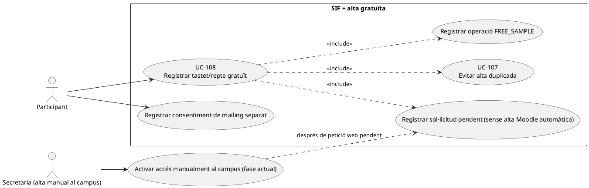
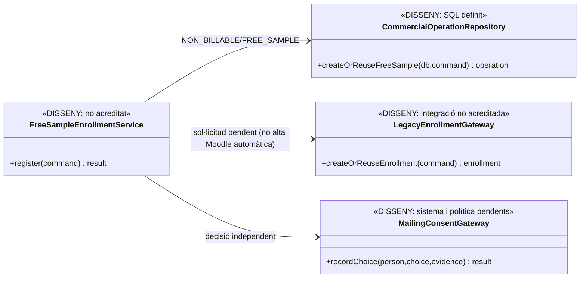

# UC-108 · Registrar un tastet o repte gratuït com a operació no facturable

**Objectiu canònic:** registrar la inscripció i la classificació `NON_BILLABLE/FREE_SAMPLE` sense factura, pagament ni enllaç de pagament. El consentiment de mailing és una decisió **independent** de la gratuïtat. La fitxa original indica com a qüestions pendents la prova del consentiment i la regla que impedeix duplicar l'accés gratuït.

**Evidència revisada:** el diccionari defineix `commercial_operation.CLASSIFICATION=NON_BILLABLE` i `FREE_SAMPLE`; la migració defineix `commercial_operation`, `commercial_operation_party` i les línies. **No s'ha acreditat al PHP SIF** un coordinador d'alta gratuïta, control d'accés temporal ni servei de consentiment. `InvoiceService` i `PaymentService` són rutes fiscals/econòmiques separades, **no** passos d'UC-108.

**Fitxa funcional revisada per pàgines:** [UC-108 — fitxa funcional específica (v2.0, decisions obertes)](../06-fitxes-funcionals/uc-108.md). **Diagrames d'activitat actual/final per cadascuna de les quatre pàgines i dotze apartats funcionals:** [UC-108 — activitats de tastets](uc-108-activitats-pagines-tastets-actual-final.md). Els diagrames finals descriuen propostes pendents de les DEC-108-01…07, no codi ja programat. La resta de models d'aquesta fitxa continuen com a referència de disseny i no substitueixen les activitats per pàgina.

## 1. Fitxa funcional específica

| Element | Regla |
| --- | --- |
| Actors | Participant, canal web i **secretaria, que fa manualment l'alta al campus en la fase actual** (DEC-108-05a). El participant pot accedir al tastet sense haver consentit rebre correus comercials. L'automatització de l'alta al campus es vol per al 2027 i és fora de l'abast actual. |
| Entrada | Identitat i `ID_INSC` si existeix, tastet/repte i edició, accés ofert, període/venciment acordat, `REQUEST_ID`, `CORRELATION_ID` i clau idempotent; elecció de mailing amb instant i text de consentiment separats. |
| Classificació | Crear/reutilitzar una operació comercial de `NON_BILLABLE` amb motiu `FREE_SAMPLE`, import efectiu zero i producte/participant identificats. Els valors són documentats al catàleg; **el writer comercial encara no està acreditat al PHP**. |
| Alta acadèmica | **DEC-108-05a ACORDADA:** el web crea una sol·licitud pendent; **secretaria fa MANUALMENT l'alta/activació al campus**, no el servidor web ni un worker automàtic. UC-107 impedeix duplicar una petició pendent o un accés encara actiu. **DEC-108-02b ACORDADA:** una setmana d'accés des de l'activació real feta per secretaria. Pendent de verificar l'inici/venciment i el registre real de Moodle/BD. Automatització desitjada per al 2027, no inclosa en l'abast actual. |
| Efectes prohibits | **Cap** `factura`, `factura_registres`, `fiscal_queue`, `payment_transaction`, `payment_allocation`, `redsys_payment_intent`, `payment_link` ni entrada al ledger de fons. Import zero no és un `CHARGE` de zero. |
| Consentiment | Elecció afirmativa o negativa i evidència diferenciada, control de finalitat i revocació segons el sistema de comunicació aprovat; no deduir consentiment de la inscripció. El servei concret de mailing no ha estat identificat. |
| Resultat | `UUID_OPERATION` i `ID_INSC`/identificador d'accés reals, classe no facturable, dates, duplicats/resolució, i dada de mailing separada, sense simular documents fiscals. |

### 1.1. Flux objectiu

1. El canal valida que el producte/edició és efectivament un tastet/repte **gratuït**. Un curs subvencionat o una compra amb preu final zero per aplicació de crèdit **no** es classifica automàticament com `FREE_SAMPLE`.
2. UC-107 detecta una alta equivalent per persona i tastet actiu (sense inventar una convocatòria per al flux continu acordat); si existeix, torna a mostrar l'accés anterior sense crear una segona operació.
3. En la fase actual, el web només crea/reutilitza una **sol·licitud pendent**. **Secretaria realitza MANUALMENT l'alta al campus** dins del termini comunicat de 24–48 hores laborals i activa l'accés. Només quan l'activació és real es registra/verifica l'inici del període d'una setmana i el venciment (DEC-108-05a/02a/02b). La futura automatització d'alta al campus es vol per al **2027**, però queda **fora d'abast**. Si s'aprova DEC-108-06, un orquestrador SIF podria registrar/reutilitzar `NON_BILLABLE/FREE_SAMPLE` sense fer ni simular l'alta Moodle automàtica.
4. Es registra la decisió de mailing a part, amb prova de què es va acceptar o rebutjar; amb «Sí» explícit i persistència comercial correcta, subscripció al butlletí directa en enviar el formulari sense correu de confirmació (DEC-108-04b). «No» o manca de «Sí» no genera subscripció; una fallada comercial no desfà l'alta acadèmica. Això no altera la classificació gratuïta.
5. **DEC-108-05e ACORDADA:** el correu manual posterior de secretaria **només informa que ja hi ha accés activat, sense enllaç al campus ni instruccions per obtenir claus**. Si la persona ja era membre conserva les credencials; si encara no ho era, quan secretaria crea manualment el compte, **el campus li envia AUTOMÀTICAMENT per correu les claus** (DEC-108-05f), per un circuit diferent del correu manual de confirmació. **DEC-108-05g ACORDADA:** la fallada o no recepció del correu de claus NO bloqueja la tramesa MANUAL del missatge informatiu posterior de secretaria quan l'accés ja és actiu; la incidència de credencials es tracta independentment. El correu manual no prova que s'hagin rebut les claus ni que s'hagi iniciat sessió. **DEC-108-05h/i ACORDADES:** secretaria atén primer la incidència i intenta reenviar o regenerar les claus des del campus; si no ho resol, deriva a Isa (suport tècnic), i finalment a desenvolupament (Meriem) si persisteix. El circuit no bloqueja el correu informatiu manual. **DEC-108-05j ACORDADA:** si la incidència impedeix entrar durant part de la setmana, prorrogar l'accés per compensar el temps perdut, sense afirmar encara una fórmula de càlcul ni automatització de la pròrroga. Verificar el comportament tècnic efectiu sense incloure credencials reals en aquest document.
6. **DEC-108-05b ACORDADA:** després que secretaria hagi completat manualment l'alta i s'hagi activat realment l'accés, **secretaria PREPARA el correu operatiu amb una PLANTILLA JA EXISTENT i l'ENVIA MANUALMENT a la persona per informar-la que ja pot accedir al campus** (DEC-108-05c/d), sense enviament automàtic del web/campus en aquesta fase. És diferent del correu de sol·licitud rebuda i s'envia independentment del «Sí/No» del butlletí, també amb «No». Cal verificar el procediment, el destinatari i l'evidència real de l'enviament sense pressupostar-ne el mecanisme tècnic. En reintent equivalent no es genera una nova entrada fiscal/econòmica ni s'atorguen dos accessos contradictoris.

### 1.2. Alternatives i proves

| Cas | Resposta |
| --- | --- |
| Mateix usuari clica dues vegades | Reús idempotent de l'operació i la inscripció; no duplicar mail ni termini sense regla expressa. |
| Disponibilitat del tastet | **DEC-108-02c ACORDADA (22/09/2026):** la inscripció web es pot sol·licitar en qualsevol moment mentre el tastet estigui actiu, sense convocatòries ni terminis d'inscripció per dates. Revalidar al servidor l'estat actiu del tastet en enviar el formulari; si ha passat a inactiu, no donar d'alta. Les regles de reintents per persona continuen vigents. La consulta actual `reptes.ESTAT=1` és visible al codi, però cal provar la ruta d'alta i el canvi d'estat entre obrir i enviar formulari. |
| Preparació i enviament del correu d'accés | **DEC-108-05c/d ACORDADES (22/09/2026):** per ara secretaria **utilitza una plantilla ja preparada, prepara el correu i l'envia manualment** després de l'alta efectiva al campus. No redacta cada missatge de zero ni s'ha d'implementar cap enviament automàtic en la fase actual; continuar separant correu de recepció i consentiment del butlletí. Pendent de contrastar contingut i ubicació de la plantilla, camps variables, destinatari i traça del procediment manual. |
| Primera actuació i escalat de la incidència de claus | **DEC-108-05h/i ACORDADES (22/09/2026):** secretaria atén primer la incidència i intenta reenviar o regenerar les claus des del campus; si no es resol, es trasllada a Isa (suport tècnic) i després a desenvolupament (Meriem). És un circuit separat de l'enviament manual de la plantilla d'accés activat. Cal contrastar les accions disponibles al campus, permisos, traça i evidència de resolució; no incloure credencials a la documentació. |
| Incidència de recepció de claus | **DEC-108-05g ACORDADA (22/09/2026):** si una persona nova no rep el correu automàtic amb les claus, secretaria envia igualment el correu manual d'accés activat un cop l'activació és real; la incidència de credencials es gestiona per separat, sense condicionar l'enviament d'un correu a la resolució de l'altre. L'avís manual no acredita recepció de claus ni accés efectiu de la persona a la seva sessió. Procediment concret d'incidències pendent de contrastar. |
| Missatge d'accés i credencials del campus | **DEC-108-05e/f ACORDADES (22/09/2026):** la plantilla manual d'accés activat **només informa que ja es pot accedir**; no inclou l'enllaç al campus ni instruccions de claus. Si ja era membre, manté les claus que tenia; si no ho era, quan secretaria crea manualment el compte al campus, el campus li envia **AUTOMÀTICAMENT per correu les claus d'accés**. El missatge del campus és diferent del correu manual de secretaria. Pendent de contrastar el disparador/plantilla/resultat reals de la tramesa automàtica i el text literal de la plantilla manual, sense registrar credencials. |
| Plantilla existent del correu d'accés | **DEC-108-05d ACORDADA (22/09/2026):** secretaria utilitza una plantilla de missatge ja preparada per al correu que comunica l'activació real del campus i l'envia manualment. No s'ha verificat el text literal, on es guarda ni quines dades s'hi han d'emplenar; no inventar-les ni atribuir al PHP generació automàtica. |
| Correu d'accés després de l'alta | **DEC-108-05b ACORDADA (22/09/2026):** quan secretaria ha completat l'alta manual i l'accés és efectiu, **envia a la persona un correu operatiu informant que ja pot accedir al campus**. No confondre'l amb el correu de recepció de sol·licitud. És independent de la subscripció comercial, també amb butlletí «No». Verificar procediment, contingut, destinatari, moment i traça; no afirmar que el PHP ja executa un enviament automàtic. |
| Procés d'alta actual i futur | **DEC-108-05a ACORDADA (22/09/2026):** secretaria tramita **manualment** l'alta/activació al campus després de rebre la petició web. La petició és pendent fins a l'alta real i no desencadena cap automatització de matrícula Moodle. La millora d'alta automàtica es vol per al **2027**, fora d'abast ara. Pendent de verificar traça real de l'alta manual, dates i avisos. |
| Pròrroga per incidència de claus | **DEC-108-05j ACORDADA (22/09/2026):** si una incidència de claus impedeix a la persona entrar al tastet durant part de la setmana, se li prorroga l'accés per compensar el temps perdut; no es conserva sense canvis el venciment original. És una modificació del venciment, NO una alta o una petició duplicada. **PENDENT:** criteri exacte de còmput, moment de resolució, responsable, procediment real de pròrroga al campus, registre de dates i possible avís de nou venciment. |
| Durada d'accés efectiva | **DEC-108-02b ACORDADA (22/09/2026):** una setmana comptada des del moment en què secretaria activa realment l'accés al campus, no des de la data d'enviament de la petició ni d'una alta encara sense accés. Pendent de verificar inici, venciment i configuració PHP/Moodle; el text web d'una setmana no acredita l'aplicació al campus. |
| Termini d'alta al campus | **DEC-108-02a ACORDADA (22/09/2026):** mantenir **24–48 hores laborals** com a termini comunicat perquè secretaria doni d'alta la persona al campus després de rebre la sol·licitud web. El PHP actual ja comunica aquest termini; cal contrastar que formulari, correus i confirmació siguin coherents i que la recepció de la petició no es presenti com a alta efectiva. **DEC-108-02b ACORDADA:** una setmana d'accés des de l'activació efectiva per secretaria al campus; pendent de verificar dates i configuració reals, no des de l'enviament del formulari. |
| Baixa de la persona o petició denegada | **DEC-108-03d ACORDADA (22/09/2026):** la persona pot tornar-se a inscriure directament des del formulari web sense desbloqueig de secretaria/suport, tant si s'ha donat de baixa com si secretaria havia denegat la sol·licitud. Conservar historial anterior i crear una nova petició quan la persona l'enviï, amb protecció davant duplicats. Pendent d'adaptar PHP/JS, identificar els estats reals i provar-ho. No aplicar aquesta exempció a accessos caducats. |
| Accés al tastet encara actiu | **DEC-108-03c ACORDADA (22/09/2026):** si la mateixa persona intenta inscriure's una altra vegada al mateix tastet mentre té l'accés actiu, mostrar que ja està inscrita i impedir una segona sol·licitud. No requerir desbloqueig de secretaria/suport, exclusiu d'accessos caducats. Pendent d'aplicar en PHP/JS i provar contra l'estat efectiu de Moodle/accés, no deduir-ho només de `INSC_CURS=1`. |
| Sol·licitud pendent d'alta al campus | **DEC-108-03b ACORDADA (22/09/2026):** si la mateixa persona torna a enviar el formulari del mateix tastet mentre la primera sol·licitud segueix pendent, mostrar que ja té una sol·licitud pendent i no crear una segona alta. No exigir desbloqueig de secretaria/suport, reservat al cas d'accés caducat. El PHP actual només cerca historial `INSC_CURS=1` en la comprovació JS; protegir també el servidor abans d'INSERT. Pendent d'aplicar i provar. |
| Tastet expirat | **DEC-108-03a ACORDADA (22/09/2026):** secretaria o suport desbloqueja la inscripció web per a aquella persona i tastet; **és la persona qui torna a emplenar i enviar el formulari**, no secretaria/suport qui l'inscriu. La caducitat no habilita una alta o renovació automàtica; el servidor ha de comprovar el desbloqueig abans d'admetre la nova alta. El procediment, la vigència i el registre tècnic concrets resten per definir, i no són codi ja implementat. |
| Preu comercial passa de zero a import positiu | Una altra classificació/oferta i acceptació UC-112; no convertir retrospectivament la reserva gratuïta en factura cobrada. |
| Mailing no consentit | **DEC-108-04a ACORDADA (22/09/2026):** el formulari del tastet inclou subscripció opcional al butlletí amb elecció «Sí/No». Si escull «No», pot inscriure's igualment al tastet i rebre les comunicacions operatives; no es crea una alta comercial ni s'infereix un «Sí» de la inscripció. **DEC-108-04b ACORDADA:** si tria «Sí» explícit, es dona d'alta directament al butlletí en enviar el formulari, **sense correu/enllaç de confirmació addicional**, sempre que l'alta comercial es registri amb èxit. Resten per concretar text/evidència/versió i implementació del consentiment a UC-125. Cal canviar JS/PHP/vista/correus i executar proves. |
| El llegat falla després d'enregistrar l'operació | Reintentar l'alta amb el mateix identificador i reconciliar UC-53, mai emetre factura o `CHARGE` com a compensació tècnica. |

**Pendents de tancament:** traçar la petició web pendent, la **intervenció manual de secretaria** al campus i el **correu operatiu posterior d'accés activat (DEC-108-05b), independent del butlletí**, identificador de recurs, dates d'activació/venciment reals, duplicats, consentiment i proves de regressió; no s'han executat proves PHP. **No incloure la futura automatització de 2027 com a tasca d'implementació de la fase actual.**

### 1.3. Endpoint llegat de tastet i diferència entre alta gratuïta i mailing

**Ruta de negoci contrastada amb el PHP de `main` (22/09/2026).** [`web-actual/ajax/enviarInscripcioTastet.php`](../../codi-drive/web-actual/ajax/enviarInscripcioTastet.php#L15-L51) està disponible: llegeix `nom`, `cog`, `dni`, `email`, `poblacio`, `conegut`, `comentaris`, `mailing` i `codiCurs` via GET i consulta `reptes.CODI_CURS` amb `ESTAT=1`. [L90–117](../../codi-drive/web-actual/ajax/enviarInscripcioTastet.php#L90-L117) declara el tastet gratuït, anuncia alta en 24/48 hores laborals i una setmana d'accés després de l'alta. [L222–234](../../codi-drive/web-actual/ajax/enviarInscripcioTastet.php#L222-L234) insereix l'alta a `inscripcions_reptes`, sense factura, intenció Redsys ni moviment bancari en aquest endpoint. L'èxit d'aquesta inserció NO prova que Moodle ja hagi concedit l'accés. El SIF no ha de registrar `payment_transaction`, intenció Redsys, factura o registre AEAT només per crear aquesta alta.

**DEC-108-04a/b ACORDADES:** al mateix formulari hi haurà elecció opcional de butlletí «Sí/No»; «No» no impedirà ni la sol·licitud gratuïta ni els avisos operatius. Amb «Sí» explícit i alta comercial registrada correctament, subscripció directa en enviar el formulari, sense segon correu/enllaç de confirmació. Si l'alta comercial falla, conservar l'estat acadèmic i registrar la incidència, sense afirmar que la subscripció ja s'ha completat. **Alta gratuïta i subscripció: discrepància real entre el PHP actual i el contracte objectiu.** El handler [llegeix `mailing`](../../codi-drive/web-actual/ajax/enviarInscripcioTastet.php#L15-L26), però fixa [`$mailingBD='1'`](../../codi-drive/web-actual/ajax/enviarInscripcioTastet.php#L210-L214); a [L255–269](../../codi-drive/web-actual/ajax/enviarInscripcioTastet.php#L255-L269) incorpora el correu a `mailing` si encara no existeix i a [L75–79](../../codi-drive/web-actual/ajax/enviarInscripcioTastet.php#L75-L79) redacta un avís que pressuposa que s'ha acceptat rebre comunicacions. **L'opció rebuda NO determina aquest comportament al fitxer revisat.** Això NO compleix la separació requerida per UC-125: si la persona tria `NO`, l'alta gratuïta i els avisos operatius han de continuar possibles, però no s'ha de crear subscripció comercial, ni afirmar una acceptació no produïda. Falta el servei de consentiment versionat per subjecte/finalitat/canal i les proves d'accés i reintent.

**Identitat, accés i reincidència.** Abans de crear una segona alta al tastet, comparar participant real i tastet, sense una convocatòria artificial en aquest flux continu. **Regla acordada:** quan l'accés anterior ha caducat, secretaria/suport desbloqueja la inscripció al formulari web per aquella persona+tastet, i la persona la torna a presentar; secretaria/suport no fa la inscripció en nom seu. El procediment tècnic d'acreditació i els altres estats de duplicat continuen pendents. Dues persones poden compartir email i una mateixa persona pot participar en edicions diferents quan s'hagi autoritzat. Un `ID_INSC` de curs de pagament o un `IDPAG` no s'han d'inventar si el handler només ha creat un ID a `inscripcions_reptes`. La disponibilitat de Moodle/accés ha de verificar-se al destí UC-129, i l'èxit de la inscripció no implica que la matrícula Moodle s'hagi confirmat.

**Canvi posterior de classificació.** Un tastet inicialment gratuït no es converteix en factura històrica si més endavant s'ofereix un curs complet de pagament o un curs subvencionat (UC-109). Cal obrir **una operació nova identificable**, congelar oferta i receptor quan sigui facturable i relacionar-la amb l'origen acadèmic, sense alterar la gratuïtat inicial ni utilitzar el mailing per deduir acceptació d'una compra.

### 1.4. Proves addicionals del handler gratuït (no executades)

| ID | Escenari | Resultat exigible |
| --- | --- | --- |
| TG-108-01 | `enviarInscripcioTastet.php` dona alta a `inscripcions_reptes` | Alta gratuïta identificable; cap factura, intenció, CHARGE ni PDF fiscal. |
| TG-108-02 | Participant tria NO al mailing del formulari | Sol·licitud gratuïta i avisos operatius disponibles, sense alta comercial, i sense que JS/PHP converteixin No en Sí. Pendent de prova. |
| TG-108-02a | Participant tria «Sí» explícit i envia el formulari del tastet | Si el registre comercial té èxit, queda subscrit directament sense correu/enllaç de confirmació addicional. Registrar l'elecció i evitar subscripcions duplicades en reintents; si falla, estat d'incidència sense afirmar alta comercial efectiva ni anul·lar la petició del tastet. Pendent de prova. |
| TG-108-03 | Dos participants comparteixen email | Altes/consentiments separats per identitat acreditada, no fusió automàtica. |
| TG-108-04 | Retry d'alta amb repte i edició equivalents | Recuperar l'alta real segons política de duplicats, sense duplicar accés o subscripció. |
| TG-108-05 | Alta al tastet registrada però accés Moodle no confirmat | Estat acadèmic pendent/UC-129, sense crear factura per reparar-lo. |
| TG-108-06 | Participant contracta un curs de pagament més endavant | Nova operació comercial/fiscal quan correspon, no conversió retrospectiva del tastet. |

## 2. UML de casos d'ús



## 3. Diagrama de classes — disseny i model SQL



**DEC-108-05a:** aquests serveis i repositoris són DISSENY. L’alta del campus no la fa `FreeSampleEnrollmentService` en la fase actual: secretaria la realitza manualment. Automatització desitjada per al 2027, no implementació actual.

Cap servei fiscal, de pagaments o d'intencions Redsys participa en aquest diagrama perquè **no hi ha import a cobrar**.

## 4. Seqüència objectiu

```mermaid
sequenceDiagram
autonumber
actor P as Participant
participant UI as Canal web de tastets
participant S as Sol·licitud gratuïta [DISSENY]
participant O as commercial_operation [SQL definit, DEC-108-06 PENDENT]
participant L as BD de sol·licituds
participant M as MailingConsentGateway [DISSENY]
actor SEC as Secretaria
participant C as Campus Moodle [alta MANUAL]
P->>UI: Enviar formulari del tastet actiu, amb opció de butlletí
UI->>S: Registrar sol·licitud (dades, tastet, requestId)
S->>S: Validar disponibilitat i estat previ segons DEC-108-03
alt Ja té petició pendent o accés actiu
 S-->>UI: Mostrar estat existent sense nova sol·licitud
else Nova sol·licitud vàlida
 opt DEC-108-06 aprova operació no facturable
  S->>O: Registrar o reutilitzar FREE_SAMPLE [DISSENY]
 end
 S->>L: Crear sol·licitud PENDENT idempotent, no matrícula Moodle
 L-->>S: Identificador i estat pendent
 S-->>UI: Sol·licitud rebuda; alta manual pendent
end
UI-->>P: Confirmació de petició, sense afirmar accés al campus
opt Hi ha sol·licitud nova vàlida
 UI->>M: Registrar opció comercial independent Sí/No i evidència
 alt Sí explícit i alta comercial reeixida
  M->>M: Activar butlletí directament, sense correu de confirmació
 else No o manca de Sí
  M-->>UI: No crear alta comercial
 else Sí amb fallada comercial
  M-->>UI: Registrar incidència; no anul·lar sol·licitud acadèmica
 end
 Note over SEC,C: DEC-108-05a. Secretaria fa l'alta MANUAL durant la fase actual; automatització desitjada per al 2027, fora d'abast.
 SEC->>C: Donar d'alta i activar manualment l'accés al tastet
 C-->>SEC: Alta efectiva i dates d'activació/venciment
 Note over SEC,C: DEC-108-02b. La setmana comença amb l'activació real; evidència de dates per verificar.
 alt La persona ja era membre del campus
  Note over SEC,C: Conserva les claus d'accés que ja tenia
 else Persona nova al campus
  C-->>P: Correu AUTOMÀTIC del CAMPUS amb claus d'accés en crear compte nou [DEC-108-05f; verificar tramesa real]
 end
 par Avís manual d'accés activat després de l'alta real
  SEC-->>P: Enviar IGUALMENT PLANTILLA MANUAL: accés activat, independent de recepció de claus [DEC-108-05b/c/d/e/f/g; també butlletí No]
 and Circuit independent de claus
  opt Persona nova que no rep el correu de claus
   P-->>SEC: Comunicar incidència de credencials [circuit concret per verificar]
   SEC->>C: Intentar reenviar o regenerar claus des del campus [DEC-108-05i; funció real per verificar]
   alt Secretaria no resol la incidència
    Note over SEC,C: Escalar a Isa (suport tècnic); si persisteix, a desenvolupament (Meriem) [DEC-108-05h]
   else Secretaria resol la incidència
    Note over SEC,C: Registrar resultat de la intervenció, sense exposar claus
   end
   Note over SEC,C: DEC-108-05g: incidència de claus SEPARADA de l'avís manual i sense bloquejar-lo
   Note over SEC,C: DEC-108-05j: si ha impedit entrar durant part de la setmana, PRORROGAR accés per compensar temps perdut; càlcul i execució Moodle pendents
  end
 end
end
Note over UI,C: Ni l'enviament web ni un registre FREE_SAMPLE activen automàticament Moodle.
```

## 5. Traçabilitat

[UC-108 original](../06-fitxes-funcionals/uc-108.md) · [UC-107 inscripció duplicada](uc-107-detectar-inscripcio-duplicada.md) · [UC-106 reserva](uc-106-crear-reserva-abans-pagament.md) · [UC-109 subvenció](../06-fitxes-funcionals/uc-109.md) · [Migració operació comercial](../../sif/database/migrations/2026_09_16_000004_add_commercial_operation_and_fiscal_fields.sql) · [Diccionari de classificació](../05-governanca-operacio/24-diccionari-camps-i-valors.md).

**Límit de la revisió (22/09/2026):** comprovació estàtica del handler de `main`, no prova del codi desplegat, de la pantalla client, de l'alta Moodle o d'execució PHP/MySQL. [Auditoria específica lot 01](00-auditoria-casos-pendents-lot-01-2026-09-22.md) · RM-024/RM-037.
