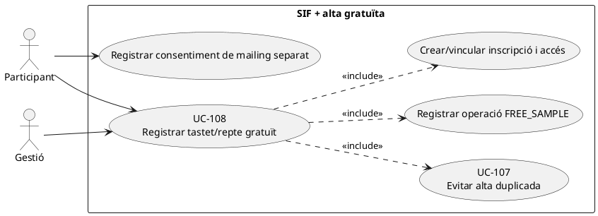
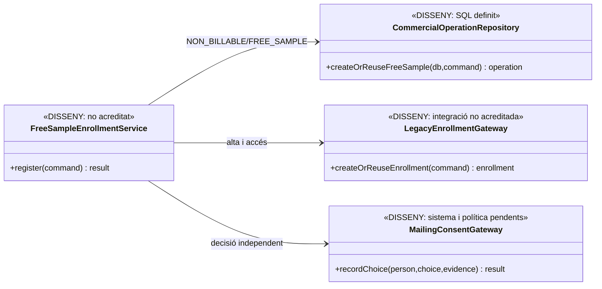
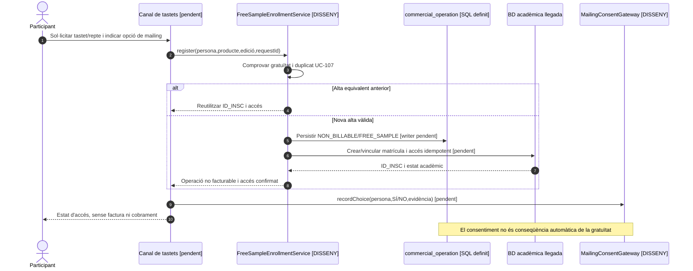

# UC-108 · Registrar un tastet o repte gratuït com a operació no facturable

**Objectiu canònic:** registrar la inscripció i la classificació `NON_BILLABLE/FREE_SAMPLE` sense factura, pagament ni enllaç de pagament. El consentiment de mailing és una decisió **independent** de la gratuïtat. La fitxa original indica com a qüestions pendents la prova del consentiment i la regla que impedeix duplicar l'accés gratuït.

**Evidència revisada:** el diccionari defineix `commercial_operation.CLASSIFICATION=NON_BILLABLE` i `FREE_SAMPLE`; la migració defineix `commercial_operation`, `commercial_operation_party` i les línies. **No s'ha acreditat al PHP SIF** un coordinador d'alta gratuïta, control d'accés temporal ni servei de consentiment. `InvoiceService` i `PaymentService` són rutes fiscals/econòmiques separades, **no** passos d'UC-108.

**Fitxa funcional revisada per pàgines:** [UC-108 — fitxa funcional específica (v2.0, decisions obertes)](../06-fitxes-funcionals/uc-108.md). **Diagrames d'activitat actual/final per cadascuna de les quatre pàgines i dotze apartats funcionals:** [UC-108 — activitats de tastets](uc-108-activitats-pagines-tastets-actual-final.md). Els diagrames finals descriuen propostes pendents de les DEC-108-01…07, no codi ja programat. La resta de models d'aquesta fitxa continuen com a referència de disseny i no substitueixen les activitats per pàgina.

## 1. Fitxa funcional específica

| Element | Regla |
| --- | --- |
| Actors | Participant, ecommerce/intranet i gestió autoritzada per casos dubtosos. El participant pot accedir al tastet sense haver consentit rebre correus comercials. |
| Entrada | Identitat i `ID_INSC` si existeix, tastet/repte i edició, accés ofert, període/venciment acordat, `REQUEST_ID`, `CORRELATION_ID` i clau idempotent; elecció de mailing amb instant i text de consentiment separats. |
| Classificació | Crear/reutilitzar una operació comercial de `NON_BILLABLE` amb motiu `FREE_SAMPLE`, import efectiu zero i producte/participant identificats. Els valors són documentats al catàleg; **el writer comercial encara no està acreditat al PHP**. |
| Alta acadèmica | Una matrícula/grant d'accés gratuït identificable al llegat, amb protecció contra segona alta de la mateixa persona/edició segons UC-107. La durada exacta de l'accés gratuït és **pendent de política**, tot i que la fitxa base preveu provar una setmana. |
| Efectes prohibits | **Cap** `factura`, `factura_registres`, `fiscal_queue`, `payment_transaction`, `payment_allocation`, `redsys_payment_intent`, `payment_link` ni entrada al ledger de fons. Import zero no és un `CHARGE` de zero. |
| Consentiment | Elecció afirmativa o negativa i evidència diferenciada, control de finalitat i revocació segons el sistema de comunicació aprovat; no deduir consentiment de la inscripció. El servei concret de mailing no ha estat identificat. |
| Resultat | `UUID_OPERATION` i `ID_INSC`/identificador d'accés reals, classe no facturable, dates, duplicats/resolució, i dada de mailing separada, sense simular documents fiscals. |

### 1.1. Flux objectiu

1. El canal valida que el producte/edició és efectivament un tastet/repte **gratuït**. Un curs subvencionat o una compra amb preu final zero per aplicació de crèdit **no** es classifica automàticament com `FREE_SAMPLE`.
2. UC-107 detecta una alta equivalent per persona, producte i edició; si existeix, torna a mostrar l'accés anterior sense crear una segona operació.
3. Un coordinador **pendent** crea l'operació `NON_BILLABLE/FREE_SAMPLE` i l'alta acadèmica amb una comanda idempotent, guardant estat/termini d'accés. Si falla el llegat, deixa situació reconciliable; una fila SIF no és per si sola accés concedit.
4. Es registra la decisió de mailing a part, amb prova de què es va acceptar o rebutjar; això no altera la classificació gratuïta.
5. Es comunica l'accés quan l'alta acadèmica està confirmada i el destinatari és l'alumne correcte. En reintent equivalent no es genera una nova entrada fiscal/econòmica ni s'atorguen dos accessos contradictoris.

### 1.2. Alternatives i proves

| Cas | Resposta |
| --- | --- |
| Mateix usuari clica dues vegades | Reús idempotent de l'operació i la inscripció; no duplicar mail ni termini sense regla expressa. |
| Tastet expirat | **DEC-108-03a ACORDADA (22/09/2026):** secretaria o suport desbloqueja la inscripció web per a aquella persona i tastet; **és la persona qui torna a emplenar i enviar el formulari**, no secretaria/suport qui l'inscriu. La caducitat no habilita una alta o renovació automàtica; el servidor ha de comprovar el desbloqueig abans d'admetre la nova alta. El procediment, la vigència i el registre tècnic concrets resten per definir, i no són codi ja implementat. |
| Preu comercial passa de zero a import positiu | Una altra classificació/oferta i acceptació UC-112; no convertir retrospectivament la reserva gratuïta en factura cobrada. |
| Mailing no consentit | Alta gratuïta igualment possible; registrar `NO` sense marcar-lo com a consentiment implícit. |
| El llegat falla després d'enregistrar l'operació | Reintentar l'alta amb el mateix identificador i reconciliar UC-53, mai emetre factura o `CHARGE` com a compensació tècnica. |

**Pendents de tancament:** integració real de tastets/repte, identificador de recurs, durada d'accés, duplicats, consentiment i proves de regressió; no s'han executat proves PHP.

### 1.3. Endpoint llegat de tastet i diferència entre alta gratuïta i mailing

**Ruta de negoci contrastada amb el PHP de `main` (22/09/2026).** [`web-actual/ajax/enviarInscripcioTastet.php`](../../codi-drive/web-actual/ajax/enviarInscripcioTastet.php#L15-L51) està disponible: llegeix `nom`, `cog`, `dni`, `email`, `poblacio`, `conegut`, `comentaris`, `mailing` i `codiCurs` via GET i consulta `reptes.CODI_CURS` amb `ESTAT=1`. [L90–117](../../codi-drive/web-actual/ajax/enviarInscripcioTastet.php#L90-L117) declara el tastet gratuït, anuncia alta en 24/48 hores laborals i una setmana d'accés després de l'alta. [L222–234](../../codi-drive/web-actual/ajax/enviarInscripcioTastet.php#L222-L234) insereix l'alta a `inscripcions_reptes`, sense factura, intenció Redsys ni moviment bancari en aquest endpoint. L'èxit d'aquesta inserció NO prova que Moodle ja hagi concedit l'accés. El SIF no ha de registrar `payment_transaction`, intenció Redsys, factura o registre AEAT només per crear aquesta alta.

**Alta gratuïta i subscripció: discrepància real entre el PHP actual i el contracte objectiu.** El handler [llegeix `mailing`](../../codi-drive/web-actual/ajax/enviarInscripcioTastet.php#L15-L26), però fixa [`$mailingBD='1'`](../../codi-drive/web-actual/ajax/enviarInscripcioTastet.php#L210-L214); a [L255–269](../../codi-drive/web-actual/ajax/enviarInscripcioTastet.php#L255-L269) incorpora el correu a `mailing` si encara no existeix i a [L75–79](../../codi-drive/web-actual/ajax/enviarInscripcioTastet.php#L75-L79) redacta un avís que pressuposa que s'ha acceptat rebre comunicacions. **L'opció rebuda NO determina aquest comportament al fitxer revisat.** Això NO compleix la separació requerida per UC-125: si la persona tria `NO`, l'alta gratuïta i els avisos operatius han de continuar possibles, però no s'ha de crear subscripció comercial, ni afirmar una acceptació no produïda. Falta el servei de consentiment versionat per subjecte/finalitat/canal i les proves d'accés i reintent.

**Identitat, accés i reincidència.** Abans de crear una segona alta al tastet, comparar participant real, repte/producte i edició/convocatòria. **Regla acordada:** quan l'accés anterior ha caducat, secretaria/suport desbloqueja la inscripció al formulari web per aquella persona+tastet, i la persona la torna a presentar; secretaria/suport no fa la inscripció en nom seu. El procediment tècnic d'acreditació i els altres estats de duplicat continuen pendents. Dues persones poden compartir email i una mateixa persona pot participar en edicions diferents quan s'hagi autoritzat. Un `ID_INSC` de curs de pagament o un `IDPAG` no s'han d'inventar si el handler només ha creat un ID a `inscripcions_reptes`. La disponibilitat de Moodle/accés ha de verificar-se al destí UC-129, i l'èxit de la inscripció no implica que la matrícula Moodle s'hagi confirmat.

**Canvi posterior de classificació.** Un tastet inicialment gratuït no es converteix en factura històrica si més endavant s'ofereix un curs complet de pagament o un curs subvencionat (UC-109). Cal obrir **una operació nova identificable**, congelar oferta i receptor quan sigui facturable i relacionar-la amb l'origen acadèmic, sense alterar la gratuïtat inicial ni utilitzar el mailing per deduir acceptació d'una compra.

### 1.4. Proves addicionals del handler gratuït (no executades)

| ID | Escenari | Resultat exigible |
| --- | --- | --- |
| TG-108-01 | `enviarInscripcioTastet.php` dona alta a `inscripcions_reptes` | Alta gratuïta identificable; cap factura, intenció, CHARGE ni PDF fiscal. |
| TG-108-02 | Participant tria NO al mailing | Accés gratuït segons política i cap alta promocional per aquest fet. |
| TG-108-03 | Dos participants comparteixen email | Altes/consentiments separats per identitat acreditada, no fusió automàtica. |
| TG-108-04 | Retry d'alta amb repte i edició equivalents | Recuperar l'alta real segons política de duplicats, sense duplicar accés o subscripció. |
| TG-108-05 | Alta al tastet registrada però accés Moodle no confirmat | Estat acadèmic pendent/UC-129, sense crear factura per reparar-lo. |
| TG-108-06 | Participant contracta un curs de pagament més endavant | Nova operació comercial/fiscal quan correspon, no conversió retrospectiva del tastet. |

## 2. UML de casos d'ús

## 3. Diagrama de classes — disseny i model SQL

Cap servei fiscal, de pagaments o d'intencions Redsys participa en aquest diagrama perquè **no hi ha import a cobrar**.

## 4. Seqüència objectiu

## 5. Traçabilitat

[UC-108 original](../06-fitxes-funcionals/uc-108.md) · [UC-107 inscripció duplicada](uc-107-detectar-inscripcio-duplicada.md) · [UC-106 reserva](uc-106-crear-reserva-abans-pagament.md) · [UC-109 subvenció](../06-fitxes-funcionals/uc-109.md) · [Migració operació comercial](../../sif/database/migrations/2026_09_16_000004_add_commercial_operation_and_fiscal_fields.sql) · [Diccionari de classificació](../05-governanca-operacio/24-diccionari-camps-i-valors.md).

**Límit de la revisió (22/09/2026):** comprovació estàtica del handler de `main`, no prova del codi desplegat, de la pantalla client, de l'alta Moodle o d'execució PHP/MySQL. [Auditoria específica lot 01](00-auditoria-casos-pendents-lot-01-2026-09-22.md) · RM-024/RM-037.
