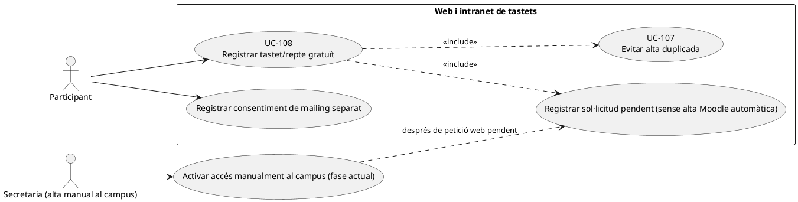
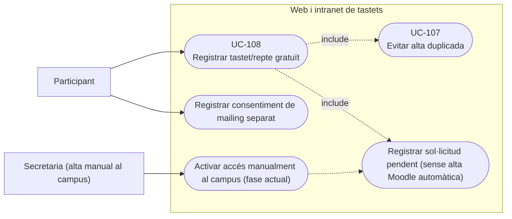
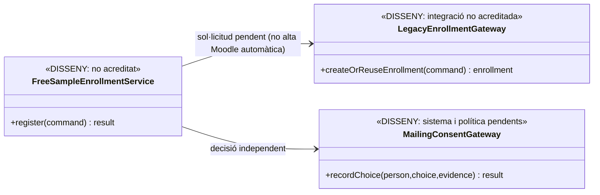
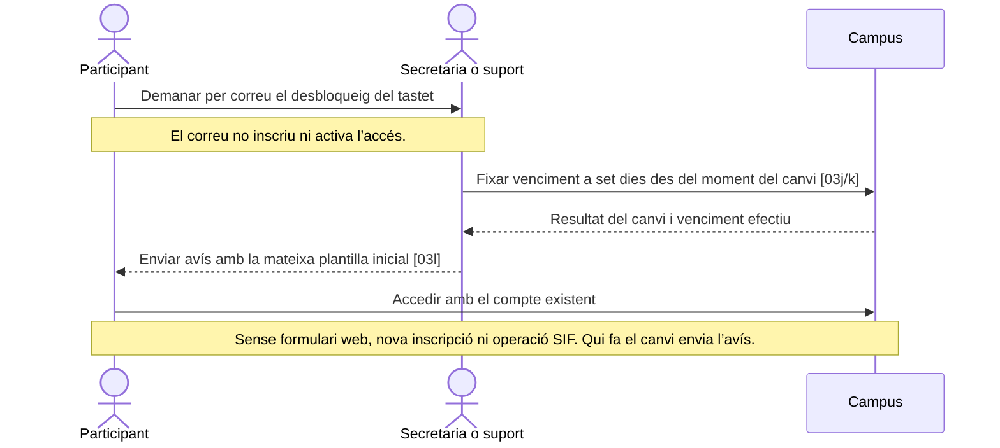

# UC-108 · Gestionar un tastet o repte gratuït al web, la intranet i el campus

## Revisió d'auditoria 29/09/2026

**Criteri vigent:** DEC-108-04 = alta obligatòria al mailing com a condició del tastet gratuït, amb baixa posterior i sense selector Sí/No. DEC-108-06 = **OBERTA** entre `commercial_operation NON_BILLABLE/FREE_SAMPLE` i exclusió del SIF. Les redaccions anteriors que indiquin mailing opcional o DEC-108-06 tancada queden superades.

Diagrames dedicats creats: [classes ACTUAL/FINAL](uc-108-classes-actual-final.md) · [seqüències ACTUAL/FINAL](uc-108-sequencies-actual-final.md) · [auditoria i traçabilitat](uc-108-auditoria-tracabilitat-2026-09-29.md).

**Decisions confirmades el 25/09/2026:** (DEC-108-03m) es pot tornar a sol·licitar el tastet quan la persona ho demana, però si l'accés està caducat s'aplica DEC-108-03a: desbloqueig persona+tastet i nova sol·licitud web; no hi ha renovació automàtica. (DEC-108-01a) la identificació per comprovar repetició del tastet és el **DNI**, conjuntament amb el tastet. (DEC-108-07) avisos de tastets i butlletí general pertanyen a **la mateixa subscripció**; no dissenyar dues subscripcions independents per aquests dos noms. Els avisos operatius d’accés/renovació continuen independents de l’opció comercial.

**DEC-108-03j/k/l — SUPERADES:** la redacció que permetia renovar un accés caducat només canviant el venciment, sense formulari nou, **no és la regla vigent**. Regla actual: si l'accés ha caducat, secretaria/suport desbloqueja **persona+tastet** i la persona torna al formulari web i envia una **nova sol·licitud**, conservant historial (DEC-108-03a). La pròrroga per incidència de credencials és un cas diferent: si la incidència ha impedit entrar, s'ajusta el venciment per donar set dies complets des de la resolució.

**Lectura de l’historial:** les notes anteriors de 03a/e/f sobre nova inscripció i vigència del desbloqueig es conserven com a antecedents superats; no prevalen sobre 03j/k/l.

**Objectiu canònic:** gestionar la sol·licitud i l’accés al tastet gratuït al web, la intranet i el campus, sense registre al SIF, factura, pagament ni enllaç de pagament. El consentiment de mailing és independent de la gratuïtat.

**DEC-108-06 — OBERTA:** cal decidir si la petició gratuïta es correlaciona amb `commercial_operation NON_BILLABLE/FREE_SAMPLE` o si resta fora del SIF. Cap opció crea factura, pagament, `CHARGE` ni registre AEAT.

**Límit del model:** les taules comercials del SIF poden existir per altres circuits; no són una dependència ni una implementació pendent d’UC-108. El control de duplicats, l’accés temporal i el consentiment es resolen dins dels sistemes del tastet.

**Fitxa funcional revisada per pàgines:** [UC-108 — fitxa funcional específica (v2.0, decisions obertes)](../06-fitxes-funcionals/uc-108.md). **Diagrames d'activitat actual/final per cadascuna de les quatre pàgines i dotze apartats funcionals:** [UC-108 — activitats de tastets](uc-108-activitats-pagines-tastets-actual-final.md). Els diagrames finals incorporen les decisions acordades, inclosa DEC-108-06; els detalls encara oberts s’identifiquen a l’auditoria. No acrediten codi ja programat. La resta de models d'aquesta fitxa continuen com a referència de disseny i no substitueixen les activitats per pàgina.

## 1. Fitxa funcional específica

| Element | Regla |
| --- | --- |
| Actors | Participant, canal web i **secretaria, que fa manualment l'alta al campus en la fase actual** (DEC-108-05a). El participant pot accedir al tastet sense haver consentit rebre correus comercials. L'automatització de l'alta al campus es vol per al 2027 i és fora de l'abast actual. |
| Entrada | Identitat i `ID_INSC` si existeix, tastet/repte i edició, accés ofert, període/venciment acordat, `REQUEST_ID`, `CORRELATION_ID` i clau idempotent; elecció de mailing amb instant i text de consentiment separats. |
| Àmbit de gestió | Web, intranet i campus. Integració SIF **pendent de DEC-108-06**: opcionalment `NON_BILLABLE/FREE_SAMPLE`; mai factura/pagament/AEAT pel tastet. |
| Alta acadèmica | **DEC-108-05a ACORDADA:** el web crea una sol·licitud pendent; **secretaria fa MANUALMENT l'alta/activació al campus**, no el servidor web ni un worker automàtic. UC-107 impedeix duplicar una petició pendent o un accés encara actiu. **DEC-108-02b ACORDADA:** una setmana d'accés des de l'activació real feta per secretaria. Pendent de verificar l'inici/venciment i el registre real de Moodle/BD. Automatització desitjada per al 2027, no inclosa en l'abast actual. |
| Efectes prohibits | **Cap** `factura`, `factura_registres`, `fiscal_queue`, `payment_transaction`, `payment_allocation`, `redsys_payment_intent`, `payment_link` ni entrada al ledger de fons. Import zero no és un `CHARGE` de zero. |
| Consentiment | Elecció afirmativa o negativa i evidència diferenciada, control de finalitat i revocació segons el sistema de comunicació aprovat; no deduir consentiment de la inscripció. El servei concret de mailing no ha estat identificat. |
| Resultat | `ID_INSC`/identificador de petició real, estat acadèmic, dates efectives, duplicats/resolució i estat de mailing. `UUID_OPERATION` només si DEC-108-06 aprova integració SIF. |

### 1.1. Flux objectiu

1. El canal valida que el recurs és efectivament un tastet/repte **gratuït i actiu**. UC-108 no crea una convocatòria/edició artificial: la sol·licitud és contínua mentre `reptes.ESTAT=1`.
2. UC-107 detecta una alta equivalent per persona i tastet actiu (sense inventar una convocatòria per al flux continu acordat); si existeix, torna a mostrar l'accés anterior sense crear una segona operació.
3. En la fase actual, el web només crea/reutilitza una **sol·licitud pendent**. Secretaria realitza MANUALMENT l'alta al campus dins de 24–48 hores laborals i activa l'accés. El venciment és set dies exactes després de l'activació efectiva, a la mateixa hora. **DEC-108-06 no altera aquest flux i continua oberta.**
4. Es registra la decisió de mailing a part, amb prova de què es va acceptar o rebutjar; amb «Sí» explícit i persistència comercial correcta, subscripció al butlletí directa en enviar el formulari sense correu de confirmació (DEC-108-04b). «No» o manca de «Sí» no genera subscripció; una fallada comercial no desfà l'alta acadèmica. Això no altera la classificació gratuïta.
5. **DEC-108-05e ACORDADA:** el correu manual posterior de secretaria **només informa que ja hi ha accés activat, sense enllaç al campus ni instruccions per obtenir claus**. Si la persona ja era membre conserva les credencials; si encara no ho era, quan secretaria crea manualment el compte, **el campus li envia AUTOMÀTICAMENT per correu les claus** (DEC-108-05f), per un circuit diferent del correu manual de confirmació. **DEC-108-05g ACORDADA:** la fallada o no recepció del correu de claus NO bloqueja la tramesa MANUAL del missatge informatiu posterior de secretaria quan l'accés ja és actiu; la incidència de credencials es tracta independentment. El correu manual no prova que s'hagin rebut les claus ni que s'hagi iniciat sessió. **DEC-108-05h/i ACORDADES:** secretaria atén primer la incidència i intenta reenviar o regenerar les claus des del campus; si no ho resol, deriva a Isa (suport tècnic), i finalment a desenvolupament (Meriem) si persisteix. El circuit no bloqueja el correu informatiu manual. **DEC-108-05j ACORDADA:** si la incidència impedeix entrar durant part de la setmana, prorrogar l'accés per compensar el temps perdut, amb una NOVA SETMANA COMPLETA des de la resolució de la incidència (DEC-108-05k), sense afirmar cap automatització de la pròrroga. Verificar el comportament tècnic efectiu sense incloure credencials reals en aquest document.
6. **DEC-108-05b ACORDADA:** després de l'activació real, secretaria prepara i envia MANUALMENT l'avís operatiu amb la plantilla existent. És independent de l'estat posterior del mailing comercial. Compte nou: el campus envia credencials automàticament; compte existent: conserva les claus. En reintent equivalent no es genera una nova petició ni es reactiva el mailing.

### 1.2. Alternatives i proves

| Cas | Resposta |
| --- | --- |
| Mateix usuari clica dues vegades | Reús idempotent de l'operació i la inscripció; no duplicar mail ni termini sense regla expressa. |
| Disponibilitat del tastet | **DEC-108-02c ACORDADA (22/09/2026):** la inscripció web es pot sol·licitar en qualsevol moment mentre el tastet estigui actiu, sense convocatòries ni terminis d'inscripció per dates. Revalidar al servidor l'estat actiu del tastet en enviar el formulari; si ha passat a inactiu, no donar d'alta. Les regles de reintents per persona continuen vigents. La consulta actual `reptes.ESTAT=1` és visible al codi, però cal provar la ruta d'alta i el canvi d'estat entre obrir i enviar formulari. |
| Preparació i enviament del correu d'accés | **DEC-108-05c/d ACORDADES (22/09/2026):** per ara secretaria **utilitza una plantilla ja preparada, prepara el correu i l'envia manualment** després de l'alta efectiva al campus. No redacta cada missatge de zero ni s'ha d'implementar cap enviament automàtic en la fase actual; continuar separant correu de recepció i consentiment del butlletí. Pendent de contrastar contingut i ubicació de la plantilla, camps variables, destinatari i traça del procediment manual. |
| Primera actuació i escalat de la incidència de claus | **DEC-108-05h/i ACORDADES (22/09/2026):** secretaria atén primer la incidència i intenta reenviar o regenerar les claus des del campus; si no es resol, es trasllada a Isa (suport tècnic) i després a desenvolupament (Meriem). És un circuit separat de l'enviament manual de la plantilla d'accés activat. Cal contrastar les accions disponibles al campus, permisos, traça i evidència de resolució; no incloure credencials a la documentació. |
| Incidència de recepció de claus | **DEC-108-05g ACORDADA (22/09/2026):** si una persona nova no rep el correu automàtic amb les claus, secretaria envia igualment el correu manual d'accés activat un cop l'activació és real; la incidència de credencials es gestiona per separat, sense condicionar l'enviament d'un correu a la resolució de l'altre. L'avís manual no acredita recepció de claus ni accés efectiu de la persona a la seva sessió. Procediment concret d'incidències pendent de contrastar. |
| Missatge d'accés i credencials del campus | **DEC-108-05e/f ACORDADES (22/09/2026):** la plantilla manual d'accés activat **només informa que ja es pot accedir**; no inclou l'enllaç al campus ni instruccions de claus. Si ja era membre, manté les claus que tenia; si no ho era, quan secretaria crea manualment el compte al campus, el campus li envia **AUTOMÀTICAMENT per correu les claus d'accés**. El missatge del campus és diferent del correu manual de secretaria. Pendent de contrastar el disparador/plantilla/resultat reals de la tramesa automàtica i el text literal de la plantilla manual, sense registrar credencials. |
| Plantilla existent del correu d'accés | **DEC-108-05d ACORDADA (22/09/2026):** secretaria utilitza una plantilla de missatge ja preparada per al correu que comunica l'activació real del campus i l'envia manualment. No s'ha verificat el text literal, on es guarda ni quines dades s'hi han d'emplenar; no inventar-les ni atribuir al PHP generació automàtica. |
| Correu d'accés després de l'alta | **DEC-108-05b ACORDADA (22/09/2026):** quan secretaria ha completat l'alta manual i l'accés és efectiu, **envia a la persona un correu operatiu informant que ja pot accedir al campus**. No confondre'l amb el correu de recepció de sol·licitud. És independent de la subscripció comercial, també amb butlletí «No». Verificar procediment, contingut, destinatari, moment i traça; no afirmar que el PHP ja executa un enviament automàtic. |
| Procés d'alta actual i futur | **DEC-108-05a ACORDADA (22/09/2026):** secretaria tramita **manualment** l'alta/activació al campus després de rebre la petició web. La petició és pendent fins a l'alta real i no desencadena cap automatització de matrícula Moodle. La millora d'alta automàtica es vol per al **2027**, fora d'abast ara. Pendent de verificar traça real de l'alta manual, dates i avisos. |
| Seguiment operatiu de la incidència i la pròrroga | **DEC-108-05q — SITUACIÓ ACTUAL CONFIRMADA (23/09/2026):** no hi ha seguiment específic de la incidència de claus ni de la pròrroga a la intranet o en una altra eina/registre de seguiment. Secretaria o Isa resolen l'accés, modifiquen el venciment existent al campus i envien manualment l'avís de 7 dies amb la mateixa plantilla de l'avís inicial adaptada. No inventar tiquets, fitxes o historial addicional. Això no elimina la data real de venciment al campus ni les comprovacions que caldrà fer en les proves operatives. |
| Plantilla compartida dels avisos manuals | **DEC-108-05p ACORDADA (23/09/2026):** el correu de pròrroga i el correu inicial d'accés activat fan servir LA MATEIXA plantilla existent, amb el missatge adaptat a cada ocasió. La pròrroga comunica 7 dies d'accés sense data exacta de venciment. Són dos enviaments diferenciats (inicial per secretaria després de l'alta real; pròrroga per secretaria o Isa després de resoldre la incidència i ajustar el venciment). Text literal, ubicació, camps variables i traça pendents de contrastar. |
| Plantilla del correu de pròrroga | **DEC-108-05o ACORDADA (22/09/2026):** Isa o secretaria utilitzen una PLANTILLA DE CORREU JA EXISTENT per informar manualment que la persona tindrà 7 dies d'accés, sense data exacta de venciment. No redacten cada correu des de zero. PENDENT contrastar text literal, ubicació, camps variables, destinatari i evidència d'enviament. **DEC-108-05p ACORDADA:** és LA MATEIXA plantilla del correu inicial d'activació, adaptant-ne el missatge per a la pròrroga; són dos enviaments separats. |
| Responsable i enviament del correu de pròrroga | **DEC-108-05n ACORDADA (22/09/2026):** **Isa o secretaria envien MANUALMENT** el correu que informa que la persona tindrà 7 dies d'accés, sense indicar data exacta de venciment. Aquest enviament no és automàtic del campus quan es modifica el venciment; no assignar-lo exclusivament a cap de les dues. **DEC-108-05o ACORDADA:** utilitzen una PLANTILLA EXISTENT, sense redactar cada missatge des de zero. PENDENT contrastar ubicació, text literal, variables, destinatari i traça real de tramesa. |
| Correu de comunicació de la pròrroga | **DEC-108-05m PRECISADA (22/09/2026):** després que secretaria o Isa hagin concedit la nova setmana, **la persona rep per correu un avís que tindrà 7 dies d'accés, SENSE indicar una data exacta de venciment**. El venciment real es modifica i es verifica separadament al campus; no n'hi ha prou d'ajustar-lo sense avisar. Aquest avís és diferent del correu inicial d'activació enviat manualment per secretaria i del correu automàtic de credencials per a nous membres. **DEC-108-05n ACORDADA:** Isa o secretaria envien el correu MANUALMENT; el campus no el genera automàticament pel canvi de venciment. PENDENT contrastar text literal/plantilla, destinatari i evidència d'enviament. |
| Responsable de modificar el venciment per pròrroga | **DEC-108-05l ACORDADA (22/09/2026):** **secretaria o Isa** ajusten la data de venciment al campus per concedir la nova setmana completa des de la resolució de la incidència (DEC-108-05k). No correspon exclusivament a cap de les dues i no s'atribueix a desenvolupament com a pas ordinari. PENDENT verificar permisos, acció real, actor efectiu, registre de la data de resolució i del nou venciment; no suposar canvi automàtic. |
| Còmput de la pròrroga per incidència de claus | **DEC-108-05k ACORDADA (22/09/2026):** una vegada resolta la incidència que impedia entrar, es concedeix **una NOVA SETMANA COMPLETA d'accés a partir de la resolució**, no únicament els dies perduts afegits al venciment original. És un ajust del venciment de l'accés existent, no una nova alta. **DEC-108-05l:** secretaria o Isa modifiquen el venciment. **DEC-108-02d ACORDADA:** venciment set dies després A LA MATEIXA HORA de la resolució, no a les 23.59 h. PENDENT de verificar l'instant real de resolució, permisos, anotació i aplicació efectiva al campus. |
| Pròrroga per incidència de claus | **DEC-108-05j ACORDADA (22/09/2026):** si una incidència de claus impedeix a la persona entrar al tastet durant part de la setmana, se li prorroga l'accés per compensar el temps perdut; no es conserva sense canvis el venciment original. És una modificació del venciment, NO una alta o una petició duplicada. **DEC-108-05k:** còmput definit com a nova setmana completa des de la resolució de la incidència, no suma de dies perduts. **PENDENT:** acreditar l'instant de resolució, responsable, procediment real de pròrroga al campus i registre de dates. **DEC-108-02d ACORDADA:** el final és set dies després A LA MATEIXA HORA de la resolució, no a les 23.59 h; l'avís de pròrroga ja està definit a DEC-108-05m/n/o/p. |
| Hora exacta de venciment dels set dies | **DEC-108-02d ACORDADA (23/09/2026):** el venciment és **set dies després a la MATEIXA HORA d'inici**, no fins a les 23.59 h del setè dia. Accés ordinari: comença amb l'activació real per secretaria (DEC-108-02b). Pròrroga per claus: la nova setmana comença amb la resolució de la incidència (DEC-108-05k), no amb el correu manual ni amb l'instant posterior de modificar el venciment. PENDENT verificar instants reals i configuració del campus/BD; no inferir regles addicionals de fus horari. |
| Durada d'accés efectiva | **DEC-108-02b ACORDADA (22/09/2026):** una setmana comptada des del moment en què secretaria activa realment l'accés al campus, no des de la data d'enviament de la petició ni d'una alta encara sense accés. Pendent de verificar inici, venciment i configuració PHP/Moodle; el text web d'una setmana no acredita l'aplicació al campus. |
| Termini d'alta al campus | **DEC-108-02a ACORDADA (22/09/2026):** mantenir **24–48 hores laborals** com a termini comunicat perquè secretaria doni d'alta la persona al campus després de rebre la sol·licitud web. El PHP actual ja comunica aquest termini; cal contrastar que formulari, correus i confirmació siguin coherents i que la recepció de la petició no es presenti com a alta efectiva. **DEC-108-02b ACORDADA:** una setmana d'accés des de l'activació efectiva per secretaria al campus; pendent de verificar dates i configuració reals, no des de l'enviament del formulari. |
| Baixa de la persona o petició denegada | **DEC-108-03d ACORDADA (22/09/2026):** la persona pot tornar-se a inscriure directament des del formulari web sense desbloqueig de secretaria/suport, tant si s'ha donat de baixa com si secretaria havia denegat la sol·licitud. Conservar historial anterior i crear una nova petició quan la persona l'enviï, amb protecció davant duplicats. Pendent d'adaptar PHP/JS, identificar els estats reals i provar-ho. No aplicar aquesta exempció a accessos caducats. |
| Accés al tastet encara actiu | **DEC-108-03c ACORDADA (22/09/2026):** si la mateixa persona intenta inscriure's una altra vegada al mateix tastet mentre té l'accés actiu, mostrar que ja està inscrita i impedir una segona sol·licitud. No requerir desbloqueig de secretaria/suport, exclusiu d'accessos caducats. Pendent d'aplicar en PHP/JS i provar contra l'estat efectiu de Moodle/accés, no deduir-ho només de `INSC_CURS=1`. |
| Sol·licitud pendent d'alta al campus | **DEC-108-03b ACORDADA (22/09/2026):** si la mateixa persona torna a enviar el formulari del mateix tastet mentre la primera sol·licitud segueix pendent, mostrar que ja té una sol·licitud pendent i no crear una segona alta. No exigir desbloqueig de secretaria/suport, reservat al cas d'accés caducat. El PHP actual només cerca historial `INSC_CURS=1` en la comprovació JS; protegir també el servidor abans d'INSERT. Pendent d'aplicar i provar. |
| Tastet expirat | Secretaria/suport desbloqueja la inscripció per aquella persona+tastet; la persona torna al formulari i envia una nova sol·licitud. No es renova directament només canviant el venciment (DEC-108-03a; 03j/k/l superades). |
| Preu comercial passa de zero a import positiu | Una altra classificació/oferta i acceptació UC-112; no convertir retrospectivament la reserva gratuïta en factura cobrada. |
| Mailing | **DEC-108-04 ACORDADA (25/09/2026):** l'alta al tastet gratuït comporta alta obligatòria al mailing, sense selector Sí/No; baixa posterior possible. Retry de la mateixa petició: no duplicar ni reactivar després d'una baixa. Cas tastet A → baixa → tastet B: OBERT. |
| El llegat falla després d'enregistrar l'operació | Reintentar l'alta amb el mateix identificador i reconciliar UC-53, mai emetre factura o `CHARGE` com a compensació tècnica. |

**Pendents de tancament:** traçar la petició web pendent, la **intervenció manual de secretaria** al campus i el **correu operatiu posterior d'accés activat (DEC-108-05b), independent del butlletí**, identificador de recurs, dates d'activació/venciment reals, duplicats, consentiment i proves de regressió; no s'han executat proves PHP. **No incloure la futura automatització de 2027 com a tasca d'implementació de la fase actual.**

### 1.3. Endpoint llegat de tastet i diferència entre alta gratuïta i mailing

**Ruta de negoci contrastada amb el PHP de `main` (22/09/2026).** [`web-actual/ajax/enviarInscripcioTastet.php`](../../codi-drive/web-actual/ajax/enviarInscripcioTastet.php#L15-L51) està disponible: llegeix `nom`, `cog`, `dni`, `email`, `poblacio`, `conegut`, `comentaris`, `mailing` i `codiCurs` via GET i consulta `reptes.CODI_CURS` amb `ESTAT=1`. [L90–117](../../codi-drive/web-actual/ajax/enviarInscripcioTastet.php#L90-L117) declara el tastet gratuït, anuncia alta en 24/48 hores laborals i una setmana d'accés després de l'alta. [L222–234](../../codi-drive/web-actual/ajax/enviarInscripcioTastet.php#L222-L234) insereix l'alta a `inscripcions_reptes`, sense factura, intenció Redsys ni moviment bancari en aquest endpoint. L'èxit d'aquesta inserció NO prova que Moodle ja hagi concedit l'accés. El SIF no ha de registrar `payment_transaction`, intenció Redsys, factura o registre AEAT només per crear aquesta alta.

**DEC-108-04a/b ACORDADES:** al mateix formulari hi haurà elecció opcional de butlletí «Sí/No»; «No» no impedirà ni la sol·licitud gratuïta ni els avisos operatius. Amb «Sí» explícit i alta comercial registrada correctament, subscripció directa en enviar el formulari, sense segon correu/enllaç de confirmació. Si l'alta comercial falla, conservar l'estat acadèmic i registrar la incidència, sense afirmar que la subscripció ja s'ha completat. **Alta gratuïta i subscripció: discrepància real entre el PHP actual i el contracte objectiu.** El handler [llegeix `mailing`](../../codi-drive/web-actual/ajax/enviarInscripcioTastet.php#L15-L26), però fixa [`$mailingBD='1'`](../../codi-drive/web-actual/ajax/enviarInscripcioTastet.php#L210-L214); a [L255–269](../../codi-drive/web-actual/ajax/enviarInscripcioTastet.php#L255-L269) incorpora el correu a `mailing` si encara no existeix i a [L75–79](../../codi-drive/web-actual/ajax/enviarInscripcioTastet.php#L75-L79) redacta un avís que pressuposa que s'ha acceptat rebre comunicacions. **L'opció rebuda NO determina aquest comportament al fitxer revisat.** Això NO compleix la separació requerida per UC-125: si la persona tria `NO`, l'alta gratuïta i els avisos operatius han de continuar possibles, però no s'ha de crear subscripció comercial, ni afirmar una acceptació no produïda. Falta el servei de consentiment versionat per subjecte/finalitat/canal i les proves d'accés i reintent.

**Identitat, accés i reincidència.** Distingir participant i tastet; no identificar automàticament persones diferents per un email compartit. Amb accés caducat, seguir la renovació del campus 03j/k/l, sense nova alta web ni autorització consumible. Amb petició pendent o accés actiu, recuperar/mostrar l’estat existent. Baixa/denegació conserva el circuit diferenciat 03d.

**Canvi posterior de classificació.** Un tastet inicialment gratuït no es converteix en factura històrica si més endavant s'ofereix un curs complet de pagament o un curs subvencionat (UC-109). Cal obrir **una operació nova identificable**, congelar oferta i receptor quan sigui facturable i relacionar-la amb l'origen acadèmic, sense alterar la gratuïtat inicial ni utilitzar el mailing per deduir acceptació d'una compra.

### 1.4. Proves addicionals del handler gratuït (no executades)

| ID | Escenari | Resultat exigible |
| --- | --- | --- |
| TG-108-01 | `enviarInscripcioTastet.php` dona alta a `inscripcions_reptes` | Alta gratuïta identificable; cap factura, intenció, CHARGE ni PDF fiscal. |
| TG-108-02 | Participant tria NO al mailing del formulari | Sol·licitud gratuïta i avisos operatius disponibles, sense alta comercial, i sense que JS/PHP converteixin No en Sí. Pendent de prova. |
| TG-108-02a | Participant tria «Sí» explícit i envia el formulari del tastet | Si el registre comercial té èxit, queda subscrit directament sense correu/enllaç de confirmació addicional. Registrar l'elecció i evitar subscripcions duplicades en reintents; si falla, estat d'incidència sense afirmar alta comercial efectiva ni anul·lar la petició del tastet. Pendent de prova. |
| TG-108-03 | Dos participants comparteixen email | Altes/consentiments separats per identitat acreditada, no fusió automàtica. |
| TG-108-04 | Retry d'alta amb repte i edició equivalents | Recuperar l'alta real segons política de duplicats, sense duplicar accés o subscripció. |
| TG-108-05 | Alta al tastet registrada però accés Moodle no confirmat | Estat acadèmic pendent/UC-129, sense crear factura per reparar-lo. |
| TG-108-06 | Participant contracta un curs de pagament més endavant | Nova operació comercial/fiscal quan correspon, no conversió retrospectiva del tastet. |

### Proves de renovació acordada (no executades)

| Prova | Resultat exigible |
| --- | --- |
| TG-108-REN1: accés caducat i petició de repetició | Desbloqueig persona+tastet per secretaria/suport; després la persona fa una nova sol·licitud web; historial conservat. |
| TG-108-REN2: canvi en un instant conegut | Venciment set dies després del canvi a la mateixa hora, no des del correu ni del primer inici de sessió. |
| TG-108-REN3: canvi efectuat per secretaria o suport | Qui fa el canvi envia l’avís amb la plantilla inicial; comprovar destinatari i resultat real de l’enviament. |
| TG-108-REN4: avís no lliurat després d’un canvi correcte | Distingir venciment real i resultat del correu; no afirmar que l’avís ha arribat. |

## 2. UML de casos d'ús

```plantuml
@startuml
left to right direction
actor "Participant" as P
actor "Secretaria (alta manual al campus)" as G
usecase "Activar accés manualment al campus (fase actual)" as Manual
rectangle "Web i intranet de tastets" {
 usecase "UC-108\nRegistrar tastet/repte gratuït" as Main
 usecase "UC-107\nEvitar alta duplicada" as Dup
 usecase "Registrar sol·licitud pendent (sense alta Moodle automàtica)" as Access
 usecase "Registrar consentiment de mailing separat" as Mail
}
P --> Main
G --> Manual
Main ..> Dup : <<include>>
Main ..> Access : <<include>>
Manual ..> Access : després de petició web pendent
P --> Mail
@enduml
```

### Vista Mermaid del cas d’ús

```mermaid
flowchart LR
  a_0["Participant"]
  a_1["Secretaria (alta manual al campus)"]
  subgraph SIF_BOUNDARY["Web i intranet de tastets"]
    u_0(["Activar accés manualment al campus (fase actual)"])
    u_1(["UC-108<br/>Registrar tastet/repte gratuït"])
    u_2(["UC-107<br/>Evitar alta duplicada"])
    u_3(["Registrar sol·licitud pendent (sense alta Moodle automàtica)"])
    u_4(["Registrar consentiment de mailing separat"])
  end
  a_0 --> u_1
  a_1 --> u_0
  u_1 -.->|include| u_2
  u_1 -.->|include| u_3
  u_0 -.-> u_3
  a_0 --> u_4
```

## 3. Diagrama de classes — disseny del web i la intranet, fora del SIF

```mermaid
classDiagram
direction LR
class FreeSampleEnrollmentService {
 <<DISSENY: no acreditat>>
 +register(command) result
}
class LegacyEnrollmentGateway {
 <<DISSENY: integració no acreditada>>
 +createOrReuseEnrollment(command) enrollment
}
class MailingConsentGateway {
 <<DISSENY: sistema i política pendents>>
 +recordChoice(person,choice,evidence) result
}
FreeSampleEnrollmentService --> LegacyEnrollmentGateway : sol·licitud pendent (no alta Moodle automàtica)
%% L'alta real del campus és manual per secretaria en la fase actual; automatització desitjada el 2027.
FreeSampleEnrollmentService --> MailingConsentGateway : decisió independent
```

**DEC-108-05a/06:** aquests serveis i adaptadors són DISSENY del web/intranet, no classes del SIF. L’alta del campus no la fa `FreeSampleEnrollmentService` en la fase actual: secretaria la realitza manualment. Automatització desitjada per al 2027, no implementació actual.

Cap servei fiscal, de pagaments o d'intencions Redsys participa en aquest diagrama perquè **no hi ha import a cobrar**.

## 4. Seqüència objectiu

### Petició de desbloqueig per correu — DEC-108-03g

```mermaid
sequenceDiagram
actor P as Participant
actor G as Secretaria o suport
participant C as Campus
P->>G: Demanar per correu el desbloqueig del tastet
Note over P,G: El correu no inscriu ni activa l’accés.
G->>C: Fixar venciment a set dies des del moment del canvi [03j/k]
C-->>G: Resultat del canvi i venciment efectiu
G-->>P: Enviar avís amb la mateixa plantilla inicial [03l]
P->>C: Accedir amb el compte existent
Note over P,C: Sense formulari web, nova inscripció ni operació SIF. Qui fa el canvi envia l’avís.
```

### Enviament del formulari i activació posterior

**Abast:** primera alta i nova petició després de baixa/denegació. La renovació d’accés caducat es resol amb la seqüència anterior, sense nova petició web.

```mermaid
sequenceDiagram
autonumber
actor P as Participant
participant UI as Canal web de tastets
participant S as Sol·licitud gratuïta [DISSENY]
participant L as BD de sol·licituds
participant M as MailingConsentGateway [DISSENY]
actor SEC as Secretaria
participant C as Campus Moodle [alta MANUAL]
P->>UI: Enviar formulari del tastet actiu, amb opció de butlletí
UI->>S: Registrar sol·licitud (dades, tastet, requestId)
S->>S: Validar disponibilitat, DNI+tastet i estat previ segons DEC-108-01a/03
alt Dades invàlides, tastet inactiu o estat no classificat
 S-->>UI: Error sense crear sol·licitud
else Accés caducat
 S-->>UI: Indicar que cal desbloqueig persona+tastet; després nova sol·licitud web
else Ja té petició pendent o accés actiu
 S-->>UI: Mostrar estat existent sense nova sol·licitud
else Primera petició o baixa/denegació
 Note over UI,S: DEC-108-03d: la persona envia el formulari després de baixa/denegació; és diferent de renovar un accés caducat.
 S->>L: Crear sol·licitud PENDENT idempotent
 Note over S,L: Reintent equivalent recupera la mateixa petició.
 L-->>S: Identificador i estat pendent
 S-->>UI: Sol·licitud rebuda; alta manual pendent
end
UI-->>P: Mostrar resultat real: error, estat existent o nova petició pendent; no afirmar accés
opt Hi ha sol·licitud nova vàlida
 UI->>M: Registrar opció comercial independent Sí/No i evidència
 alt Sí explícit i alta comercial reeixida
  M->>M: Activar butlletí directament, sense correu de confirmació
 else No o manca de Sí
  M-->>UI: No crear alta comercial
 else Sí amb fallada comercial
  M-->>UI: Registrar incidència; no anul·lar sol·licitud acadèmica
 end
 Note over SEC,C: DEC-108-05a. Secretaria fa l'alta MANUAL durant la fase actual; automatització desitjada per al 2027, fora d'abast.
 SEC->>C: Donar d'alta i activar manualment l'accés al tastet
 C-->>SEC: Alta efectiva i dates d'activació/venciment
 Note over SEC,C: DEC-108-02b/d. La setmana ordinària comença amb l'activació real i venç 7 dies després a la MATEIXA HORA; evidència de dates per verificar.
 alt La persona ja era membre del campus
  Note over SEC,C: Conserva les claus d'accés que ja tenia
 else Persona nova al campus
  C-->>P: Correu AUTOMÀTIC del CAMPUS amb claus d'accés en crear compte nou [DEC-108-05f; verificar tramesa real]
 end
 par Avís manual d'accés activat després de l'alta real
  SEC-->>P: Enviar IGUALMENT PLANTILLA MANUAL: accés activat, independent de recepció de claus [DEC-108-05b/c/d/e/f/g; també butlletí No]
 and Circuit independent de claus
  opt Persona nova que no rep el correu de claus
   P-->>SEC: Comunicar incidència de credencials [circuit concret per verificar]
   SEC->>C: Intentar reenviar o regenerar claus des del campus [DEC-108-05i; funció real per verificar]
   alt Secretaria no resol la incidència
    Note over SEC,C: Escalar a Isa (suport tècnic); si persisteix, a desenvolupament (Meriem) [DEC-108-05h]
   else Secretaria resol la incidència
    Note over SEC,C: Resolució de l’accés; sense registre addicional de seguiment segons DEC-108-05q
   end
   Note over SEC,C: DEC-108-05g: incidència de claus SEPARADA de l'avís manual i sense bloquejar-lo
   Note over SEC,C: DEC-108-02d/05j/k/l: si ha impedit entrar durant part de la setmana, secretaria o Isa MODIFIQUEN venciment al campus per NOVA SETMANA COMPLETA des de la RESOLUCIÓ, fins 7 dies després a la MATEIXA HORA; acreditar moment i execució Moodle
   Note over SEC,C: DEC-108-05q: NO hi ha seguiment específic de la incidència ni de la pròrroga a la intranet o eina addicional; actualitzar el venciment del campus i enviar l'avís sí que es fan
   Note over SEC,P: DEC-108-05m/n/o: DESPRÉS de concedir la pròrroga, ISA O SECRETARIA envien MANUALMENT amb la MATEIXA PLANTILLA de l'avís inicial, adaptant-ne el missatge (DEC-108-05p), el CORREU que informa que TINDRÀ 7 DIES D'ACCÉS, SENSE data exacta de venciment; no autoenviament del campus
  end
 end
end
Note over UI,C: La petició web no activa automàticament Moodle i no crea cap registre SIF (DEC-108-06).
```

## 5. Traçabilitat

[UC-108 original](../06-fitxes-funcionals/uc-108.md) · [UC-107 inscripció duplicada](uc-107-detectar-inscripcio-duplicada.md) · [UC-106 reserva](uc-106-crear-reserva-abans-pagament.md) · [UC-109 subvenció](../06-fitxes-funcionals/uc-109.md) · [Migració operació comercial](../../sif/database/migrations/2026_09_16_000004_add_commercial_operation_and_fiscal_fields.sql) · [Diccionari de classificació](../05-governanca-operacio/24-diccionari-camps-i-valors.md).

**Límit de la revisió (22/09/2026):** comprovació estàtica del handler de `main`, no prova del codi desplegat, de la pantalla client, de l'alta Moodle o d'execució PHP/MySQL. [Auditoria específica lot 01](00-auditoria-casos-pendents-lot-01-2026-09-22.md) · RM-024/RM-037.

### 25/09/2026 — Confirmació del còmput d’accés (DEC-108-02b/d)

La usuària confirma que els **7 dies d’accés comencen amb l’activació efectiva al campus**, no amb l’enviament del formulari web. Es conserva la regla ja acordada: venciment set dies després a la mateixa hora de l’activació. La caducitat del desbloqueig és una qüestió separada: resolta posteriorment a DEC-108-03f, sense termini abans del primer ús. Es manté el desbloqueig d’un sol ús (DEC-108-03e).

### 25/09/2026 — Vigència del desbloqueig

**DEC-108-03f ACORDADA (25/09/2026):** el desbloqueig no té caducitat temporal mentre no s’hagi utilitzat: la persona pot enviar el formulari quan vulgui. Es manté l’ús únic per persona+tastet (DEC-108-03e) i la validació que el tastet estigui actiu. Els set dies d’accés comencen amb l’activació efectiva al campus (DEC-108-02b/d), no amb el desbloqueig ni amb l’enviament del formulari.

Font: resposta explícita «pot fer-ho quan vulgui». Decisió documental; implementació i proves no acreditades per aquesta actualització.

### 25/09/2026 — Canal de petició del desbloqueig

**DEC-108-03g ACORDADA (25/09/2026):** la persona demana el desbloqueig del tastet per correu electrònic. Secretaria/suport gestiona el desbloqueig segons DEC-108-03a; l’enviament del correu no és una nova inscripció ni activa l’accés al campus. Després del desbloqueig, és la persona qui emplena i envia el formulari web. El desbloqueig es fa des del campus (DEC-108-03h); l’adreça destinatària i el control concret del campus no s’han precisat.

Font: resposta explícita «escriu un coreu». Actualització documental; cap correu enviat ni canvi de codi.

### 25/09/2026 — Sistema de gestió del desbloqueig

**DEC-108-03h ACORDADA (25/09/2026):** secretaria o suport fa el desbloqueig des del campus, segons resposta explícita de la usuària. El canal de petició és el correu electrònic (03g). Resta identificar l’acció concreta del campus i el seu efecte sobre l’accés i la possible reinscripció web; no s’infereix una sincronització campus→web ni un nou servei automàtic. Es mantenen les regles acordades d’ús únic, absència de caducitat abans de l’ús i set dies des de l’activació efectiva.

Actualització de fitxes i diagrames; no s’ha operat al campus ni modificat PHP/BD.

### 25/09/2026 — Acció concreta al campus i coherència pendent

**DEC-108-03i ACORDADA (25/09/2026):** el desbloqueig es fa canviant la data de venciment al campus. Aquesta és l’acció concreta confirmada per la usuària. **COHERÈNCIA PENDENT:** precisar si aquest canvi renova directament l’accés existent o si encara cal el nou formulari web descrit a DEC-108-03a/e/f, i des de quin instant es calcula el nou venciment. No afirmar que canviar la data crea una autorització web ni una nova matrícula. La regla dels set dies des de l’activació efectiva es manté; no s’infereix un còmput des del primer inici de sessió. El circuit de repetició de tastet i la pròrroga per incidència de claus no s’assimilen automàticament.

Font: resposta explícita «Canvieu la data de venciment». La usuària demana agrupar les preguntes per agilitzar la definició. Actualització documental; cap acció executada al campus.

### 25/09/2026 — Renovació aclarida per la usuària

**DEC-108-03j/k/l — SUPERADES:** la redacció que permetia renovar un accés caducat només canviant el venciment, sense formulari nou, **no és la regla vigent**. Regla actual: si l'accés ha caducat, secretaria/suport desbloqueja **persona+tastet** i la persona torna al formulari web i envia una **nova sol·licitud**, conservant historial (DEC-108-03a). La pròrroga per incidència de credencials és un cas diferent: si la incidència ha impedit entrar, s'ajusta el venciment per donar set dies complets des de la resolució.

Font: respostes agrupades 1–3 de la usuària. La renovació queda definida documentalment; no s’ha executat cap canvi al campus, enviament ni prova funcional.

### Contrast de les respostes amb el codi disponible — 25/09/2026

**Contrast amb codi abans de preguntar:** `web-actual/ajax/buscarSiHaRealitzatElTastet.php:20` consulta `CURS=? AND DNI=? AND INSC_CURS=1`; acredita el criteri DNI+tastet, però no una consulta del venciment real al campus. `web-actual/ajax/enviarInscripcioTastet.php:213,255–269` força mailing a 1 i consulta/insereix `mailing`: la persistència llegida no respecta encara l’opció No acordada. `Tastets.php:200–239` i `js1619773569/mostrarTastets.min.js:238–259` conserven textos i controls de xerrades/dues opcions: són una discrepància de la còpia, no motiu per tornar a preguntar si el negoci vol dues subscripcions. La decisió 07 és única; resta adequar el codi i comprovar els consumidors reals.

La resta de l’autenticació i l’accés segur a la confirmació no es dedueix només de conèixer el DNI. No s’ha accedit al campus ni s’han enviat correus.

### Confirmació web: mecanisme existent identificat al codi

[`mostrar_confirmacio_inscripcio_tastet_automatic.php`](../../codi-drive/web-actual/ajax/mostrar_confirmacio_inscripcio_tastet_automatic.php#L11) extreu el token de REQUEST_URI, desxifra AES-128-CBC i compara HMAC amb hash_equals abans de construir PaginaConfirmacioTastet. [`PaginaConfirmacioTastet.php`](../../codi-drive/web-actual/PaginaConfirmacioTastet.php#L22) llegeix la inscripció per ID amb INSC_CURS 0/1. Per tant, el mecanisme actual no és desconegut; resta revisar robustesa, permisos i proves negatives. Conèixer el DNI no substitueix aquesta validació del token. Vegeu CD-05 de la revisió global.
