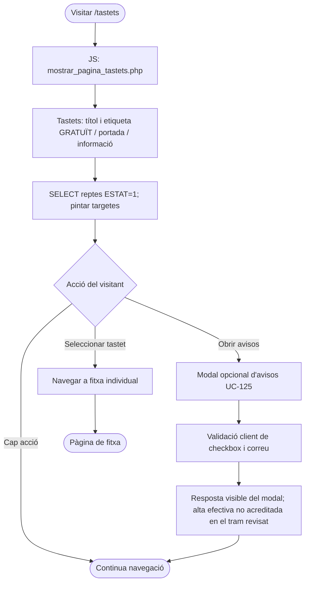
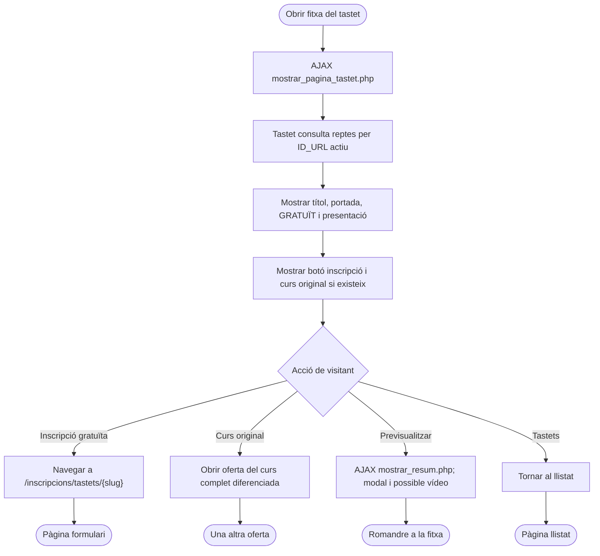
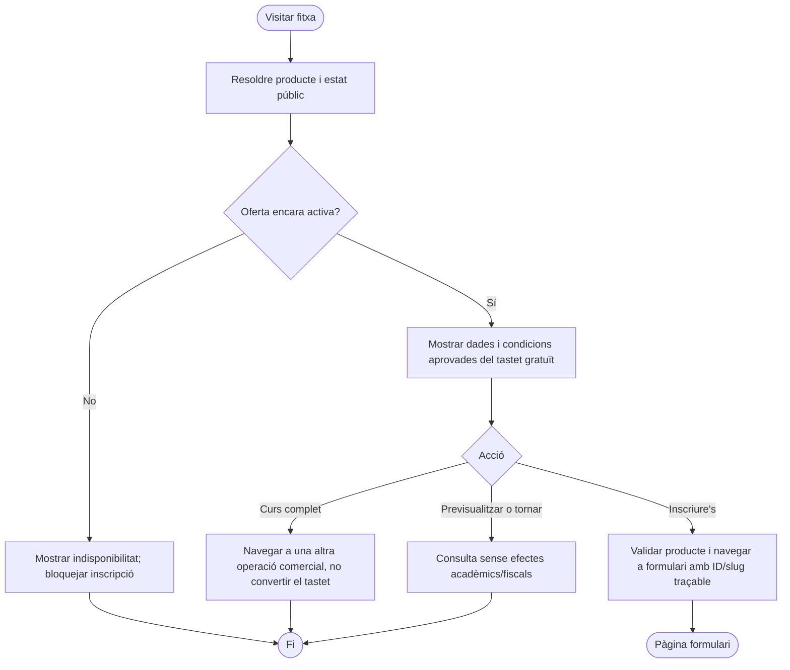
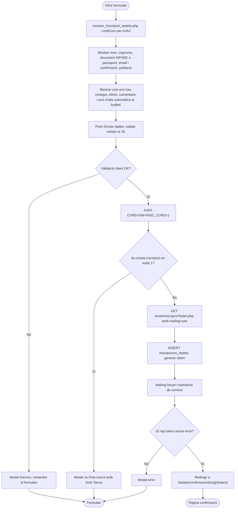
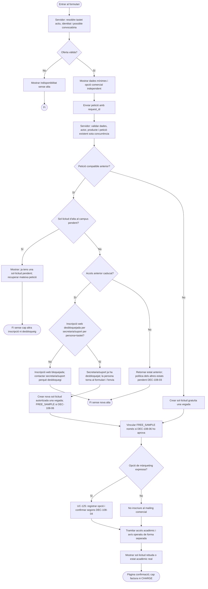
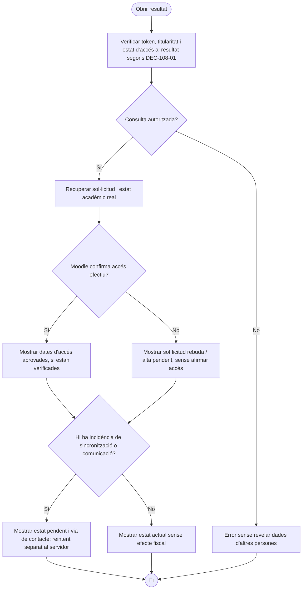

# UC-108 — Vista gràfica dels diagrames d'activitat de les quatre pàgines

**Document per llegir i decidir amb Meriem.** Aquesta pàgina utilitza diagrames Mermaid, que GitHub representa gràficament. Els **32 diagrames d'activitat UML en PlantUML, inclosos els diagrames per cada apartat funcional**, tenen la seva font canònica a [UC-108 — diagrames d'activitat detallats](uc-108-activitats-pagines-tastets-actual-final.md). Aquesta visualització resumeix *cada pàgina completa*; els detalls per apartat i la traçabilitat estan al document principal.

**Llegenda:** ACTUAL = comportament observat al codi `main` del 22/09/2026; FINAL = proposta que encara requereix resoldre DEC-108-01…07 a la [fitxa funcional](../06-fitxes-funcionals/uc-108.md#20-decisions-que-volem-definir-amb-negoci-abans-de-passar-a-un-altre-uc). No s'han executat proves ni confirmat el desplegament.

## 1. Llistat `/tastets`

**ACTUAL — Seccions:** A títol/GRATUÏT; B portada; C informació i targetes; D modal opcional d'avisos, que no inscriu al tastet.

**FINAL PROPOSAT — Sense alta fiscal ni acadèmica en consultar targetes.**

## 2. Fitxa individual `/tastets/{slug}`

**ACTUAL — Seccions:** A títol i retorn; B portada/GRATUÏT; C presentació; D CTA inscripció; E curs original i previsualització si disponible.

**FINAL PROPOSAT — La visita al curs original o al vídeo no és una inscripció.**

## 3. Formulari `/inscripcions/tastets/{slug}`

**ACTUAL — Seccions:** A càrrega AJAX; B dades personals; C com ens ha conegut/comentaris/mailing automàtic; D errors i modal de duplicat; E alta llegada.

**FINAL PROPOSAT — Decidir estat de la petició, alta acadèmica i mailing de manera independent.**

## 4. Confirmació `/tastets/confirmacio/{slug}/{token}`

**ACTUAL — Seccions:** A HMAC i consulta de fila; B missatge de sol·licitud enviada amb termini orientatiu; C contacte en cas d'incidència.

**FINAL PROPOSAT — Mostrar l'estat verificat i protegir dades del titular.**

**DEC-108-03b ACORDADA:** si la primera sol·licitud encara està pendent d'alta al campus, avisar que ja hi ha una petició pendent i no crear cap altra alta; no exigir desbloqueig de secretaria/suport. **DEC-108-03a ACORDADA:** accés caducat → secretaria/suport desbloqueja la inscripció web per persona+tastet i és la persona qui torna a emplenar i enviar el formulari; secretaria/suport no inscriu directament. El PHP actual no acredita aquest control. **Abans de considerar la proposta FINAL aprovada:** concretar el mecanisme de l'autorització i resoldre la resta de [DEC-108-01…07](../06-fitxes-funcionals/uc-108.md#20-decisions-que-volem-definir-amb-negoci-abans-de-passar-a-un-altre-uc). Els subdiagrames PlantUML dels dotze apartats tenen estats independents i no s'han substituït per aquesta vista resumida.
