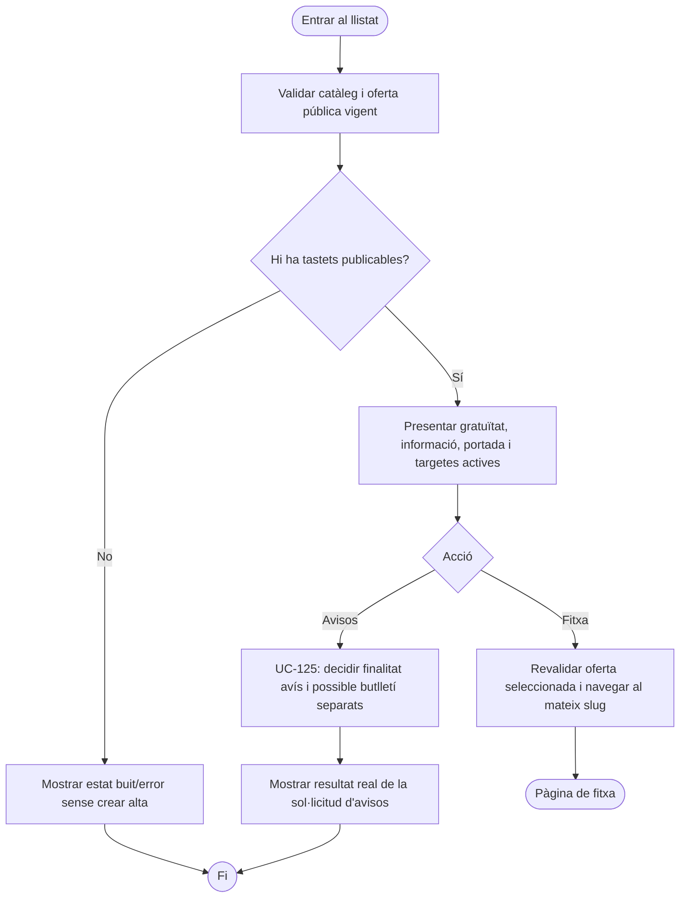
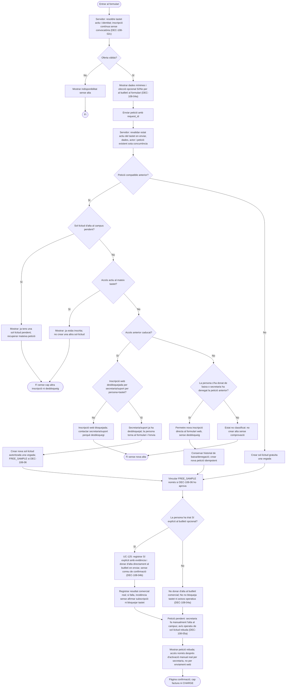
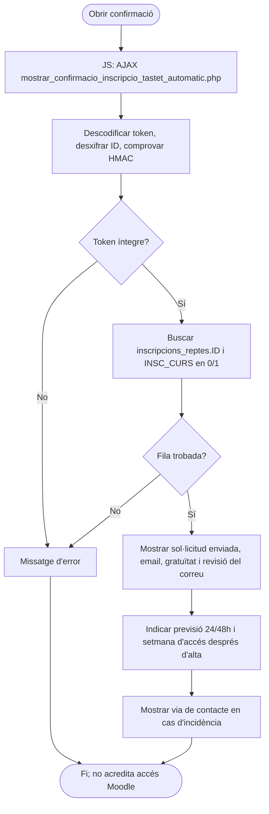
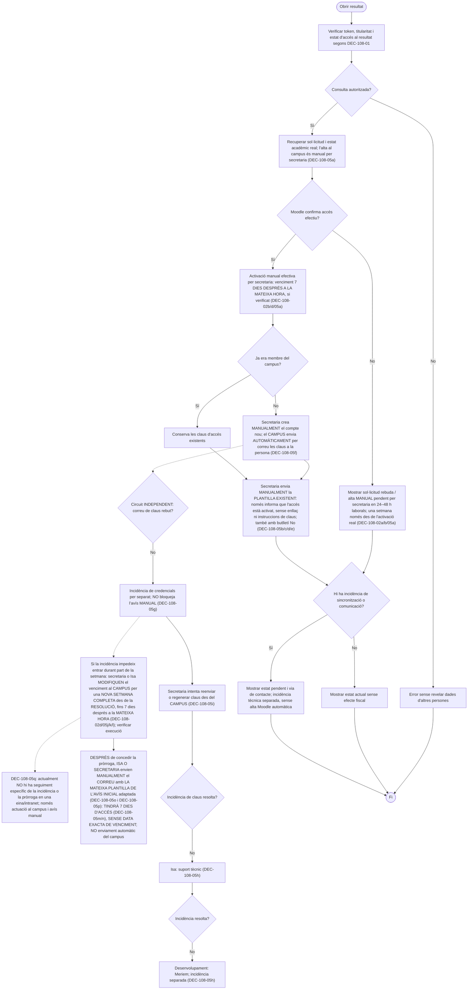

# UC-108 — Vista gràfica dels diagrames d'activitat de les quatre pàgines

**Document per llegir i decidir amb Meriem.** Aquesta pàgina utilitza diagrames Mermaid, que GitHub representa gràficament. Els **32 diagrames d'activitat UML en PlantUML, inclosos els diagrames per cada apartat funcional**, tenen la seva font canònica a [UC-108 — diagrames d'activitat detallats](uc-108-activitats-pagines-tastets-actual-final.md). Aquesta visualització resumeix *cada pàgina completa*; els detalls per apartat i la traçabilitat estan al document principal.

**Llegenda:** ACTUAL = comportament observat al codi `main` del 22/09/2026; FINAL = proposta que encara requereix resoldre DEC-108-01…07 a la [fitxa funcional](../06-fitxes-funcionals/uc-108.md#20-decisions-que-volem-definir-amb-negoci-abans-de-passar-a-un-altre-uc). No s'han executat proves ni confirmat el desplegament.

## 1. Llistat `/tastets`

**ACTUAL — Seccions:** A títol/GRATUÏT; B portada; C informació i targetes; D modal opcional d'avisos, que no inscriu al tastet.

**FINAL PROPOSAT — Sense alta fiscal ni acadèmica en consultar targetes.**

## 2. Fitxa individual `/tastets/{slug}`

**ACTUAL — Seccions:** A títol i retorn; B portada/GRATUÏT; C presentació; D CTA inscripció; E curs original i previsualització si disponible.

**FINAL PROPOSAT — La visita al curs original o al vídeo no és una inscripció.**

## 3. Formulari `/inscripcions/tastets/{slug}`

**ACTUAL — Seccions:** A càrrega AJAX; B dades personals; C com ens ha conegut/comentaris/mailing automàtic; D errors i modal de duplicat; E alta llegada.

**FINAL PROPOSAT — Decidir estat de la petició, alta acadèmica i mailing de manera independent.**

## 4. Confirmació `/tastets/confirmacio/{slug}/{token}`

**ACTUAL — Seccions:** A HMAC i consulta de fila; B missatge de sol·licitud enviada amb termini orientatiu; C contacte en cas d'incidència.

**FINAL PROPOSAT — Mostrar l'estat verificat i protegir dades del titular.**

**DEC-108-05a ACORDADA:** en aquesta fase secretaria fa manualment l'alta al campus després de rebre la sol·licitud web; l'accés no s'activa automàticament amb el formulari ni amb un worker. L'automatització es vol per al 2027 però no s'inclou al flux actual. **DEC-108-05b ACORDADA:** després de completar l'alta manual efectiva, secretaria envia un correu operatiu d'accés a la persona, independent del «Sí/No» del butlletí, també amb «No». **DEC-108-05c ACORDADA:** secretaria prepara i envia el correu MANUALMENT; no hi ha cap correu d'accés automàtic que s'hagi de programar ara. **DEC-108-05d ACORDADA:** secretaria utilitza una plantilla de correu ja preparada, no redacta cada missatge de zero. Cal contrastar-ne el text literal i la ubicació reals. **DEC-108-05e ACORDADA:** aquesta plantilla manual només comunica que l'accés ja s'ha activat, sense enllaç al campus ni instruccions per obtenir les claus. Si la persona ja era membre conserva les credencials existents. **DEC-108-05f ACORDADA:** si encara no era membre, quan secretaria crea MANUALMENT el compte el campus envia AUTOMÀTICAMENT per correu les claus d'accés a la persona; aquest correu del campus és diferent del correu posterior manual de secretaria i no implica automatitzar l'alta al campus. **DEC-108-05g ACORDADA:** si no rep les claus, secretaria envia IGUALMENT la plantilla manual informativa després de l'activació real; es gestiona la incidència de claus per separat. Enviar l'avís manual no acredita recepció de credencials ni entrada real al campus. **DEC-108-05h/i ACORDADES:** secretaria atén primer la incidència i prova reenviar o regenerar claus des del campus; si no la resol, es trasllada a Isa (suport tècnic) i després a desenvolupament (Meriem), sense condicionar l'avís manual posterior a l'activació ni duplicar comptes. **DEC-108-05j, DEC-108-05k i DEC-108-05l ACORDADES:** si una incidència de claus impedeix entrar durant part de la setmana, **concedir una NOVA SETMANA COMPLETA a partir de la resolució de la incidència** (no sumar només els dies perduts); **secretaria o Isa modifiquen el venciment al campus**, sense atribuir-ne exclusivament l'execució a cap de les dues. **DEC-108-05m PRECISADA:** després de concedir la pròrroga s'avisa per correu la persona que **tindrà 7 dies d'accés**, sense indicar cap data exacta de venciment en el missatge. El venciment real es modifica al campus i s'ha de verificar separadament. **DEC-108-05n ACORDADA:** Isa o secretaria envien MANUALMENT aquest correu de pròrroga; no hi ha un enviament automàtic del campus vinculat al canvi de venciment. **DEC-108-02d ACORDADA:** tant l'accés ordinari com el concedit per pròrroga venç SET DIES DESPRÉS A LA MATEIXA HORA del seu inici (activació real o resolució de la incidència, respectivament); NO a les 23.59 h. Comprovar la configuració efectiva de Moodle/BD sense pressuposar seguiment formal de la incidència. **DEC-108-05q — SITUACIÓ ACTUAL:** no hi ha cap circuit específic de seguiment de la incidència o la pròrroga a la intranet ni en una eina addicional; la modificació efectiva del venciment al campus i l'enviament manual del correu continuen sent les actuacions a contrastar. No pressuposar ni requerir un sistema de tiquets ja existent. **DEC-108-05o i DEC-108-05p ACORDADES:** l'avís de pròrroga reutilitza LA MATEIXA plantilla existent de l'avís inicial d'accés activat, adaptant-ne el missatge a 7 dies; són dos enviaments manuals separats. Text literal, ubicació, camps variables, destinatari exacte i traça pendents de contrastar. Pendent verificar l'instant de resolució, l'hora final/inclusivitat, permisos i modificació efectiva del venciment al campus; cap nova inscripció web. Pendent de comprovar permisos i circuit real. Pendent de verificar-ne el disparador, el destinatari i el resultat efectiu. Separar-lo del correu de petició rebuda; resten per verificar dates, contingut, destinatari i traça de l'enviament, sense pressuposar-ne el mecanisme tècnic. **DEC-108-04a ACORDADA:** subscripció al butlletí opcional amb elecció «Sí/No» al formulari de tastet; «No» no impedeix la sol·licitud ni els avisos operatius. Cal eliminar la subscripció automàtica al PHP/JS. **DEC-108-04b ACORDADA:** si tria «Sí» explícit, subscripció directa en enviar el formulari sense correu/enllaç de confirmació addicional, un cop registrada correctament; pendent de definir text/evidència i de provar alta/error/reintents. **DEC-108-02c ACORDADA:** es pot sol·licitar el tastet en qualsevol moment mentre estigui actiu, sense dates de convocatòria; revalidar-ne l'estat al servidor abans d'acceptar l'alta. **DEC-108-02a ACORDADA:** mantenir el termini comunicat de 24–48 hores laborals per a l'alta al campus després de la sol·licitud. Aquest avís no acredita un accés immediat. **DEC-108-02b ACORDADA:** una setmana d'accés des del moment en què secretaria activa realment el campus, no des de l'enviament del formulari; pendent de verificar les dates reals i el venciment PHP/Moodle. **DEC-108-03d ACORDADA:** després de baixa de la persona o petició denegada per secretaria, es permet una nova inscripció des del formulari web sense desbloqueig; es conserva l'historial i s'evita la doble alta. **DEC-108-03c ACORDADA:** accés actiu al mateix tastet → mostrar «ja estàs inscrita» sense crear una segona sol·licitud ni exigir desbloqueig. **DEC-108-03b ACORDADA:** si la primera sol·licitud encara està pendent d'alta al campus, avisar que ja hi ha una petició pendent i no crear cap altra alta; no exigir desbloqueig de secretaria/suport. **DEC-108-03a ACORDADA:** accés caducat → secretaria/suport desbloqueja la inscripció web per persona+tastet i és la persona qui torna a emplenar i enviar el formulari; secretaria/suport no inscriu directament. El PHP actual no acredita aquest control. **Abans de considerar la proposta FINAL aprovada:** concretar el mecanisme de l'autorització i resoldre la resta de [DEC-108-01…07](../06-fitxes-funcionals/uc-108.md#20-decisions-que-volem-definir-amb-negoci-abans-de-passar-a-un-altre-uc). Els subdiagrames PlantUML dels dotze apartats tenen estats independents i no s'han substituït per aquesta vista resumida.
