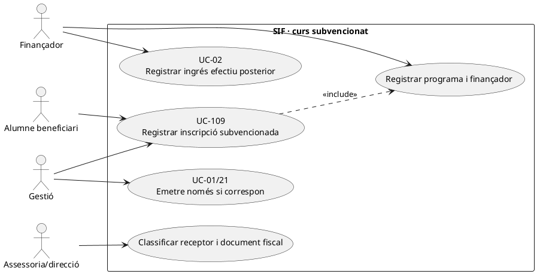
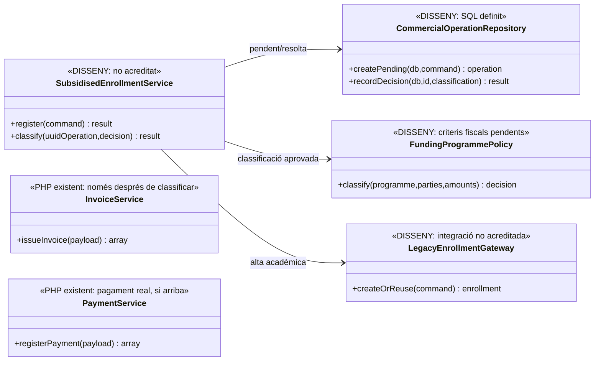
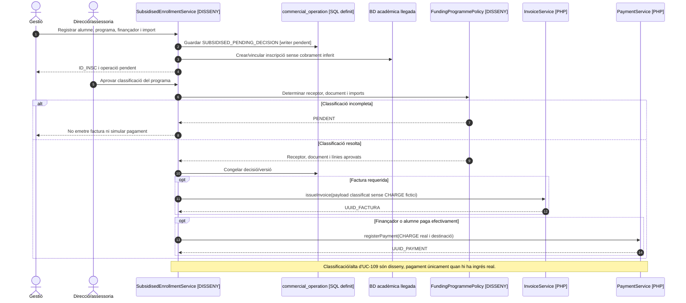

# UC-109 · Registrar una inscripció a curs subvencionat sense cobrament individual

**Objectiu canònic:** conservar inscripció, programa, finançador i evidència amb classificació **`SUBSIDISED_PENDING_DECISION`** sense inventar un cobrament de zero ni determinar automàticament qui ha de rebre la factura. La fitxa original classifica el cas com a **bloquejant** fins que negoci i assessoria fiscal resolguin **finançador, receptor i document econòmic/fiscal** per cada programa.

**Estat de les fonts:** `commercial_operation.CLASSIFICATION` recull `SUBSIDISED_PENDING_DECISION` al diccionari; la migració defineix operació i participants, però **no s'ha acreditat** un coordinador de subvencions que registri i resolgui la decisió fiscal. `InvoiceService` pot emetre una factura a partir d'un payload validat, però **no decideix per si mateix** si l'operació subvencionada exigeix factura a alumne, finançador, altra entitat o cap factura.

## 1. Fitxa específica

| Element | Regla |
| --- | --- |
| Actors | Alumne beneficiari, gestió acadèmica, responsable del programa/finançador, direcció i assessoria fiscal per classificar el circuit. |
| Entrada | `ID_INSC`, producte/edició, identificador de programa, identitat del finançador, bases/condicions i evidència, import finançat i eventual copagament, pagador real, destinatari fiscal quan es determini, actor i correlació. |
| Estat inicial | `SUBSIDISED_PENDING_DECISION` amb motiu i versions de regla; **no** usar `FREE_SAMPLE` perquè l'alumne no paga. Gratuïtat per a l'alumne no equival necessàriament a operació sense contraprestació. |
| Alta acadèmica | Es pot identificar l'inscrit i el programa quan el procediment ho permet; el registre d'alta acadèmica **no és** prova que el finançador hagi abonat cap import. |
| Decisió fiscal obligatòria | Determinar per programa/operació qui presta i qui rep el servei, receptor o receptors fiscals, document exigible, imports i moment d'emissió; és **pendent**. No codificar per defecte factura zero, no subjecta o al nom de l'alumne. |
| Moviment econòmic | Cap `payment_transaction CHARGE` mentre no consti ingrés real. Si paga el finançador, registrar **el seu ingrés únic** amb factura/es pertinents i atribució a `ID_INSC`; si hi ha copagament, ingressos separats segons pagador/origen real. |
| Fonts de dades | `commercial_operation`, `commercial_operation_party` i `commercial_operation_line` són esquemes definits, no writers desplegats. `payment_allocation` assigna a factura, **no** determina automàticament import finançat per inscrit. |

### 1.1. Flux funcional objectiu

1. El canal valida programa i elegibilitat acadèmica i identifica alumne, finançador i condicions de la subvenció. Les condicions particulars del programa no estan definides a `InvoiceService`.
2. Crea/reutilitza operació **pendent de classificació** amb imports potencials i evidència del finançament; no crea factura ni `CHARGE` fictici pel fet que la quota alumne sigui 0.
3. El procés responsable resol i registra la decisió fiscal aplicable **per a aquest programa**. Si la decisió és incompleta, manté `SUBSIDISED_PENDING_DECISION` i impedeix l'emissió automàtica.
4. Un cop la classificació és aprovada, congela producte, participants, receptor/es, línies, règim/import i qui paga què. Si correspon emissió, passa a UC-01 o UC-21; si no, documenta la justificació sense crear número fiscal.
5. Si el finançador paga posteriorment, UC-02/24 registra l'ingrés efectiu una sola vegada i l'assigna a la factura/s que corresponguin. Per N inscrits, cal traça de N imports individuals sense N cobraments bancaris artificials.
6. En cas de copagament alumne + finançador, cada entrada de caixa porta identitat i import propis; no duplicar la part finançada com a pagament de l'alumne.
7. Si canvia el programa/finançador després d'emetre, classificar fiscalment l'impacte abans de rectificar o modificar imports; mai editar directament factura emesa per adaptar-la al nou ajut.

### 1.2. Alternatives i proves

| Situació | Resposta |
| --- | --- |
| Curs gratuït per a alumne però finançador paga al centre | No `FREE_SAMPLE`; decisió fiscal i ingrés real del finançador quan es produeixi. |
| Subvenció adjudicada però no ingressada | Acreditar el compromís i el deute segons política, **cap CHARGE** fins a l'ingrés. |
| Pagament global per 20 inscrits | Un moviment bancari per ingrés real, atribució monetària individual documentada; cap suposició de quota idèntica sense conveni. |
| Copagament parcial | Separar pagador alumne i pagador entitat, inclosos retorns o incidències futurs. |
| Manca receptor/document fiscal resolt | Mantindre pendent la classificació i impedir emissió automàtica sense dades legítimes. |
| Reintent de l'alta acadèmica | Reutilitzar inscripció/operació si equivalent, sense segon dret, factura o ingrés. |

**Bloquejants:** documents/decisió fiscal per programa, receptor i finançador, import finançat individual, estat acadèmic, pagaments reals i proves d'extrem a extrem. No s'ha executat cap prova PHP específica del programa subvencionat.

### 1.3. Identificació del curs subvencionat al handler de compra llegat

**Origen de la classificació, no decisió fiscal automàtica.** El document `33-casos-us-sif.md` identifica `web-actual/ajax/enviarInscripcio.php` com el handler que crea inscripcions **abans de pagar** i distingeix un curs subvencionat per `tipusCurs == 'S'`. La marca del canal identifica un **candidat a classificar**: no determina el finançador concret, el document fiscal, l'import que rep l'empresa ni que el curs sigui un tastet `FREE_SAMPLE`. La fitxa objectiu exigeix `SUBSIDISED_PENDING_DECISION` fins que les condicions del programa i el receptor estiguin acreditats; no afirmar que el handler llegat ja implementa aquesta classificació al SIF.

**Separar les tres quantitats per programa.** Conservar, quan la font real ho acrediti, **preu del servei**, **part assumida pel finançador** i **copagament efectivament degut per la persona**; un `A_PAGAR=0` en una inscripció pot correspondre a una quota individual zero, no a contraprestació global zero ni a ingrés bancari confirmat del finançador. Si el conveni inclou diverses inscripcions o cursos, la distribució per `ID_INSC` ha de provenir de les condicions aprovades: ni el `tipusCurs` ni un `IDPAG` de grup autoritzen repartir la subvenció a parts iguals per defecte.

**Accés acadèmic, cobrament i emissió posteriors.** L'alta de `enviarInscripcio.php` és un fet acadèmic/comercial que pot antecedir tant l'ingrés del finançador com la decisió fiscal. Conservar `ID_INSC`, programa, participant, entitat, imports previstos i estat pendent; UC-124/129 comprova matrícula i accés sense crear una factura provisional de zero. Quan el programa tingui classificació fiscal aprovada, UC-69/01/21 decideix i congela receptor/es i documents, i UC-02 registra un `CHARGE` **només si hi ha ingrés extern efectiu**. Si el programa combina aportacions d'alumne i entitat, traçar dues fonts monetàries amb els seus imports i receptors sense confondre el finançador amb la persona inscrita.

**No extrapolar el cas USOC.** La documentació de fluxos descriu un tractament propi d'USOC amb factures de part alumne i part entitat i una variant de curs gratuït; `tipusCurs=='S'` **no permet inferir** que totes les subvencions segueixin aquesta divisió, que l'alumne pagui necessàriament 10 € o que un curs subvencionat sempre requereixi dues factures. UC-13/19 només s'aplica quan la situació real i la regla aprovada encaixen en aquell circuit.

### 1.4. Proves addicionals del handler subvencionat (no executades)

| ID | Escenari | Resultat exigible |
| --- | --- | --- |
| SB-109-01 | `enviarInscripcio.php` crea matrícula amb `tipusCurs='S'` | Alta identificada i classificació pendent; cap factura zero ni CHARGE inventat. |
| SB-109-02 | Quota d'alumne zero i subvenció no ingressada | No tractar l'operació com FREE_SAMPLE ni marcar finançador com a pagat. |
| SB-109-03 | Aportació global d'entitat per diverses inscripcions | Traçar programa i imports per persona segons conveni, no repartir per igual sense font. |
| SB-109-04 | Programa subvencionat amb copagament individual real | Separar pagadors i fonts d'ingrés, conservar receptor/s fiscal/s segons decisió. |
| SB-109-05 | Curs marcat com S però falta resolució sobre receptor/document | Aturar emissió automàtica i derivar a decisió fiscal del programa. |
| SB-109-06 | Algú aplica per defecte les dues factures pròpies d'USOC | Rebutjar l'equivalència sense regla específica del programa subvencionat. |

## 2. UML de casos d'ús

## 3. Classes — model SQL i orquestració pendent

No es dibuixa dependència executable d'`InvoiceService` a `FundingProgrammePolicy`: **l'emissor no comprova automàticament les condicions del programa**.

## 4. Seqüència — inscripció i decisió abans d'emetre (DISSENY)

## 5. Traçabilitat

[UC-109 original](../06-fitxes-funcionals/uc-109.md) · [UC-108 tastet gratuït](uc-108-tastet-repte-gratuit.md) · [UC-01 emissió](uc-001-emetre-o-reutilitzar-factura.md) · [UC-04 factura abans de cobrar](uc-004-emetre-factura-abans-cobrar.md) · [UC-02 cobrament](uc-002-registrar-cobrament-factura.md) · [Classificacions del diccionari](../05-governanca-operacio/24-diccionari-camps-i-valors.md) · [Esquema comercial](../../sif/database/migrations/2026_09_16_000004_add_commercial_operation_and_fiscal_fields.sql) · [Model de fons individual](00-revisio-moviments-inscripcions.md).
