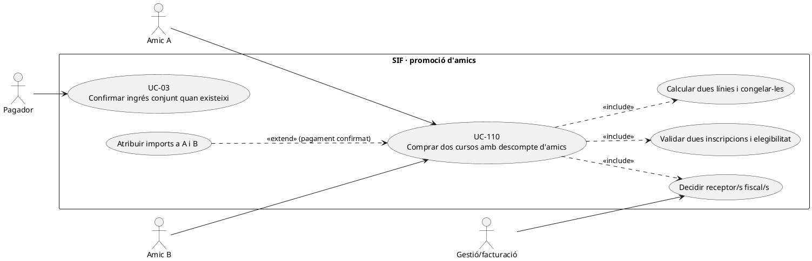
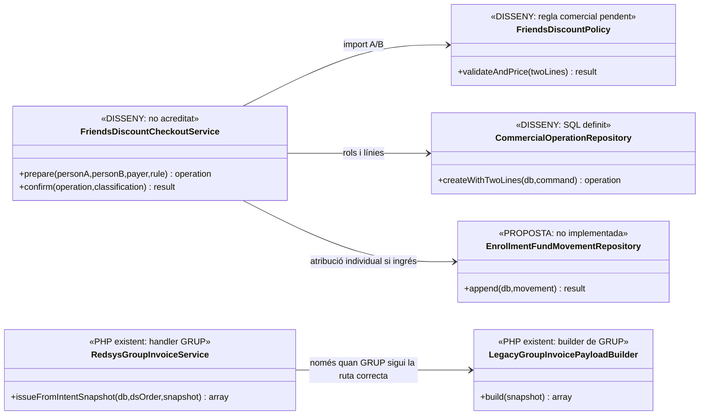
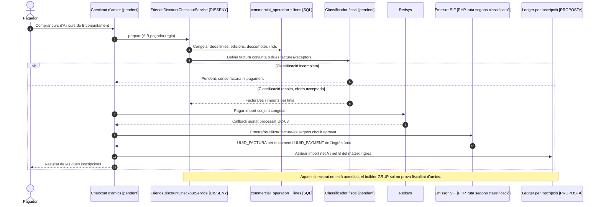

# UC-110 · Descompte d'amics: dues inscripcions, un pagador

**Objectiu canònic:** dues persones poden inscriure's a **cursos diferents** i compartir una operació/intenció i un pagador, però cada participant, curs, edició, base, descompte i import final s'ha de congelar separadament. **Decisió bloquejant:** la factura pot correspondre a dues línies al pagador o a factures separades segons receptors; el fet de compartir `IDPAG` o pagador **no resol la identitat del receptor fiscal**.

**Estat del codi:** `RedsysGroupInvoiceService` i `LegacyGroupInvoicePayloadBuilder` admeten un snapshot amb N `items`, una línia `INSCRIPCIO` i una relació per participant, i una relació addicional `GRUP`. **Això no acredita que el descompte d'amics estigui integrat a la ruta de grup ni que la promoció sigui fiscalment una factura única**. El builder de grup usa `responsible` com a receptor, `IDPAG` de grup i tracta totes les línies com a grup; manca un `FriendsDiscountCheckoutService` verificat que autoritzi regles/preus/receptors individuals.

## 1. Fitxa funcional específica

| Element | Regla |
| --- | --- |
| Actors | Amic A, amic B, pagador designat, ecommerce i operador que resol diferències fiscals. El pagador pot no ser receptor únic de les dues prestacions. |
| Entrada | Dos participants amb `ID_INSC_A` i `ID_INSC_B`, dos productes/edicions potencialment diferents, bases de preu, regla/percentatge aprovat, descompte **per línia**, total, `UUID_OPERATION`, pagador, receptor/s i un identificador de compra. |
| Regla comercial | Cal validar que **ambdues** inscripcions compleixen les condicions reals de la promoció i calcular el descompte sobre la **base de cadascun dels cursos**. El percentatge i les incompatibilitats no queden fixats pel builder fiscal; no inventar-ne cap. |
| Model SQL | `commercial_operation_party` diferencia rols i participants i `commercial_operation_line` desa cada producte/edició, `PARTICIPANT_PARTY_KEY`, base/descompte/total i snapshot. `operation_line_invoice_link` permet traçar línies comercials a línies fiscals, **sense decidir** si hi ha una o dues factures. Són definicions SQL, no writer executat acreditat. |
| Fons | Una única transacció bancària **si** realment es fa un pagament conjunt; si s'emeten dues factures, una mateixa entrada es pot assignar a totes dues només amb suma de trams coherent. El ledger individual proposat ha de portar import A i B, **no dues entrades externes del total global**. |
| Correccions | Si una persona abandona abans d'emetre, revalidar promoció i imports **d'ambdues** línies abans de congelar. Si canvia després de la factura, UC-16a/16b, 71/72 i classificació fiscal/retorn corresponents; no editar directament la factura anterior. |

### 1.1. Flux objectiu

1. El canal identifica els dos amics i evita inscripcions duplicades UC-107 per persona, producte i edició. No es dedueix relació de parentiu, pagador o receptor del fet de compartir email.
2. Valida les condicions de la promoció d'amics segons regla vigent, conserva justificació i percentatge/descompte **per participant**. Per exemple, bases diferents generen imports de descompte diferents quan la regla és percentual.
3. Classifica receptor/s fiscal/s i agrupació de línies abans del TPV amb decisió de negoci/assessoria. **No** convertir automàticament el snapshot al format `GRUP` perquè existeixi un builder de N línies.
4. UC-112 congela cada producte, edició, plaça, import i receptor; un intent Redsys `DS_ORDER` només s'ha de crear quan l'adaptador determinat disposa d'un handler vàlid per la composició comercial.
5. Si hi ha un **únic ingrés conjunt confirmat**, UC-03 crea/reutilitza un `UUID_PAYMENT` extern; segons classificació, la seva suma s'assigna a la factura única o als dos documents, i els imports individuals d'A i B són moviments **interns** d'atribució.
6. La relació comercial conserva ambdós `ID_INSC`, `UUID_OPERATION`, `UUID_PAYMENT` i `UUID_FACTURA` corresponents. La comprovació final garanteix que `netA + netB = importConjunt` per pagament total, sense barrejar conceptes ni registrar `CHARGE` dues vegades.
7. En un pagament denegat no es crea ingrés; si una plaça es perd després de cobrar, no es descarta el cobrament real ni es concedeix una plaça fictícia: incidència i tractament individual.

### 1.2. Alternatives i proves concretes

| Cas | Comportament |
| --- | --- |
| A curs de 80 € i B de 120 €, promoció percentual | Congelar base i descompte d'A i B independentment segons percentatge aprovat; no repartir un descompte global per meitats. Imports **il·lustratius**, no tarifa real. |
| Un pagador, dues factures per receptors diferents | **Un** moviment bancari si la transacció és conjunta, dues imputacions fiscals que sumen el total i dues atribucions per `ID_INSC`. La capacitat de repartir un pagament existent UC-56 continua pendent d'implementació completa. |
| Dos participants i un curs diferent per cadascun | Conservar dues línies i edicions; no reconstruir tots dos cursos a partir del primer `IDPAG` o del primer `CURS`. |
| Baixa d'A abans del TPV | Reavaluar si B encara té dret al descompte i crear nova oferta acceptada; no reutilitzar el snapshot antic amb import contradictori. |
| Baixa d'A després de cobrar | Identificar import **atribuït a A** i titular del retorn; no retornar el total conjunt ni retirar el servei B automàticament. |
| Callback repetit | Reutilitzar factura/es i `UUID_PAYMENT` de l'operació, sense duplicar l'accés de cap participant. |

**Pendents:** definició comercial de la promoció d'amics, qui rep cada factura, handler comercial si no equival a grup, política de places, split fiscal de pagament existent i ledger per inscripció. No s'han executat proves específiques del descompte d'amics.

### 1.3. Alta real de `DescompteAmic.php` i perill d'assimilar-la al grup ordinari

**Evidència directa del canal web en `main` (22/09/2026).** [`DescompteAmic.php::__insertBD()`](../../codi-drive/web-actual/DescompteAmic.php#L92-L138) **fixa `TIPUS_INSC='G'`**, insereix `inscripcions` amb un `IDPAG` compartit, calcula el preu net de cada participant amb `__getPriceOffer()` i fixa `INSC_MAILING='0'`. [`__getOfferCompy()` i `__getPriceOffer()`](../../codi-drive/web-actual/DescompteAmic.php#L423-L462) consulten el paràmetre `descompteAmics` i calculen el preu individual. [`__insertRespGrupBD()`](../../codi-drive/web-actual/DescompteAmic.php#L149-L163) insereix el responsable a `respGrups`; l'alta dels dos participants comparteix `IDPAG` a [L1360–1394](../../codi-drive/web-actual/DescompteAmic.php#L1360-L1394). **La tipologia G sí queda acreditada al PHP del canal**, i cal retirar la incertesa històrica sobre aquest camp. Tanmateix, que la tipologia sigui G NO demostra que el descompte d'amics compleixi el contracte fiscal, de receptors, descomptes i assignacions del grup ordinari. Abans de reutilitzar el builder de grup, verificar i provar les dues regles de negoci i el destinatari legítim de cada factura.

**Els dos cursos no comparteixen necessàriament oferta o plaça.** Per cada `ID_INSC` conservar `ANY/MES/CURS`, versió de preu i regla de descompte, base individual, import net, reserva/plaça i identitat del participant. La dada `descomptes_grup` del grup ordinari **no prova** que el descompte d'amics segueixi aquells trams; la regla i el percentatge efectius s'han d'obtenir del canal/promoció validats, no reconstruir-los amb el `A_PAGAR` d'un participant després d'un pagament parcial. En cas de cancel·lació o indisponibilitat de **només un** curs, revisar la continuïtat del benefici de l'altre segons les condicions aprovades; no cancel·lar l'altra inscripció, plaça o factura sense decisió.

**Cobrament conjunt i receptor/s.** La creació de dues altes amb `IDPAG` compartit **no demostra que existeixi ingrés bancari** ni defineix si la factura s'ha d'emetre a cada receptor o a un únic destinatari legítim. Un `DS_ORDER` validat amb cobrament conjunt crea/reutilitza **un únic moviment extern**; el desglossament fiscal i les atribucions de diners per inscrit han de sumar els imports efectius sense inventar dos `CHARGE`. Si ja existeix una factura prèvia d'un receptor per la composició confirmada, el cobrament posterior s'assigna a la factura existent; no emetre dues factures per les dues inscripcions simplement perquè el callback troba dos IDs.

**La regla exacta de la promoció no és al builder de grup.** El valor comercial aplicable a A i B, possibles incompatibilitats i efecte d'una baixa/canvi són **decisions a recuperar i validar al canal/promoció**, no un percentatge que es pugui copiar d'un altre descompte. El criteri de facturació per receptors diferents també continua pendent de decisió explícita per aquesta composició.

### 1.4. Proves del canal d'amics (no executades)

| ID | Escenari | Resultat exigible |
| --- | --- | --- |
| AM-110-01 | `DescompteAmic.php` crea dues inscripcions en cursos diferents amb `IDPAG` comú | Dos `ID_INSC` i dues edicions/places verificades; cap curs copiat del primer participant. |
| AM-110-02 | `DescompteAmic::__insertBD()` sí fixa `TIPUS_INSC='G'` i s'intenta usar `LegacyGroupSnapshotRepository` | La lectura de la tipologia G pot funcionar; comprovar si el builder tracta correctament promoció d'amics, dues edicions, imports individuals, receptor/s i operació comuna abans d'emetre, sense assimilar automàticament amics a grup ordinari. |
| AM-110-03 | Responsable a `respGrups` paga però els receptors fiscals són diferents | Resoldre agrupació fiscal legítima abans d'emetre; un `IDPAG` no autoritza factura única per defecte. |
| AM-110-04 | Una de les dues inscripcions perd la plaça abans del TPV | Revalidar la promoció de l'altra línia i oferir nou snapshot, sense cobrament anticipat. |
| AM-110-05 | Ingrés conjunt real de dues inscripcions amb import individual diferent | Un `UUID_PAYMENT` extern i imports individuals acreditats, no divisió automàtica per meitats. |
| AM-110-06 | Baixa d'un amic després de la factura i del pagament | Revisió del descompte i decisió econòmica/fiscal per afectat, sense esborrar la venda de l'altre. |

## 2. UML de casos d'ús

## 3. Diagrama de classes: builder genèric de grup ≠ integració d'amics

La classe d'orquestració de la promoció és **disseny**; no se li atribueix una crida actual al handler `GRUP`.

## 4. Seqüència — dos participants i ingrés conjunt (DISSENY/PARCIAL)

## 5. Traçabilitat

[UC-110 original](../06-fitxes-funcionals/uc-110.md) · [UC-107 duplicats](uc-107-detectar-inscripcio-duplicada.md) · [UC-112 snapshot](uc-112-congelar-snapshot-abans-tpv.md) · [UC-16 grup](uc-016-facturar-grup.md) · [UC-56 assignar pagament](uc-056-cercar-assignar-cobrament.md) · [LegacyGroupInvoicePayloadBuilder](../../sif/src/Service/LegacyGroupInvoicePayloadBuilder.php) · [RedsysGroupInvoiceService](../../sif/src/Service/RedsysGroupInvoiceService.php) · [Taules línies i drets comercials](../../sif/database/migrations/2026_09_16_000005_add_operation_lifecycle_tables.sql) · [Ledger individual proposat](00-revisio-moviments-inscripcions.md).

**Límit de revisió:** inspecció estàtica del PHP versionat a `main`; no s'ha executat el checkout ni s'ha acreditat el desplegament, la factura de dos receptors o la suite. [Auditoria lot 01](00-auditoria-casos-pendents-lot-01-2026-09-22.md).
