# UC-111 · Diagrames d'activitat ACTUAL / FINAL

**Objectiu:** tenir les activitats separades per pàgina/apartat i per estat ACTUAL/FINAL, en lloc de dependre només del document UML integrat.

## 1. Web d'inscripció JASOM · ACTUAL contrastat

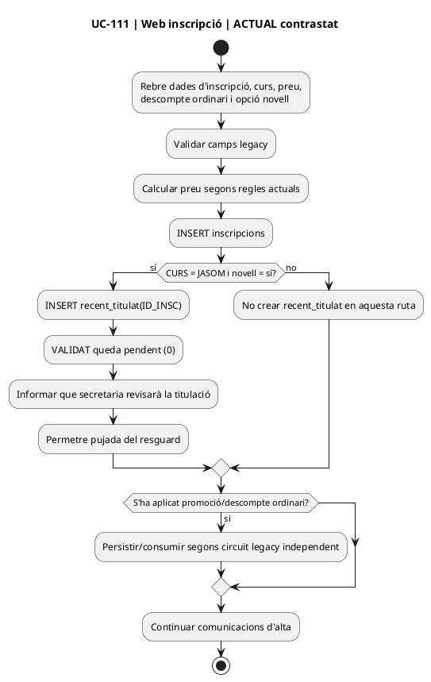

## 2. Web d'inscripció JASOM · FINAL

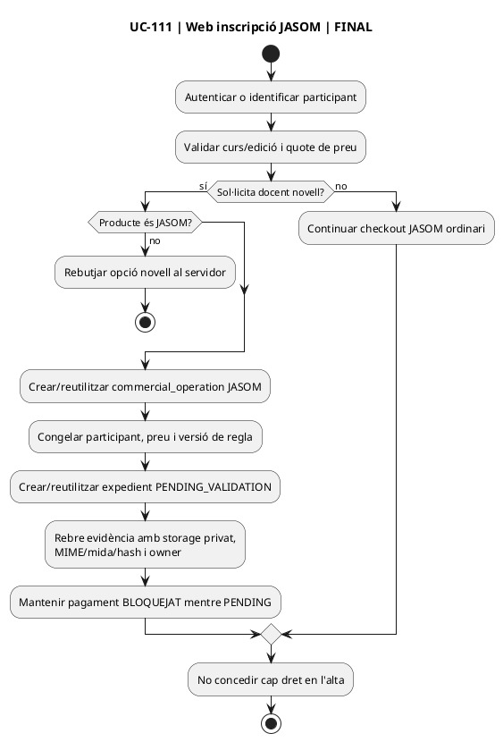

## 3. Pujada de justificació · ACTUAL / FINAL

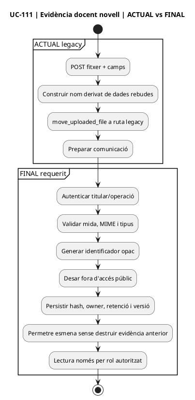

## 4. Intranet alumnes-validar-descomptes · ACTUAL contrastat

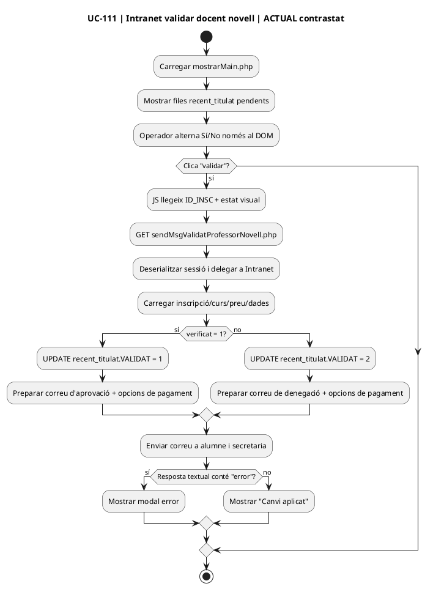

## 5. Intranet alumnes-validar-descomptes · FINAL

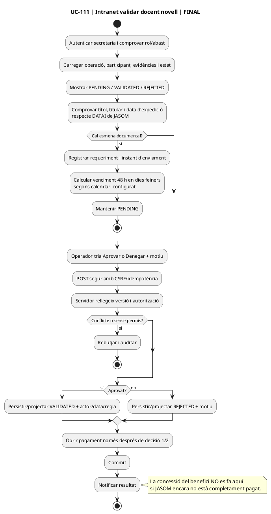

## 6. Pagament JASOM · ACTUAL contrastat

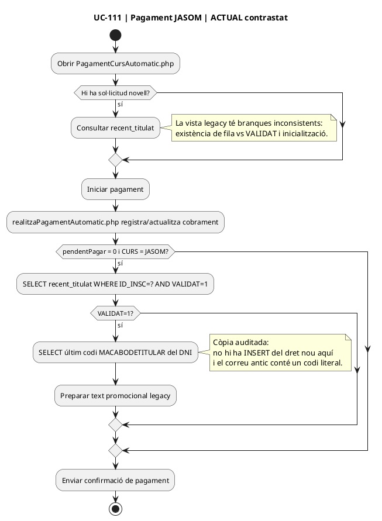

## 7. Pagament JASOM i concessió · FINAL implementat a la branca

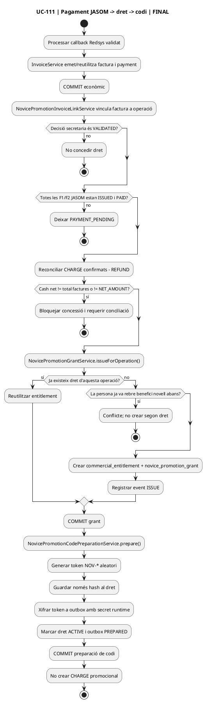

## 8. Consum del saldo original · FINAL

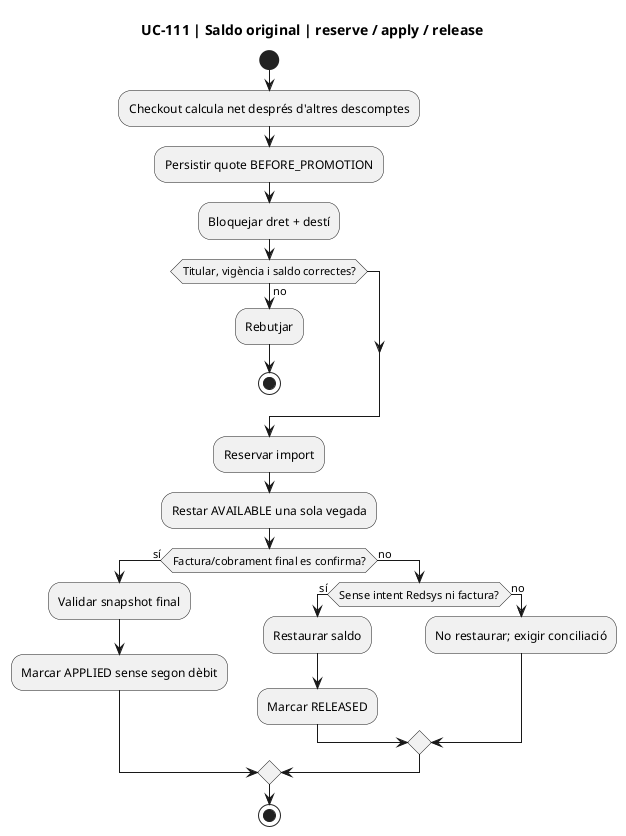

## 9. Canvi de curs · FINAL

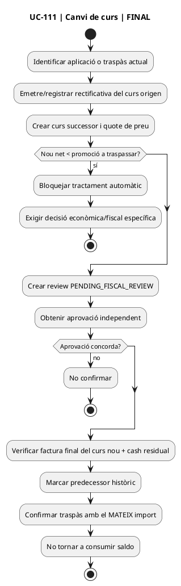

## 10. Baixa del curs destí i saldo derivat · FINAL

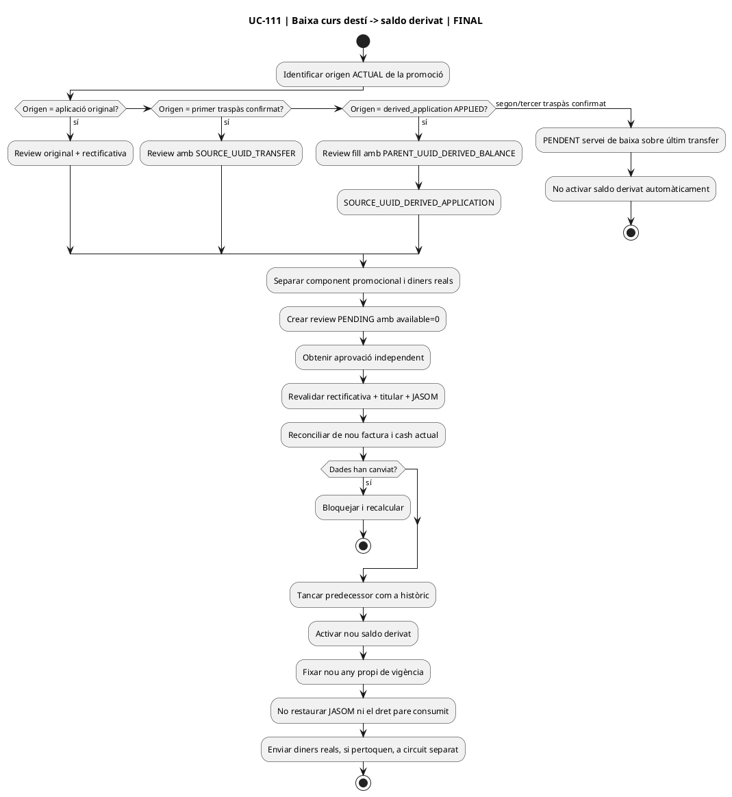

**Implementació de branca:** la baixa directa d'una `novice_promotion_derived_application.APPLIED` usa `NovicePromotionDerivedApplicationCancellationReviewService` i `NovicePromotionDerivedApplicationCancellationActivationService`; el fill conserva `PARENT_UUID_DERIVED_BALANCE` i el predecessor passa a `CONVERTED_TO_DERIVED` sense recreditar el pare.
## 11. Consum del saldo derivat · FINAL

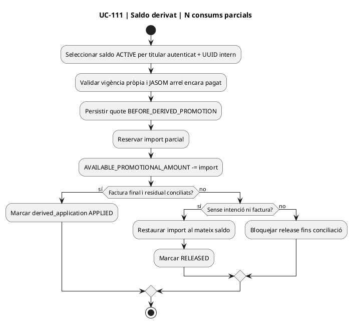

## 12. Devolució JASOM · review, freeze i recovery · FINAL

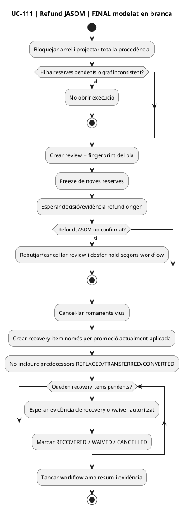

## 13. Matriu pàgina/apartat → activitat

| Superfície | ACTUAL | FINAL |
| --- | --- | --- |
| web alta curs | §1 | §2 |
| pujada justificant | §3 | §3 |
| intranet validar descomptes | §4 | §5 |
| pagament JASOM | §6 | §7 |
| checkout curs posterior | consulta legacy | §8 |
| canvi curs | flux general legacy | §9 |
| baixa curs | no canònic | §10 |
| saldo derivat | inexistent com a model canònic | §11 |
| refund JASOM | manual/dispers | §12 |

## 14. Estat

Les activitats FINAL dels §§7–12 corresponen a serveis de la branca, però els adaptadors d'UI/autenticació/pricing/fiscalitat/evidències externes no estan acreditats com a desplegats. **No s'han executat proves MySQL en aquesta auditoria.**

[Fitxes d'acció](../06-fitxes-funcionals/uc-111-accions.md) · [Classes](uc-111-classes-actual-final.md) · [Seqüències](uc-111-sequencies-actual-final.md) · [Dades i estats](uc-111-dades-estats-actual-final.md) · [Traçabilitat](uc-111-tracabilitat-implementacio.md)
