# UC-111 · Diagrames d'activitat ACTUAL / FINAL

**Objectiu:** tenir les activitats separades per pàgina/apartat i per estat ACTUAL/FINAL, en lloc de dependre només del document UML integrat.

## 1. Web d'inscripció JASOM · ACTUAL observable

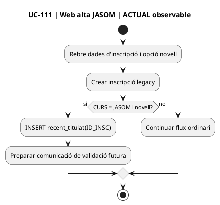

## 2. Web d'inscripció JASOM · FINAL/SIF

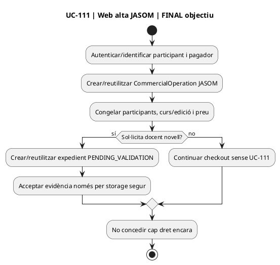

## 3. Pujada de justificació · ACTUAL / FINAL

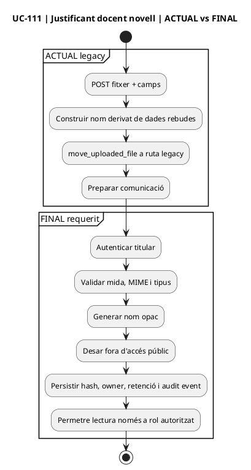

## 4. Intranet · validar docent novell · ACTUAL observable

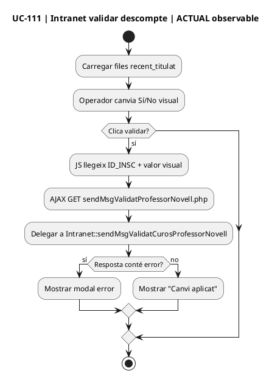

## 5. Intranet · validar docent novell · FINAL

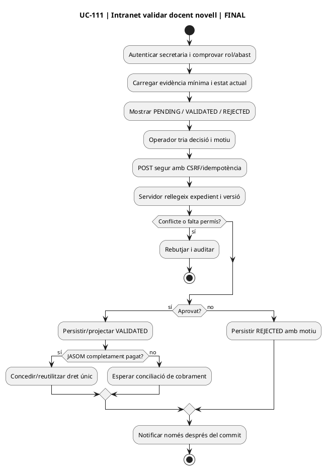

## 6. Pagament JASOM i concessió · FINAL

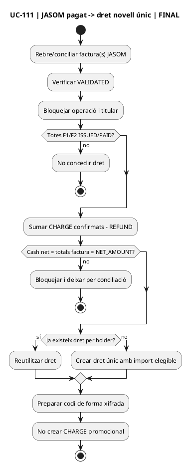

## 7. Consum del saldo original · FINAL

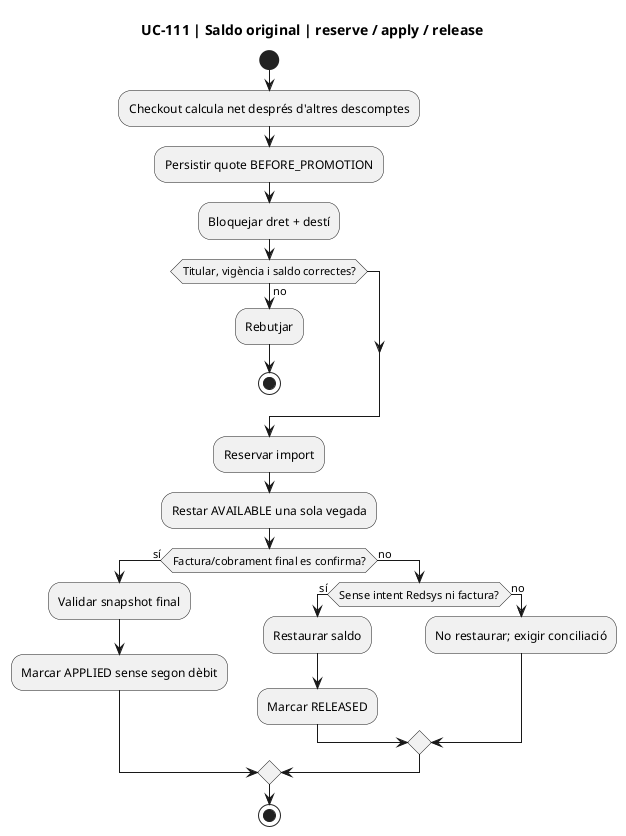

## 8. Canvi de curs · FINAL

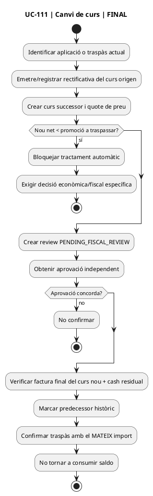

## 9. Baixa del curs destí i saldo derivat · FINAL

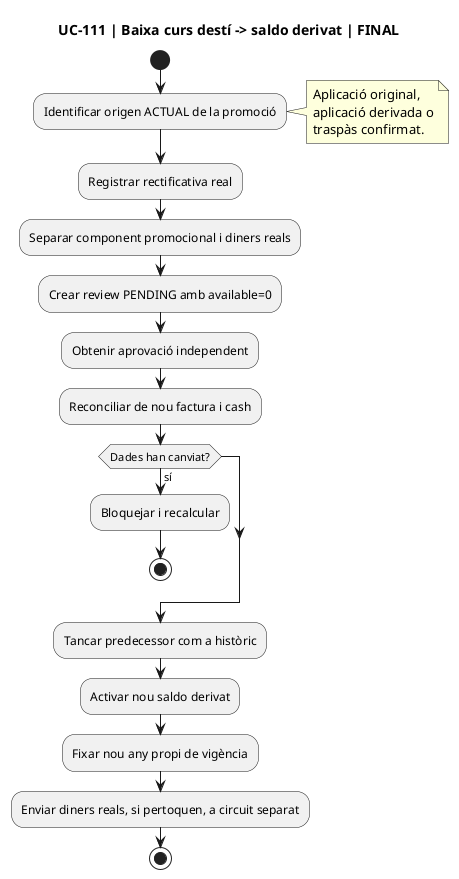

## 10. Consum del saldo derivat · FINAL

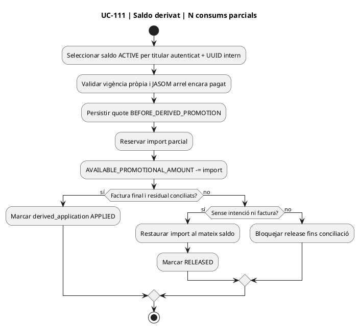

## 11. Devolució JASOM · review, freeze i recovery · FINAL

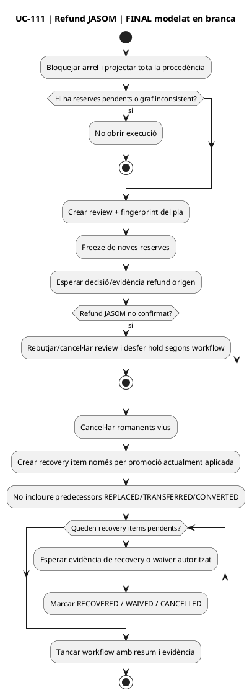

## 12. Matriu pàgina/apartat → activitat

| Superfície | ACTUAL | FINAL |
| --- | --- | --- |
| web alta curs | §1 | §2 |
| pujada justificant | §3 | §3 |
| intranet validar descomptes | §4 | §5 |
| pagament JASOM | parcial/dispers | §6 |
| checkout curs posterior | consulta legacy | §7 |
| canvi curs | flux general legacy | §8 |
| baixa curs | no canònic | §9 |
| saldo derivat | inexistent com a model canònic | §10 |
| refund JASOM | manual/dispers | §11 |

## 13. Estat

Les activitats FINAL dels §§6–11 corresponen a serveis de la branca, però els adaptadors d'UI/autenticació/pricing/fiscalitat/evidències externes no estan acreditats com a desplegats. **No s'han executat proves MySQL en aquesta auditoria.**

[Fitxes d'acció](../06-fitxes-funcionals/uc-111-accions.md) · [Classes](uc-111-classes-actual-final.md) · [Seqüències](uc-111-sequencies-actual-final.md) · [Traçabilitat](uc-111-tracabilitat-implementacio.md)
