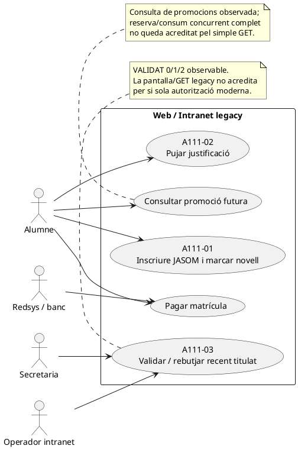

# UC-111 · Casos d'ús ACTUAL / FINAL

**Document canònic de vistes de casos d'ús.** La [fitxa principal](../06-fitxes-funcionals/uc-111.md) conserva les regles de negoci i les decisions; les [fitxes d'acció](../06-fitxes-funcionals/uc-111-accions.md) descomponen el cas per operació.

## 1. Frontera ACTUAL observable

L'ACTUAL no és un sistema únic. Combina web legacy, intranet, taules `recent_titulat/promocions`, pagament i comunicacions. El codi observat acredita algunes accions, però no una orquestració única ni totes les garanties de titularitat, idempotència i fiscalitat.

## 2. Frontera FINAL/SIF per responsabilitats

```plantuml
@startuml
left to right direction
actor Alumne
actor "Secretaria autoritzada" as Sec
actor "Checkout / pricing SIF" as Checkout
actor "Emissor fiscal SIF" as Fiscal
actor "Redsys / banc" as Bank
actor "Worker privat correu" as Mail
actor "Procés conciliació/refund" as Refund

rectangle "UC-111 · Dret docent novell" {
  usecase "A111-01\nPreparar expedient JASOM" as U1
  usecase "A111-03\nProjectar decisió secretaria" as U3
  usecase "A111-04\nConcedir dret únic després de cobrament" as U4
  usecase "A111-05\nPreparar i lliurar codi" as U5
  usecase "A111-06\nReservar / aplicar saldo original" as U6
  usecase "A111-07\nTraspassar aplicació entre cursos" as U7
  usecase "A111-08\nBaixa i saldo derivat" as U8
  usecase "A111-09\nConsumir saldo derivat" as U9
  usecase "A111-10\nProjectar procedència" as U10
  usecase "A111-11\nObrir revisió refund JASOM" as U11
  usecase "A111-12\nExecutar cancel·lació/recovery" as U12
}

Alumne --> U1
Sec --> U3
Checkout --> U6
Checkout --> U7
Checkout --> U8
Checkout --> U9
Fiscal --> U7
Fiscal --> U8
Bank --> U4
Mail --> U5
Refund --> U11
Refund --> U12

U3 ..> U4 : <<precondition>>
U4 ..> U5 : <<include>>
U5 ..> U6 : <<enables>>
U6 ..> U7 : <<alternate lifecycle>>
U6 ..> U8 : <<alternate lifecycle>>
U8 ..> U9 : <<enables>>
U7 ..> U10 : <<trace>>
U8 ..> U10 : <<trace>>
U9 ..> U10 : <<trace>>
U10 ..> U11 : <<include>>
U11 ..> U12 : <<approved refund only>>
@enduml
```

## 3. Relació amb altres casos d'ús

| Relació | Motiu |
| --- | --- |
| UC-14 / descomptes | UC-111 és una promoció comercial específica, acumulable segons regla confirmada |
| UC-20d | bescanvi/reserva d'un dret comercial futur |
| UC-23 | validació/gestió documental i decisió de descompte |
| UC-50/51/52/63 | intenció, callback i worker Redsys; UC-111 no pot inventar un cobrament |
| UC-90 | notificacions/outbox |
| UC-112 | snapshot complet abans del TPV |
| UC-117 | cicle de vida del dret futur, consum, canvi, baixa i derivació |

## 4. Catàleg de subcasos UC-111

| ID d'acció | Subcas | ACTUAL | FINAL/branca | Estat |
| --- | --- | --- | --- | --- |
| A111-01 | alta i expedient | handler web + `recent_titulat` | `NovicePromotionEnrollmentStager` | parcial |
| A111-02 | evidència | pujada legacy | storage segur pendent | bloquejant |
| A111-03 | decisió | intranet/VALIDAT | `SecretaryDecisionProjector` | parcial |
| A111-04 | concessió | generador legacy no acreditat completament | `GrantService` + reconciler | implementat branca |
| A111-05 | codi/correu | comportament legacy parcial | preparació xifrada + verificació + worker | implementat branca, connectors pendents |
| A111-06 | consum original | consulta promo legacy | `RedemptionService` | implementat branca |
| A111-07 | canvi de curs | flux general de canvi | review/confirm primer + successius | implementat branca |
| A111-08 | baixa/saldo derivat | no model canònic | review/activation original i transferit | implementat branca |
| A111-09 | consum derivat | no model canònic | `DerivedBalanceRedemptionService` | implementat branca |
| A111-10 | procedència | dispersa | snapshot + projection + lineage policy | implementat branca |
| A111-11 | review refund arrel | manual/dispers | root refund review/plan | implementat branca |
| A111-12 | conseqüències/recovery | no canònic | execution + resolution + completion | implementat branca |

## 5. Regles que el diagrama NO autoritza a inferir

- Un expedient `PENDING` no és un dret promocional.
- Una rectificativa no és, per si sola, una aprovació comercial.
- Un traspàs no és un segon consum.
- Un saldo derivat no reobre el saldo JASOM original.
- Un `REFUND` bancari de JASOM no permet reclamar consums històrics ja substituïts.
- Un servei present a la branca no prova que hi hagi endpoint, UI o desplegament.
- Cap test MySQL es considera executat en aquesta auditoria.

## 6. Fonts de navegació

- [Fitxa principal UC-111](../06-fitxes-funcionals/uc-111.md)
- [Fitxes d'acció](../06-fitxes-funcionals/uc-111-accions.md)
- [Classes ACTUAL/FINAL](uc-111-classes-actual-final.md)
- [Seqüències ACTUAL/FINAL](uc-111-sequencies-actual-final.md)
- [Activitats ACTUAL/FINAL](uc-111-activitats-actual-final.md)
- [Traçabilitat d'implementació](uc-111-tracabilitat-implementacio.md)
