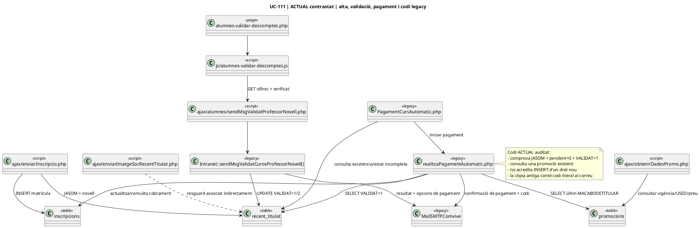
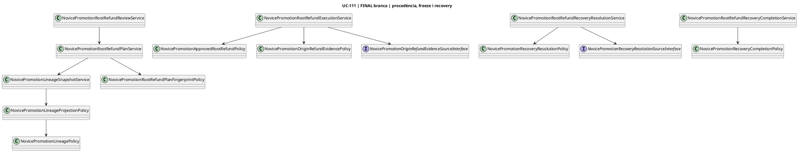

# UC-111 · Diagrames de classes ACTUAL / FINAL


## Actualització post-merge · 03/10/2026

```plantuml
@startuml
title UC-111 | Recuperació de decisió legacy -> SIF
class NovicePromotionDecisionReconciler
class NovicePromotionSecretaryDecisionProjector
database recent_titulat
database inscripcions
database commercial_operation
database discount_validation

NovicePromotionDecisionReconciler --> recent_titulat : llegir VALIDAT 0/1/2
NovicePromotionDecisionReconciler --> inscripcions : exigir JASOM
NovicePromotionDecisionReconciler --> commercial_operation : candidats PENDING_VALIDATION
NovicePromotionDecisionReconciler --> discount_validation : candidats NOVICE_TEACHER/PENDING
NovicePromotionDecisionReconciler --> NovicePromotionSecretaryDecisionProjector : només VALIDAT=1/2
NovicePromotionSecretaryDecisionProjector --> commercial_operation : READY_FOR_PAYMENT
NovicePromotionSecretaryDecisionProjector --> discount_validation : VALIDATED / REJECTED
@enduml
```

**Estat verificat:** MySQL 8, suite UC-111 específica: **156 passades / 0 fallades**. El runner UC-111 comparteix el mateix advisory lock que la suite SIF global per evitar dues neteges simultànies sobre la mateixa sif_test*.


**Objectiu:** separar les classes/peces observades al llegat de les classes implementades o modelades a la branca SIF. El diagrama general del SIF és [31-diagrames-classes-sif.md](../04-estat-final/31-diagrames-classes-sif.md); aquest document és el submodel específic UC-111.

## 1. ACTUAL · peces legacy observables

El circuit legacy és majoritàriament procedural. El diagrama representa **fitxers, mètodes i taules reals** en lloc de fingir una arquitectura OO que no existeix.



**Conclusió ACTUAL:** la decisió de secretaria i el cobrament existeixen, però el model legacy no garanteix per si sol unicitat per persona, emissió idempotent, saldo parcial únic ni traça origen→dret→consums.

## 2. FINAL/branca · validació, cobrament, concessió i preparació del codi

```plantuml
@startuml
title UC-111 | FINAL | validació + pagament complet -> dret únic -> codi preparat
class NovicePromotionEnrollmentStager
class NovicePromotionSecretaryDecisionProjector
class RedsysCourseInvoiceService
class NovicePromotionInvoiceLinkService
class NovicePromotionGrantService
class NovicePromotionGrantReconciler
class NovicePromotionCodePreparationService
class NovicePromotionEmailVerificationService
class NovicePromotionDeliveryAttemptService
class NovicePromotionPrivateMailWorker
interface NovicePromotionCodeKeyProviderInterface
interface NovicePromotionMailTransportInterface
interface NoviceEmailChallengeTransportInterface
class UuidGenerator

database commercial_operation
database discount_validation
database "factura / payment_transaction / payment_allocation" as Fiscal
database commercial_entitlement
database novice_promotion_grant
database novice_promotion_code_outbox
database commercial_entitlement_event

NovicePromotionEnrollmentStager --> commercial_operation
NovicePromotionSecretaryDecisionProjector --> discount_validation
NovicePromotionSecretaryDecisionProjector --> commercial_operation : READY_FOR_PAYMENT

RedsysCourseInvoiceService --> NovicePromotionInvoiceLinkService : factura ja committed
NovicePromotionInvoiceLinkService --> Fiscal : verificar F1/F2 PAID
NovicePromotionInvoiceLinkService --> commercial_operation : PAID / PAYMENT_PENDING
RedsysCourseInvoiceService --> NovicePromotionGrantService : només VALIDATED + fully paid
NovicePromotionGrantService --> discount_validation : VALIDATED
NovicePromotionGrantService --> Fiscal : CHARGE - REFUND reconciliat
NovicePromotionGrantService --> commercial_entitlement : ISSUE únic
NovicePromotionGrantService --> novice_promotion_grant
NovicePromotionGrantService --> commercial_entitlement_event
RedsysCourseInvoiceService --> NovicePromotionCodePreparationService : després del grant
NovicePromotionCodePreparationService --> commercial_entitlement : CODE_HASH + ACTIVE
NovicePromotionCodePreparationService --> novice_promotion_code_outbox : token xifrat PREPARED
NovicePromotionGrantReconciler --> NovicePromotionGrantService

NovicePromotionCodePreparationService ..> NovicePromotionCodeKeyProviderInterface : secret runtime
NovicePromotionEmailVerificationService --> NoviceEmailChallengeTransportInterface
NovicePromotionPrivateMailWorker --> NovicePromotionDeliveryAttemptService
NovicePromotionPrivateMailWorker --> NovicePromotionMailTransportInterface

note right of RedsysCourseInvoiceService
  Tall transaccional:
  1) factura/pagament committed
  2) grant idempotent
  3) codi preparat en una transacció separada
  Un reintent reutilitza el mateix entitlement.
end note
@enduml
```

## 3. FINAL/branca · consum original, canvi i saldo derivat

```plantuml
@startuml
title UC-111 | FINAL branca | consum, canvi i derivació
class NovicePromotionRedemptionService
class NovicePromotionAmountPolicy
class NovicePromotionCourseTransferReviewService
class NovicePromotionFirstTransferConfirmationService
class NovicePromotionSuccessiveTransferReviewService
class NovicePromotionSuccessiveTransferConfirmationService
class NovicePromotionDestinationCancellationReviewService
class NovicePromotionDerivedBalanceActivationService
class NovicePromotionTransferredDestinationCancellationReviewService
class NovicePromotionTransferredCancellationActivationService
class NovicePromotionDerivedBalanceRedemptionService
class NovicePromotionDerivedBalanceEligibilityPolicy
class NovicePromotionDestinationAdjustmentPolicy
class NovicePromotionRectificationEvidencePolicy
class NovicePromotionApprovedCancellationPolicy
class NovicePromotionApprovedTransferPolicy
class NovicePromotionApprovedSuccessiveTransferPolicy
class NovicePromotionApprovedTransferredCancellationPolicy
interface NovicePromotionAdjustmentApprovalSourceInterface

NovicePromotionRedemptionService --> NovicePromotionAmountPolicy
NovicePromotionDerivedBalanceRedemptionService --> NovicePromotionAmountPolicy
NovicePromotionDerivedBalanceRedemptionService --> NovicePromotionDerivedBalanceEligibilityPolicy

NovicePromotionCourseTransferReviewService --> NovicePromotionDestinationAdjustmentPolicy
NovicePromotionCourseTransferReviewService --> NovicePromotionRectificationEvidencePolicy
NovicePromotionFirstTransferConfirmationService --> NovicePromotionAdjustmentApprovalSourceInterface
NovicePromotionFirstTransferConfirmationService --> NovicePromotionApprovedTransferPolicy
NovicePromotionFirstTransferConfirmationService --> NovicePromotionRectificationEvidencePolicy

NovicePromotionSuccessiveTransferReviewService --> NovicePromotionDestinationAdjustmentPolicy
NovicePromotionSuccessiveTransferConfirmationService --> NovicePromotionAdjustmentApprovalSourceInterface
NovicePromotionSuccessiveTransferConfirmationService --> NovicePromotionApprovedSuccessiveTransferPolicy
NovicePromotionSuccessiveTransferConfirmationService --> NovicePromotionRectificationEvidencePolicy

NovicePromotionDestinationCancellationReviewService --> NovicePromotionDestinationAdjustmentPolicy
NovicePromotionDestinationCancellationReviewService --> NovicePromotionRectificationEvidencePolicy
NovicePromotionDerivedBalanceActivationService --> NovicePromotionAdjustmentApprovalSourceInterface
NovicePromotionDerivedBalanceActivationService --> NovicePromotionApprovedCancellationPolicy
NovicePromotionDerivedBalanceActivationService --> NovicePromotionDestinationAdjustmentPolicy
NovicePromotionDerivedBalanceActivationService --> NovicePromotionRectificationEvidencePolicy

NovicePromotionTransferredDestinationCancellationReviewService --> NovicePromotionDestinationAdjustmentPolicy
NovicePromotionTransferredDestinationCancellationReviewService --> NovicePromotionRectificationEvidencePolicy
NovicePromotionTransferredCancellationActivationService --> NovicePromotionAdjustmentApprovalSourceInterface
NovicePromotionTransferredCancellationActivationService --> NovicePromotionApprovedTransferredCancellationPolicy
NovicePromotionTransferredCancellationActivationService --> NovicePromotionDestinationAdjustmentPolicy
NovicePromotionTransferredCancellationActivationService --> NovicePromotionRectificationEvidencePolicy
@enduml
```



## 4. FINAL/branca · procedència i retorn JASOM



## 5. Persistència UC-111 que les classes manipulen

| Bloc | Taules principals |
| --- | --- |
| expedient/validació | `commercial_operation`, `commercial_operation_party`, `discount_validation` |
| dret original | `commercial_entitlement`, `novice_promotion_grant` |
| codi/lliurament | `novice_promotion_code_outbox`, `novice_promotion_verified_recipient`, challenge de correu |
| consum original | `novice_promotion_application` |
| saldos derivats | `novice_promotion_derived_balance`, `novice_promotion_derived_application` |
| canvis de curs | `novice_promotion_application_transfer` |
| refund/recovery | taules de review, recovery items i evidències de refund incorporades a les migracions 000021–000027 |
| auditoria | `commercial_entitlement_event`, operació/fiscalitat relacionada |

## 6. Classes no equivalents

- `novice_promotion_grant` és la concessió original JASOM; un `novice_promotion_derived_balance` no és una nova concessió de docent novell.
- Un `novice_promotion_application_transfer` representa atribució traspassada, no consum addicional.
- `payment_transaction` representa diners externs; el saldo promocional no s'ha de convertir en CHARGE.
- La política de procedència és una projecció/comprovació; no executa una reclamació per si sola.
- Les interfaces d'aprovació/evidència són fronteres: **no hi ha adaptador real de producció acreditat** només perquè existeixi la interfície.

## 7. Estat d'auditoria

| Vista | Documentada | Codi branca | Prova unitària escrita | MySQL executat | Desplegat |
| --- | --- | --- | --- | --- | --- |
| concessió | sí | sí | parcial | no | no acreditat |
| lliurament | sí | sí | parcial | no | no acreditat |
| consum original | sí | sí | sí/parcial | no | no acreditat |
| canvis/baixes | sí | sí | sí/parcial | no | no acreditat |
| consum derivat | sí | sí | 5 proves pures | no | no |
| procedència/refund | sí | sí | sí | no | no |

## 8. Navegació

[Fitxes d'acció](../06-fitxes-funcionals/uc-111-accions.md) · [Casos d'ús](uc-111-casos-us-actual-final.md) · [Seqüències](uc-111-sequencies-actual-final.md) · [Activitats](uc-111-activitats-actual-final.md) · [Dades i estats](uc-111-dades-estats-actual-final.md) · [Traçabilitat](uc-111-tracabilitat-implementacio.md)
