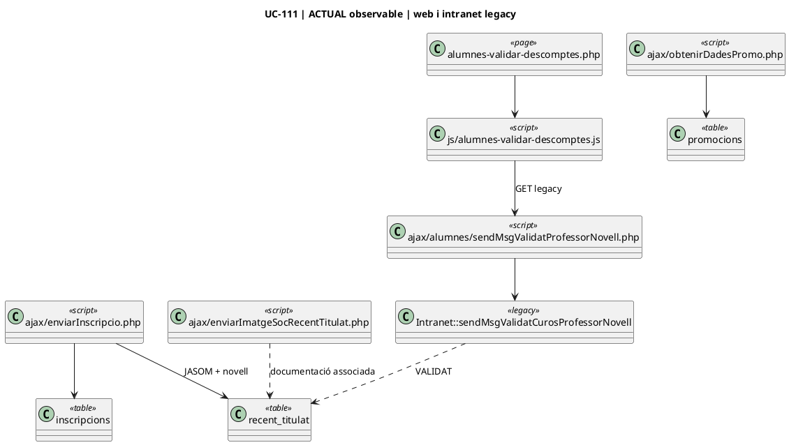
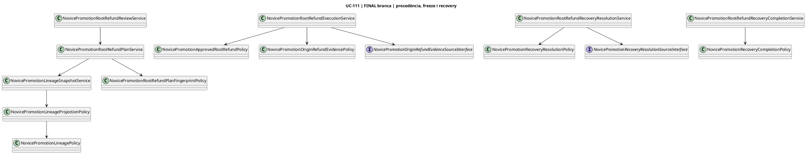

# UC-111 · Diagrames de classes ACTUAL / FINAL

**Objectiu:** separar les classes/peces observades al llegat de les classes implementades o modelades a la branca SIF. El diagrama general del SIF és [31-diagrames-classes-sif.md](../04-estat-final/31-diagrames-classes-sif.md); aquest document és el submodel específic UC-111.

## 1. ACTUAL · peces legacy observables

El circuit legacy és majoritàriament procedural i una part important de la lògica viu en `Intranet` i endpoints AJAX; per tant, no es força una falsa arquitectura de classes.

**Límit:** aquest diagrama mostra dependències observades, no garanteix que `IntranetMethod` sigui l'únic escriptor de `promocions` ni que el circuit desplegat coincideixi exactament amb la còpia versionada.

## 2. FINAL/branca · alta, decisió, concessió i lliurament

```plantuml
@startuml
title UC-111 | FINAL branca | concessió i lliurament
class NovicePromotionEnrollmentStager
class NovicePromotionSecretaryDecisionProjector
class NovicePromotionInvoiceLinkService
class NovicePromotionGrantService
class NovicePromotionGrantReconciler
class NovicePromotionCodePreparationService
class NovicePromotionEmailVerificationService
class NovicePromotionDeliveryAttemptService
class NovicePromotionPrivateMailWorker
interface NovicePromotionCodeKeyProviderInterface
interface NovicePromotionMailTransportInterface
interface NoviceEmailChallengeTransportInterface
class UuidGenerator

NovicePromotionEnrollmentStager --> UuidGenerator
NovicePromotionSecretaryDecisionProjector --> UuidGenerator
NovicePromotionGrantService --> UuidGenerator
NovicePromotionGrantReconciler --> NovicePromotionGrantService
NovicePromotionCodePreparationService --> NovicePromotionCodeKeyProviderInterface
NovicePromotionEmailVerificationService --> NoviceEmailChallengeTransportInterface
NovicePromotionDeliveryAttemptService --> UuidGenerator
NovicePromotionPrivateMailWorker --> NovicePromotionDeliveryAttemptService
NovicePromotionPrivateMailWorker --> NovicePromotionMailTransportInterface

note right of NovicePromotionPrivateMailWorker
  Transport real pendent.
  No prova desplegament.
end note
@enduml
```

## 3. FINAL/branca · consum original, canvi i saldo derivat

```plantuml
@startuml
title UC-111 | FINAL branca | consum, canvi i derivació
class NovicePromotionRedemptionService
class NovicePromotionAmountPolicy
class NovicePromotionCourseTransferReviewService
class NovicePromotionFirstTransferConfirmationService
class NovicePromotionSuccessiveTransferReviewService
class NovicePromotionSuccessiveTransferConfirmationService
class NovicePromotionDestinationCancellationReviewService
class NovicePromotionDerivedBalanceActivationService
class NovicePromotionTransferredDestinationCancellationReviewService
class NovicePromotionTransferredCancellationActivationService
class NovicePromotionDerivedBalanceRedemptionService
class NovicePromotionDerivedBalanceEligibilityPolicy
class NovicePromotionDestinationAdjustmentPolicy
class NovicePromotionRectificationEvidencePolicy
interface NovicePromotionAdjustmentApprovalSourceInterface

NovicePromotionRedemptionService --> NovicePromotionAmountPolicy
NovicePromotionDerivedBalanceRedemptionService --> NovicePromotionAmountPolicy
NovicePromotionDerivedBalanceRedemptionService --> NovicePromotionDerivedBalanceEligibilityPolicy

NovicePromotionCourseTransferReviewService --> NovicePromotionDestinationAdjustmentPolicy
NovicePromotionCourseTransferReviewService --> NovicePromotionRectificationEvidencePolicy
NovicePromotionFirstTransferConfirmationService --> NovicePromotionAdjustmentApprovalSourceInterface
NovicePromotionFirstTransferConfirmationService --> NovicePromotionRectificationEvidencePolicy

NovicePromotionSuccessiveTransferReviewService --> NovicePromotionDestinationAdjustmentPolicy
NovicePromotionSuccessiveTransferConfirmationService --> NovicePromotionAdjustmentApprovalSourceInterface
NovicePromotionSuccessiveTransferConfirmationService --> NovicePromotionRectificationEvidencePolicy

NovicePromotionDestinationCancellationReviewService --> NovicePromotionDestinationAdjustmentPolicy
NovicePromotionDestinationCancellationReviewService --> NovicePromotionRectificationEvidencePolicy
NovicePromotionDerivedBalanceActivationService --> NovicePromotionAdjustmentApprovalSourceInterface
NovicePromotionDerivedBalanceActivationService --> NovicePromotionDestinationAdjustmentPolicy
NovicePromotionDerivedBalanceActivationService --> NovicePromotionRectificationEvidencePolicy

NovicePromotionTransferredDestinationCancellationReviewService --> NovicePromotionDestinationAdjustmentPolicy
NovicePromotionTransferredDestinationCancellationReviewService --> NovicePromotionRectificationEvidencePolicy
NovicePromotionTransferredCancellationActivationService --> NovicePromotionAdjustmentApprovalSourceInterface
NovicePromotionTransferredCancellationActivationService --> NovicePromotionDestinationAdjustmentPolicy
NovicePromotionTransferredCancellationActivationService --> NovicePromotionRectificationEvidencePolicy
@enduml
```

## 4. FINAL/branca · procedència i retorn JASOM

## 5. Persistència UC-111 que les classes manipulen

| Bloc | Taules principals |
| --- | --- |
| expedient/validació | `commercial_operation`, `commercial_operation_party`, `discount_validation` |
| dret original | `commercial_entitlement`, `novice_promotion_grant` |
| codi/lliurament | `novice_promotion_code_outbox`, `novice_promotion_verified_recipient`, challenge de correu |
| consum original | `novice_promotion_application` |
| saldos derivats | `novice_promotion_derived_balance`, `novice_promotion_derived_application` |
| canvis de curs | `novice_promotion_application_transfer` |
| refund/recovery | taules de review, recovery items i evidències de refund incorporades a les migracions 000021–000026 |
| auditoria | `commercial_entitlement_event`, operació/fiscalitat relacionada |

## 6. Classes no equivalents

- `novice_promotion_grant` és la concessió original JASOM; un `novice_promotion_derived_balance` no és una nova concessió de docent novell.
- Un `novice_promotion_application_transfer` representa atribució traspassada, no consum addicional.
- `payment_transaction` representa diners externs; el saldo promocional no s'ha de convertir en CHARGE.
- La política de procedència és una projecció/comprovació; no executa una reclamació per si sola.
- Les interfaces d'aprovació/evidència són fronteres: **no hi ha adaptador real de producció acreditat** només perquè existeixi la interfície.

## 7. Estat d'auditoria

| Vista | Documentada | Codi branca | Prova unitària escrita | MySQL executat | Desplegat |
| --- | --- | --- | --- | --- | --- |
| concessió | sí | sí | parcial | no | no acreditat |
| lliurament | sí | sí | parcial | no | no acreditat |
| consum original | sí | sí | sí/parcial | no | no acreditat |
| canvis/baixes | sí | sí | sí/parcial | no | no acreditat |
| consum derivat | sí | sí | 5 proves pures | no | no |
| procedència/refund | sí | sí | sí | no | no |

## 8. Navegació

[Fitxes d'acció](../06-fitxes-funcionals/uc-111-accions.md) · [Casos d'ús](uc-111-casos-us-actual-final.md) · [Seqüències](uc-111-sequencies-actual-final.md) · [Activitats](uc-111-activitats-actual-final.md) · [Traçabilitat](uc-111-tracabilitat-implementacio.md)
