# UC-111 · Diagrames 1:1 per acció A111-01…A111-12

**Objectiu de control:** complir literalment la porta documental «per cada acció: fitxa + cas d'ús + classes + seqüència + activitat». Les [fitxes d'acció](../06-fitxes-funcionals/uc-111-accions.md) són la font funcional; aquest fitxer aporta quatre vistes UML per cadascuna. Els diagrames combinen **ACTUAL observable** i **FINAL/branca** sense convertir un objectiu o una classe present a la branca en desplegament acreditat.

**Llegenda:** `<<ACTUAL>>` = peça legacy observada; `<<FINAL>>` = servei/model final o present a la branca; `<<PENDENT>>` = connector requerit encara no acreditat. Les proves MySQL continuen ajornades.

## A111-01 · Alta JASOM i obertura d'expedient novell

[Fitxa de l'acció](../06-fitxes-funcionals/uc-111-accions.md) · [traçabilitat global](uc-111-tracabilitat-implementacio.md)

### A111-01.1 · Cas d'ús ACTUAL / FINAL

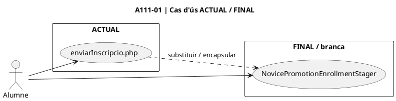

### A111-01.2 · Classes / components ACTUAL / FINAL

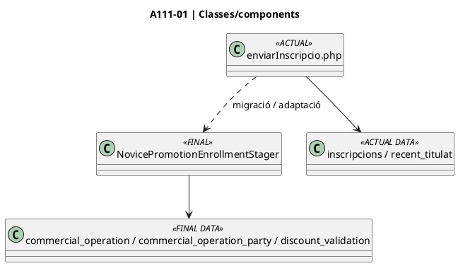

### A111-01.3 · Seqüència

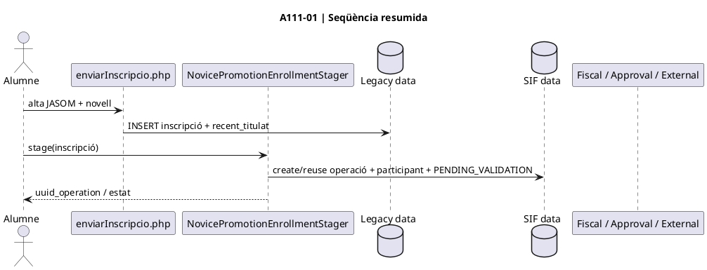

### A111-01.4 · Activitat ACTUAL / FINAL

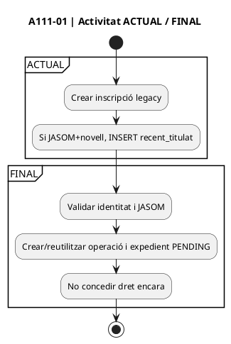

## A111-02 · Pujar i custodiar evidència de titulació

[Fitxa de l'acció](../06-fitxes-funcionals/uc-111-accions.md) · [traçabilitat global](uc-111-tracabilitat-implementacio.md)

### A111-02.1 · Cas d'ús ACTUAL / FINAL

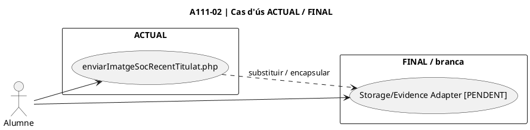

### A111-02.2 · Classes / components ACTUAL / FINAL

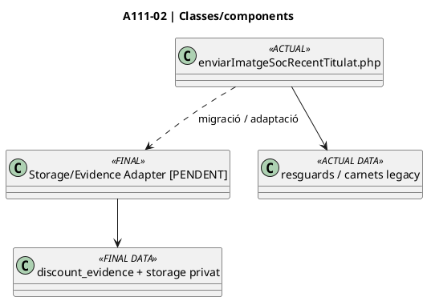

### A111-02.3 · Seqüència

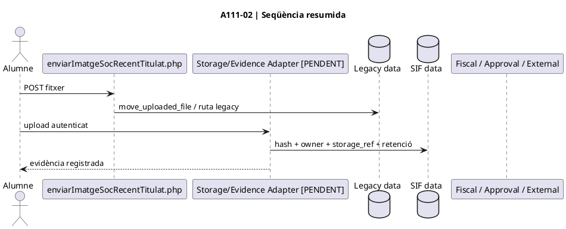

### A111-02.4 · Activitat ACTUAL / FINAL

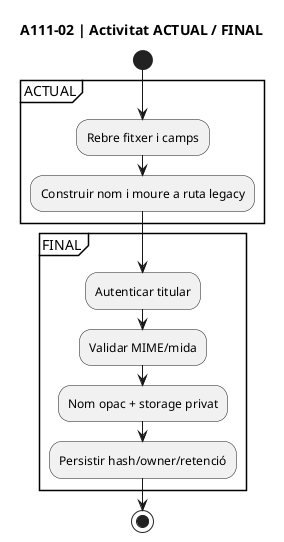

## A111-03 · Decisió de secretaria

[Fitxa de l'acció](../06-fitxes-funcionals/uc-111-accions.md) · [traçabilitat global](uc-111-tracabilitat-implementacio.md)

### A111-03.1 · Cas d'ús ACTUAL / FINAL

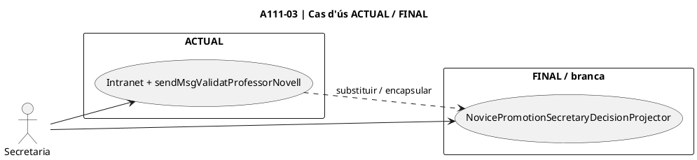

### A111-03.2 · Classes / components ACTUAL / FINAL

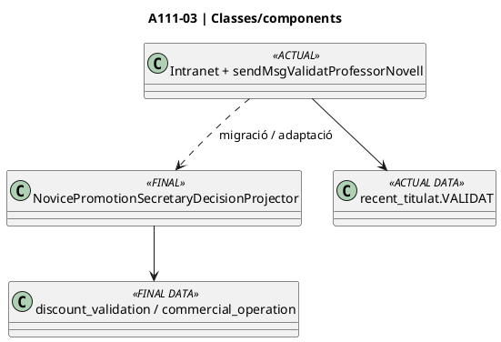

### A111-03.3 · Seqüència

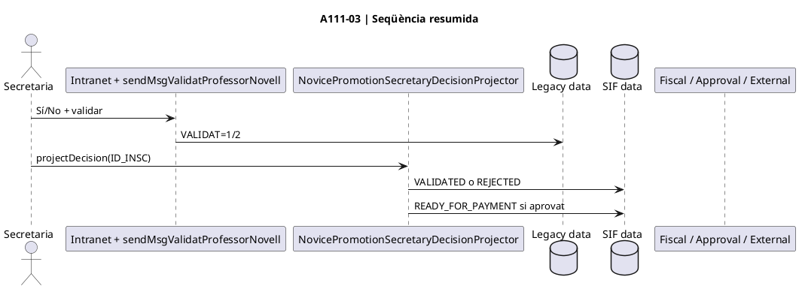

### A111-03.4 · Activitat ACTUAL / FINAL

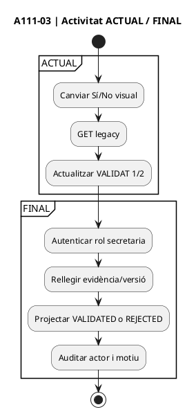

## A111-04 · Conciliar JASOM pagat i concedir dret únic

[Fitxa de l'acció](../06-fitxes-funcionals/uc-111-accions.md) · [traçabilitat global](uc-111-tracabilitat-implementacio.md)

### A111-04.1 · Cas d'ús ACTUAL / FINAL

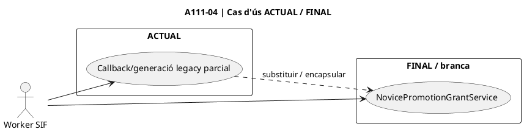

### A111-04.2 · Classes / components ACTUAL / FINAL

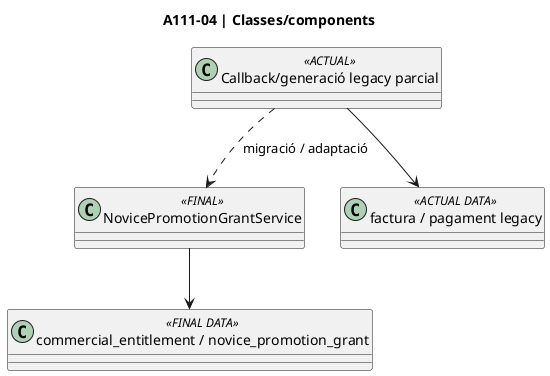

### A111-04.3 · Seqüència

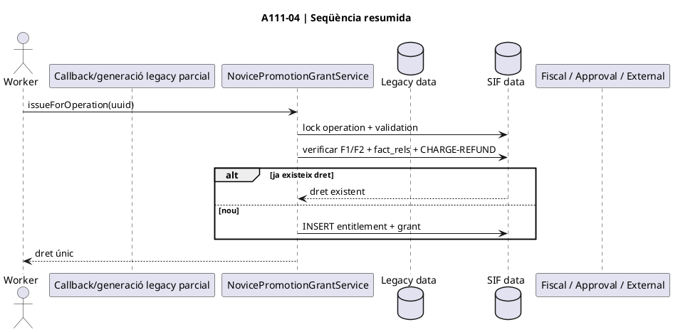

### A111-04.4 · Activitat ACTUAL / FINAL

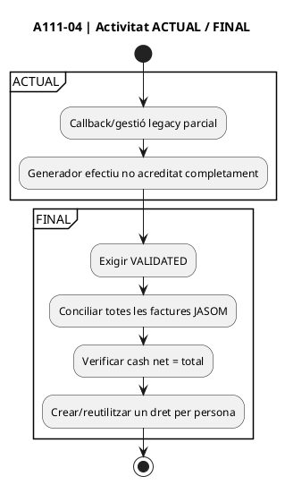

## A111-05 · Preparar i lliurar el codi

[Fitxa de l'acció](../06-fitxes-funcionals/uc-111-accions.md) · [traçabilitat global](uc-111-tracabilitat-implementacio.md)

### A111-05.1 · Cas d'ús ACTUAL / FINAL

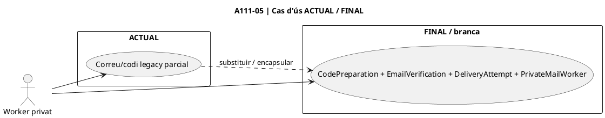

### A111-05.2 · Classes / components ACTUAL / FINAL

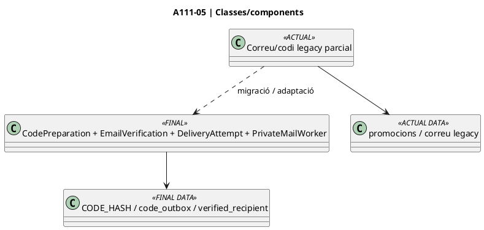

### A111-05.3 · Seqüència

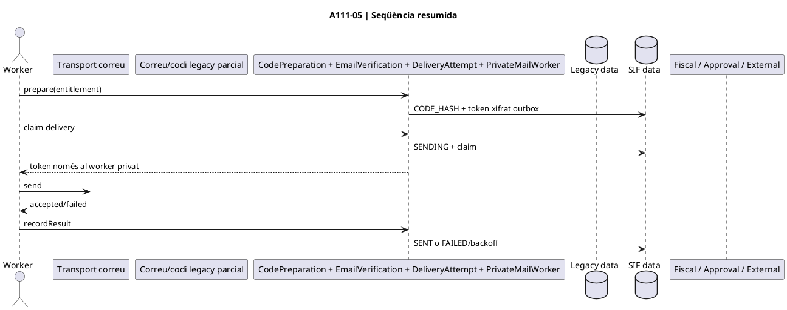

### A111-05.4 · Activitat ACTUAL / FINAL

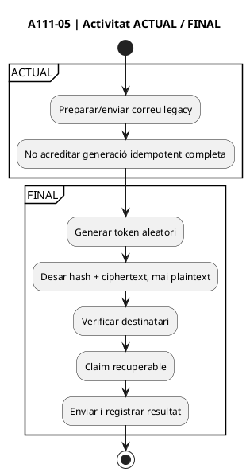

## A111-06 · Reservar, aplicar o alliberar saldo original

[Fitxa de l'acció](../06-fitxes-funcionals/uc-111-accions.md) · [traçabilitat global](uc-111-tracabilitat-implementacio.md)

### A111-06.1 · Cas d'ús ACTUAL / FINAL

```plantuml
@startuml
title A111-06 | Cas d'ús ACTUAL / FINAL
left to right direction
actor "Checkout" as Actor
rectangle "ACTUAL" {
  usecase "obtenirDadesPromo.php / promocions" as Current
}
rectangle "FINAL / branca" {
  usecase "NovicePromotionRedemptionService" as Target
}
Actor --> Current
Actor --> Target
Current ..> Target : substituir / encapsular
@enduml
```

### A111-06.2 · Classes / components ACTUAL / FINAL

```plantuml
@startuml
title A111-06 | Classes/components
class "obtenirDadesPromo.php / promocions" as Legacy <<ACTUAL>>
class "NovicePromotionRedemptionService" as Final <<FINAL>>
class "promocions" as LegacyDB <<ACTUAL DATA>>
class "novice_promotion_grant / novice_promotion_application" as SIFDB <<FINAL DATA>>
Legacy --> LegacyDB
Legacy ..> Final : migració / adaptació
Final --> SIFDB
@enduml
```

### A111-06.3 · Seqüència

```plantuml
@startuml
title A111-06 | Seqüència resumida
actor Checkout
participant "obtenirDadesPromo.php / promocions" as Legacy
participant "NovicePromotionRedemptionService" as Final
database "Legacy data" as LegacyDB
database "SIF data" as SIFDB
participant "Fiscal / Approval / External" as Fiscal
Checkout -> Final : reserve(code, holder, dest, key)
Final -> SIFDB : lock grant + destí
Final -> SIFDB : AVAILABLE -= amount + INSERT RESERVED
Checkout -> Fiscal : pricing/factura/cobrament final
Checkout -> Final : confirmApplied(app, invoice)
Final -> SIFDB : validar factura/cash + APPLIED
opt checkout falla sense intent/factura
Checkout -> Final : release(app)
Final -> SIFDB : restore available + RELEASED
end
@enduml
```

### A111-06.4 · Activitat ACTUAL / FINAL

```plantuml
@startuml
title A111-06 | Activitat ACTUAL / FINAL
start
partition ACTUAL {
:Consultar promoció disponible;
:Consum concurrent complet no acreditat;
}
partition FINAL {
:Persistir quote BEFORE_PROMOTION;
:Reservar i debitar una vegada;
:Confirmar contra factura/cash final;
:O release segur abans d'evidència fiscal;
}
stop
@enduml
```

## A111-07 · Canviar el curs de destinació

[Fitxa de l'acció](../06-fitxes-funcionals/uc-111-accions.md) · [traçabilitat global](uc-111-tracabilitat-implementacio.md)

### A111-07.1 · Cas d'ús ACTUAL / FINAL

```plantuml
@startuml
title A111-07 | Cas d'ús ACTUAL / FINAL
left to right direction
actor "Secretaria / Checkout" as Actor
rectangle "ACTUAL" {
  usecase "Flux general canvi de curs" as Current
}
rectangle "FINAL / branca" {
  usecase "First/Successive Transfer Review + Confirmation" as Target
}
Actor --> Current
Actor --> Target
Current ..> Target : substituir / encapsular
@enduml
```

### A111-07.2 · Classes / components ACTUAL / FINAL

```plantuml
@startuml
title A111-07 | Classes/components
class "Flux general canvi de curs" as Legacy <<ACTUAL>>
class NovicePromotionCourseTransferReviewService
class NovicePromotionFirstTransferConfirmationService
class NovicePromotionSuccessiveTransferReviewService
class NovicePromotionSuccessiveTransferConfirmationService
class NovicePromotionApprovedTransferPolicy
class NovicePromotionApprovedSuccessiveTransferPolicy
interface NovicePromotionAdjustmentApprovalSourceInterface
class "novice_promotion_application_transfer" as SIFDB <<FINAL DATA>>
Legacy ..> NovicePromotionCourseTransferReviewService : migració / adaptació
NovicePromotionCourseTransferReviewService --> SIFDB
NovicePromotionFirstTransferConfirmationService --> SIFDB
NovicePromotionSuccessiveTransferReviewService --> SIFDB
NovicePromotionSuccessiveTransferConfirmationService --> SIFDB
NovicePromotionFirstTransferConfirmationService --> NovicePromotionApprovedTransferPolicy
NovicePromotionSuccessiveTransferConfirmationService --> NovicePromotionApprovedSuccessiveTransferPolicy
NovicePromotionFirstTransferConfirmationService --> NovicePromotionAdjustmentApprovalSourceInterface
NovicePromotionSuccessiveTransferConfirmationService --> NovicePromotionAdjustmentApprovalSourceInterface
@enduml
```

### A111-07.3 · Seqüència

```plantuml
@startuml
title A111-07 | Seqüència resumida
actor Secretaria
participant NovicePromotionCourseTransferReviewService as FirstReview
participant NovicePromotionFirstTransferConfirmationService as FirstConfirm
participant NovicePromotionSuccessiveTransferReviewService as NextReview
participant NovicePromotionSuccessiveTransferConfirmationService as NextConfirm
interface NovicePromotionAdjustmentApprovalSourceInterface as Approval
database novice_promotion_application_transfer as Transfer
participant "Pricing / factura / rectificativa" as Fiscal
alt primer canvi
  Secretaria -> FirstReview : stageFirstTransfer(...)
  FirstReview -> Fiscal : validar rectificativa + preu nou
  FirstReview -> Transfer : PENDING_FISCAL_REVIEW
  FirstConfirm -> Approval : approvedFirstTransfer(uuid)
  Approval --> FirstConfirm : final APPROVED
  FirstConfirm -> Fiscal : factura nova + residual cash
  FirstConfirm -> Transfer : CONFIRMED
else canvi successiu
  Secretaria -> NextReview : stageFromDerivedApplication / stageFromConfirmedTransfer
  NextReview -> Transfer : PENDING_FISCAL_REVIEW
  NextConfirm -> Approval : approvedSuccessiveTransfer(uuid)
  Approval --> NextConfirm : final APPROVED
  NextConfirm -> Fiscal : factura nova + residual cash
  NextConfirm -> Transfer : predecessor històric + successor CONFIRMED
end
@enduml
```

### A111-07.4 · Activitat ACTUAL / FINAL

```plantuml
@startuml
title A111-07 | Activitat ACTUAL / FINAL
start
partition ACTUAL {
:Canvi de curs segons circuit general legacy;
}
partition FINAL {
:Identificar atribució actual;
:Rectificativa origen;
:Validar nou net;
:Review + aprovació independent;
:Confirmar mateixa quantia, sense segon consum;
}
stop
@enduml
```

## A111-08 · Baixa de curs i concessió de saldo derivat

[Fitxa de l'acció](../06-fitxes-funcionals/uc-111-accions.md) · [traçabilitat global](uc-111-tracabilitat-implementacio.md)

### A111-08.1 · Cas d'ús ACTUAL / FINAL

```plantuml
@startuml
title A111-08 | Cas d'ús ACTUAL / FINAL
left to right direction
actor "Secretaria" as Actor
rectangle "ACTUAL" {
  usecase "Baixa general / sense lineage canònic" as Current
}
rectangle "FINAL / branca" {
  usecase "Review + Activation\norigen original" as Original
  usecase "Review + Activation\norigen transferit" as Transferred
  usecase "Review + Activation\norigen derived_application" as DerivedUse
}
Actor --> Current
Actor --> Original
Actor --> Transferred
Actor --> DerivedUse
Current ..> Original : substituir / encapsular
Current ..> Transferred : preservar curs actual
Current ..> DerivedUse : preservar pare/fill
@enduml
```

### A111-08.2 · Classes / components ACTUAL / FINAL

```plantuml
@startuml
title A111-08 | Classes/components
class "Baixa general / sense lineage canònic" as Legacy <<ACTUAL>>
class NovicePromotionDestinationCancellationReviewService
class NovicePromotionDerivedBalanceActivationService
class NovicePromotionTransferredDestinationCancellationReviewService
class NovicePromotionTransferredCancellationActivationService
class NovicePromotionDerivedApplicationCancellationReviewService
class NovicePromotionDerivedApplicationCancellationActivationService
class NovicePromotionApprovedCancellationPolicy
class NovicePromotionApprovedTransferredCancellationPolicy
class NovicePromotionApprovedDerivedCancellationPolicy
class NovicePromotionDestinationAdjustmentPolicy
class NovicePromotionRectificationEvidencePolicy
interface NovicePromotionAdjustmentApprovalSourceInterface
class "novice_promotion_derived_balance" as Derived <<FINAL DATA>>
class "novice_promotion_derived_application" as DerivedApp <<FINAL DATA>>
class "novice_promotion_application_transfer" as Transfer <<FINAL DATA>>

Legacy ..> NovicePromotionDestinationCancellationReviewService : migració / adaptació

NovicePromotionDestinationCancellationReviewService --> Derived
NovicePromotionDerivedBalanceActivationService --> Derived
NovicePromotionDerivedBalanceActivationService --> NovicePromotionApprovedCancellationPolicy

NovicePromotionTransferredDestinationCancellationReviewService --> Derived
NovicePromotionTransferredCancellationActivationService --> Derived
NovicePromotionTransferredCancellationActivationService --> Transfer
NovicePromotionTransferredCancellationActivationService --> NovicePromotionApprovedTransferredCancellationPolicy

NovicePromotionDerivedApplicationCancellationReviewService --> DerivedApp
NovicePromotionDerivedApplicationCancellationReviewService --> Derived
NovicePromotionDerivedApplicationCancellationActivationService --> DerivedApp
NovicePromotionDerivedApplicationCancellationActivationService --> Derived
NovicePromotionDerivedApplicationCancellationActivationService --> NovicePromotionApprovedDerivedCancellationPolicy

NovicePromotionDestinationCancellationReviewService --> NovicePromotionDestinationAdjustmentPolicy
NovicePromotionTransferredDestinationCancellationReviewService --> NovicePromotionDestinationAdjustmentPolicy
NovicePromotionDerivedApplicationCancellationReviewService --> NovicePromotionDestinationAdjustmentPolicy

NovicePromotionDestinationCancellationReviewService --> NovicePromotionRectificationEvidencePolicy
NovicePromotionTransferredDestinationCancellationReviewService --> NovicePromotionRectificationEvidencePolicy
NovicePromotionDerivedApplicationCancellationReviewService --> NovicePromotionRectificationEvidencePolicy

NovicePromotionDerivedBalanceActivationService --> NovicePromotionAdjustmentApprovalSourceInterface
NovicePromotionTransferredCancellationActivationService --> NovicePromotionAdjustmentApprovalSourceInterface
NovicePromotionDerivedApplicationCancellationActivationService --> NovicePromotionAdjustmentApprovalSourceInterface
@enduml
```

### A111-08.3 · Seqüència

```plantuml
@startuml
title A111-08 | Seqüència resumida
actor Secretaria
participant NovicePromotionDestinationCancellationReviewService as OriginalReview
participant NovicePromotionDerivedBalanceActivationService as OriginalActivate
participant NovicePromotionTransferredDestinationCancellationReviewService as TransferReview
participant NovicePromotionTransferredCancellationActivationService as TransferActivate
participant NovicePromotionDerivedApplicationCancellationReviewService as DerivedReview
participant NovicePromotionDerivedApplicationCancellationActivationService as DerivedActivate
interface NovicePromotionAdjustmentApprovalSourceInterface as Approval
database novice_promotion_derived_balance as Derived
database novice_promotion_derived_application as DerivedApp
database novice_promotion_application_transfer as Transfer
participant "Factura / rectificativa / cash" as Fiscal

alt baixa aplicació original
  Secretaria -> OriginalReview : stageOriginalApplicationReview(...)
  OriginalReview -> Fiscal : validar factura + rectificativa + cash
  OriginalReview -> Derived : PENDING_FISCAL_REVIEW / available=0
  OriginalActivate -> Approval : approvedCancellation(review)
  Approval --> OriginalActivate : final APPROVED
  OriginalActivate -> Fiscal : reconciliar de nou + JASOM pagat
  OriginalActivate -> Derived : ACTIVE + venciment propi
else baixa curs traspassat
  Secretaria -> TransferReview : stageCurrentTransferredDestinationReview(...)
  TransferReview -> Derived : PENDING / SOURCE_UUID_TRANSFER
  TransferActivate -> Approval : approvedTransferredCancellation(review)
  Approval --> TransferActivate : final APPROVED
  TransferActivate -> Fiscal : reconciliar de nou + JASOM pagat
  TransferActivate -> Transfer : CANCELLED / CONVERTED_TO_DERIVED
  TransferActivate -> Derived : ACTIVE + venciment propi
else baixa curs pagat amb saldo derivat
  Secretaria -> DerivedReview : stageDerivedApplicationReview(...)
  DerivedReview -> Fiscal : validar factura + rectificativa + cash
  DerivedReview -> Derived : PENDING / parent + SOURCE_UUID_DERIVED_APPLICATION
  DerivedActivate -> Approval : approvedDerivedApplicationCancellation(review)
  Approval --> DerivedActivate : final APPROVED
  DerivedActivate -> Fiscal : reconciliar de nou + JASOM pagat
  DerivedActivate -> DerivedApp : CONVERTED_TO_DERIVED
  DerivedActivate -> Derived : child ACTIVE + venciment propi
end
@enduml
```

### A111-08.4 · Activitat ACTUAL / FINAL

```plantuml
@startuml
title A111-08 | Activitat ACTUAL / FINAL
start
partition ACTUAL {
:Tramitar baixa/rectificativa general;
}
partition FINAL {
:Identificar predecessor ACTUAL de la promoció;
if (Aplicació original?) then (sí)
  :Review original;
elseif (Últim transfer CONFIRMED sense successor?) then (sí)
  :Review amb SOURCE_UUID_TRANSFER;
  :Resoldre parent derivat real de la cadena;
elseif (derived_application APPLIED?) then (sí)
  :Review fill amb PARENT_UUID_DERIVED_BALANCE;
  :SOURCE_UUID_DERIVED_APPLICATION;
else (origen ambigu / transfer no actual)
  :Bloquejar; no retrocedir a predecessor històric;
  stop
endif
:Separar promoció i diners reals;
:Crear review no gastable;
:Obtenir aprovació independent;
:Reconciliar de nou factura/cash + JASOM;
if (Canvis després de review?) then (sí)
  :Bloquejar i recalcular;
  stop
endif
:Tancar predecessor com a històric;
:Activar nou saldo derivat amb any propi;
:No recreditar JASOM ni el dret pare consumit;
}
stop
@enduml
```

## A111-09 · Consum parcial del saldo derivat

[Fitxa de l'acció](../06-fitxes-funcionals/uc-111-accions.md) · [traçabilitat global](uc-111-tracabilitat-implementacio.md)

### A111-09.1 · Cas d'ús ACTUAL / FINAL

```plantuml
@startuml
title A111-09 | Cas d'ús ACTUAL / FINAL
left to right direction
actor "Checkout" as Actor
rectangle "ACTUAL" {
  usecase "Sense model canònic" as Current
}
rectangle "FINAL / branca" {
  usecase "NovicePromotionDerivedBalanceRedemptionService" as Target
}
Actor --> Current
Actor --> Target
Current ..> Target : substituir / encapsular
@enduml
```

### A111-09.2 · Classes / components ACTUAL / FINAL

```plantuml
@startuml
title A111-09 | Classes/components
class "Sense model canònic" as Legacy <<ACTUAL>>
class "NovicePromotionDerivedBalanceRedemptionService" as Final <<FINAL>>
class "n/a" as LegacyDB <<ACTUAL DATA>>
class "novice_promotion_derived_balance / novice_promotion_derived_application" as SIFDB <<FINAL DATA>>
Legacy --> LegacyDB
Legacy ..> Final : migració / adaptació
Final --> SIFDB
@enduml
```

### A111-09.3 · Seqüència

```plantuml
@startuml
title A111-09 | Seqüència resumida
actor Checkout
participant "Sense model canònic" as Legacy
participant "NovicePromotionDerivedBalanceRedemptionService" as Final
database "Legacy data" as LegacyDB
database "SIF data" as SIFDB
participant "Fiscal / Approval / External" as Fiscal
Checkout -> Final : reserve(derivedUuid, holder, dest, key)
Final -> SIFDB : lock root + derived + destination
Final -> SIFDB : derived AVAILABLE -= amount + RESERVED
Checkout -> Fiscal : factura/residual
Checkout -> Final : confirmApplied
Final -> SIFDB : APPLIED sense segon dèbit
opt fallada segura
Checkout -> Final : release
Final -> SIFDB : restore + RELEASED
end
@enduml
```

### A111-09.4 · Activitat ACTUAL / FINAL

```plantuml
@startuml
title A111-09 | Activitat ACTUAL / FINAL
start
partition ACTUAL {
:No hi ha ledger derivat canònic acreditat;
}
partition FINAL {
:Seleccionar saldo per titular + UUID intern;
:Validar vigència pròpia;
:Reservar parcialment;
:Confirmar factura/cash o alliberar segurament;
}
stop
@enduml
```

## A111-10 · Projectar la cadena de procedència

[Fitxa de l'acció](../06-fitxes-funcionals/uc-111-accions.md) · [traçabilitat global](uc-111-tracabilitat-implementacio.md)

### A111-10.1 · Cas d'ús ACTUAL / FINAL

```plantuml
@startuml
title A111-10 | Cas d'ús ACTUAL / FINAL
left to right direction
actor "SIF" as Actor
rectangle "ACTUAL" {
  usecase "Traça dispersa" as Current
}
rectangle "FINAL / branca" {
  usecase "LineageSnapshot + Projection + Policy" as Target
}
Actor --> Current
Actor --> Target
Current ..> Target : substituir / encapsular
@enduml
```

### A111-10.2 · Classes / components ACTUAL / FINAL

```plantuml
@startuml
title A111-10 | Classes/components
class "Traça dispersa" as Legacy <<ACTUAL>>
class NovicePromotionLineageSnapshotService
class NovicePromotionLineageProjectionPolicy
class NovicePromotionLineagePolicy
class "grant + applications + transfers + derived balances" as SIFDB <<FINAL DATA>>
Legacy ..> NovicePromotionLineageSnapshotService : migració / adaptació
NovicePromotionLineageSnapshotService --> SIFDB
NovicePromotionLineageSnapshotService --> NovicePromotionLineageProjectionPolicy
NovicePromotionLineageProjectionPolicy --> NovicePromotionLineagePolicy
@enduml
```

### A111-10.3 · Seqüència

```plantuml
@startuml
title A111-10 | Seqüència resumida
actor SIF
participant NovicePromotionLineageSnapshotService as Snapshot
participant NovicePromotionLineageProjectionPolicy as Projection
participant NovicePromotionLineagePolicy as Policy
database "grant + applications + transfers + derived balances" as SIFDB
SIF -> Snapshot : projectLocked(root)
Snapshot -> SIFDB : lock/load arrel + descendents
Snapshot -> Projection : project(SQL rows)
Projection -> Projection : validar parents/transfers/estats
Projection --> Snapshot : graf lògic prefixat app:/dapp:/transfer:/right:
Snapshot -> Policy : validar conservació + reachability
Policy --> SIF : disponibles + exposició viva
@enduml
```

### A111-10.4 · Activitat ACTUAL / FINAL

```plantuml
@startuml
title A111-10 | Activitat ACTUAL / FINAL
start
partition ACTUAL {
:Reconstrucció manual/dispersa;
}
partition FINAL {
:Bloquejar arrel i descendents;
:Projectar SQL a graf;
:Marcar predecessors substituïts com història;
:Comptar només exposició viva;
}
stop
@enduml
```

## A111-11 · Obrir review i freeze per devolució JASOM

[Fitxa de l'acció](../06-fitxes-funcionals/uc-111-accions.md) · [traçabilitat global](uc-111-tracabilitat-implementacio.md)

### A111-11.1 · Cas d'ús ACTUAL / FINAL

```plantuml
@startuml
title A111-11 | Cas d'ús ACTUAL / FINAL
left to right direction
actor "Operador refund" as Actor
rectangle "ACTUAL" {
  usecase "Manual/dispers" as Current
}
rectangle "FINAL / branca" {
  usecase "RootRefundPlan + RootRefundReview" as Target
}
Actor --> Current
Actor --> Target
Current ..> Target : substituir / encapsular
@enduml
```

### A111-11.2 · Classes / components ACTUAL / FINAL

```plantuml
@startuml
title A111-11 | Classes/components
class "Manual/dispers" as Legacy <<ACTUAL>>
class NovicePromotionRootRefundPlanService
class NovicePromotionRootRefundReviewService
class NovicePromotionRootRefundPlanFingerprintPolicy
class NovicePromotionLineageSnapshotService
class "novice_promotion_root_refund_review" as ReviewDB <<FINAL DATA>>
class commercial_entitlement as Root <<FINAL DATA>>
Legacy ..> NovicePromotionRootRefundReviewService : migració / adaptació
NovicePromotionRootRefundReviewService --> NovicePromotionRootRefundPlanService
NovicePromotionRootRefundPlanService --> NovicePromotionRootRefundPlanFingerprintPolicy
NovicePromotionRootRefundPlanService --> NovicePromotionLineageSnapshotService
NovicePromotionRootRefundReviewService --> ReviewDB
NovicePromotionRootRefundReviewService --> Root : ACTIVE -> REFUND_REVIEW
@enduml
```

### A111-11.3 · Seqüència

```plantuml
@startuml
title A111-11 | Seqüència resumida
actor "Operador refund" as Operador
participant NovicePromotionRootRefundReviewService as Review
participant NovicePromotionRootRefundPlanService as Plan
participant NovicePromotionLineageSnapshotService as Snapshot
database novice_promotion_root_refund_review as ReviewDB
database commercial_entitlement as Root
Operador -> Review : openReview(root, evidence, key)
Review -> Snapshot : projectLocked(root)
Snapshot --> Review : graf coherent
Review -> Plan : planLocked + fingerprint
Plan --> Review : cancel_available + recover_active + hash
Review -> ReviewDB : PENDING_APPROVAL + PLAN_JSON/HASH
Review -> Root : ACTIVE -> REFUND_REVIEW
Review --> Operador : review congelada
@enduml
```

### A111-11.4 · Activitat ACTUAL / FINAL

```plantuml
@startuml
title A111-11 | Activitat ACTUAL / FINAL
start
partition ACTUAL {
:Decisió manual sense graf canònic complet;
}
partition FINAL {
:Projectar procedència completa;
:Bloquejar si reserves/graf inconsistent;
:Congelar noves reserves;
:Desar pla immutable per aprovació;
}
stop
@enduml
```

## A111-12 · Executar conseqüències del refund i tancar recoveries

[Fitxa de l'acció](../06-fitxes-funcionals/uc-111-accions.md) · [traçabilitat global](uc-111-tracabilitat-implementacio.md)

### A111-12.1 · Cas d'ús ACTUAL / FINAL

```plantuml
@startuml
title A111-12 | Cas d'ús ACTUAL / FINAL
left to right direction
actor "Refund / Recovery" as Actor
rectangle "ACTUAL" {
  usecase "Sense workflow canònic" as Current
}
rectangle "FINAL / branca" {
  usecase "RootRefundExecution + RecoveryResolution + RecoveryCompletion" as Target
}
Actor --> Current
Actor --> Target
Current ..> Target : substituir / encapsular
@enduml
```

### A111-12.2 · Classes / components ACTUAL / FINAL

```plantuml
@startuml
title A111-12 | Classes/components
class "Sense workflow canònic" as Legacy <<ACTUAL>>
class NovicePromotionRootRefundExecutionService
class NovicePromotionRootRefundRecoveryResolutionService
class NovicePromotionRootRefundRecoveryCompletionService
class NovicePromotionApprovedRootRefundPolicy
class NovicePromotionOriginRefundEvidencePolicy
class NovicePromotionRecoveryResolutionPolicy
class NovicePromotionRecoveryCompletionPolicy
interface NovicePromotionAdjustmentApprovalSourceInterface
interface NovicePromotionOriginRefundEvidenceSourceInterface
interface NovicePromotionRecoveryResolutionSourceInterface
class "root refund review + recovery/evidence" as SIFDB <<FINAL DATA>>
Legacy ..> NovicePromotionRootRefundExecutionService : migració / adaptació
NovicePromotionRootRefundExecutionService --> SIFDB
NovicePromotionRootRefundRecoveryResolutionService --> SIFDB
NovicePromotionRootRefundRecoveryCompletionService --> SIFDB
NovicePromotionRootRefundExecutionService --> NovicePromotionApprovedRootRefundPolicy
NovicePromotionRootRefundExecutionService --> NovicePromotionOriginRefundEvidencePolicy
NovicePromotionRootRefundExecutionService --> NovicePromotionAdjustmentApprovalSourceInterface
NovicePromotionRootRefundExecutionService --> NovicePromotionOriginRefundEvidenceSourceInterface
NovicePromotionRootRefundRecoveryResolutionService --> NovicePromotionRecoveryResolutionPolicy
NovicePromotionRootRefundRecoveryResolutionService --> NovicePromotionRecoveryResolutionSourceInterface
NovicePromotionRootRefundRecoveryCompletionService --> NovicePromotionRecoveryCompletionPolicy
@enduml
```

### A111-12.3 · Seqüència

```plantuml
@startuml
title A111-12 | Seqüència resumida
actor "Operador refund" as Refund
actor "Operador recovery" as RecoveryActor
participant NovicePromotionRootRefundExecutionService as Execute
participant NovicePromotionRootRefundRecoveryResolutionService as Resolve
participant NovicePromotionRootRefundRecoveryCompletionService as Complete
interface NovicePromotionAdjustmentApprovalSourceInterface as Approval
interface NovicePromotionOriginRefundEvidenceSourceInterface as RefundEvidence
interface NovicePromotionRecoveryResolutionSourceInterface as RecoveryEvidence
database "root refund review + recovery items" as SIFDB
Refund -> Execute : executeApprovedCommercialConsequences(review)
Execute -> Approval : approvedRootRefund(review)
Approval --> Execute : APPROVED
Execute -> RefundEvidence : confirmedOriginRefund(review)
RefundEvidence --> Execute : refund JASOM real
Execute -> SIFDB : EXECUTED + cancel·lar romanents vius
Execute -> SIFDB : crear PENDING_RECOVERY per usos actuals
RecoveryActor -> Resolve : resolveVerifiedRecovery(item)
Resolve -> RecoveryEvidence : evidència externa / waiver
RecoveryEvidence --> Resolve : resolució verificada
Resolve -> SIFDB : RECOVERED / WAIVED / CANCELLED
RecoveryActor -> Complete : closeResolvedWorkflow(review)
Complete -> SIFDB : RECOVERY_RESOLVED + summary
@enduml
```

### A111-12.4 · Activitat ACTUAL / FINAL

```plantuml
@startuml
title A111-12 | Activitat ACTUAL / FINAL
start
partition ACTUAL {
:No hi ha workflow canònic acreditat;
}
partition FINAL {
:Exigir refund d'origen confirmat;
:Cancel·lar només romanents vius;
:Crear recovery només per ús actual;
:Resoldre cada item amb evidència;
:Tancar sense inventar cobrament;
}
stop
@enduml
```

## Matriu de verificació 1:1

| Acció | Fitxa | Cas d'ús | Classes | Seqüència | Activitat |
| --- | --- | --- | --- | --- | --- |
| A111-01 | sí | §A111-01.1 | §A111-01.2 | §A111-01.3 | §A111-01.4 |
| A111-02 | sí | §A111-02.1 | §A111-02.2 | §A111-02.3 | §A111-02.4 |
| A111-03 | sí | §A111-03.1 | §A111-03.2 | §A111-03.3 | §A111-03.4 |
| A111-04 | sí | §A111-04.1 | §A111-04.2 | §A111-04.3 | §A111-04.4 |
| A111-05 | sí | §A111-05.1 | §A111-05.2 | §A111-05.3 | §A111-05.4 |
| A111-06 | sí | §A111-06.1 | §A111-06.2 | §A111-06.3 | §A111-06.4 |
| A111-07 | sí | §A111-07.1 | §A111-07.2 | §A111-07.3 | §A111-07.4 |
| A111-08 | sí | §A111-08.1 | §A111-08.2 | §A111-08.3 | §A111-08.4 |
| A111-09 | sí | §A111-09.1 | §A111-09.2 | §A111-09.3 | §A111-09.4 |
| A111-10 | sí | §A111-10.1 | §A111-10.2 | §A111-10.3 | §A111-10.4 |
| A111-11 | sí | §A111-11.1 | §A111-11.2 | §A111-11.3 | §A111-11.4 |
| A111-12 | sí | §A111-12.1 | §A111-12.2 | §A111-12.3 | §A111-12.4 |

**Estat:** cobertura documental 1:1 creada. Això no acredita renderització PlantUML, execució dels serveis, MySQL, concurrència, connectors ni desplegament. La vista funcional més detallada continua a [activitats ACTUAL/FINAL](uc-111-activitats-actual-final.md), [seqüències](uc-111-sequencies-actual-final.md), [classes](uc-111-classes-actual-final.md) i [dades/estats](uc-111-dades-estats-actual-final.md).
