# UC-111 · Diagrames 1:1 per acció A111-01…A111-12

**Objectiu de control:** complir literalment la porta documental «per cada acció: fitxa + cas d'ús + classes + seqüència + activitat». Les [fitxes d'acció](../06-fitxes-funcionals/uc-111-accions.md) són la font funcional; aquest fitxer aporta quatre vistes UML per cadascuna. Els diagrames combinen **ACTUAL observable** i **FINAL/branca** sense convertir un objectiu o una classe present a la branca en desplegament acreditat.

**Llegenda:** `<<ACTUAL>>` = peça legacy observada; `<<FINAL>>` = servei/model final o present a la branca; `<<PENDENT>>` = connector requerit encara no acreditat. Les proves MySQL continuen ajornades.

## A111-01 · Alta JASOM i obertura d'expedient novell

[Fitxa de l'acció](../06-fitxes-funcionals/uc-111-accions.md#a111-01-) · [traçabilitat global](uc-111-tracabilitat-implementacio.md)

### A111-01.1 · Cas d'ús ACTUAL / FINAL

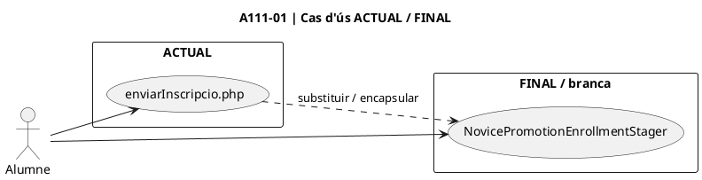

### A111-01.2 · Classes / components ACTUAL / FINAL

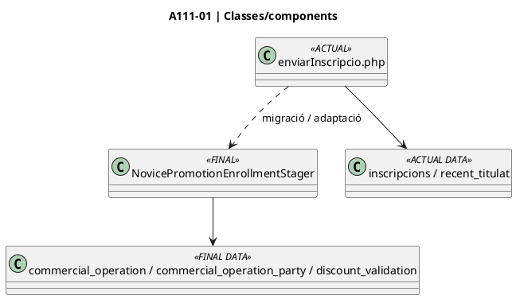

### A111-01.3 · Seqüència

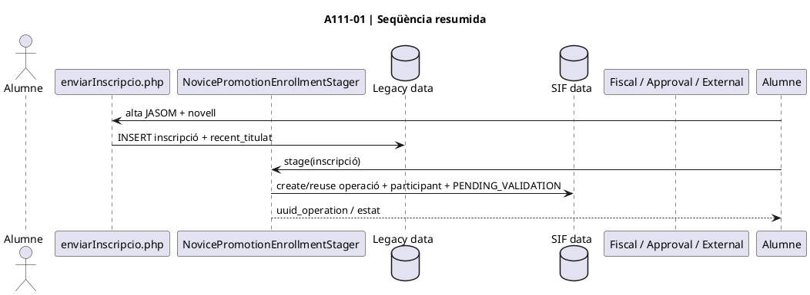

### A111-01.4 · Activitat ACTUAL / FINAL

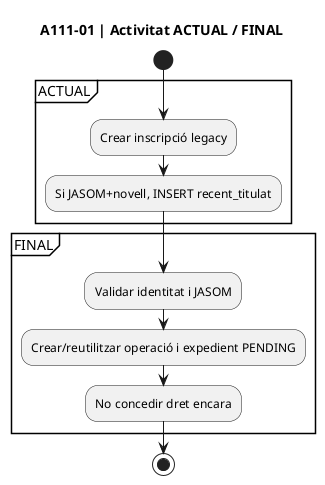

## A111-02 · Pujar i custodiar evidència de titulació

[Fitxa de l'acció](../06-fitxes-funcionals/uc-111-accions.md#a111-02-) · [traçabilitat global](uc-111-tracabilitat-implementacio.md)

### A111-02.1 · Cas d'ús ACTUAL / FINAL

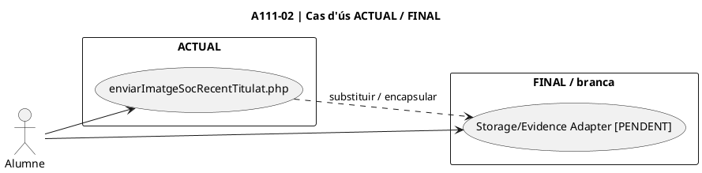

### A111-02.2 · Classes / components ACTUAL / FINAL

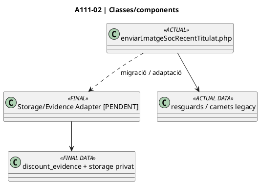

### A111-02.3 · Seqüència

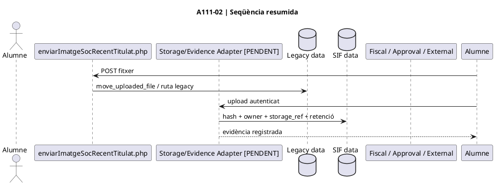

### A111-02.4 · Activitat ACTUAL / FINAL

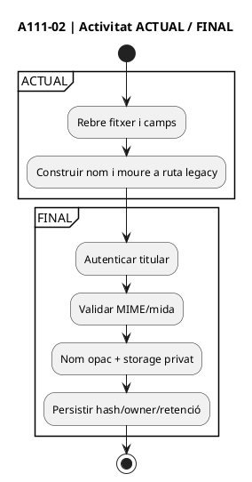

## A111-03 · Decisió de secretaria

[Fitxa de l'acció](../06-fitxes-funcionals/uc-111-accions.md#a111-03-) · [traçabilitat global](uc-111-tracabilitat-implementacio.md)

### A111-03.1 · Cas d'ús ACTUAL / FINAL

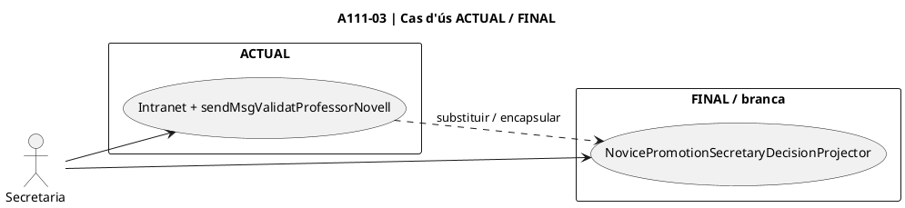

### A111-03.2 · Classes / components ACTUAL / FINAL

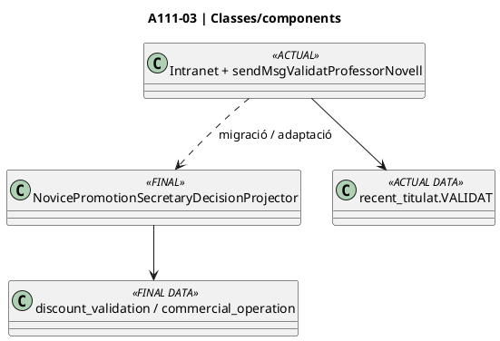

### A111-03.3 · Seqüència

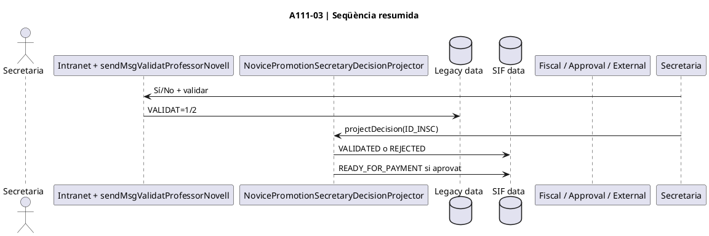

### A111-03.4 · Activitat ACTUAL / FINAL

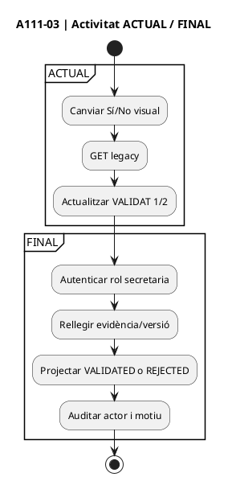

## A111-04 · Conciliar JASOM pagat i concedir dret únic

[Fitxa de l'acció](../06-fitxes-funcionals/uc-111-accions.md#a111-04-) · [traçabilitat global](uc-111-tracabilitat-implementacio.md)

### A111-04.1 · Cas d'ús ACTUAL / FINAL

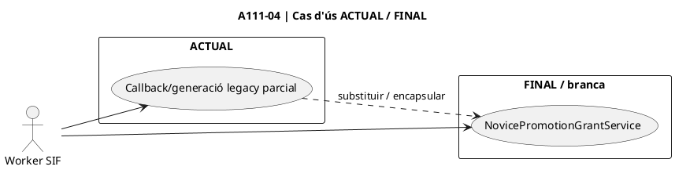

### A111-04.2 · Classes / components ACTUAL / FINAL

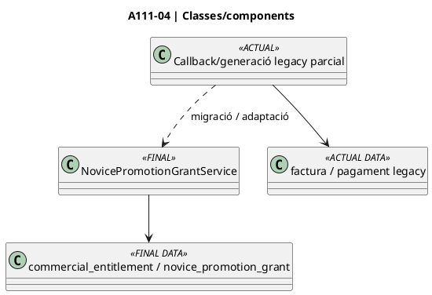

### A111-04.3 · Seqüència

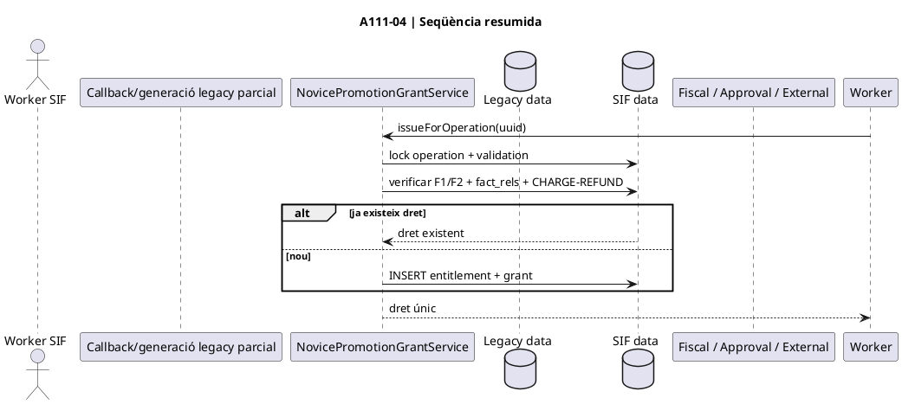

### A111-04.4 · Activitat ACTUAL / FINAL

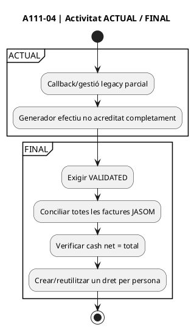

## A111-05 · Preparar i lliurar el codi

[Fitxa de l'acció](../06-fitxes-funcionals/uc-111-accions.md#a111-05-) · [traçabilitat global](uc-111-tracabilitat-implementacio.md)

### A111-05.1 · Cas d'ús ACTUAL / FINAL

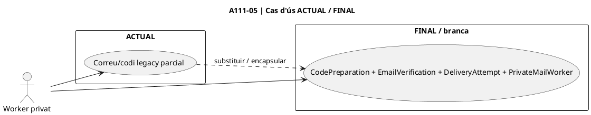

### A111-05.2 · Classes / components ACTUAL / FINAL

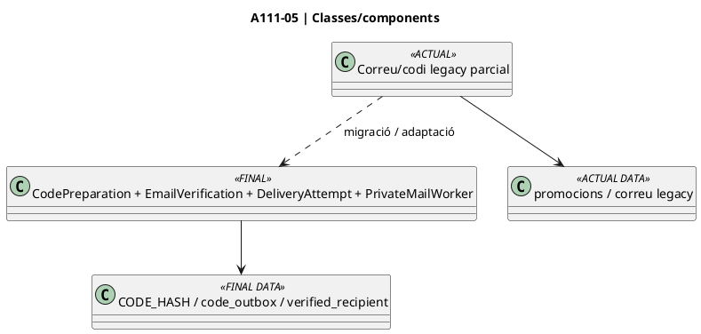

### A111-05.3 · Seqüència

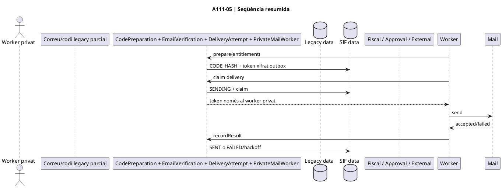

### A111-05.4 · Activitat ACTUAL / FINAL

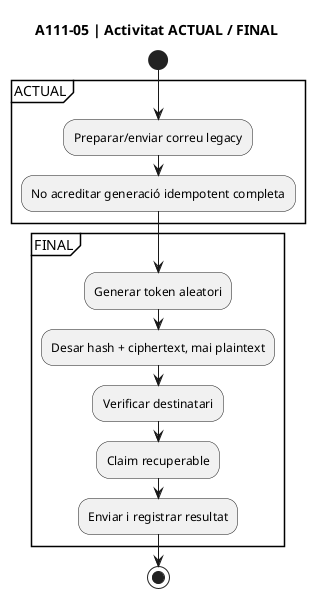

## A111-06 · Reservar, aplicar o alliberar saldo original

[Fitxa de l'acció](../06-fitxes-funcionals/uc-111-accions.md#a111-06-) · [traçabilitat global](uc-111-tracabilitat-implementacio.md)

### A111-06.1 · Cas d'ús ACTUAL / FINAL

```plantuml
@startuml
title A111-06 | Cas d'ús ACTUAL / FINAL
left to right direction
actor "Checkout" as Actor
rectangle "ACTUAL" {
  usecase "obtenirDadesPromo.php / promocions" as Current
}
rectangle "FINAL / branca" {
  usecase "NovicePromotionRedemptionService" as Target
}
Actor --> Current
Actor --> Target
Current ..> Target : substituir / encapsular
@enduml
```

### A111-06.2 · Classes / components ACTUAL / FINAL

```plantuml
@startuml
title A111-06 | Classes/components
class "obtenirDadesPromo.php / promocions" as Legacy <<ACTUAL>>
class "NovicePromotionRedemptionService" as Final <<FINAL>>
class "promocions" as LegacyDB <<ACTUAL DATA>>
class "novice_promotion_grant / novice_promotion_application" as SIFDB <<FINAL DATA>>
Legacy --> LegacyDB
Legacy ..> Final : migració / adaptació
Final --> SIFDB
@enduml
```

### A111-06.3 · Seqüència

```plantuml
@startuml
title A111-06 | Seqüència resumida
actor "Checkout" as Actor
participant "obtenirDadesPromo.php / promocions" as Legacy
participant "NovicePromotionRedemptionService" as Final
database "Legacy data" as LegacyDB
database "SIF data" as SIFDB
participant "Fiscal / Approval / External" as Fiscal
Checkout -> Final : reserve(code, holder, dest, key)
Final -> SIFDB : lock grant + destí
Final -> SIFDB : AVAILABLE -= amount + INSERT RESERVED
Checkout -> Fiscal : pricing/factura/cobrament final
Checkout -> Final : confirmApplied(app, invoice)
Final -> SIFDB : validar factura/cash + APPLIED
opt checkout falla sense intent/factura
Checkout -> Final : release(app)
Final -> SIFDB : restore available + RELEASED
end
@enduml
```

### A111-06.4 · Activitat ACTUAL / FINAL

```plantuml
@startuml
title A111-06 | Activitat ACTUAL / FINAL
start
partition ACTUAL {
:Consultar promoció disponible;
:Consum concurrent complet no acreditat;
}
partition FINAL {
:Persistir quote BEFORE_PROMOTION;
:Reservar i debitar una vegada;
:Confirmar contra factura/cash final;
:O release segur abans d'evidència fiscal;
}
stop
@enduml
```

## A111-07 · Canviar el curs de destinació

[Fitxa de l'acció](../06-fitxes-funcionals/uc-111-accions.md#a111-07-) · [traçabilitat global](uc-111-tracabilitat-implementacio.md)

### A111-07.1 · Cas d'ús ACTUAL / FINAL

```plantuml
@startuml
title A111-07 | Cas d'ús ACTUAL / FINAL
left to right direction
actor "Secretaria/Checkout" as Actor
rectangle "ACTUAL" {
  usecase "Flux general canvi de curs" as Current
}
rectangle "FINAL / branca" {
  usecase "First/Successive Transfer Review + Confirmation" as Target
}
Actor --> Current
Actor --> Target
Current ..> Target : substituir / encapsular
@enduml
```

### A111-07.2 · Classes / components ACTUAL / FINAL

```plantuml
@startuml
title A111-07 | Classes/components
class "Flux general canvi de curs" as Legacy <<ACTUAL>>
class "First/Successive Transfer Review + Confirmation" as Final <<FINAL>>
class "inscripció/factura antiga" as LegacyDB <<ACTUAL DATA>>
class "novice_promotion_application_transfer" as SIFDB <<FINAL DATA>>
Legacy --> LegacyDB
Legacy ..> Final : migració / adaptació
Final --> SIFDB
@enduml
```

### A111-07.3 · Seqüència

```plantuml
@startuml
title A111-07 | Seqüència resumida
actor "Secretaria/Checkout" as Actor
participant "Flux general canvi de curs" as Legacy
participant "First/Successive Transfer Review + Confirmation" as Final
database "Legacy data" as LegacyDB
database "SIF data" as SIFDB
participant "Fiscal / Approval / External" as Fiscal
Secretaria -> Final : stage transfer
Final -> Fiscal : validar rectificativa + preu nou
Final -> SIFDB : PENDING_FISCAL_REVIEW
Final -> Approval : decisió final
Approval --> Final : APPROVED
Final -> Fiscal : factura nova + residual cash
Final -> SIFDB : predecessor històric + transfer CONFIRMED
@enduml
```

### A111-07.4 · Activitat ACTUAL / FINAL

```plantuml
@startuml
title A111-07 | Activitat ACTUAL / FINAL
start
partition ACTUAL {
:Canvi de curs segons circuit general legacy;
}
partition FINAL {
:Identificar atribució actual;
:Rectificativa origen;
:Validar nou net;
:Review + aprovació independent;
:Confirmar mateixa quantia, sense segon consum;
}
stop
@enduml
```

## A111-08 · Baixa de curs i concessió de saldo derivat

[Fitxa de l'acció](../06-fitxes-funcionals/uc-111-accions.md#a111-08-) · [traçabilitat global](uc-111-tracabilitat-implementacio.md)

### A111-08.1 · Cas d'ús ACTUAL / FINAL

```plantuml
@startuml
title A111-08 | Cas d'ús ACTUAL / FINAL
left to right direction
actor "Secretaria" as Actor
rectangle "ACTUAL" {
  usecase "Baixa general / sense lineage canònic" as Current
}
rectangle "FINAL / branca" {
  usecase "Cancellation Review + Derived Activation" as Target
}
Actor --> Current
Actor --> Target
Current ..> Target : substituir / encapsular
@enduml
```

### A111-08.2 · Classes / components ACTUAL / FINAL

```plantuml
@startuml
title A111-08 | Classes/components
class "Baixa general / sense lineage canònic" as Legacy <<ACTUAL>>
class "Cancellation Review + Derived Activation" as Final <<FINAL>>
class "factura/baixa legacy" as LegacyDB <<ACTUAL DATA>>
class "novice_promotion_derived_balance" as SIFDB <<FINAL DATA>>
Legacy --> LegacyDB
Legacy ..> Final : migració / adaptació
Final --> SIFDB
@enduml
```

### A111-08.3 · Seqüència

```plantuml
@startuml
title A111-08 | Seqüència resumida
actor "Secretaria" as Actor
participant "Baixa general / sense lineage canònic" as Legacy
participant "Cancellation Review + Derived Activation" as Final
database "Legacy data" as LegacyDB
database "SIF data" as SIFDB
participant "Fiscal / Approval / External" as Fiscal
Secretaria -> Final : stage cancellation review
Final -> Fiscal : validar factura + rectificativa + cash
Final -> SIFDB : PENDING (available=0)
Final -> Approval : decisió final
Approval --> Final : APPROVED
Final -> Fiscal : reconciliar de nou
Final -> SIFDB : tancar predecessor + ACTIVE derived + expiry pròpia
@enduml
```

### A111-08.4 · Activitat ACTUAL / FINAL

```plantuml
@startuml
title A111-08 | Activitat ACTUAL / FINAL
start
partition ACTUAL {
:Tramitar baixa/rectificativa general;
}
partition FINAL {
:Separar promoció i diners reals;
:Crear review no gastable;
:Aprovar de forma independent;
:Reconciliar de nou;
:Activar saldo derivat amb nou any;
}
stop
@enduml
```

## A111-09 · Consum parcial del saldo derivat

[Fitxa de l'acció](../06-fitxes-funcionals/uc-111-accions.md#a111-09-) · [traçabilitat global](uc-111-tracabilitat-implementacio.md)

### A111-09.1 · Cas d'ús ACTUAL / FINAL

```plantuml
@startuml
title A111-09 | Cas d'ús ACTUAL / FINAL
left to right direction
actor "Checkout" as Actor
rectangle "ACTUAL" {
  usecase "Sense model canònic" as Current
}
rectangle "FINAL / branca" {
  usecase "NovicePromotionDerivedBalanceRedemptionService" as Target
}
Actor --> Current
Actor --> Target
Current ..> Target : substituir / encapsular
@enduml
```

### A111-09.2 · Classes / components ACTUAL / FINAL

```plantuml
@startuml
title A111-09 | Classes/components
class "Sense model canònic" as Legacy <<ACTUAL>>
class "NovicePromotionDerivedBalanceRedemptionService" as Final <<FINAL>>
class "n/a" as LegacyDB <<ACTUAL DATA>>
class "novice_promotion_derived_balance / novice_promotion_derived_application" as SIFDB <<FINAL DATA>>
Legacy --> LegacyDB
Legacy ..> Final : migració / adaptació
Final --> SIFDB
@enduml
```

### A111-09.3 · Seqüència

```plantuml
@startuml
title A111-09 | Seqüència resumida
actor "Checkout" as Actor
participant "Sense model canònic" as Legacy
participant "NovicePromotionDerivedBalanceRedemptionService" as Final
database "Legacy data" as LegacyDB
database "SIF data" as SIFDB
participant "Fiscal / Approval / External" as Fiscal
Checkout -> Final : reserve(derivedUuid, holder, dest, key)
Final -> SIFDB : lock root + derived + destination
Final -> SIFDB : derived AVAILABLE -= amount + RESERVED
Checkout -> Fiscal : factura/residual
Checkout -> Final : confirmApplied
Final -> SIFDB : APPLIED sense segon dèbit
opt fallada segura
Checkout -> Final : release
Final -> SIFDB : restore + RELEASED
end
@enduml
```

### A111-09.4 · Activitat ACTUAL / FINAL

```plantuml
@startuml
title A111-09 | Activitat ACTUAL / FINAL
start
partition ACTUAL {
:No hi ha ledger derivat canònic acreditat;
}
partition FINAL {
:Seleccionar saldo per titular + UUID intern;
:Validar vigència pròpia;
:Reservar parcialment;
:Confirmar factura/cash o alliberar segurament;
}
stop
@enduml
```

## A111-10 · Projectar la cadena de procedència

[Fitxa de l'acció](../06-fitxes-funcionals/uc-111-accions.md#a111-10-) · [traçabilitat global](uc-111-tracabilitat-implementacio.md)

### A111-10.1 · Cas d'ús ACTUAL / FINAL

```plantuml
@startuml
title A111-10 | Cas d'ús ACTUAL / FINAL
left to right direction
actor "SIF" as Actor
rectangle "ACTUAL" {
  usecase "Traça dispersa" as Current
}
rectangle "FINAL / branca" {
  usecase "LineageSnapshot + Projection + Policy" as Target
}
Actor --> Current
Actor --> Target
Current ..> Target : substituir / encapsular
@enduml
```

### A111-10.2 · Classes / components ACTUAL / FINAL

```plantuml
@startuml
title A111-10 | Classes/components
class "Traça dispersa" as Legacy <<ACTUAL>>
class "LineageSnapshot + Projection + Policy" as Final <<FINAL>>
class "inscripcions/promocions disperses" as LegacyDB <<ACTUAL DATA>>
class "grant + applications + transfers + derived balances" as SIFDB <<FINAL DATA>>
Legacy --> LegacyDB
Legacy ..> Final : migració / adaptació
Final --> SIFDB
@enduml
```

### A111-10.3 · Seqüència

```plantuml
@startuml
title A111-10 | Seqüència resumida
actor "SIF" as Actor
participant "Traça dispersa" as Legacy
participant "LineageSnapshot + Projection + Policy" as Final
database "Legacy data" as LegacyDB
database "SIF data" as SIFDB
participant "Fiscal / Approval / External" as Fiscal
SIF -> Snapshot : projectLocked(root)
Snapshot -> SIFDB : lock/load root + descendants
Snapshot -> Projection : project(rows)
Projection -> Projection : validar parents/transfers/estats
Projection --> Snapshot : graf lògic
Snapshot -> Policy : plan exposure/refund-safe view
Policy --> SIF : disponibles + usos vius
@enduml
```

### A111-10.4 · Activitat ACTUAL / FINAL

```plantuml
@startuml
title A111-10 | Activitat ACTUAL / FINAL
start
partition ACTUAL {
:Reconstrucció manual/dispersa;
}
partition FINAL {
:Bloquejar arrel i descendents;
:Projectar SQL a graf;
:Marcar predecessors substituïts com història;
:Comptar només exposició viva;
}
stop
@enduml
```

## A111-11 · Obrir review i freeze per devolució JASOM

[Fitxa de l'acció](../06-fitxes-funcionals/uc-111-accions.md#a111-11-) · [traçabilitat global](uc-111-tracabilitat-implementacio.md)

### A111-11.1 · Cas d'ús ACTUAL / FINAL

```plantuml
@startuml
title A111-11 | Cas d'ús ACTUAL / FINAL
left to right direction
actor "Operador refund" as Actor
rectangle "ACTUAL" {
  usecase "Manual/dispers" as Current
}
rectangle "FINAL / branca" {
  usecase "RootRefundPlan + RootRefundReview" as Target
}
Actor --> Current
Actor --> Target
Current ..> Target : substituir / encapsular
@enduml
```

### A111-11.2 · Classes / components ACTUAL / FINAL

```plantuml
@startuml
title A111-11 | Classes/components
class "Manual/dispers" as Legacy <<ACTUAL>>
class "RootRefundPlan + RootRefundReview" as Final <<FINAL>>
class "refund/origen manual" as LegacyDB <<ACTUAL DATA>>
class "root_refund_review + fingerprint/hold" as SIFDB <<FINAL DATA>>
Legacy --> LegacyDB
Legacy ..> Final : migració / adaptació
Final --> SIFDB
@enduml
```

### A111-11.3 · Seqüència

```plantuml
@startuml
title A111-11 | Seqüència resumida
actor "Operador refund" as Actor
participant "Manual/dispers" as Legacy
participant "RootRefundPlan + RootRefundReview" as Final
database "Legacy data" as LegacyDB
database "SIF data" as SIFDB
participant "Fiscal / Approval / External" as Fiscal
Operador -> Final : openReview(root)
Final -> Snapshot : projectLocked
Snapshot --> Final : graf coherent
Final -> Plan : calcular cancel_available + recover_active
Final -> SIFDB : review PENDING_APPROVAL + fingerprint + hold
Final --> Operador : review oberta
@enduml
```

### A111-11.4 · Activitat ACTUAL / FINAL

```plantuml
@startuml
title A111-11 | Activitat ACTUAL / FINAL
start
partition ACTUAL {
:Decisió manual sense graf canònic complet;
}
partition FINAL {
:Projectar procedència completa;
:Bloquejar si reserves/graf inconsistent;
:Congelar noves reserves;
:Desar pla immutable per aprovació;
}
stop
@enduml
```

## A111-12 · Executar conseqüències del refund i tancar recoveries

[Fitxa de l'acció](../06-fitxes-funcionals/uc-111-accions.md#a111-12-) · [traçabilitat global](uc-111-tracabilitat-implementacio.md)

### A111-12.1 · Cas d'ús ACTUAL / FINAL

```plantuml
@startuml
title A111-12 | Cas d'ús ACTUAL / FINAL
left to right direction
actor "Refund/Recovery" as Actor
rectangle "ACTUAL" {
  usecase "Sense workflow canònic" as Current
}
rectangle "FINAL / branca" {
  usecase "RootRefundExecution + RecoveryResolution + RecoveryCompletion" as Target
}
Actor --> Current
Actor --> Target
Current ..> Target : substituir / encapsular
@enduml
```

### A111-12.2 · Classes / components ACTUAL / FINAL

```plantuml
@startuml
title A111-12 | Classes/components
class "Sense workflow canònic" as Legacy <<ACTUAL>>
class "RootRefundExecution + RecoveryResolution + RecoveryCompletion" as Final <<FINAL>>
class "refund/reclamacions disperses" as LegacyDB <<ACTUAL DATA>>
class "root refund evidence / recovery items / resolution evidence" as SIFDB <<FINAL DATA>>
Legacy --> LegacyDB
Legacy ..> Final : migració / adaptació
Final --> SIFDB
@enduml
```

### A111-12.3 · Seqüència

```plantuml
@startuml
title A111-12 | Seqüència resumida
actor "Refund/Recovery" as Actor
participant "Sense workflow canònic" as Legacy
participant "RootRefundExecution + RecoveryResolution + RecoveryCompletion" as Final
database "Legacy data" as LegacyDB
database "SIF data" as SIFDB
participant "Fiscal / Approval / External" as Fiscal
Refund -> Final : executeApprovedCommercialConsequences
Final -> Evidence : verificar refund JASOM real
Final -> SIFDB : cancel·lar romanents vius
Final -> SIFDB : crear PENDING_RECOVERY per usos vius
Recovery -> Final : resolveVerifiedRecovery(item)
Final -> SIFDB : RECOVERED/WAIVED/CANCELLED + evidència
Recovery -> Final : closeResolvedWorkflow
Final -> SIFDB : resum + tancament
@enduml
```

### A111-12.4 · Activitat ACTUAL / FINAL

```plantuml
@startuml
title A111-12 | Activitat ACTUAL / FINAL
start
partition ACTUAL {
:No hi ha workflow canònic acreditat;
}
partition FINAL {
:Exigir refund d'origen confirmat;
:Cancel·lar només romanents vius;
:Crear recovery només per ús actual;
:Resoldre cada item amb evidència;
:Tancar sense inventar cobrament;
}
stop
@enduml
```

## Matriu de verificació 1:1

| Acció | Fitxa | Cas d'ús | Classes | Seqüència | Activitat |
| --- | --- | --- | --- | --- | --- |
| A111-01 | sí | §A111-01.1 | §A111-01.2 | §A111-01.3 | §A111-01.4 |
| A111-02 | sí | §A111-02.1 | §A111-02.2 | §A111-02.3 | §A111-02.4 |
| A111-03 | sí | §A111-03.1 | §A111-03.2 | §A111-03.3 | §A111-03.4 |
| A111-04 | sí | §A111-04.1 | §A111-04.2 | §A111-04.3 | §A111-04.4 |
| A111-05 | sí | §A111-05.1 | §A111-05.2 | §A111-05.3 | §A111-05.4 |
| A111-06 | sí | §A111-06.1 | §A111-06.2 | §A111-06.3 | §A111-06.4 |
| A111-07 | sí | §A111-07.1 | §A111-07.2 | §A111-07.3 | §A111-07.4 |
| A111-08 | sí | §A111-08.1 | §A111-08.2 | §A111-08.3 | §A111-08.4 |
| A111-09 | sí | §A111-09.1 | §A111-09.2 | §A111-09.3 | §A111-09.4 |
| A111-10 | sí | §A111-10.1 | §A111-10.2 | §A111-10.3 | §A111-10.4 |
| A111-11 | sí | §A111-11.1 | §A111-11.2 | §A111-11.3 | §A111-11.4 |
| A111-12 | sí | §A111-12.1 | §A111-12.2 | §A111-12.3 | §A111-12.4 |

**Estat:** cobertura documental 1:1 creada. Això no acredita renderització PlantUML, execució dels serveis, MySQL, concurrència, connectors ni desplegament. La vista funcional més detallada continua a [activitats ACTUAL/FINAL](uc-111-activitats-actual-final.md), [seqüències](uc-111-sequencies-actual-final.md) i [classes](uc-111-classes-actual-final.md).
