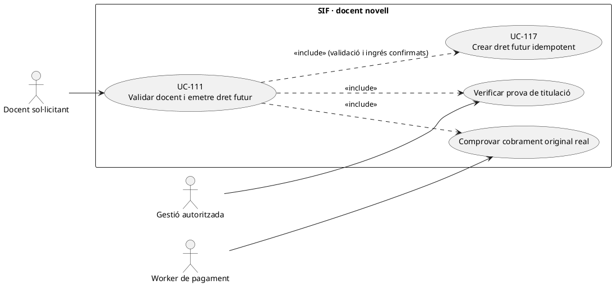
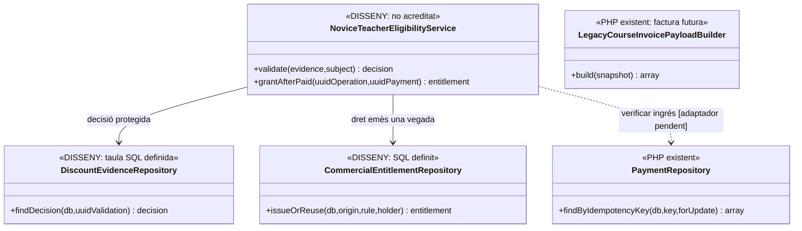

# UC-111 · Validar docent novell i generar un dret de descompte futur

**Objectiu del catàleg:** separar l'evidència de titulació i la seva validació de la compra d'origen; **només després de confirmar el cobrament** s'emet una sola vegada el benefici futur. No es modifica ni es torna a emetre la factura inicial per concedir el dret.

**Estat:** la migració defineix `discount_evidence`, `commercial_entitlement` i `commercial_entitlement_event`; `PaymentService` registra un moviment efectiu quan el canal li aporta un payload correcte, i `LegacyCourseInvoicePayloadBuilder` trasllada el descompte al **document de la compra futura**, però **no s'ha acreditat** un servei PHP de verificació de docent novell o emissió automàtica del dret en acabar el cobrament. La fitxa original manté pendent la naturalesa del benefici —codi promocional, crèdit comercial o un altre dret—, la caducitat i transferibilitat.

## 1. Fitxa específica

| Aspecte | Contracte i límit |
| --- | --- |
| Actors | Persona titulada, operador autoritzat que comprova evidència i worker de pagament de la compra inicial. |
| Entrada | Titular, titulació/prova mínima, emissor i data quan siguin exigibles segons regla real, `ID_INSC_ORIGEN`, `UUID_OPERATION_ORIGEN`, `UUID_PAYMENT` **confirmat**, regla/versió, valor o percentatge i caducitat acordada. |
| Evidència | `discount_evidence` preveu `UUID_VALIDATION`, `STORAGE_REF`, hash, finalitat, classificació i retenció; **l'esquema no demostra** que el fitxer existeixi ni que sigui accessible només a gestió. |
| Condicions | Dret acadèmic/documental vàlid **i** moviment econòmic d'origen efectiu i pertinent. Una intenció `PENDING`, factura abans de cobrar o un camp `PAGAMENT` del llegat **no acrediten** per si sols l'ingrés. |
| Emissió | `commercial_entitlement.ORIGIN_UUID_OPERATION` i `IDEMPOTENCY_KEY` poden vincular dret amb compra original. Per a una compra elegible, idempotència per regla+titular+operació; no crear dos codis per retries de worker. |
| Dret futur | La classe econòmica **no està decidida**. Si és cupó de descompte, redueix preu d'una altra compra segons regla; si és valor ja cobrat reutilitzable, requereix ledger de procedència i tractament d'aplicació de valor, no fingir un segon ingrés. |
| Fiscalitat | La factura inicial queda immutable. La compra posterior incorpora el seu propi snapshot fiscal segons el tipus de dret; una cancel·lació de compra inicial exigeix decisió expressa sobre dret derivat. |

### Flux i alternatives

1. L'operador comprova evidència de docent novell amb mínima informació i registra aprovació/rebuig amb actor i data; cap dret es crea només per pujar un document.
2. L'alta/compra original segueix UC-14/112. El processador espera un **pagament real confirmat** i reconciliat per `UUID_OPERATION_ORIGEN` i `ID_INSC`, no el primer callback no processat.
3. El coordinador **pendent** llegeix decisió vàlida i pagament; aplica política comercial aprovada (tipus, titular, transferibilitat, valor, caducitat) i crea/reutilitza `commercial_entitlement` amb event d'emissió, sense tocar factura inicial.
4. Un retry equivalent retorna dret anterior; si canvia regla, titular, valor o origen, bloqueja contradicció.
5. En compra posterior UC-117 valida reserva, consum i import del dret; només si és valor monetari **prepagat** el ledger proposat vincula import original i destí individual.
6. Si la compra inicial es retorna o s'anul·la, no eliminar el dret silenciosament: expedient/decisió segons política i event de reversió si correspon, amb possibles efectes fiscals/econòmics separats.

**Proves pendents:** evidència invàlida/caducada, factura abans de cobrar, pagament parcial o denegat, dos callbacks equivalents, reintent després d'emetre dret, compra posterior, devolució d'origen i codi consumit abans de la cancel·lació. No s'han executat proves PHP.

### 1.1. Validació `recent_titulat` i codi personal del llegat

La documentació de la promoció de docents novells identifica una consulta a `recent_titulat` per `ID_INSC` i `VALIDAT=1`. El correu històric pot comunicar un codi del patró `MACABODETITULAR#...`, el descompte i la data de validesa. La taula `promocions` conté titular, curs, mes, percentatge, estat `USED` i dates de vigència; el procediment `cnsSiTePromocioDispo` comprova la disponibilitat del codi. Aquestes són **peces del circuit llegat**, no una demostració que existeixi al SIF un worker que expedeixi drets nous a partir del cobrament.

`recent_titulat.VALIDAT=1` acredita la decisió de validació acadèmica del llegat, **no el cobrament de la compra d'origen**. L'objectiu de la fitxa exigeix comprovar per separat el `UUID_PAYMENT` real i la regla comercial abans d'emetre el dret futur. Una factura emesa abans de cobrar o una intenció Redsys pendent no són suficients. Si un callback es repeteix després de concedir el codi, cal recuperar el mateix dret en comptes d'emetre'n un segon; si falla només el correu, reintentar el lliurament sense crear una nova promoció.

En una compra futura, el codi personal es valida segons UC-20d/117. Si la compra inicial es retorna després que el codi ja s'hagi consumit, conservar les dues operacions i el seu historial, i sotmetre la reversió a una decisió expressa. El xat recuperat no estableix un mecanisme automàtic per desfer descomptes de factures futures ja emeses.

### 1.2. Proves addicionals de docent novell (no executades)

| ID | Escenari | Resultat |
| --- | --- | --- |
| DN-01 | recent_titulat.VALIDAT=1 i factura d'origen encara pendent | No concedir el dret per una factura no cobrada. |
| DN-02 | Compra confirmada amb doble callback Redsys | Un sol codi/dret amb origen i titular identificats. |
| DN-03 | El dret ja existeix però falla el correu | Reintentar només el lliurament, no duplicar el dret. |
| DN-04 | Codi personal presentat per una altra persona | Denegar ús sense revelar les dades del titular. |
| DN-05 | Retorn posterior de compra d'origen amb codi ja consumit | Expedient de reversió, no reactivació ni edició automàtica de factura futura. |

## 2. UML de casos d'ús



## 3. Diagrama de classes



## 4. Seqüència objectiu — prova, pagament i dret independent

```mermaid
sequenceDiagram
actor D as Docent
participant V as NoviceTeacherEligibilityService [DISSENY]
participant E as Custòdia i decisió [SQL definit]
participant P as Verificador de pagament real [integració pendent]
participant R as commercial_entitlement + event [SQL definit]
D->>V: Aportar prova i identificar compra inicial
V->>E: Validar evidència i custodiar resultat
alt Evidència no vàlida
 E-->>V: REJECTED
 V-->>D: No concedir dret
else Evidència vàlida
 E-->>V: APPROVED
 V->>P: Comprovar UUID_PAYMENT efectiu de la compra original
 alt Encara no cobrat
  P-->>V: PENDING / NO_CHARGE
  V-->>D: Validació conservada; dret encara no emès
 else Cobrament real confirmat
  P-->>V: UUID_PAYMENT acreditat
  V->>R: issueOrReuse(origin,rule,holder) + event
  R-->>V: UUID_ENTITLEMENT nou o reutilitzat
  V-->>D: Dret futur, tipus i condicions aprovats
 end
end
Note over V,R: Coordinació no implementada; no ALTERAR factura original ni generar CHARGE pel dret.
```

## 5. Traçabilitat

[UC-111 original](../06-fitxes-funcionals/uc-111.md) · [UC-117 drets](uc-117-cicle-vida-codi-dret-futur.md) · [UC-116 evidències original](../06-fitxes-funcionals/uc-116.md) · [UC-20d cupó](uc-020d-aplicar-codi-promocional.md) · [UC-02 cobrament](uc-002-registrar-cobrament-factura.md) · [Migració dret/evidència](../../sif/database/migrations/2026_09_16_000005_add_operation_lifecycle_tables.sql) · [CreditBalanceService: diferent d'un cupó](../../sif/src/Service/CreditBalanceService.php) · [Traçabilitat monetària](00-revisio-moviments-inscripcions.md).
