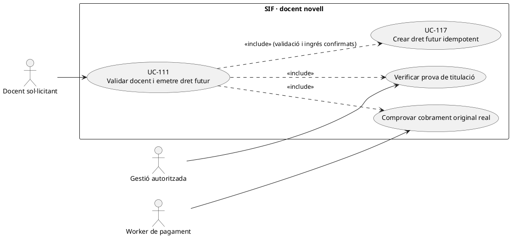
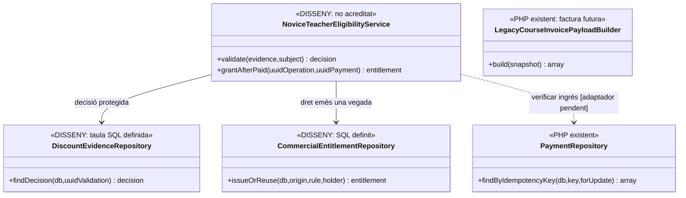
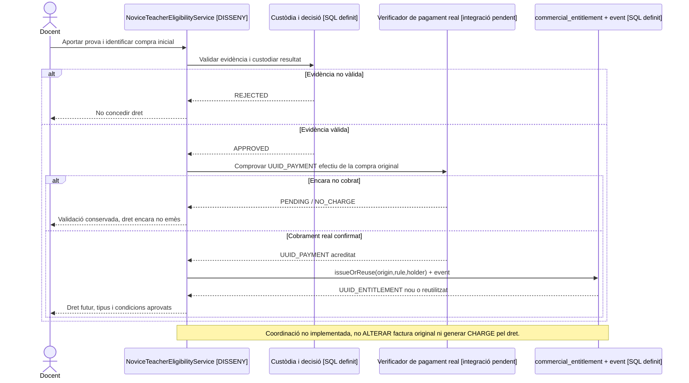
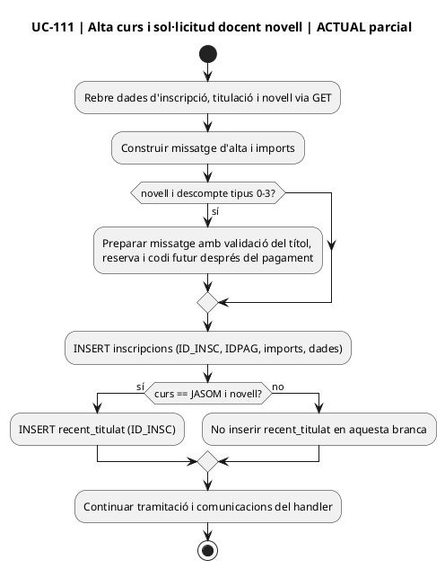
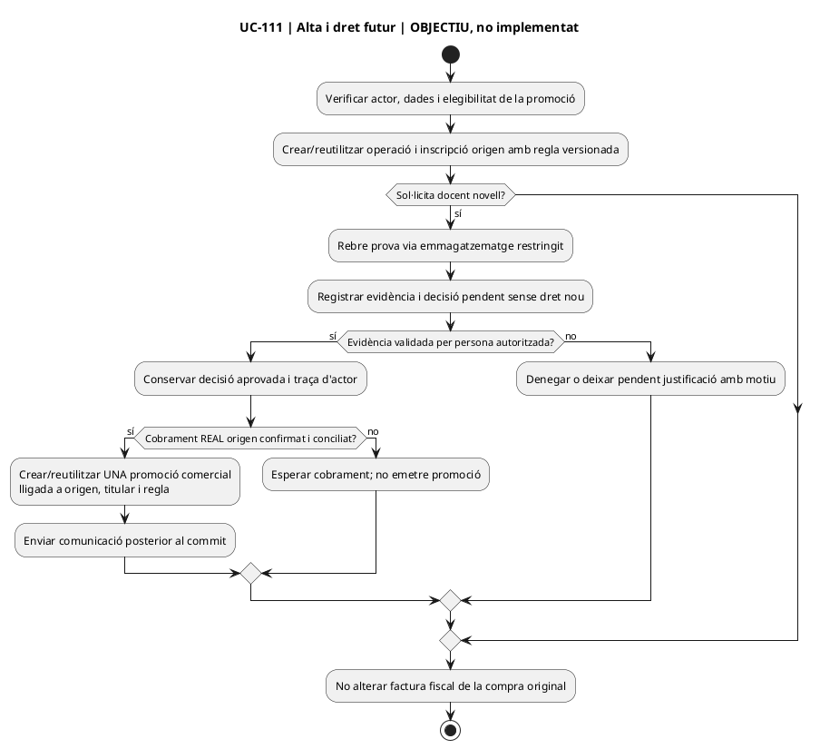
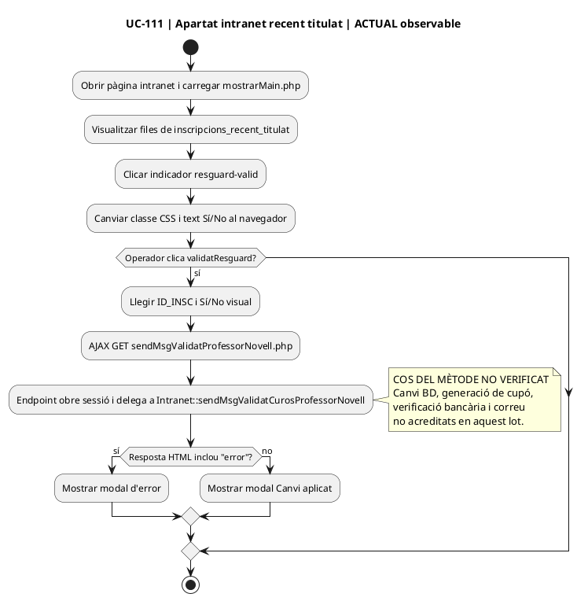
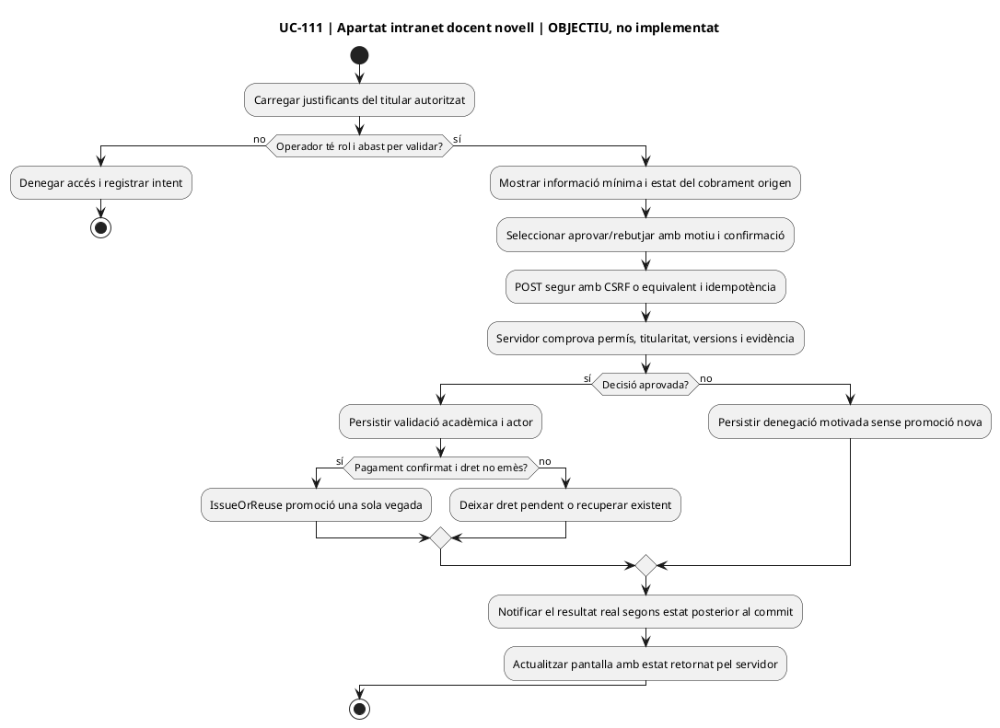

# UC-111 · Validar docent novell i generar un dret de descompte futur

**Objectiu del catàleg:** separar l'evidència de titulació i la seva validació de la compra d'origen; **només després de confirmar el cobrament** s'emet una sola vegada el benefici futur. No es modifica ni es torna a emetre la factura inicial per concedir el dret.

**Estat revisat el 22/09/2026:** les migracions defineixen `discount_validation`, `discount_evidence`, `commercial_entitlement` i `commercial_entitlement_event`. El PHP web llegat identifica la promoció de novell i, quan `CURS='JASOM'` i es marca novell, crea `recent_titulat(ID_INSC)`; la intranet té un botó de validació que crida `Intranet::sendMsgValidatCurosProfessorNovell()`. **No s'ha pogut recuperar el cos d'aquest mètode llegat en aquesta auditoria**, ni acreditar el servei SIF que emet el dret després del pagament. La comunicació del canal web anuncia un **codi de descompte futur per un import monetari**, però no demostra que sigui un saldo prepagat; les condicions exactes, caducitat, transferibilitat i emissió/consum real queden pendents de contrast i decisió. [Auditoria específica UC-111](00-auditoria-casos-pendents-lot-02-uc-111-2026-09-22.md).

## 1. Fitxa específica

| Aspecte | Contracte i límit |
| --- | --- |
| Actors | Persona titulada, operador autoritzat que comprova evidència i worker de pagament de la compra inicial. |
| Entrada | Titular, titulació/prova mínima, emissor i data quan siguin exigibles segons regla real, `ID_INSC_ORIGEN`, `UUID_OPERATION_ORIGEN`, `UUID_PAYMENT` **confirmat**, regla/versió, valor o percentatge i caducitat acordada. |
| Evidència | `discount_evidence` preveu `UUID_VALIDATION`, `STORAGE_REF`, hash, finalitat, classificació i retenció; **l'esquema no demostra** que el fitxer existeixi ni que sigui accessible només a gestió. |
| Condicions | Dret acadèmic/documental vàlid **i** moviment econòmic d'origen efectiu i pertinent. Una intenció `PENDING`, factura abans de cobrar o un camp `PAGAMENT` del llegat **no acrediten** per si sols l'ingrés. |
| Emissió | `commercial_entitlement.ORIGIN_UUID_OPERATION` i `IDEMPOTENCY_KEY` poden vincular dret amb compra original. Per a una compra elegible, idempotència per regla+titular+operació; no crear dos codis per retries de worker. |
| Dret futur | La classe econòmica **no està decidida**. Si és cupó de descompte, redueix preu d'una altra compra segons regla; si és valor ja cobrat reutilitzable, requereix ledger de procedència i tractament d'aplicació de valor, no fingir un segon ingrés. |
| Fiscalitat | La factura inicial queda immutable. La compra posterior incorpora el seu propi snapshot fiscal segons el tipus de dret; una cancel·lació de compra inicial exigeix decisió expressa sobre dret derivat. |

### Flux i alternatives

1. L'operador comprova evidència de docent novell amb mínima informació i registra aprovació/rebuig amb actor i data; cap dret es crea només per pujar un document.
2. L'alta/compra original segueix UC-14/112. El processador espera un **pagament real confirmat** i reconciliat per `UUID_OPERATION_ORIGEN` i `ID_INSC`, no el primer callback no processat.
3. El coordinador **pendent** llegeix decisió vàlida i pagament; aplica política comercial aprovada (tipus, titular, transferibilitat, valor, caducitat) i crea/reutilitza `commercial_entitlement` amb event d'emissió, sense tocar factura inicial.
4. Un retry equivalent retorna dret anterior; si canvia regla, titular, valor o origen, bloqueja contradicció.
5. En compra posterior UC-117 valida reserva, consum i import del dret; només si és valor monetari **prepagat** el ledger proposat vincula import original i destí individual.
6. Si la compra inicial es retorna o s'anul·la, no eliminar el dret silenciosament: expedient/decisió segons política i event de reversió si correspon, amb possibles efectes fiscals/econòmics separats.

**Proves pendents:** evidència invàlida/caducada, factura abans de cobrar, pagament parcial o denegat, dos callbacks equivalents, reintent després d'emetre dret, compra posterior, devolució d'origen i codi consumit abans de la cancel·lació. No s'han executat proves PHP.

### 1.1. Validació `recent_titulat` i codi personal del llegat

La documentació de la promoció de docents novells identifica una consulta a `recent_titulat` per `ID_INSC` i `VALIDAT=1`. El correu històric pot comunicar un codi del patró `MACABODETITULAR#...`, el descompte i la data de validesa. La taula `promocions` conté titular, curs, mes, percentatge, estat `USED` i dates de vigència; el procediment `cnsSiTePromocioDispo` comprova la disponibilitat del codi. Aquestes són **peces del circuit llegat**, no una demostració que existeixi al SIF un worker que expedeixi drets nous a partir del cobrament.

`recent_titulat.VALIDAT=1` acredita la decisió de validació acadèmica del llegat, **no el cobrament de la compra d'origen**. L'objectiu de la fitxa exigeix comprovar per separat el `UUID_PAYMENT` real i la regla comercial abans d'emetre el dret futur. Una factura emesa abans de cobrar o una intenció Redsys pendent no són suficients. Si un callback es repeteix després de concedir el codi, cal recuperar el mateix dret en comptes d'emetre'n un segon; si falla només el correu, reintentar el lliurament sense crear una nova promoció.

En una compra futura, el codi personal es valida segons UC-20d/117. Si la compra inicial es retorna després que el codi ja s'hagi consumit, conservar les dues operacions i el seu historial, i sotmetre la reversió a una decisió expressa. El xat recuperat no estableix un mecanisme automàtic per desfer descomptes de factures futures ja emeses.

### 1.2. Proves addicionals de docent novell (no executades)

| ID | Escenari | Resultat |
| --- | --- | --- |
| DN-01 | recent_titulat.VALIDAT=1 i factura d'origen encara pendent | No concedir el dret per una factura no cobrada. |
| DN-02 | Compra confirmada amb doble callback Redsys | Un sol codi/dret amb origen i titular identificats. |
| DN-03 | El dret ja existeix però falla el correu | Reintentar només el lliurament, no duplicar el dret. |
| DN-04 | Codi personal presentat per una altra persona | Denegar ús sense revelar les dades del titular. |
| DN-05 | Retorn posterior de compra d'origen amb codi ja consumit | Expedient de reversió, no reactivació ni edició automàtica de factura futura. |

### 1.3. Contrast dirigit amb el codi actual de la web i intranet (22/09/2026)

**Alta i origen:** [`web-actual/ajax/enviarInscripcio.php` L36–69](../../codi-drive/web-actual/ajax/enviarInscripcio.php#L36-L69) llegeix `novell` i dades de titulació. A [L586–620](../../codi-drive/web-actual/ajax/enviarInscripcio.php#L586-L620) insereix la inscripció i **només quan el codi del curs és `JASOM` i novell** insereix `recent_titulat(ID_INSC)`. Això no prova per si sol la titulació, el cobrament o l'existència de la promoció. Identificar altres rutes possibles abans de generalitzar la regla a qualsevol curs. El missatge de [L403–420](../../codi-drive/web-actual/ajax/enviarInscripcio.php#L403-L420) indica validació del títol abans de reserva/pagament i després un **codi de descompte per valor de l'import del curs d'origen** per al pròxim curs: confirmar política comercial vigent, càlcul, titular, productes aplicables, caducitat i incompatibilitats, sense convertir automàticament «valor» en «crèdit bancari».

**Justificant:** [`web-actual/ajax/enviarImatgeSocRecentTitulat.php` L13–45](../../codi-drive/web-actual/ajax/enviarImatgeSocRecentTitulat.php#L13-L45) desa un fitxer a `resguards/` amb nom derivat de dades d'alta i extensió enviada. [L40–76](../../codi-drive/web-actual/ajax/enviarImatgeSocRecentTitulat.php#L40-L76) construeix referència a `ajax/carnets/` per al correu, sense acreditar aquí que el destí coincideixi amb la ubicació escrita. La ruta revisada NO demostra validació segura del document, autorització del titular ni registre de hash/retenció a `discount_evidence`; comprovar configuració real i no traslladar justificants personals a repositoris públics.

**Gestió i accions d'intranet:** [`alumnes-validar-descomptes.js` L42–53](../../codi-drive/intranet-actual/js/alumnes-validar-descomptes.js#L42-L53) només alterna el Sí/No visual del resguard; [L95–117](../../codi-drive/intranet-actual/js/alumnes-validar-descomptes.js#L95-L117) envia `idInsc` i `verificat` per GET a [`sendMsgValidatProfessorNovell.php`](../../codi-drive/intranet-actual/ajax/alumnes/sendMsgValidatProfessorNovell.php#L13-L25), que delega a `Intranet::sendMsgValidatCurosProfessorNovell()`. El cos d'aquest mètode de `Intranet.php` **no està verificat en aquest lot**; no afirmar que comprova el cobrament, genera el codi o envia la comunicació fins que se n'obtingui el codi i les dades de persistència.

**Model final i dependències:** migració 000004 defineix `discount_validation` i 000005 defineix `discount_evidence`, `commercial_entitlement` i els seus events; **SQL definit no prova servei ni persistència executada**. Completar a UC-117 la reserva i el consum del codi amb autorització, titularitat, import no negatiu i concurrència. Per a aquest UC, separar (1) validar evidència, (2) confirmar ingrés real, (3) expedir o recuperar dret, (4) notificar-lo i (5) consum futur; no alterar la factura original.

**Privacitat (P0 fins a revisió):** l'arbre de `main` del repositori públic conté justificants amb identificadors personals en noms d'arxiu a carpetes de web. No reproduir ni enllaçar fitxers individuals. Revisar i restringir la publicació i l'historial amb el responsable de dades abans de sincronitzar o desplegar-los; **no s'ha verificat que les còpies siguin les mateixes que en producció**.

**Traçabilitat i prova:** [auditoria UC-111 · lot 02](00-auditoria-casos-pendents-lot-02-uc-111-2026-09-22.md) inclou matriu d'accions, decisions, 4 diagrames d'activitat parcials (alta web actual/final i apartat d'intranet actual/final) i DN-111-01…12. **NO EXECUTATS**. La cobertura integral de cadascuna de les dues pàgines continua pendent de RM-037.

## 2. UML de casos d'ús

## 3. Diagrama de classes

## 4. Seqüència objectiu — prova, pagament i dret independent

## 5. Traçabilitat

[UC-111 original](../06-fitxes-funcionals/uc-111.md) · [UC-117 drets](uc-117-cicle-vida-codi-dret-futur.md) · [UC-116 evidències original](../06-fitxes-funcionals/uc-116.md) · [UC-20d cupó](uc-020d-aplicar-codi-promocional.md) · [UC-02 cobrament](uc-002-registrar-cobrament-factura.md) · [Migració dret/evidència](../../sif/database/migrations/2026_09_16_000005_add_operation_lifecycle_tables.sql) · [CreditBalanceService: diferent d'un cupó](../../sif/src/Service/CreditBalanceService.php) · [Traçabilitat monetària](00-revisio-moviments-inscripcions.md).

## 6. Diagrames d'activitat del cas UC-111

**Els quatre diagrames següents reprodueixen subfluxos comprovables o proposats del CAS UC-111, no la totalitat de totes les pàgines compartides.** Els fluxos ACTUALS NO afirmen el que fa el mètode d'Intranet no recuperat. Els fluxos FINALS són contractes objectiu, no programació acabada. Per a l'auditoria de les pàgines i apartats sencers continua oberta RM-037; no donar per acabada la documentació només per l'existència d'aquests diagrames.
**Abast:** subfluxos de la pàgina d'inscripció i de l'apartat «recent titulat» de la pàgina de validació; **NO** diagrama complet de totes les accions de les dues pàgines. Marcar els estats del servidor llegat que no s'han pogut recuperar com a NO VERIFICATS.

### 4.1. Inscripció web — subflux actual observable

### 4.2. Inscripció web — subflux objectiu pendent

### 4.3. Intranet · Validar descomptes · apartat docent novell — subflux actual observable

### 4.4. Intranet · Validar descomptes · apartat docent novell — subflux final pendent

